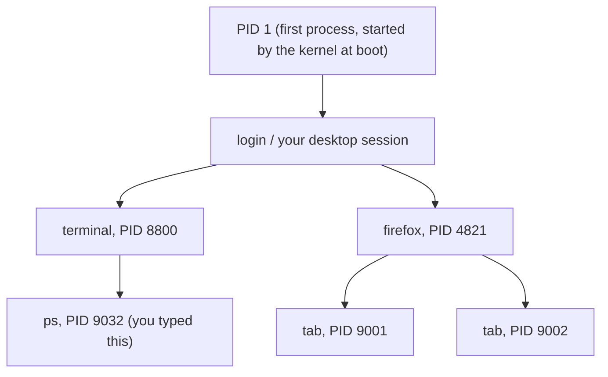
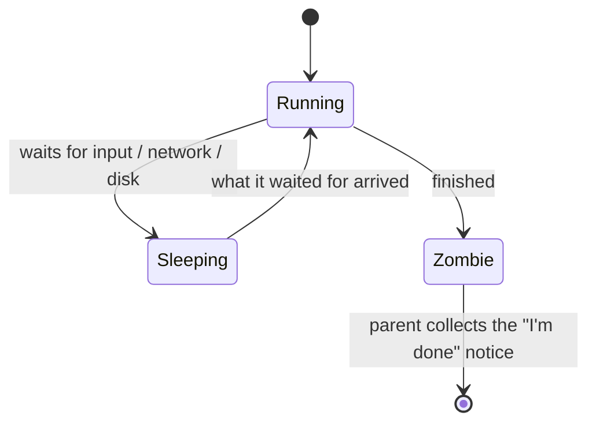

# Processes, Up Close

You already know the headline from [the OS guide](/guides/what-an-operating-system-is): a **process** is a program that's actually running. That's the right mental model, but it's too smooth to debug with. When the machine is stuck, you need the texture - *which* process, who started it, what it's doing right now, and how you make it stop without nuking everything around it.

So let's zoom in. A process isn't a vague cloud of "the app running." It's a thing the OS is keeping careful books on: it has a number, a parent, a current state, and a small set of doorbells you can ring to tell it to quit. Learn those four facts and a "stuck" program becomes something you can actually grab.

## Every process has a number: the PID

**What it actually is.** When the OS starts a process, it stamps it with a unique integer - the **PID** (process ID). That's the name the OS uses internally; the human-readable name (`firefox`, `python`) is just a label for you. The PID is how every tool refers to a process: "slow down PID 4821," "kill PID 9032."

📝 **Terminology.** *PID* = Process ID, a number the OS assigns when a process starts and reuses only after that process is long gone. It's the handle you grab a process by.

**A real example.** On macOS or Linux, `ps` lists processes. Here's a focused view:

```console
$ ps -o pid,ppid,stat,command
  PID  PPID STAT COMMAND
 4821  1190 S    /usr/lib/firefox/firefox
 9001  4821 S    firefox --type=renderer   (a tab)
 9032  8800 R    ps -o pid,ppid,stat,command
```
*What just happened:* `ps` printed four columns. `PID` is each process's own number. `PPID` is its **parent's** PID. `STAT` is its current state (more on that below). `COMMAND` is what's running. Notice PID `9001` (a browser tab) has `PPID 4821` - Firefox itself. The browser *started* the tab, so the tab is its child.

⚠️ **Gotcha.** PIDs get **reused**. After a process exits, the OS is free to hand its number to a brand-new, unrelated process later. So don't save a PID from this morning and assume it's the same program this afternoon - re-check the name before you act on a number.

## Parents and children: where processes come from

**What it actually is.** No process appears from nowhere. Every process is *started by another process* - its **parent** - forming a family tree. Your terminal starts the commands you type. Firefox starts a process per tab. At the very root sits the first process the kernel launched at boot (PID 1), the ancestor of everything.



**Why this matters in real life.** The tree explains things that otherwise look like magic. Close Firefox and its tabs vanish too - because killing a parent usually takes its children with it. It also explains *blame*: if some `python` process is eating your CPU, its parent (the `PPID`) tells you *what launched it* - a cron job? your editor? a runaway script? - which is often the real thing to fix.

## Foreground vs. background

**What it actually is.** A **foreground** process is the one currently holding your terminal (or window) hostage - you typed a command and you're waiting for it, and your keystrokes (including Ctrl-C) go to it. A **background** process runs without sitting on your prompt; it's detached, doing its work while you do other things. Most of the 300-odd processes on your machine are background: services, daemons, helpers you never see.

**A real example.** In a shell, `&` starts something in the background, and you get your prompt back immediately:

```console
$ ./long-backup.sh &
[1] 9105
$ 
```
*What just happened:* The shell started `long-backup.sh` as a background process with PID `9105` (the `[1]` is the shell's own short-hand "job number"), then handed your prompt right back so you can keep working. The backup runs on its own; your terminal isn't waiting on it.

⚠️ **Gotcha.** A background process is *not* hidden from the OS - it still uses CPU and memory, and it'll still show up in `top` and Task Manager. "Background" means "not blocking your prompt," not "free."

## The states a process sits in

**What it actually is.** A process is almost never running every instant - it spends most of its life *waiting*. The OS tracks which of a few states each one is in. You don't need the full list; three carry almost all the meaning:


*Running = on a CPU core (the only state that burns CPU). Sleeping = waiting, using ~no CPU; where most processes sit most of the time. Zombie = finished but not yet cleared from the table; harmless leftover bookkeeping.*

In `ps`, the `STAT` column shows these: `R` = running, `S` = sleeping, `Z` = zombie (Task Manager shows similar wording under a "Status" column - "Running," "Suspended").

**Why this saves you later.** Two big misreadings die here. First: seeing "312 processes" and panicking - *almost all of them are sleeping*, costing you nothing; a busy machine and a crowded process list are different things. Second: the word **zombie** sounds alarming, but a zombie is harmless leftover bookkeeping, not a CPU or memory hog. A pile of zombies points to a buggy *parent* that isn't cleaning up after its children - annoying, worth noting, but not what's making your fan scream.

📝 **Terminology.** A *zombie* (or "defunct") process has already exited; it lingers only as a one-line entry until its parent acknowledges it. It is not "a process gone rogue" - that's the opposite, a *running* process pinning a core (Phase 2).

## How you actually stop a process: signals

This is the part nobody explains, so it feels like superstition. Ctrl-C, `kill`, "End task," "Force quit" - they all do *one underlying thing*: they send the process a **signal**. A signal is a tiny, predefined message the OS delivers to a process meaning roughly "something happened - here's what." Stopping a program is choosing *which* message to send.

📝 **Terminology.** A *signal* is a short, numbered notification the OS hands to a process. A handful matter for stopping things; the names are more useful than the numbers.

**The two that matter most:**

```text
   SIGTERM (15)  "Please wrap up and exit."
                 The POLITE ask. The process can catch it, finish
                 writing files, close connections, then quit cleanly.
                 This is the default - and almost always what you want.

   SIGKILL (9)   "Stop. Now. No cleanup."
                 The kernel removes the process immediately. It gets
                 NO chance to save or tidy up. The nuclear option, for
                 when a process is too stuck to even hear SIGTERM.
```

Now the everyday actions decode cleanly:

- **Ctrl-C** in a terminal sends **SIGINT** ("interrupt") to the foreground process - a close cousin of "please stop." That's why Ctrl-C cancels the command you're waiting on, and *only* that one (it goes to the foreground process).
- **`kill <PID>`** sends **SIGTERM** by default - the polite ask - despite the scary name.
- **`kill -9 <PID>`** sends **SIGKILL** - the no-mercy version.
- **"End task" (Task Manager) / "Force Quit" (macOS)** ask politely first and escalate to the forceful kill if the program won't go.

**A real example.**

```console
$ kill 9105
$
$ kill 9105
bash: kill: (9105) - No such process
```
*What just happened:* The first `kill` sent SIGTERM to PID `9105` and it exited cleanly - no output means it worked. The second `kill` failed because the process is already gone: there's no PID `9105` anymore. ("No such process" here is good news, not an error to fix.)

⚠️ **Gotcha.** Reach for `kill -9` (SIGKILL) only after a plain `kill` (SIGTERM) has clearly failed. Because SIGKILL gives the process *zero* chance to clean up, you can lose unsaved work, leave a half-written file, or corrupt a database mid-write. Polite first; nuclear only when polite is ignored.

🪖 **War story.** A teammate had a script "stuck forever" and went straight to `kill -9` on it every time, then spent an hour confused by half-written output files. The script wasn't stuck - it was *sleeping*, waiting on a slow network call, and SIGKILL kept yanking it mid-write. A plain `kill` (SIGTERM) let it notice, abort the call, and clean up its own mess. The polite signal existed for exactly that.

## Recap

1. **PID** - every process has a unique number; that's how every tool grabs it. PIDs get reused, so re-check the name.
2. **Parent/child** - every process is started by another, forming a tree; the parent (`PPID`) tells you *what launched* a misbehaving process.
3. **Foreground vs. background** - foreground holds your prompt (and receives Ctrl-C); background runs detached but still uses real resources.
4. **States** - only **running** burns CPU; **sleeping** is the normal resting state; **zombie** is harmless dead bookkeeping.
5. **Signals** - stopping a process means sending it a signal. **SIGTERM** (plain `kill`, "End task") asks politely; **SIGKILL** (`kill -9`) is the no-cleanup nuke. Polite first.

Now that you can name and grab a single process, let's use that to answer the first big "the machine is on fire" question: what does **100% CPU** actually mean, and how do you find the one process causing it?

Watch it animated: [processes](/explainers/ProcessesThreads.dc.html)

---

[← Guide overview](_guide.md) · [Phase 2: What "100% CPU" Really Means →](02-what-100-cpu-really-means.md)
