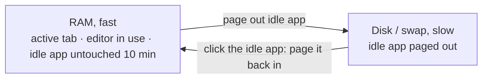
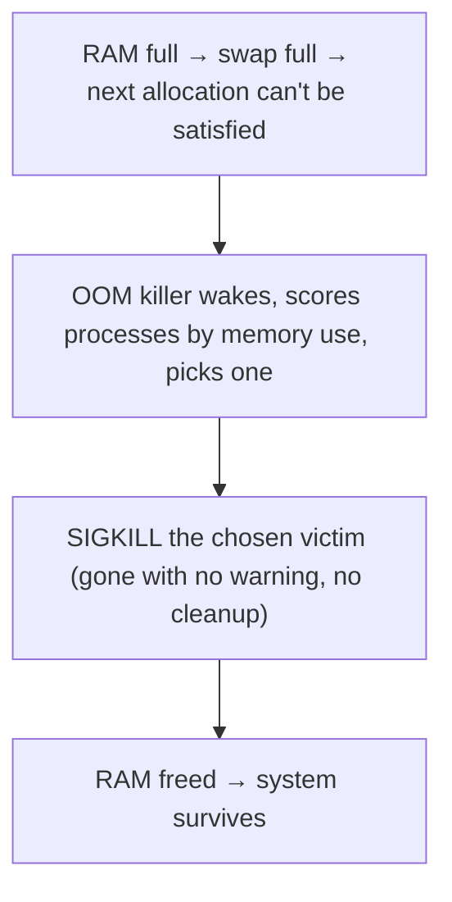

# What "Out of Memory" Really Means

This slowdown has a different flavor than the CPU one. The fan isn't screaming; instead everything turns to *molasses* - switching apps takes seconds, the disk light is solid, and eventually a box says **out of memory** and something dies. It feels like the machine is choking, slowly.

The thing to understand up front: "out of memory" is rarely a clean wall the machine slams into. Long before it gives up, the OS fights to keep going by quietly shuffling memory out to the disk - and *that fight is the slowness.* The crawl isn't a symptom of running low; it's the OS's survival strategy, and it's expensive. Once you see the mechanism, both the molasses and the eventual "out of memory" make complete sense.

> ⏭️ This phase leans on *RAM vs. disk* and *process* from [the OS guide](/guides/what-an-operating-system-is) and Phase 1. The one-line version: **RAM is the fast desk you work on; the disk is the slow filing cabinet.**

## Find the culprit (do this first)

| You're on | Open it | Then |
|---|---|---|
| **Windows** | Task Manager (Ctrl + Shift + Esc) | Click the **Memory** column to sort; the top row is the hog |
| **macOS** | Activity Monitor → **Memory** tab | Click **Memory** to sort; check the **Memory Pressure** graph (green = fine, red = trouble) |
| **Linux / any terminal** | `top`, then press **`M`** (capital) | Sorts by memory; top row is the hog. `q` to quit |

The process at the top of the memory-sorted list is using the most RAM. Now let's understand what that number is, and why a full one drags the whole machine down.

## RAM and virtual memory: the desk and the trick on top of it

**What it actually is.** **RAM** is the fast working memory where processes keep what they're actively using - your desk. It's limited (say 16 GB) and far faster than disk. **Virtual memory** is a clever layer the OS puts *on top* of RAM so that each process is handed its own private, tidy address space - it thinks it has a clean, continuous stretch of memory all to itself, and the OS secretly maps those addresses to wherever the real bytes happen to live (in RAM, or - the key part - temporarily on disk).

📝 **Terminology.** *Virtual memory* = the illusion the OS gives each process of its own private, contiguous memory. It's what lets the OS move the *real* data around (even onto disk) without the process noticing. *Physical memory* = the actual RAM chips.

**Why the OS bothers.** Two big problems solved at once. **Isolation:** because each process sees its own address space, one process literally can't read or scribble on another's memory (the protection from the OS guide). **Overcommitment:** the OS can promise more memory than physically exists, betting that not everything is needed at once - and when that bet gets tight, it falls back on the disk trick below.

## Paging and swap: the slow trick that saves you (and costs you)

**What it actually is.** When RAM fills up, the OS doesn't crash. It finds memory that hasn't been touched in a while - a background app, an idle tab - and writes it out to a reserved area on the **disk**, freeing that RAM for whatever needs it now. Moving memory between RAM and disk like this is **paging**; the disk area it uses is called **swap** (Windows: the *page file*; macOS: *swap files* it manages automatically).


*RAM is full and a new program needs room, so the OS pages the idle app out to disk - freeing RAM now. Later, clicking that idle app forces the OS to page it back from disk first (the beachball/spinner). That wait IS the swap cost.*

**Why this is the slowness.** Disk is *dramatically* slower than RAM - orders of magnitude. As long as paging is occasional, you barely notice. But when RAM is so tight that the OS is *constantly* shuffling pages out and pulling them back - every app switch forcing another disk round-trip - the machine spends more time moving memory than doing your work. That pathological state has a name: **thrashing**. The molasses feeling, the solid disk light, the multi-second app switches - that's thrashing, the OS frantically swapping to avoid the alternative.

⚠️ **Gotcha.** A little swap *in use* is not a problem - the OS pages out genuinely-idle stuff to keep RAM free for active work; that's healthy. The alarm signal isn't "swap > 0," it's **constant** paging activity while you're actively using the machine (on macOS, the Memory Pressure graph going yellow/red; on Linux, `top`'s swap line steadily climbing). Some swap, calm = fine. Lots of swap, churning = thrashing.

## What "this app uses 4 GB" actually means

**What it actually is.** It sounds like a simple weight, but memory has layers, which is why Task Manager and `top` can show two different numbers for the same process. The two that matter:

```text
   RESIDENT memory (RES / "Memory" in Task Manager)
     = how much actual RAM the process is using RIGHT NOW.
       This is the number that counts toward "are we out of RAM?"

   VIRTUAL memory (VIRT)
     = the total address space the process has CLAIMED, including
       parts paged out to disk and parts merely reserved-but-unused.
       Almost always much bigger than RES - and usually NOT worth worrying about.
```

**Why this saves you later.** When you're hunting a memory hog, look at **resident** memory (RES / "Memory"), not virtual. A process can show a frightening 30 GB of *virtual* memory while actually holding 800 MB of real RAM - that's normal, not a leak. "This app uses 4 GB" only means something scary if that 4 GB is *resident*.

📝 **Terminology.** A *memory leak* = a process that keeps allocating memory and never releases it, so its **resident** memory only ever grows. The tell isn't a big number at one moment - it's a number that *climbs and never comes back down* even when the app is idle.

**A real example.** `top` after pressing `M` to sort by memory:

```console
$ top
top - 17:12:40 up 5 days,  6:55,  2 users,  load average: 2.31, 2.10, 1.84
MiB Mem :  15872.0 total,    180.4 free,  14102.7 used,   1588.9 buff/cache
MiB Swap:   4096.0 total,    402.1 free,   3693.9 used

    PID USER      %CPU  %MEM    VIRT    RES     TIME+ COMMAND
   6620 ada        4.1  61.0  18.2g   9.5g   8:40.21 java
   4821 ada        2.0  14.2   6.1g   2.2g   5:11.30 firefox
   1190 ada        0.8   2.0   3.0g 327540   1:40.66 gnome-shell
```
*What just happened:* (an illustrative readout) The header tells the grim story first: of ~16 GB RAM, only `180.4` MiB is **free**, and `MiB Swap` shows `3693.9` of 4096 MiB swap **used** - the OS has shoved nearly 4 GB onto disk and is still scraping for room. That's a machine deep in thrashing, which is why the `load average` is elevated too (processes stuck waiting on the slow disk, exactly the high-load-from-I/O case from Phase 2). The hog is obvious: PID `6620`, `java`, holding **9.5 GB resident** (`RES`) - 61% of all RAM. Note its `VIRT` is `18.2g`, almost double its real footprint; that's the virtual-vs-resident gap - the number that matters is the `9.5g` RES.

The diagnosis writes itself: one Java process is eating real RAM, which forced everything else out to swap, which is why the whole machine crawls. The fix is that one process (restart it, raise its limit, or find its leak) - not "buy more RAM" as a reflex.

## When even swap isn't enough: the OOM killer

**What it actually is.** Sometimes paging can't save the day - memory demand outruns RAM *and* swap. The OS now faces a genuinely bad choice: freeze the entire system, or sacrifice something. Linux chooses to sacrifice: a part of the kernel called the **OOM killer** ("Out Of Memory killer") wakes up, picks the process it judges most responsible (roughly: the biggest memory user, weighed against a few factors), and kills it - SIGKILL, no negotiation - to claw back enough RAM to keep the *rest* of the system alive.



**Why this matters in real life.** This explains one of the most baffling experiences in computing: **a program vanishes with no error, no crash dialog, nothing.** You didn't close it; it didn't crash *itself*. The OS executed it to survive. On Linux servers the fingerprint is unmistakable in the system log:

```console
$ sudo dmesg | grep -i "killed process"
[284913.557] Out of memory: Killed process 6620 (java) total-vm:19089920kB, ...
```
*What just happened:* The kernel logged that *it* killed PID `6620` (`java`) because the system was out of memory. So the "java just disappeared" mystery has a precise, written answer: it didn't disappear - the OOM killer ended it deliberately, and left a note. (The exact numbers and timestamp will differ on a real system; the *line* is what you're hunting for.)

⚠️ **Gotcha.** The OOM killer's victim **isn't always the true cause.** It targets whoever's *biggest right now*, which may be an innocent bystander that happened to be large when a *different*, leaking process pushed the system over the edge. So when something gets OOM-killed, don't stop at the victim - check what was *growing* (climbing resident memory) in the minutes before. The casualty and the culprit can be two different processes.

🪖 **War story.** A service kept dying nightly "for no reason" - no crash, no error in *its* logs. The app team blamed the app for weeks. One line of `dmesg` ended it: `Out of memory: Killed process … (the-service)`. The machine was running a nightly batch job that ballooned RAM; the OOM killer reaped the biggest thing in sight, which happened to be the service, not the batch job. The "buggy service" was an innocent bystander. The real fix was capping the batch job's memory - found in thirty seconds, once we knew the OOM killer existed and where it signs its work.

## Recap

1. **"Out of memory" is rarely a clean wall.** Long before it, the OS pages idle memory to disk to keep going - and that paging *is* the slowness.
2. **RAM is the fast desk; virtual memory** is the per-process illusion that lets the OS isolate processes and quietly move real data (even onto disk).
3. **Paging/swap** rescues you from crashing but is far slower than RAM; *constant* paging while you work is **thrashing** - the molasses, the solid disk light.
4. **Hunt resident memory (RES / "Memory"), not virtual.** A leak is resident memory that climbs and never falls.
5. **The OOM killer** is why a program can vanish with no error: out of RAM and swap, the OS SIGKILLs a big process to survive. Check `dmesg` - and remember the victim may not be the culprit.

You now have the whole diagnostic loop. A slow or stuck machine is no longer weather: it's either CPU (a screaming fan, a *running* process pinning a core - Phase 2) or memory (molasses, a solid disk light, swap churning, maybe an OOM kill - this phase). Either way, the answer is the same calm move that started this guide: open the list, sort it, and find the one row that's the problem.

> **Where next.** This guide got you to *diagnosis*. The follow-up - adjusting priorities with `nice`, sizing swap, and setting per-process memory limits so the OOM killer reaps the *right* thing - is *intervention*, and deserves its own guide. For the broader context, the rest of the [Operating Systems track](/guides/what-an-operating-system-is) and [The Terminal & Shell](/guides/the-terminal-and-shell) are good neighbors.

---

[← Phase 2: What "100% CPU" Really Means](02-what-100-cpu-really-means.md) · [Guide overview](_guide.md)
