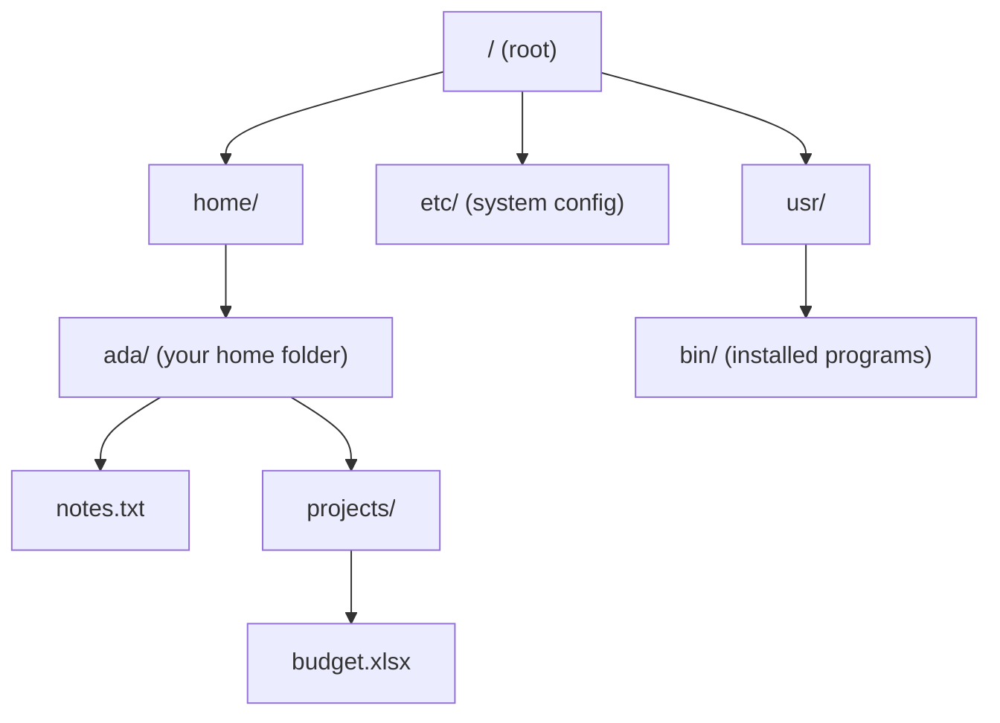

# What a Filesystem Is

Let's build the picture first, because once you have it, paths and folders stop being a maze and become a map you can read at a glance. Forget commands for a minute - we're installing one mental model.

## The disk is just numbered storage

**What it actually is.** Down at the hardware, your disk (or SSD) has no idea what a "file" or a "folder" is. It's a huge wall of numbered boxes, each holding a chunk of bytes. Box 0, box 1, box 2, on and on - millions of them. That's all the hardware offers: "give me a number, I'll give you back what's stored there."

```text
   THE RAW DISK (what the hardware actually is)
   ┌────┬────┬────┬────┬────┬────┬────┬────┬────┐
   │ 0  │ 1  │ 2  │ 3  │ 4  │ 5  │ 6  │ 7  │ …  │   each box = a chunk of bytes
   └────┴────┴────┴────┴────┴────┴────┴────┴────┘   no names, no folders, no order
```

**Why people get this wrong.** Most people imagine their files are literally *inside* folders, the way papers sit inside a physical drawer, neatly grouped on the disk. They aren't. A photo might be scattered across boxes 4,201 and 88,015 and 502,330. The tidy folders you see are not a property of the disk - they're a story the operating system tells *on top of* those numbered boxes.

📝 **Terminology.** A *filesystem* is exactly that story: the system the OS uses to turn dumb numbered storage into named files organized in folders, and to remember which boxes belong to which file. (If "the OS" is fuzzy, the sibling guide [What an Operating System Is](/guides/what-an-operating-system-is) covers the manager-in-the-middle idea.)

## The OS lays a tree on top

**What it actually is.** The filesystem organizes everything into a **tree**: folders that contain files and other folders, branching down from a single starting point. A *folder* (also called a *directory*) is just a named container; a *file* is a named blob of bytes. That's the whole structure.



Notice there's exactly one box at the very top that everything hangs off. That's the **root**.

📝 **Terminology.** *Directory* and *folder* mean the same thing. "Folder" is the friendly desktop word; "directory" is the word the terminal and most docs use. We'll use them interchangeably.

💡 **Key point.** The disk is a flat wall of numbered boxes. The folders-and-files *tree* is a structure the OS imposes on top to make that storage usable by humans. Everything else in this guide is about navigating that tree.

## The root: the top of the tree

**What it actually is.** Every filesystem has a single starting point that contains everything else, directly or indirectly. On macOS and Linux it's written as a lone forward slash: `/`. On Windows each drive has its own root, written with a drive letter and a backslash: `C:\`, `D:\`, and so on.

**What it does in real life.** Let's actually look at the root on a Mac or Linux machine. (We'll use the terminal here; if it's unfamiliar, the sibling guide [The Terminal and Shell](/guides/the-terminal-and-shell) introduces it gently.)

```console
$ ls /
bin   etc   home   lib   tmp   usr   var
```
*What just happened:* `ls` means "list what's in this folder," and `/` is the root. So you asked "what sits at the very top of the tree?" and the OS listed the top-level folders. Everything on the machine lives somewhere underneath one of these.

⚠️ **Gotcha - Windows is different here.** Windows doesn't have one single root. Each storage device gets its own letter, so there's a `C:\` tree (usually your main drive), and a USB stick might show up as `E:\` with its *own* separate tree. The equivalent peek looks like this:

```console
C:\> dir C:\
 Directory of C:\

 Program Files
 Users
 Windows
```
*What just happened:* `dir` is the Windows version of `ls`, and `C:\` is the root of the C drive. Same idea as `/` - the top of one tree - but Windows has one tree per drive, not one tree for the whole machine.

## A path is an address

**What it actually is.** A *path* is the route from somewhere to one specific file, written as a list of folder names separated by slashes. It's a street address: country, city, street, house number - except it's root, folder, subfolder, filename.

Read this path left to right:

```text
   /home/ada/projects/budget.xlsx
   │  │    │   │        └── the file we want
   │  │    │   └── inside a folder called "projects"
   │  │    └── inside ada's home folder
   │  └── inside the "home" folder
   └── starting at the root
```

📝 **Terminology.** macOS and Linux separate folders with a **forward slash** `/`. Windows traditionally uses a **backslash** `\`, so the same kind of path looks like `C:\Users\ada\projects\budget.xlsx`. Same concept, different separator - and this difference causes real confusion, which is why we name it now.

## Absolute vs relative paths

This is the one distinction that clears up most "but I typed the right path!" frustration.

**An absolute path** starts at the root and gives the complete address, so it means the same file no matter where you currently are. You can spot it because it begins with `/` (or `C:\` on Windows):

```console
$ cat /home/ada/notes.txt
Buy milk. Call the bank. Finish the budget.
```
*What just happened:* `cat` prints a file's contents. Because the path started at `/`, it's a full address - this command finds the exact same `notes.txt` whether you run it from your home folder, from the desktop, or from anywhere else.

**A relative path** starts from wherever you happen to be standing right now (your *current directory*) and gives directions from there. It does *not* begin with a slash:

```console
$ cd /home/ada
$ cat notes.txt
Buy milk. Call the bank. Finish the budget.
```
*What just happened:* `cd` ("change directory") moved you into `/home/ada`. Now `notes.txt` - with no leading slash - means "`notes.txt` starting from where I am," which resolves to `/home/ada/notes.txt`. Same file, shorter address, *because you were standing in the right place.*

📝 **Terminology.** Two special relative names show up everywhere: `.` means "the folder I'm in right now," and `..` means "the folder one level up." So `cd ..` walks you up toward the root, and `../photos/cat.jpg` means "go up one, then into photos."

⚠️ **Gotcha.** A relative path that works in one place fails in another, and the error looks identical to a typo. If `cat notes.txt` says "no such file," you're probably not standing where you think you are. Run `pwd` ("print working directory") to ask the OS where you currently are:

```console
$ pwd
/home/ada/projects
```
*What just happened:* You asked "where am I?" and got the absolute path of your current folder. From `/home/ada/projects`, the relative name `notes.txt` points at `/home/ada/projects/notes.txt` - which doesn't exist. That's the whole mystery: the path was fine, your location wasn't.

## The home folder and `~`

**What it actually is.** Your *home folder* is the one folder that belongs to you - where your documents, desktop, and personal settings live. Every user account on the machine gets its own. On Linux it's usually `/home/yourname`, on macOS `/Users/yourname`, on Windows `C:\Users\yourname`.

**What it does in real life.** Because you refer to your home folder constantly, Unix-style shells give it a one-character nickname: the tilde, `~`.

```console
$ cd ~
$ pwd
/home/ada
```
*What just happened:* `~` expanded to your home folder's full path, so `cd ~` took you home. `~/projects/budget.xlsx` is just shorthand for `/home/ada/projects/budget.xlsx`. Typing `cd` with no path at all usually does the same thing - drops you at home.

💡 **Key point.** `~` is not a folder named "tilde." It's a shorthand the shell replaces with the absolute path of *your* home folder. Two different users typing `~` get two different real paths.

## Recap

1. The **disk** is dumb numbered storage; the **filesystem** is the tree of folders and files the OS imposes on top of it.
2. The **root** is the single top of the tree - `/` on macOS/Linux, and one per drive (`C:\`, `D:\`) on Windows.
3. A **path** is an address built from folder names: forward slashes on Unix, backslashes on Windows.
4. **Absolute** paths start at the root and mean the same file everywhere; **relative** paths start from where you're standing - so `pwd` is your best friend when a path "should" work but doesn't.
5. Your **home folder** is your personal space, nicknamed `~` in the shell.

Next, we'll look at why the tree won't always let you in - the rules of ownership and permission that decide who can read, change, or run each file.

---

[← Guide overview](_guide.md) · [Phase 2: Permissions & Ownership →](02-permissions-and-ownership.md)
