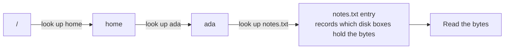

# Where Things Live & Finding Them

You can now picture the tree and read the rules. This last phase ties it together: what *actually happens*
when you open a file, the two naming conventions everyone misreads as magic, where to expect standard
things, and how to find anything you've misplaced. We'll start with the cheat-card, since you might be here
mid-panic.

## Cheat: the three errors that bite everyone

| Symptom | What it usually means | Calm fix |
|---|---|---|
| `No such file or directory` | You're not standing where you think, or there's a typo | `pwd` to confirm where you are; check spelling and case; try the **absolute** path from `/` |
| `Permission denied` | The file's rules don't grant your action (see [Phase 2](02-permissions-and-ownership.md)) | `ls -l` to read the rules; run as an allowed user (`sudo`, carefully) or `chmod` it |
| Path "works" on one OS, not the other | `\` vs `/` mismatch, or a drive letter | Unix uses `/`; Windows uses `\` and drive letters like `C:\` - don't copy a path across as-is |

Each row is explained in full below.

## How a path becomes real bytes

**What it actually is.** When you open `/home/ada/notes.txt`, the OS doesn't magically know where the bytes
are. It *walks the tree*: looks up `home` in the root, finds `ada` inside `home`, finds `notes.txt` inside
`ada`, and only then learns which numbered boxes on the disk hold the contents. Each step also checks
permissions - that's why a folder you can't enter (`x` off) blocks everything beneath it.



💡 **Key point.** A path is resolved one folder at a time, top down, checking permission at each step. This is why "no such file" can mean a folder *partway up* the path is wrong, and why "permission denied" can come from a folder you didn't even name - you lacked `x` to pass *through* it.

📝 **Terminology.** The disk entry that records a file's real location and its rwx rules is called an
*inode* on Unix systems. You rarely touch it directly; the name is worth knowing because it's why a single
file can sometimes appear under two names (two directory entries pointing at one inode).

## Hidden files are a naming convention, not a security feature

**What it actually is.** On macOS and Linux, any file or folder whose name **starts with a dot** is hidden from normal listings. That's the entire rule. `.bashrc`, `.git`, `.env` - all hidden, all the time, for one reason: the leading `.`.

```console
$ ls
notes.txt   projects

$ ls -a
.          ..          .bashrc     .config     notes.txt   projects
```
*What just happened:* plain `ls` skipped anything starting with a dot. Adding `-a` ("all") revealed them -
your shell config (`.bashrc`), a settings folder (`.config`), and the special `.` and `..` entries. The
files were always there; they were just filtered from the default view.

📝 **Terminology.** These are called *dotfiles*. They hold configuration and tool state - the stuff you
don't want cluttering everyday listings but that programs read constantly.

⚠️ **Gotcha.** Hidden does *not* mean protected. A dotfile is fully readable and editable if its permissions
allow it (Phase 2 still applies) - the dot only hides it from casual listing, it's tidiness, not security.
On Windows, "hidden" is a separate file *attribute* you toggle, not a naming rule.

## File extensions are a hint, not magic

**What it actually is.** The `.txt`, `.jpg`, `.pdf` at the end of a name is part of the **name** - a convention so humans and programs can guess what's inside. The OS does not enforce that a `.jpg` contains an image. Rename `photo.jpg` to `photo.txt` and the bytes don't change one bit; you've only changed the label.

```console
$ mv report.pdf report.txt
$ file report.txt
report.txt: PDF document, version 1.7
```
*What just happened:* `mv` renamed the file (extension and all). But `file` inspects the *actual bytes* and
correctly reports it's still a PDF - the extension lied, the content didn't.

💡 **Key point.** Renaming a file's extension never converts it. It changes which program tries to open it
(and whether that program then chokes), but the contents are untouched. To truly convert a file you need a
program that reads one format and writes another.

⚠️ **Gotcha - Windows hides extensions by default.** Windows Explorer often hides known extensions, so
`invoice.pdf` may display as just `invoice`, and a malicious `invoice.pdf.exe` shows as `invoice.pdf` -
hiding that it's actually a program. Turning on "show file extensions" in Explorer's View settings is a
small, real security habit.

## Where standard things live

You don't have to memorize the whole tree, but a few landmarks save constant hunting. These are conventions, not laws, but they hold across most systems:

```text
   UNIX (macOS / Linux)
   /home/you  or  /Users/you   your stuff (home folder, the "~")
   /etc                        system-wide configuration files
   /usr/bin, /bin              installed programs (commands you run)
   /tmp                        temporary scratch space, often wiped on reboot
   /var/log                    log files - where to look when something failed

   WINDOWS
   C:\Users\you                your stuff (Documents, Desktop, Downloads)
   C:\Program Files            installed applications
   C:\Windows                  the OS itself - generally do not touch
```

The one worth internalizing: **`/var/log` (Unix) is where you look when a program misbehaved.** When the sibling guide [Processes, Memory & CPU](/guides/processes-memory-and-cpu) talks about a service that "won't start," its log under `/var/log` is usually the first place the answer is hiding.

## Finding things

When you don't know where a file is, you ask the filesystem to walk the tree and match names for you. On
Unix that's `find`:

```console
$ find ~ -name "budget.xlsx"
/home/ada/projects/budget.xlsx
/home/ada/old/2024/budget.xlsx
```
*What just happened:* `find ~` started at your home folder and searched every folder beneath it;
`-name "budget.xlsx"` kept only entries with that exact name. It found two - including one you'd forgotten
in an `old` folder. `find` walks the tree the same way the OS resolves a path, just visiting every branch
instead of one.

You can match patterns with `*` (meaning "any characters"):

```console
$ find . -name "*.log"
./app.log
./logs/error.log
```
*What just happened:* starting from `.` (the current folder), this found every name ending in `.log` at any
depth. The `*` is a wildcard - "anything here" - so `*.log` means "any name that ends in `.log`."

⚠️ **Gotcha.** Running `find /` (from the root) searches the *entire* machine and will throw "Permission
denied" lines for folders you can't enter - that's Phase 2 in action, not a failure of the command. Search
from `~` or a specific folder unless you genuinely need the whole disk. (On Windows,
`dir /s /b C:\Users\you\*.xlsx` is the rough equivalent, and the desktop search box does the same job.)

## The three errors, explained

Now the cheat-card rows make full sense:

- **`No such file or directory`** - the tree-walk failed at some step. A folder name partway up was wrong,
  you're not standing where you assumed (run `pwd`), or it's a typo - and Unix paths are **case-sensitive**,
  so `Notes.txt` and `notes.txt` are different files. When in doubt, give the full absolute path from `/`.
- **`Permission denied`** - a permission check failed during the walk (Phase 2). `ls -l` the file *and* the
  folders leading to it; you may lack `x` on a folder you have to pass through. Fix by acting as an allowed
  user or adjusting the rules - on purpose, not reflexively.
- **`\` vs `/` mismatch** - a path copied from a Windows machine into a Unix shell (or the reverse) breaks
  because the separators and drive letters don't translate. Rebuild paths in the target system's style.

## Recap

1. The OS resolves a path by **walking the tree top-down**, checking permission at each folder - which explains *both* classic errors.
2. **Dotfiles** (names starting with `.`) are hidden by a naming convention, not protected; `ls -a` reveals them.
3. **Extensions** are a naming hint, not magic - renaming `.pdf` to `.txt` changes the label, never the bytes.
4. A few **standard locations** (`~`, `/etc`, `/var/log`, `C:\Users`) save you constant hunting; logs are where failures explain themselves.
5. **`find`** walks the tree to locate files by name or pattern; search from `~`, not `/`, to avoid noise.
6. The three biting errors - **not found, denied, and `\` vs `/`** - are all explainable by the model you now hold.

That's the whole map: numbered storage at the bottom, a tree on top, rules guarding each branch, and a handful of conventions for finding your way. You can read a path, read a permission line, and read an error - which is most of what "knowing the filesystem" actually means.

---

[← Phase 2: Permissions & Ownership](02-permissions-and-ownership.md) · [Guide overview](_guide.md)

## Try it yourself

Poke around a fake filesystem - `ls`, `cd`, `pwd`, `cat`, `tree`. Nothing leaves your browser:

```playground-terminal
```
