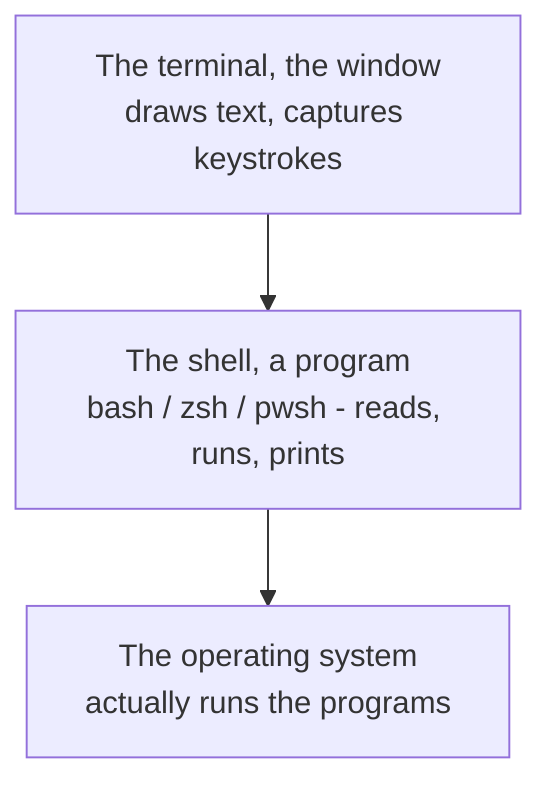
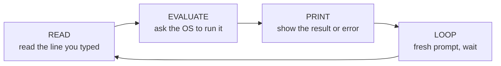

# What the Terminal and Shell Actually Are

Before a single command, let's clear up the thing that quietly confuses almost everyone: people say
"terminal," "shell," "command line," and "console" as if they're one thing. They're not, and once you can
tell them apart, the whole black window stops feeling like a single intimidating blob and becomes a couple
of simple, separate pieces you can actually reason about.

## Two things, not one: the window and the program inside it

Picture what's really happening when you open that black window. There are two distinct pieces stacked
together:



**What the terminal actually is.** The **terminal** (or "terminal emulator") is the *window* - a fairly
dumb but useful program whose entire job is to show text on the screen and capture the keys you press. It
doesn't understand a single command you type. It's a pane of glass with a keyboard attached. Think of it
as the screen-and-keyboard, nothing more.

**What the shell actually is.** Inside that window runs a second program: the **shell**. *This* is the
part with the brains. The shell reads the line you type, figures out what you meant, asks the operating
system to actually do it, and prints whatever comes back. `bash`, `zsh`, and `PowerShell` are all shells -
different programs that do this same job with slightly different syntax.

📝 **Terminology.** The words people muddle together:
- **Terminal** - the window that displays text and takes keystrokes (e.g. Terminal.app, Windows Terminal,
  GNOME Terminal, iTerm2).
- **Shell** - the program *running inside* the terminal that interprets your commands (e.g. `bash`,
  `zsh`, `fish`, `PowerShell`).
- **Console** - historically a physical terminal wired to a computer; today people use it loosely to mean
  "the terminal window." Treat it as a casual synonym for terminal.
- **Command line** / **CLI** (command-line interface) - the general *style* of using a computer by typing
  text commands, as opposed to clicking a GUI (graphical user interface).

The clean one-sentence version: **the terminal is the window; the shell is the program in it that reads
your commands.** Hold onto that - it explains everything else in this phase.

**Why this distinction matters.** When someone says "which shell are you using?" they're not asking about
your window; they're asking whether your commands get interpreted by bash, zsh, or PowerShell - because
the syntax differs. And when your prompt looks different from a tutorial's, it's usually because you're in
a different *shell*, not a different *terminal*. Knowing which layer you're talking about saves a lot of
confused troubleshooting.

## The prompt: the shell telling you it's your turn

When the shell is ready for a command, it prints a **prompt** and waits. That's what the `$` (or `%`, or
`>`, or `PS C:\>`) at the start of the line is - not part of any command, but the shell's way of saying
"I'm listening; type something."

```console
ada@laptop:~$
```
*What just happened:* Nothing ran yet - this is the shell *waiting*. Reading it left to right: `ada` is
your username, `laptop` is the machine's name, `~` is where you currently are (`~` means your home
folder), and `$` marks the end of the prompt. Everything you type goes *after* that `$`. Different shells
dress this up differently - zsh on a Mac often ends in `%`, and PowerShell shows something like
`PS C:\Users\ada>` - but they all mean the same thing: "ready for your next command."

⚠️ **Gotcha.** In guides and docs, commands are shown with a leading `$ ` (or `% `, or `> `) to signal
"this is a shell command." **Don't type that leading prompt character.** If a guide shows `$ ls`, you
type `ls` and press Enter. Pasting the `$` in is one of the most common first-day stumbles, and it gives a
baffling `command not found` error.

## The loop: read, evaluate, print, repeat

Here's the rhythm the shell runs in, forever. Every command you ever type goes through the same four
steps:



This cycle has a name: the **read-eval-print loop**, or **REPL**. It's not jargon you need to wield, but
it's the whole shape of using a shell: you type a line, it acts, it shows you what happened, it asks for
the next line. Calm and turn-based. You're never in a race; the shell waits as long as you like.

Let's watch one full turn of the loop:

```console
ada@laptop:~$ whoami
ada
ada@laptop:~$
```
*What just happened:* You typed `whoami` and pressed Enter (**read**). The shell recognized it as a
program and asked the OS to run it (**evaluate**). That program printed your username, `ada` (**print**).
Then the shell drew a fresh prompt and went back to waiting (**loop**). One command, one answer, back to
ready. That's every interaction you'll ever have with a shell, repeated.

💡 **Key point.** The shell isn't doing the work itself - it's a *middleman*. It reads your request and
hands it to the operating system, which actually runs the program and touches the hardware. (If you want
the full picture of how the OS runs programs on your behalf, that's the
[/guides/what-an-operating-system-is](/guides/what-an-operating-system-is) guide.) The shell's job is to
translate "what you typed" into "what the OS should do."

## Why type at all, when you could click?

It's a fair question. The desktop with its icons and buttons works fine for a lot of things. So why do
developers live in this text window? Three real reasons, and they're worth understanding because they tell
you *when* the terminal is the right tool:

- **Precision.** A command says *exactly* what you want, with no ambiguity. "Delete every file ending in
  `.tmp` in this folder" is one precise line. Doing that by hand in a file browser means hunting, eyeballing,
  and hoping you didn't miss one. The terminal does precisely what you said - which is a double-edged sword
  we'll respect carefully in Phase 2.
- **Repeatability and automation.** A command is text. Text can be saved, shared, and rerun. You can hand a
  colleague the exact line you ran, paste it into instructions, or eventually drop it into a script that
  runs a hundred commands while you get coffee. You can't email someone a sequence of mouse clicks.
- **Reach - including remote machines.** Servers in a data center usually have *no desktop at all*. The only
  way to drive them is by typing commands over a network connection. The same skills you're learning here
  are exactly how you'll operate a machine you'll never physically see. (Connecting to those remote machines
  is its own topic - a follow-up guide - but the commands you'd run there are these.)

The terminal isn't more powerful because it's harder. It's more powerful because text is precise,
saveable, and works everywhere - even where there's nothing to click.

## Recap

1. The **terminal** is the *window* (it draws text and captures keystrokes); the **shell** is the
   *program inside it* (it reads and runs your commands). They're two different things.
2. `bash`, `zsh`, and `PowerShell` are **shells** - same job, different syntax.
3. The **prompt** (`$`, `%`, `>`, `PS C:\>`) is the shell saying "ready" - don't type it.
4. The shell runs a **read-eval-print loop**: read your line, evaluate it via the OS, print the result,
   loop. Calm and turn-based.
5. We type instead of click for **precision, repeatability, and reach** - including machines that have no
   screen at all.

Now that you know what the window and the shell *are*, let's give your hands something to do: the everyday
commands you'll actually reach for.

---

[← Guide overview](_guide.md) · [Phase 2: The Essential Commands →](02-essential-commands.md)
