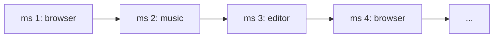
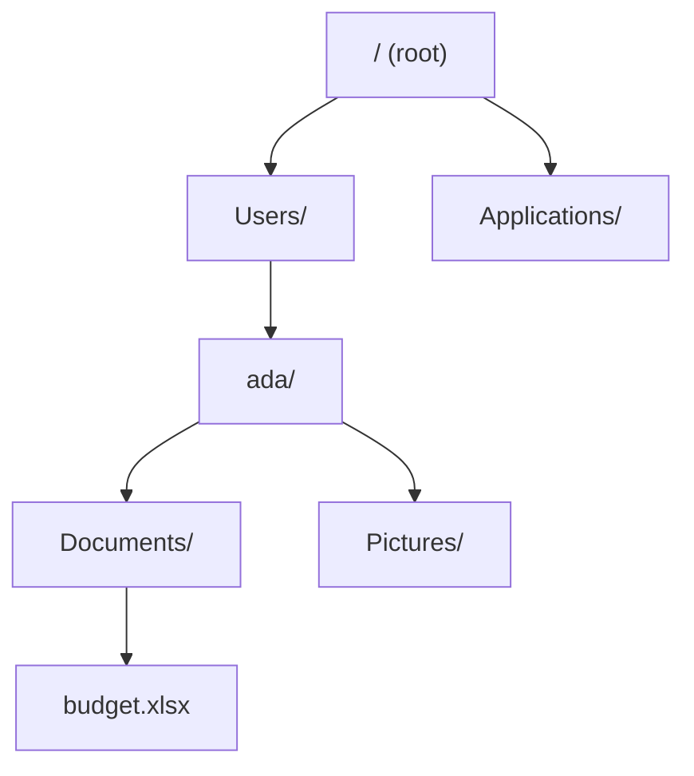
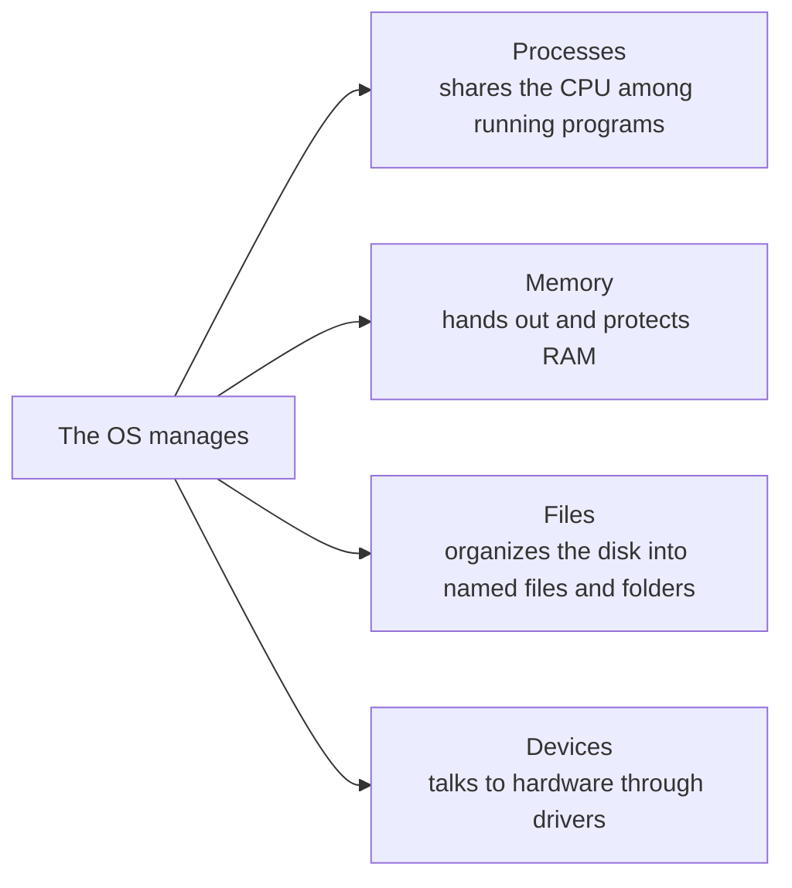

# The Four Jobs Every OS Does

In Phase 1 you learned what an OS *is* - the manager between programs and hardware. Now let's see what it
actually spends its day doing. Almost everything an OS does falls into four jobs: running programs, handing
out memory, storing files, and talking to devices. Learn these four and you've learned the shape of every
operating system there is.

## Job 1: Running programs (processes)

**What it actually is.** When you launch an app, the OS loads it into memory and starts it running. A
running program is called a **process**. The same program can even be several processes at once (each
browser tab is often its own).

📝 **Terminology.** *Program* = the app sitting on disk, not running (like a recipe in a book). *Process* =
that program actually running, with its own memory and a slice of the CPU (the meal being cooked). Same
recipe, many meals.

**The job: sharing one CPU among many.** Here's the magic trick at the heart of every OS. You have dozens of
processes but only a few CPU cores. The OS runs one process for a few milliseconds, pauses it, runs the
next, pauses it, and cycles through them all - *so fast* that to you they look perfectly simultaneous. This
is called **scheduling**, and it's why your music keeps playing while your browser loads while your editor
waits for your next keystroke.

*One core, switched thousands of times a second - so the browser, music, and editor only LOOK like they run all at once.*

**Why this saves you later.** "Why is my computer slow?" usually means too many processes are fighting over
too little CPU, so each one's turn comes around less often. "Force quit" / "End task" is you asking the OS
to kill a process. None of that is mysterious once you see the OS as a dealer handing out CPU turns.

## Job 2: Handing out memory (RAM)

**What it actually is.** **RAM** (memory) is the fast, temporary workspace where processes keep the data
they're actively using. The OS gives each process its own private chunk and - critically - keeps them
separate, so one process can't read or wreck another's memory (that's the protection from Phase 1).

📝 **Terminology.** *RAM* (Random-Access Memory) is *working* memory: fast, but wiped when the power goes
off. The *disk* (or SSD) is *storage*: slower, but it remembers when powered down. RAM is your desk;
the disk is the filing cabinet.

**The job: rationing a limited resource.** RAM is limited, and open programs want more than exists. The OS
parcels it out, and when it runs low it gets clever - shuffling less-used data out to the disk temporarily
to free room. That trick (called *swapping*) saves you from crashing, but disk is far slower than RAM, which
is why a computer that's "out of memory" doesn't stop - it gets *painfully* slow.

**Why this saves you later.** "Out of memory," "this app is using 4 GB of RAM," "close some tabs to speed it
up" - all the same idea. RAM is the desk space; when it's full, work slows to a crawl as the OS keeps
running to the filing cabinet.

## Job 3: Storing files (the filesystem)

**What it actually is.** Your disk is really just a vast field of numbered storage slots. The OS imposes a
human-friendly system on top of it - **files** with names, organized into **folders** (directories), in a
tree. That organizing system is the **filesystem**.

**The job: turning slots into names you can find.** Without the filesystem you'd be asking for "the bytes in
slots 5,000,000 through 5,002,048." Instead you ask for `Documents/budget.xlsx`, and the OS translates that
name into the actual physical location and hands you the contents. It also tracks who's allowed to open
each file - the basis of permissions.

**Why this saves you later.** "File not found," "permission denied," "where did it save?" are all
filesystem questions, and they get much less frustrating once you know files are *names the OS maps to
storage* - a topic the next guide in this track, [The Filesystem, Explained](/guides/the-filesystem-explained),
takes all the way down.

## Job 4: Talking to devices (drivers)

**What it actually is.** Keyboards, screens, printers, Wi-Fi cards, webcams, USB sticks - every device
speaks its own private language, and there are thousands of models. The OS uses small pieces of software
called **drivers**, one per device type, that know how to talk to that specific hardware. Your programs
never learn any of those languages; they ask the OS, and the right driver handles it.

📝 **Terminology.** *Driver* = the translator between the OS and one kind of hardware. "Install the printer
driver" means "give the OS the translator for this printer."

**The job: one simple way to reach a thousand devices.** Because the OS hides each device behind a driver,
your program can just say "print this" or "show this on screen" without caring whose printer or which
screen. Plug in a new mouse and it works instantly - the OS already had (or fetched) the driver and slotted
it in behind the same controls.

**Why this saves you later.** "It stopped working after an update," "the printer needs a driver," "the
webcam isn't detected" - device problems are usually driver problems: the translator is missing, outdated,
or confused. Knowing the layer exists tells you where to look.

## The four jobs, together

Every feature, setting, and error message you'll ever meet is really one of these four jobs showing
through. That's the whole machine, named.

## Recap

1. **Processes** - a running program; the OS shares the CPU among many by **scheduling** rapid turns.
2. **Memory** - the OS hands each process private, protected **RAM** and rations it when it runs low.
3. **Files** - the **filesystem** turns raw storage into named files and folders you (and only you) can
   reach.
4. **Devices** - **drivers** let the OS talk to any hardware, so your programs don't have to.

Now let's stop describing and start *watching* - in the next phase you'll see these four jobs live on your
own machine.

---

[← Phase 1: The Manager in the Middle](01-the-manager-in-the-middle.md) · [Guide overview](_guide.md) · [Phase 3: See It Yourself →](03-see-it-yourself.md)
