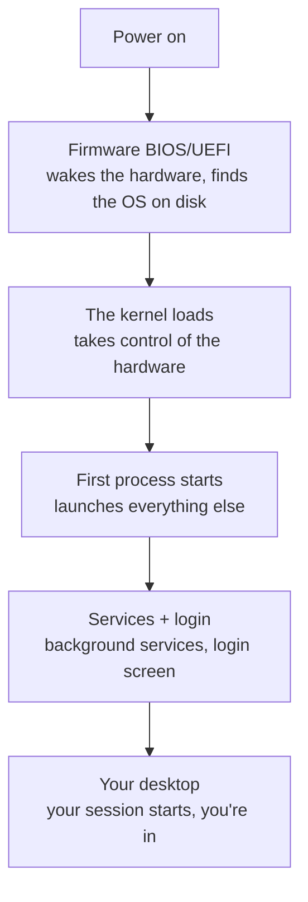

# See It Yourself

You've got the model: an OS is the manager in the middle, doing four jobs. Now let's make it real. The best
way to believe all this is to *watch it happening* on your own machine - so this phase is hands-on. Open
something, look at it, and recognize the ideas from the last two phases staring back at you.

## Watch the processes (Job 1 and Job 2, live)

Every OS ships a window that lists running processes and how much CPU and memory each is using. Open yours:

```text
   Windows  → Task Manager        (press Ctrl + Shift + Esc)
   macOS    → Activity Monitor     (Applications → Utilities, or search Spotlight)
   Linux    → a System Monitor app, or type `top` in a terminal
```

They look different but show the *same four jobs* from Phase 2. Here's the terminal version, `top`, because
it's the most universal - the others show the same columns with prettier graphics:

```console
$ top
top - 14:23:01 up 3 days,  2:14,  1 user,  load average: 0.42, 0.55, 0.59
Tasks: 312 total,   1 running, 311 sleeping
%Cpu(s):  4.7 us,  1.2 sy, 93.8 id
MiB Mem :  15872.0 total,   2104.5 free,   8231.2 used,   5536.3 buff/cache

    PID USER      %CPU  %MEM     TIME+ COMMAND
   4821 ada       12.3   6.4   3:21.08 firefox
   1190 ada        3.0   2.1   1:02.55 gnome-shell
   9032 ada        0.7   0.3   0:00.12 top
```
*What just happened:* You're looking at the OS's own report on the four jobs. Read it top to bottom:

- `Tasks: 312 total` - there are **312 processes** running right now (Job 1). You launched maybe five; the
  OS and its services are the rest.
- `%Cpu(s): ... 93.8 id` - the CPU is **93.8% idle**. Even with 312 processes, most are asleep waiting for
  something; the scheduler is barely breaking a sweat.
- `MiB Mem : ... 8231 used` - about 8 GB of **RAM** is in use of ~16 GB total (Job 2).
- Each row is one **process**: its `PID` (process ID - the OS's unique number for it), its share of CPU and
  memory, and its name. `firefox` is using the most CPU here because it's doing the most work.

There it all is - scheduling and memory-sharing, the abstract ideas from Phase 2, as plain numbers. (Press
`q` to quit `top`.)

🪖 **War story.** The first time a senior showed me `top` while a server was "mysteriously slow," one process
sat pinned at `99% CPU` - a runaway script stuck in a loop. Thirty seconds earlier it had felt like dark
magic; the moment I saw the process list, it was just *one row, misbehaving.* That's the whole value of
seeing it: problems shrink from "the computer is haunted" to "that process, right there."

## What happens when you press the power button

That pile of processes didn't appear by magic. Here's the chain from cold metal to your desktop - the
moment the manager-in-the-middle takes charge:


*What just happened:* Pressing power runs a tiny built-in program (the **firmware**) that knows just enough
to wake the hardware and hand control to the **kernel**. The kernel takes over, then starts a first process
whose job is to start all the others - services, the login screen, and finally your desktop. "Booting" is
just this hand-off, hardware → kernel → everything else.

📝 **Terminology.** *Booting* comes from "pulling yourself up by your bootstraps" - the funny image of a
computer starting from nothing and bringing itself fully to life, one layer starting the next.

## Same model, different clothes: Windows vs macOS vs Linux

Here's the payoff. The three big operating systems feel like completely different worlds, but everything
you've learned applies to all of them - they're the same four jobs and the same kernel idea, dressed
differently:

| | Windows | macOS | Linux |
|---|---|---|---|
| Kernel | Windows (NT) | Darwin (Unix-based) | Linux |
| You'll see programs as | `.exe` files | `.app` bundles | installed via a package manager |
| Your files live under | `C:\Users\you` | `/Users/you` | `/home/you` |
| Watch processes with | Task Manager | Activity Monitor | `top` / System Monitor |
| Famous for | desktops & games | design & "it's Unix underneath" | running most of the world's servers |

**What's actually the same.** All three have a kernel managing the hardware. All three run programs as
processes, ration RAM, organize a filesystem, and use drivers for devices. Learn the model once and you can
sit down at any of them and reason about what's going on - the menus move, the concepts don't.

💡 **Key point.** macOS and Linux are both *Unix-like*, so they share a lot (including a very similar
terminal), while Windows took its own path - but under the hood, all three are doing the four jobs from
Phase 2. There is no magic OS; there's one idea in three outfits.

## You understand your computer now

Step back and notice what changed. The mystery box has a shape now: a kernel in the middle, sharing the
hardware among a crowd of processes, rationing memory, organizing files, and talking to devices through
drivers - and you can *watch* it doing all of it. The error messages and slowdowns that used to feel random
now point somewhere specific.

This is the foundation the rest of the Operating Systems track stands on. From here you can go deeper into
any one piece: how files really work, how to drive the machine from the keyboard, or what's really happening
when the CPU and memory are under strain.

## Recap

1. **Task Manager / Activity Monitor / `top`** all show the same thing: the OS's live report on processes,
   CPU, and memory - Phase 2's jobs as real numbers.
2. **Booting** is the hand-off from firmware → kernel → first process → services → your desktop.
3. **Windows, macOS, and Linux** are the *same model in different clothes* - a kernel doing the four jobs,
   with different names and menus.

> ⏭️ **Where next.** Go deeper with [The Filesystem, Explained](/guides/the-filesystem-explained) and
> [The Terminal & Shell, Explained](/guides/the-terminal-and-shell), or see what "100% CPU" really means in
> [Processes, Memory & the CPU](/guides/processes-memory-and-cpu). (Those guides are part of this track.)

---

[← Phase 2: The Four Jobs](02-the-four-jobs.md) · [Guide overview](_guide.md)
