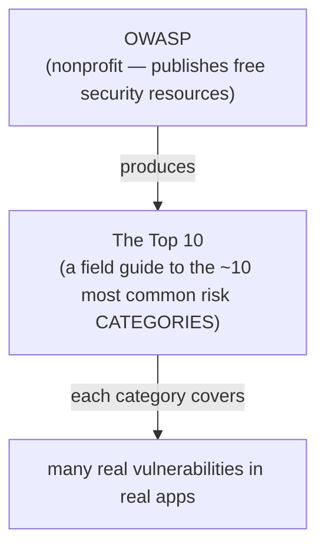

# What OWASP & the Top 10 Are

Before we look at a single vulnerability, let's clear up the confusion that trips up almost everyone the first time. The OWASP Top 10 sounds like it should be one specific thing — a piece of software, a certification, a rule you have to obey. It's none of those. Getting the mental model right *first* is what makes the actual list make sense, so we'll spend this whole phase on it.

## What OWASP actually is

**What it actually is.** OWASP is the **Open Worldwide Application Security Project** — a nonprofit foundation that publishes free, vendor-neutral resources about software security. Think of it as a community-run public library for application security: documentation, tools, cheat sheets, and guides, all open and free, maintained by volunteers and contributors around the world.

**Why people get this wrong.** Because the name shows up next to scary audit language, people assume OWASP is a company selling a product, or a government body issuing regulations. It's neither. Nobody can "sell you OWASP," and OWASP can't fine you. It's a body of freely available knowledge — and the Top 10 is its single most famous publication.

💡 **Key point.** OWASP is the organization. The Top 10 is one document that organization produces. Keep those two separate in your head and half the confusion evaporates.

## What the Top 10 actually is

**What it actually is.** The OWASP Top 10 is a **list of the ten broad categories of security risk that most commonly and most seriously affect web applications.** It's compiled from real-world data — vulnerabilities found across huge numbers of real applications — plus input from security practitioners about what's hurting people in practice.

The two words that matter most are **categories** and **risk**.

- It's not a list of ten specific bugs. Each entry is a *family* of related problems. "Injection," for example, covers SQL injection, command injection, and several cousins — many distinct bugs under one banner.
- It ranks by **risk**, which blends how common a problem is with how much damage it does when exploited. A flaw that's everywhere and catastrophic ranks above one that's rare and minor.

📝 **Terminology.** A *vulnerability* is a specific weakness in one app (a particular login form that doesn't check permissions). A *category* (or "risk category") is the named family that weakness belongs to (Broken Access Control). The Top 10 lists categories; your code has vulnerabilities that fall *into* those categories.

**Why people get this wrong.** Newcomers expect a checklist of literal bugs they can grep for. Instead they find ten broad headings and feel let down — "this is vague." It's broad *on purpose*. Specific bugs come and go; the underlying mistakes ("you trusted input you shouldn't have," "you forgot to check who's asking") repeat across every framework and decade. The categories are durable in a way a list of individual bugs never could be.

## The mental model: a field guide to the usual suspects

Here's the picture to carry around. A field guide to birds doesn't list every bird that has ever existed — it shows you the ones you're actually likely to see, with enough detail to recognize each on sight. The OWASP Top 10 is a field guide to the *usual suspects* in web app break-ins: the attacks you're genuinely likely to face, described so you can recognize them in your own code before an attacker recognizes them first.

That last line is the real value, and it's worth saying plainly: the Top 10's biggest gift isn't the ranking — it's that it gives the whole industry a **shared checklist and a shared vocabulary.** When a pentester writes "Broken Access Control" in a report, your team knows exactly what family of problem they mean, where to look, and roughly how bad it is. Before shared lists like this, every report invented its own terms and every team argued past each other.

## A periodically-updated list — check the source

**What it does in real life.** OWASP revises the Top 10 every few years as the data and the threat landscape shift. Categories get renamed, merged, split, or re-ranked between editions — something near the top one year might drop, and new concerns (like server-side request forgery) get promoted in as they become more common.

⚠️ **Gotcha.** Don't memorize one edition's exact ordering as if it were permanent truth — and be wary of blog posts quoting an old version. The categories described in the next phase reflect the most recent published list at the time of writing; for the current edition, the precise ranking, and the official write-ups, always go to the source: **[owasp.org](https://owasp.org)**.

**Why this saves you later.** When a colleague references "A03" or "the new SSRF entry," you'll know that's edition-specific shorthand, not gospel — and you'll instinctively check which version they mean instead of arguing from a stale memory.

## Recap

1. **OWASP** is a nonprofit that publishes free, vendor-neutral application-security resources — not a tool, company, or regulator.
2. **The Top 10** is OWASP's list of the ten broad *categories* of the most common and impactful web app security risks.
3. It ranks by **risk** (how common × how damaging), and each entry is a *family* of related vulnerabilities, not a single bug.
4. The mental model: a **field guide to the usual suspects** — and its real value is a **shared checklist and vocabulary** for the whole industry.
5. It's **updated every few years**; check [owasp.org](https://owasp.org) for the current edition rather than trusting any one ranking as permanent.

---

[← Guide overview](_guide.md) · [Phase 2: The Big Categories, in Plain English →](02-the-big-categories.md)
