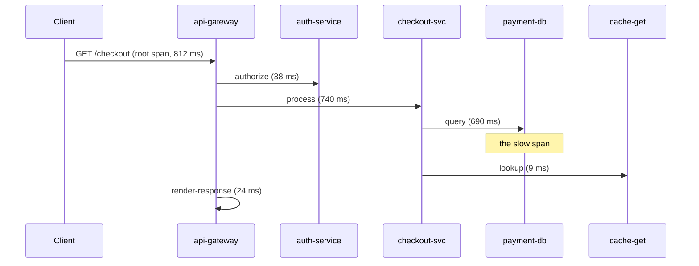

# The Three Pillars

You've heard "the three pillars of observability" recited like a slogan, but nobody told you *why* there
are three or what each one is genuinely for. So you reach for logs for everything - including questions
logs are terrible at - and wonder why debugging feels like archaeology. The fix isn't memorizing three
definitions. It's understanding that each pillar answers a fundamentally different *shape* of question, so
you learn to reach for the right one on instinct.

Here's the shape of each, in one line, before we go deep:

- **Logs** tell you *what happened* - individual events, in detail.
- **Metrics** tell you *how much / how many / how often* - numbers, trended over time.
- **Traces** tell you *where the time went* - one request's path across all your services.

## Logs - the discrete events

**What a log actually is.** A log is a timestamped record of one thing that happened: a request arrived,
a payment failed, a cache missed. It's the system's diary, written one event at a time, usually with
human-readable (or machine-parseable) detail attached.

**What logs are best at.** *Detail about a specific event.* When you've narrowed a problem down to "this
request, this moment," a log line can tell you the exact error, the exact input, the exact stack trace.
Nothing else carries that much context per event.

**A real example.**

```console
$ tail -n 1 /var/log/checkout/app.log
{"ts":"2026-06-19T14:02:11.481Z","level":"ERROR","service":"checkout","trace_id":"4bf92f3577b34da6","msg":"payment declined","order_id":"ord_8812","provider":"stripe","code":"card_declined"}
```

*What just happened:* One event, fully described - an order failed at 14:02:11 because the card was
declined, with the order id and provider right there. Notice the `trace_id`: that single field is the
thread that will let us tie this log line back to the exact request it belongs to in Phase 3.

**Where logs fall down.** Logs are *expensive at scale* and *bad at "how many."* Counting "how many
payments were declined this hour" from log lines means scanning a mountain of text, and a busy system
emits so much of it that storing and searching gets slow and costly. Logs answer *what happened in this
one case*, not *what's the overall trend*.

> ⏭️ Reading log lines well - levels, filtering, following one request through the flood - is its own
> skill. We cover it properly in [Reading Logs Without Drowning](/guides/reading-logs-without-drowning).

## Metrics - numbers over time

**What a metric actually is.** A metric is a number, sampled or accumulated over time, usually tagged with
a few labels (service, endpoint, region). Instead of recording *every* event in full, it records an
*aggregate* - "Requests handled: 1,204,883" is one cheap number, not 1.2 million log lines.

**What metrics are best at.** *Trends, rates, and alerting.* A metric is just numbers, so it's cheap to
store for a long time and cheap to chart. "Is error rate climbing?" "Is p99 latency above target?" - these
are metric questions, and metrics answer them instantly.

📝 **The three metric types** (worth knowing by name - they behave differently):

- **Counter** - a number that only ever goes *up* (until it resets), like a turnstile click. Total
  requests, total errors, total bytes sent. You rarely read the raw counter; you read its *rate of
  change* ("requests per second").
- **Gauge** - a number that goes *up and down*, a snapshot of "right now." Current memory in use, current
  queue depth, current temperature. A gauge is a thermometer; a counter is an odometer.
- **Histogram** - buckets that count how many observations fell into each range, so you can ask about the
  *distribution*, not just the average. This is how you get percentiles like p50, p95, p99 ("95% of
  requests finished under 300ms"). Averages lie - a few very slow requests hide behind a healthy-looking
  mean - so latency almost always wants a histogram, not a gauge.

**A real example.**

```console
$ curl -s localhost:9090/metrics | grep http_request
# HELP http_requests_total Total HTTP requests handled.
# TYPE http_requests_total counter
http_requests_total{service="checkout",status="200"} 1204883
http_requests_total{service="checkout",status="500"} 312
# TYPE http_request_duration_seconds histogram
http_request_duration_seconds_bucket{le="0.1"} 1180004
http_request_duration_seconds_bucket{le="0.3"} 1203991
http_request_duration_seconds_bucket{le="1.0"} 1204870
http_request_duration_seconds_bucket{le="+Inf"} 1205195
```

*What just happened:* A Prometheus-format metrics endpoint. The counter shows checkout handled ~1.2M
successful requests and 312 with a 500 error. The histogram buckets are cumulative (`le` means "less than
or equal to"): ~1.18M requests finished under 100ms, nearly all under 300ms, and a small tail took longer
- that's your p99. One scrape gives you the rate *and* the shape of latency, no individual request needed.

**Where metrics fall down.** Metrics tell you *that* something is happening, not *which case* or *why*.
The histogram above shows a slow tail exists; it can't tell you *which order* was slow or what went wrong
in it. For that, you follow the thread to a trace and then a log.

> ⏭️ Collecting, querying, and charting metrics is a craft of its own. The hands-on version lives in
> [Prometheus and Grafana](/guides/prometheus-and-grafana).

## Traces - one request's journey

**What a trace actually is.** A trace is the complete story of *one request* as it travels through your
system - the missing piece once you have more than one service. It's made of **spans**: each span is one
unit of work (a service call, a DB query, an API call), nested parent-to-child into a tree. Every span
records when it started and how long it took.

📝 **Span** - a single timed operation within a trace, with a name, a start time, a duration, and a parent
span. The top span (the whole request) is the **root span**; everything it triggers hangs beneath it.

**What traces are best at.** *Showing where the time went across services.* When a request touches five
services and one is slow, a trace lays it out as a waterfall so the slow span is visually obvious - the
question metrics and logs both struggle to answer: "which *part* was slow?"

**A real example.** Here's one trace (`trace_id: 4bf92f3577b34da6`, 812 ms total) drawn as the request crossing services, each span's duration noted:



*What just happened:* The 812ms request spent 690ms of that in a single `payment-db` query nested under
`checkout-svc` - auth, cache, and rendering were all fine. Without the trace you'd know only "the request
was slow"; with it, you know exactly which span to investigate, plus the `trace_id` to pull matching logs.
That's the same `trace_id` from the log line at the top of this phase - how the three pillars connect.

**Where traces fall down.** A trace is one request. It won't tell you "is this slow for *everyone*?" (a
metric question) or carry the full error detail inside the slow span (a log question). Traces are also
usually *sampled* - storing every trace from a busy system is costly - so the exact request you want may
not have been kept.

> ⏭️ Reading a real trace in a commercial tool, including the waterfall view and span attributes, is
> covered in [Reading Dynatrace](/guides/reading-dynatrace).

## Three lenses on the same system

The reason there are three pillars is that each looks at the system from a different angle, and the gaps in
one are covered by the others:

```text
   metric:  "p99 latency on /checkout jumped at 14:00"     → THAT it's wrong, for everyone
   trace:   "in this request, payment-db took 690 of 812ms" → WHERE the time went, one request
   log:     "payment declined / slow query: full table scan" → WHY, the exact event detail
```

Notice the natural order: a metric tells you *that* there's a problem and how widespread, a trace tells
you *where* in the request it lives, and a log tells you *why* at the level of a single event. Holding all
three lets you zoom from "something's wrong" all the way down to one line of detail - which is exactly the
journey we walk in Phase 3.

## Recap

1. **Logs** are discrete, detailed events - best for *what happened in this specific case*; expensive at
   scale and poor at "how many."
2. **Metrics** are numbers over time - **counters** (only go up), **gauges** (up and down, "right now"),
   and **histograms** (distributions, for percentiles). Cheap to store and chart; best for *trends and
   alerting*; can't tell you *which case* or *why*.
3. **Traces** follow one request across services as a tree of **spans** - best for *where the time went*;
   one request at a time, and usually sampled.
4. The three are lenses on the same system: metric = *that / how widespread*, trace = *where*, log =
   *why*. A shared `trace_id` is the thread that stitches them together.

---

[← Guide overview](_guide.md) · [Phase 3: Putting Them Together →](03-putting-them-together.md)
