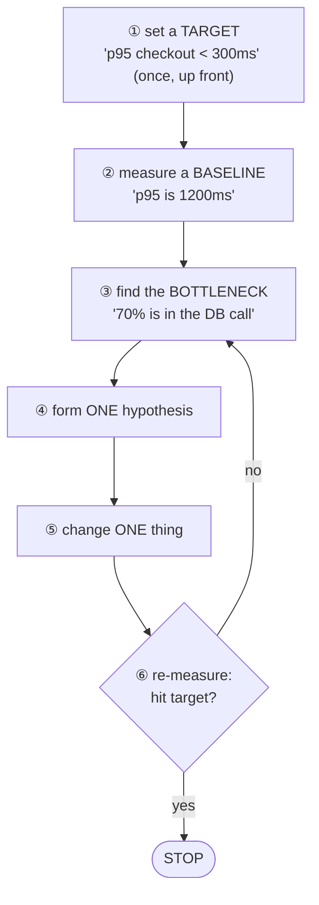

# The Optimization Loop

Optimization feels like it should be a burst of cleverness - spot the slow thing, rewrite it, done. In
practice the developers who reliably make systems faster are the boring ones. They don't out-clever the
problem; they run a loop, and they refuse to skip steps. The cleverness, when it's needed at all, comes
at the very end.

Here's the secret that makes the whole thing work: **optimization is a measurement problem wearing a
coding problem's clothes.** The hard part isn't writing the faster version - it's knowing *what* to make
faster, *whether* it worked, and *when* to stop. Get those three right and the code mostly writes
itself. Get them wrong and you can spend two weeks shaving microseconds off a function that runs once a
day.

## The loop, top to bottom

Every optimization that actually lands walks the same circle:



Notice what's at the top and what's at the bottom: a target you decide *before* you start, and a hard
stop the moment you reach it. Everything in between is what people think of as "optimizing" - the two
ends are what separate a focused afternoon from a lost fortnight.

## Set a target before you touch anything

**What it actually is.** A target is a specific, measured number that defines "done." Not "make it
faster" - *"p95 checkout latency under 300ms"* or *"the nightly report finishes before 6am."* It names
the metric, the threshold, and ideally the conditions.

**Why people get this wrong.** "Make it faster" feels like a goal, but it has no finish line - there's
always another millisecond, and *faster than what, by how much, is that enough?* stay undefined. A
target converts an open-ended craving into a yes/no question - and your permission to **stop**. When p95
hits 280ms against a 300ms target, you're done; go ship something else. Performance work has steeply
diminishing returns, and the target is what stops you grinding past the point anyone cares.

⚠️ **Gotcha - optimizing without a baseline or a target is how you lose weeks.** This is the single most
common way performance work goes wrong. With no baseline, you can't prove anything got faster - "it
feels snappier" is not a result. With no target, you can't tell when to stop, so you keep going until
you run out of patience or break something. Decide both before you write a line of code.

## Measure the baseline

**What it actually is.** The baseline is the system's performance *right now*, measured the same way
you'll measure after each change - the "before" photo. Every claim of improvement compares against it,
so if it's sloppy, every later number is meaningless.

**What it does in real life.** You run the workload and record the number that matters - and the
*distribution*, not just one figure, because real latency is lumpy (much more on this in
[Phase 3](03-optimizing-safely-in-production.md)).

```console
$ ./bench checkout --requests 5000
checkout latency over 5000 requests:
  p50   180ms
  p95  1200ms
  p99  2100ms
```
*What just happened:* You now have a concrete "before." The typical request (p50) is fine at 180ms, but
the tail (p95, p99) is dragging - and since your target is p95 under 300ms, that tail is exactly the
problem. Without this measurement you'd be guessing at which end to fix.

⚠️ **Gotcha - measure in conditions that resemble production.** A baseline taken on your laptop against
an empty database tells you almost nothing about a system serving real traffic against fifty million
rows. The bottleneck on a tiny dataset is often *completely different* from the one in production.
Measure against realistic data volume and concurrency, or your baseline is a fairy tale.

## Find the bottleneck - then attack only it

**What it actually is.** The bottleneck is the one part of the system responsible for the largest share
of the time you care about. In almost every system, time is wildly unevenly distributed - a small
fraction of the code accounts for most of the wall-clock cost.

**Why this matters so much.** Amdahl's law is the math behind the intuition: the speedup from optimizing
a component is capped by how much of the total time it uses. A function that's 5% of your runtime,
made *infinitely* fast, speeds up the whole system by at most 5% - so optimizing anything but the
bottleneck is, almost by definition, a waste of effort.

```text
   where the time goes in one checkout request:

   DB query   ███████████████████████████████████  70%   ◄── the bottleneck
   serialize  ████████                              16%
   app logic  ████                                   8%
   network    ███                                    6%

   (illustrative breakdown - your real split comes from a profiler or trace)
```

*What just happened:* The breakdown says 70% of the time is one database query. Spend your week
hand-optimizing the app logic (8%) instead, and the best possible outcome is an 8% improvement - still
missing target by a mile. The profiler just told you where the only meaningful win lives. (Producing
this breakdown is the subject of [Profiling 101](/guides/profiling-101) and
[Observability: Logs, Metrics, Traces](/guides/observability-logs-metrics-traces).)

💡 **Key point.** Don't optimize what's *slow in isolation*; optimize what's *expensive in total*. A
function that takes 2ms but runs ten thousand times per request beats a function that takes 200ms but
runs once. The bottleneck is about total cost, not per-call cost.

## Form one hypothesis, change one thing

**What it actually is.** A hypothesis is a falsifiable guess about cause and effect: *"The query is slow
because it's doing a full table scan; adding an index on `user_id` will bring it under 300ms."* It names
what you think is wrong and what you'll do about it, so a re-measurement can confirm or refute it.

**Why change exactly one thing.** Add an index, rewrite the query, *and* add a cache all at once, and
the number improves - which change did it? You don't know; maybe two helped and one hurt and they
happened to net out. One change per loop is what lets the re-measurement actually *mean* something -
slower per step, far faster overall, because you never untangle a knot of interacting changes.

🪖 **War story.** A teammate once "optimized" a slow page with six changes in one afternoon - new index,
query rewrite, added cache, tweaked serializer, bumped connection pool, changed timeout. The page got
faster. Two weeks later it was *slower than the original*, and nobody could undo the regression because
nobody knew which change was load-bearing and which was secretly harmful. They reverted the whole batch
and started over, one at a time. The one-thing rule isn't bureaucracy - it's what makes your work
reversible and your conclusions trustworthy.

## Re-measure, then decide

**What it does in real life.** You make your one change and run the *exact same* measurement as your
baseline - same workload, same conditions - and compare.

```console
$ ./bench checkout --requests 5000
checkout latency over 5000 requests:
  p50   120ms
  p95   260ms     (was 1200ms)
  p99   340ms     (was 2100ms)
```
*What just happened:* The index dropped p95 from 1200ms to 260ms, under target. The hypothesis is
confirmed, the target is met - so you **stop**. You don't chase the next 20ms; it isn't worth a day of
your life and the risk of a new bug. If the number *hadn't* moved, discard that hypothesis and loop back
to "find the bottleneck" with what you just learned.

⚠️ **Gotcha - a change that doesn't help is still information, so keep it only if it's free.** If your
hypothesis was wrong and the change made no difference, revert it. Dead "optimizations" that don't
measurably help are just complexity you'll pay for forever in readability. Carry forward only the
changes that earned their place on the graph.

## Recap

1. **Set a target first.** A specific measured number ("p95 < 300ms") defines done and gives you
   permission to stop. No target means no finish line.
2. **Measure a baseline** in production-like conditions, capturing the distribution - it's the "before"
   every later claim compares against.
3. **Find the bottleneck.** Amdahl's law: optimizing anything but the largest cost is capped at a tiny
   payoff. Attack total cost, not per-call slowness.
4. **One hypothesis, one change, re-measure.** Changing one thing per loop is what makes the result
   interpretable and reversible.
5. **Stop when you hit the target.** Diminishing returns are real; the next millisecond rarely pays for
   its risk.
6. ⚠️ **Optimizing with no baseline and no target is the classic way to lose weeks.** Both, up front,
   every time.

Next: now that you have the loop, where should you point it? The usual real-world bottlenecks, ranked,
so you look in the right place first.

---

[← Guide overview](_guide.md) · [Phase 2: Where the Time Actually Goes →](02-where-the-time-goes.md)
