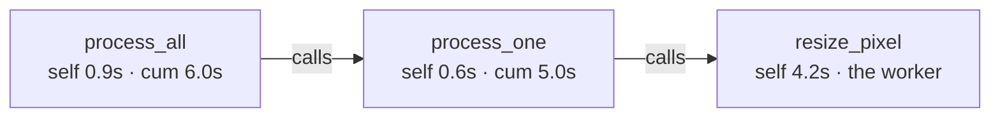

# Reading a Profile

You ran the profiler. Now you're staring at a table of function names and numbers, or a multicolored diagram that looks like a city skyline turned upside down, and it's not obvious what any of it is telling you. This is the moment a lot of people quietly close the tool and go back to guessing.

Don't. A profile is built around a handful of ideas, and once you have them, reading one is fast. This phase gives you those ideas - hot functions, the all-important difference between *self* and *cumulative* time, call counts - and then teaches you the flame graph, which is the same information drawn as a picture. The numbers below are illustrative (a made-up program), but the shape and the column meanings are exactly what real tools show.

## The flat profile: a ranked list of functions

**What it actually is.** The simplest view a profiler gives you is a **flat profile** - a table, one row per function, sorted so the most expensive function is on top. It answers the first question you have: *which functions are eating the time?* A function near the top, soaking up a big share of the runtime, is called a **hot** function. That's where your attention goes.

**A real example.** Here's a flat profile from a slow image-processing script (illustrative output):

```console
$ python -m cProfile -s tottime slowscript.py
         812043 function calls in 6.114 seconds

   Ordered by: internal time

   ncalls  tottime  percall  cumtime  percall filename:lineno(function)
    50000    4.231    0.000    4.231    0.000 image.py:88(resize_pixel)
        1    0.902    0.902    5.980    5.980 image.py:40(process_all)
    50000    0.611    0.000    5.060    0.000 image.py:71(process_one)
    50000    0.210    0.000    0.210    0.000 image.py:103(clamp)
        1    0.160    0.160    6.114    6.114 slowscript.py:1(<module>)
```
*What just happened:* The profiler ran your script, tallied every call, and sorted by `tottime` - the time spent *inside each function itself*. The story is right there in the top row: `resize_pixel` burned **4.231 seconds** of the program's 6.1, and it was called **50,000 times** (`ncalls`). That one function is most of your runtime. Everything below it is comparatively small. You found the tall bar.

📝 **Terminology.** A **hot** function (or "hot spot," "hot path") is one where the program spends a large fraction of its time. "Hot" just means "where the action is." The whole point of a profile is to find the hot function.

## Self time vs. cumulative time - the distinction that matters most

This is the one idea that, if you get it backwards, sends you optimizing the wrong function. So go slow here.

**What they actually are.** Every function gets two different time numbers, and they mean genuinely different things:

- **Self time** (also called *internal* or *exclusive* time - `tottime` in the output above) is the time spent executing *that function's own code*, not counting the functions it called. It's the work the function does with its own hands.
- **Cumulative time** (also *total* or *inclusive* time - `cumtime` above) is the time spent in that function *plus everything it called, down the whole chain*. It's the work the function is responsible for, including the work it delegated.



**Why this trips everyone up.** Look at `process_all` in the table: its **cumulative** time is 5.98 seconds - nearly the whole program. If you sort by cumulative time, `process_all` looks like the villain. But its *self* time is only 0.9 seconds. It's not slow; it just *contains* the slow thing. Rewriting `process_all` would do almost nothing. The actual culprit is `resize_pixel`, with high *self* time - that's where the CPU is genuinely spending cycles.

💡 **Key point.** **High cumulative, low self = a manager, not a worker.** It's slow only because something it calls is slow; chase *that*. **High self time = the actual worker** doing the expensive thing - that's what you optimize. When you open a profile, the question is always "what has high *self* time?" That's the bottleneck. Cumulative time tells you *who called it*, which is useful for understanding the path, but self time tells you *what to fix*.

⚠️ **Gotcha.** Top-level and framework functions (`main`, `process_all`, an event loop, a web framework's request handler) almost always have huge cumulative times - they sit at the top of the call chain, so by definition everything happens "inside" them. That is not a finding. Don't celebrate discovering that `main` accounts for 100% of the runtime. Sort by *self* time to cut past the managers and find the worker.

## Call counts: cheap × many = expensive

**What it actually is.** The `ncalls` column is how many times each function ran. On its own it's just a number, but paired with time it tells a story you can't get otherwise: **a cheap function called a staggering number of times is a bottleneck in disguise.**

**What it does in real life.** Look back at `resize_pixel`: `percall` is `0.000` seconds - each individual call is so fast it rounds to zero. In isolation you'd swear it was free. But `ncalls` is 50,000, and 50,000 times "basically free" is 4.2 seconds. The expense isn't in any one call; it's in the multiplication. This is why call count matters: it reveals the loops and the per-row work that no single profile-time number flags as suspicious.

**Why this saves you later.** When you see a hot function with a huge call count, your fix often isn't "make the function faster" - it's "**call it fewer times.**" Move work out of the loop, batch it, cache the result, compute it once instead of per-row. A function called 50,000 times that you can get down to 1 call is a far bigger win than shaving 10% off each call. Call count points you at *that* kind of fix.

## The flame graph: the profile as a picture

The table is precise but hard to feel. A **flame graph** is the same information drawn so the bottleneck is impossible to miss - once you know the two rules for reading it.

**What it actually is.** A flame graph stacks your call chains as boxes. There are exactly two things to read:

- **Vertical = depth of the call stack.** A box sitting on top of another box means "this function was *called by* the one beneath it." The bottom is your entry point; height is how deep the calls nest. (Height is *not* time - a tall stack isn't a slow one.)
- **Horizontal = time. This is the one that matters.** The **width** of a box is how much total time was spent in that function and its children. **Wide = expensive.** A box that stretches across most of the graph is where most of your time went. Color is usually just for contrast; it carries no meaning.

```text
   Read it like this: WIDTH = time spent.  The widest box is your target.

   ┌──────────────────────────────────────────────────────────────┐
   │ process_all                                          (6.0s)   │   ← entry point, spans ~everything
   ├──────────────────────────────────────────────────────────────┤
   │ process_one                                          (5.0s)   │
   ├───────────────────────────────────────────────┬──────────────┤
   │ resize_pixel                          (4.2s)   │ clamp (0.2s) │   ← resize_pixel is WIDE = the bottleneck
   └───────────────────────────────────────────────┴──────────────┘

   Your eye should go straight to the widest box. That's where the time is.
```

**How to actually read one.** Don't try to absorb the whole thing. Let your eye fall to the **widest box** - scan left to right for the longest horizontal run. That box is your bottleneck. Then read *upward* from it to see what it calls, and *downward* to see what called it (the path that led there). Narrow towers, however tall, are cheap; ignore them. A flame graph is designed so the answer is literally the widest thing on screen.

💡 **Key point.** A flame graph and a flat profile say the same thing. The widest box in the flame graph is the function with the highest *cumulative* time; to find the **self**-time hot spot, look for a wide box with no wide box *stacked on top of it* - meaning it's spending that width on its own code, not passing it down. That "wide box with nothing wide above it" is the worker you want to fix.

## Recap

1. **A flat profile is a ranked list of functions.** The one on top - the **hot** function - is where the time goes.
2. **Self time = the function's own work; cumulative time = it plus everything it called.** Optimize high *self* time. High cumulative + low self is a manager, not the problem.
3. **Top-level functions always have huge cumulative time** - that's not a finding. Sort by self time to skip the managers.
4. **Call count reveals cheap-but-frequent bottlenecks.** Cheap × 50,000 is expensive; the fix is often "call it less," not "make it faster."
5. **A flame graph draws the same data: width = time.** Find the widest box; that's your target. A wide box with nothing wide stacked above it is the self-time hot spot.

You can now read a profile and point at the slow thing with confidence. But knowing *where* it's slow isn't the same as making it fast - and it's surprisingly easy to "fix" it and make things worse. The next phase is the disciplined loop that turns a reading into a real, verified speedup.

---

[← Phase 1: Measure, Don't Guess](01-measure-dont-guess.md) · [Guide overview](_guide.md) · [Phase 3: From Profile to Fix →](03-from-profile-to-fix.md)
