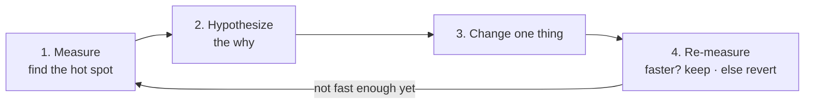

# From Profile to Fix

You've found the slow thing. The flame graph has a fat box with your name on it, and you can feel the urge: open the file, start changing things. That urge is where good profiling work goes to die. The gap between "I found the bottleneck" and "I made it faster" is full of ways to fool yourself — fixes that don't help, fixes that help in dev but not in production, fixes that speed up code nobody runs.

This phase is the discipline that closes that gap. It's a short, boring, reliable loop, plus the handful of patterns that turn out to be the bottleneck most of the time, plus the two traps that make a profile lie to you. Boring is the point: boring is repeatable.

## The loop: confirm, change one thing, re-measure

**What it actually is.** Optimization isn't a single heroic edit; it's a loop you run until you're fast enough:

**Why each step is non-negotiable.**

- **Confirm the hypothesis before you code.** The profile tells you *where*, not always *why*. Before optimizing, form a specific guess about the cause ("this is O(n²) because of the nested scan") and sanity-check it against the code. Optimizing without a *why* is just guessing again, one level down.
- **Change exactly one thing.** This is the rule people break and regret. If you make three changes and the function gets faster, you don't know which change did it — or whether one of them helped while another quietly hurt. One change per loop means every re-measure has a clear verdict.
- **Re-measure against the *before* number.** "It feels faster" is not a result. You had a number before; get the number after; compare. If it didn't move, **revert** — an optimization that doesn't measurably help is just added complexity and a future bug. Keeping it because you're attached to it is how codebases rot.

⚠️ **Gotcha.** Re-measure the *same way* you measured the first time — same workload, same data size, same machine state. If you profiled a 50,000-row run, don't confirm your fix on a 100-row run. Comparing two numbers taken under different conditions tells you nothing, and it's an easy way to convince yourself a non-fix worked.

🪖 **War story.** Someone "optimized" a hot loop with three changes at once: a caching layer, a rewritten inner function, and a switched data structure. The endpoint got 20% faster, everyone celebrated, it shipped. A week later a bug surfaced in the cache. They reverted just the cache — and the endpoint got *faster*. The cache had been a net loss the whole time; the data-structure change carried the win and the cache was dragging it down. Three changes at once hid that completely. One change per loop would have caught it in two minutes.

## The common wins: what the bottleneck usually turns out to be

After you've done this a few times, you start recognizing the same culprits. Three of them account for a huge share of real-world slowness.

### An accidental O(n²)

**What it actually is.** Often the hot function is slow because its work grows with the *square* of the input — double the data and it gets four times slower, not twice. This usually sneaks in as a loop inside a loop, or a lookup-in-a-list inside a loop (each lookup scans the whole list, and you do it once per item).

📝 **Terminology.** **O(n²)** ("oh of n squared") is shorthand for "the time grows with the square of the input size." For 1,000 items that's a million operations; for 10,000 it's a hundred million. It's fine when n is tiny and brutal when n grows — which is exactly why it passes tests on small data and melts in production.

**The fix.** Replace the repeated scan with a one-time setup that makes each lookup cheap. Build a set or a dictionary *once* before the loop, then look up in it — turning a scan-per-item into a constant-time check. The telltale sign in the profile is a function whose cost grows far faster than your data does, often with an enormous call count on an inner lookup.

### An N+1 query

**What it actually is.** You fetch a list of N things (1 query), then loop over them and fire one more query *per item* to get its details — N more queries. So displaying 100 orders runs 101 database round-trips instead of 1 or 2. Each query is fast; the killer is the *count* of them, and the network round-trip cost on every one.

**How it shows up in a profile.** A database or HTTP-client function with a call count suspiciously close to your row count, and a big cumulative time made of many tiny calls. It's the call-count lesson from Phase 2 in its most common real-world form.

**The fix.** Fetch in bulk: one query that gets all the related data at once (a join, an `IN (...)` query, or your ORM's eager-loading / batch-fetch feature), instead of one query per item. This is such a common and deep topic that it has its own guide — see [Why Is My Query Slow?](/guides/why-is-my-query-slow) for diagnosing and fixing it properly.

### Repeated work you can cache

**What it actually is.** The profile shows a function computing the *same expensive result over and over* — parsing the same config, rebuilding the same lookup table, recomputing a value that didn't change between calls. The date-formatting helper from Phase 1 that rebuilt a timezone table on every one of 50,000 rows is exactly this.

**The fix.** Compute it once and reuse it. **Hoist** the work out of the loop if it doesn't depend on the loop variable, or **cache** (memoize) the result so the second call returns the stored answer instead of recomputing. The win can be enormous because you're not making the work faster — you're deleting almost all of it.

💡 **Key point.** Notice the pattern across all three: the best fix is usually **doing the work fewer times**, not making each unit of work faster. Squashing an O(n²) into O(n), collapsing N+1 into 1, caching repeated work — all three *remove* work rather than speeding it up. Reach for "can I do this less often?" before "can I make this line faster?"

## The two traps that make a profile lie

A profile is honest about what it measured. The danger is measuring the wrong thing, and then trusting the answer.

⚠️ **Trap 1: dev data lies — profile a realistic workload.** Your development database has 50 rows; production has 5 million. An O(n²) bottleneck is *invisible* on 50 rows and catastrophic on 5 million. If you profile against tiny dev data, the profile will point you at the wrong function — or at nothing at all — because the real bottleneck only wakes up at scale. Profile against production-sized data (a realistic copy, a load test, a representative sample). A profile of an unrealistic workload is worse than no profile, because it's confidently wrong.

⚠️ **Trap 2: don't optimize cold paths.** A **cold path** is code that runs rarely — startup, an admin-only report, an error handler. A **hot path** runs constantly. The profile makes this distinction for you: hot paths have high time and high call counts; cold paths barely register. It's tempting to optimize a function because it *looks* inefficient, but if the profile shows it's cold, making it faster is wasted effort that buys zero real speedup and adds complexity. Only optimize what the profile shows is actually hot. The whole reason you measured was to avoid spending effort where it doesn't matter — don't throw that away by polishing cold code.

## Beyond your laptop: production

Everything here profiles a run *on your machine*. But the workload that matters is the one in production — real traffic, real data sizes, real concurrency — and that's often where the surprising bottlenecks live. You can't always reproduce a 2pm Tuesday traffic spike on your laptop.

That's a different discipline: watching performance continuously in the live system rather than in a one-off profiling run. Metrics tell you *when* and *where* things slowed down; traces follow a single slow request across services to show you which hop ate the time — production's version of cumulative-vs-self. When the slow thing only happens in production, reach for [Observability: Logs, Metrics, and Traces](/guides/observability-logs-metrics-traces).

## Recap

1. **Run the loop:** measure → hypothesize the *why* → change exactly one thing → re-measure against the before number. Same conditions both times. If it didn't help, revert.
2. **One change per loop**, always — so every re-measure has a clear verdict and a quiet regression can't hide.
3. **The common wins** are an accidental O(n²), an N+1 query, and repeated work you can cache — and the fix is usually **doing the work fewer times**, not faster.
4. **Profile a realistic workload** — dev data hides the bottlenecks that only appear at scale.
5. **Don't optimize cold paths** — the profile tells you what's hot; spend your effort only there.
6. **For production**, move from one-off profiling to continuous observability — metrics and traces — covered in [Observability: Logs, Metrics, and Traces](/guides/observability-logs-metrics-traces).

That's the whole loop. You measure instead of guessing, you read the profile to find the genuine hot spot, you change one thing and prove it helped. Do that, and "the app is slow" stops being a dreaded mystery and becomes a list with the answer near the top.

For the bigger picture of what "fast enough" even means and how to set targets, see [What Performance Means](/guides/what-performance-means).

---

[← Phase 2: Reading a Profile](02-reading-a-profile.md) · [Guide overview](_guide.md)
