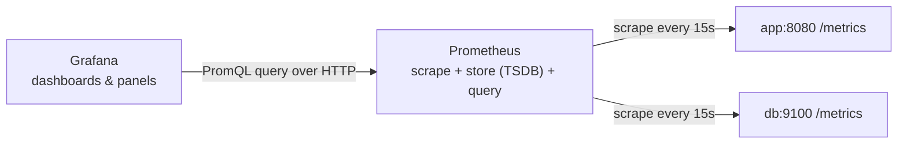

# What Each One Does

The single most common confusion about this pair is thinking they're one thing - "the monitoring system" - or that they're interchangeable. They're not. They're a database and a drawing tool that happen to be used together so often that people say their names in one breath: "promandgrafana."

Untangling them is the whole game. So let's name the jobs.

## The division of labor

**What it actually is.** You have two separate tools, each doing one job:

- **Prometheus** is a **time-series database** with a collector built in. Its job is to go out, *pull* numbers from your services on a schedule, and *store* them with timestamps. It also answers queries about that stored data.
- **Grafana** is a **dashboard tool**. It stores no metrics of its own. Its job is to *ask* a data source (Prometheus, here) for numbers and *draw* them - graphs, gauges, tables, the wall of green.

> 📝 **Time-series database (TSDB):** a database built for data that is "a number, at a time, with some labels," recorded over and over. `http_requests_total{path="/login"} = 4072 at 14:03:10`. It's optimized for "show me this number's shape over the last hour," which a normal SQL table is bad at.

**Why people get this wrong.** Because you only ever *see* Grafana, it's natural to assume Grafana is "the monitoring system" and Prometheus is some plumbing detail. It's the reverse: Prometheus holds the truth (the actual stored numbers), and Grafana is a window onto it. Delete Grafana and your data is fine. Delete Prometheus and Grafana has nothing to draw.

**What it does in real life.** Here's the flow, end to end:



*What just happened:* Prometheus reaches out every scrape interval (15s is the common default) and reads a plain-text page each service publishes at `/metrics`. It stores every number it finds, stamped with the time. Grafana, when you open a dashboard, sends PromQL queries to Prometheus and renders whatever comes back. The arrows point *from* Prometheus *to* your services on purpose - Prometheus pulls; your services don't push.

## Prometheus pulls - it doesn't wait to be told

**What it actually is.** Each service you want to monitor exposes an HTTP endpoint, conventionally `/metrics`, that prints its current numbers as text. Prometheus is configured with a list of these endpoints (its **scrape targets**) and visits each one on a timer.

**What a `/metrics` page looks like.** It's just text. If you `curl` one yourself, you'll see something like:

```console
$ curl localhost:8080/metrics
# HELP http_requests_total Total HTTP requests handled.
# TYPE http_requests_total counter
http_requests_total{method="GET",status="200"} 18342
http_requests_total{method="GET",status="500"} 12
# HELP process_resident_memory_bytes Resident memory in use.
# TYPE process_resident_memory_bytes gauge
process_resident_memory_bytes 5.81824e+07
```

*What just happened:* The service printed its live counters and gauges as a snapshot - "right now, I've handled 18,342 successful GETs and 12 failed ones, and I'm using ~58 MB of memory." Prometheus reads exactly this page every 15 seconds and files each line away with a timestamp, building a history out of repeated snapshots. (The `# HELP` and `# TYPE` lines are the metric describing itself - we'll use those types in Phase 2.)

**The gotcha.** Because Prometheus *pulls* on a schedule, it can only see what a service is exposing *at scrape time*. A request that started and finished entirely between two scrapes still gets counted (the counter went up), but a brief spike in a gauge that rises and falls within 15 seconds can be invisible. Pull-based monitoring trades that blind spot for a big simplicity win: Prometheus always knows whether a target is up (the scrape either succeeds or it doesn't), and your services don't need to know where Prometheus is.

💡 **Key point.** This is a design decision, not an accident. The alternative - services *pushing* metrics out - means every service needs to know the monitoring address and you lose the free "is it up?" signal. Prometheus chose pull. (Push exists too, via a component called the Pushgateway, for short-lived jobs that die before a scrape can reach them - but pull is the default and the norm.)

## Grafana draws - it stores nothing

**What it actually is.** Grafana connects to one or more **data sources** (Prometheus is one of many it supports) and turns query results into panels. A **panel** is one visualization - a graph, a single stat, a table. A **dashboard** is a page full of panels.

**What it does in real life.** When you load a dashboard, Grafana fires off the PromQL queries behind each panel, Prometheus answers with time-stamped numbers, and Grafana plots them. Refresh the page and it queries again. There's no metric data living inside Grafana - it's a live view, re-fetched each time.

**Why this matters.** It explains a lot of "weird" behavior you'll hit:

- A panel showing "No data" usually means the *query* found nothing in Prometheus, or the data source is misconfigured - not that Grafana lost anything.
- You can point Grafana at a different Prometheus and the same dashboard "just works" against the new data, because the dashboard is only queries and layout.
- If Prometheus only keeps 15 days of history (a common retention setting), Grafana can't show you last month - there's nothing to ask for. Retention is Prometheus's concern, not Grafana's.

**The gotcha.** Grafana can connect to many data sources - Prometheus, Loki for logs, a SQL database, cloud-vendor metrics. So "it's in Grafana" tells you almost nothing about *where the data actually lives*. When a panel misbehaves, your first question is always: *which data source is this panel querying, and is the data really there?* Open the panel's query, run it against Prometheus directly, and you'll know in seconds whether the problem is the data or the drawing.

## Why this saves you later

The next time a dashboard shows a flatline or "No data" during an incident, you won't flail. You'll know the data lives in Prometheus and Grafana is just the window - so you check the right thing first: *is Prometheus actually scraping that target?* (Prometheus has its own page listing every target and whether the last scrape succeeded.) Half of "the monitoring is broken" turns out to be one dead scrape target, and you can only see that if you know who's responsible for what.

## Recap

1. **Two tools, two jobs.** Prometheus collects and stores; Grafana queries and displays.
2. **Prometheus pulls.** It scrapes a text `/metrics` page from each target on a timer and stores every number with a timestamp.
3. **Grafana stores nothing.** It's a live window - it asks a data source for numbers and draws them on demand.
4. **The truth lives in Prometheus.** When a graph looks wrong, check whether the data is really there before blaming the picture.

Now that you know *where* the numbers live, let's learn how to read them - the metric types, labels, and your first PromQL query.

---

[← Guide overview](_guide.md) · [Phase 2: Metrics & a Taste of PromQL →](02-metrics-and-promql.md)
