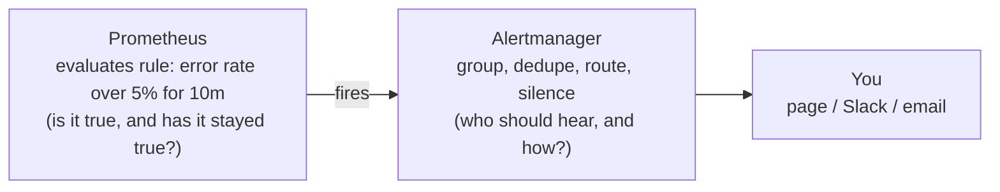

# Dashboards & Alerting

It's tempting to think the goal here is "make a nice dashboard." It isn't. The goal is to *answer questions* and *get woken up only when something is genuinely wrong*. A beautiful dashboard nobody looks at is wasted work; an alert that cries wolf every night gets muted, and then it misses the real fire.

So this phase is less about clicking buttons and more about judgment: what to chart, what to alert on, and the three ways this whole setup quietly rots. Let's start with the rot, so you can avoid it from the first panel.

## The "what goes wrong" cheat-card

> **Recognize the failure mode, then read the section.**

| Symptom | What's actually happening | Where to look |
|---|---|---|
| 40-panel dashboard nobody opens | Built to *display data*, not *answer a question* | §1, §2 |
| "I don't know what to put on this dashboard" | No method - charting at random | §2 (RED / USE) |
| Team mutes the alerts channel | Alert fatigue - too many, too noisy, not actionable | §4 |
| Prometheus slow / OOM / disk full | Cardinality blowup - too many label values | §5 |
| "Should we just buy an APM instead?" | Reasonable question - trade-offs are real | §6 |

---

## 1. A panel answers one question

**What it actually is.** A good panel starts with a *question*, not a metric. "Are we serving errors to users right now?" is a question. "Let me put `http_requests_total` on a graph" is not - it's just data with no point.

**What it does in real life.** Say the question is "what's our error rate?" You already know how to express that from Phase 2. The panel's query might be:

```promql
sum(rate(http_requests_total{status=~"5.."}[5m]))
  /
sum(rate(http_requests_total[5m]))
```

*What it's showing you:* the fraction of requests that are server errors, as a live ratio. The top line is "5xx errors per second" (`status=~"5.."` matches any 5xx code with a regex), the bottom is "all requests per second," and dividing gives you "what share of traffic is failing." A panel like this answers the question directly: `0` is healthy, `0.05` means 5% of requests are failing right now. That's something a human can act on at a glance.

💡 **Key point.** Before you add any panel, finish this sentence: *"This panel exists so I can tell whether ______."* If you can't fill the blank, don't add the panel.

## 2. RED and USE - how to decide *what* to chart

The blank-page problem ("what do I even put here?") has two well-known answers, depending on whether you're looking at a *service* or a *resource*.

**RED - for request-driven services** (an API, a web app). For each service, chart three things:

```text
  R ─ Rate        how many requests per second?      rate(requests[5m])
  E ─ Errors      how many of them are failing?      rate(requests{status="error"}[5m])
  D ─ Duration    how long are they taking?          a latency percentile from a histogram
```

*What this gives you:* with just those three, you can answer "is the service busy, is it healthy, is it fast?" - which is almost everything you want to know about a service from the outside. (RED is widely attributed to Tom Wilkie; USE below to Brendan Gregg. Both are well-documented industry conventions.)

**USE - for resources** (a CPU, a disk, a memory pool, a connection pool). For each resource, chart:

```text
  U ─ Utilization   how busy is it?       (% CPU, % memory used)
  S ─ Saturation    how much is it queued / waiting?  (run queue, swap)
  E ─ Errors        is it throwing errors? (disk errors, dropped packets)
```

*What this gives you:* a way to find the *constrained* resource when a service is slow - the disk that's 100% utilized, the connection pool that's saturated.

**The gotcha.** Don't apply both to everything. RED is for things that *serve requests*; USE is for things that *get consumed*. Picking the right lens is most of the skill - a service's dashboard is mostly RED, an infrastructure dashboard is mostly USE.

## 3. ⚠️ Dashboards nobody reads

**What's actually happening.** The natural failure mode of dashboards is *accretion*. Someone adds a panel during an incident "to see," never removes it, and a year later the dashboard has 40 panels, three of which anyone actually uses. A 40-panel wall isn't more informative than a 5-panel one - it's *less*, because the signal is buried and nobody can hold it in their head.

**The calm fix.** Treat panels like code: if it doesn't earn its place, delete it. A dashboard that answers five real questions clearly beats one that displays fifty metrics nobody reads. When in doubt, ask whose question each panel answers - if the answer is "nobody's, anymore," cut it.

## 4. Alerting - and ⚠️ alert fatigue

**What it actually is.** An **alert rule** is a PromQL expression plus a condition and a duration: "if *this* is true for *this long*, fire." Prometheus evaluates the rule on a timer; when it fires, it hands the alert to **Alertmanager**, a separate component whose job is routing - deciding who gets paged, grouping related alerts, and silencing them during maintenance.



*What just happened:* Prometheus decides *whether* something is wrong; Alertmanager decides *what to do about it*. Splitting those two jobs is deliberate - it means one Alertmanager can handle alerts from many Prometheus servers, and you tune *routing* (who, when, how loud) without touching the *rules* (what counts as wrong).

**A real alert rule.** Rules live in Prometheus's config as YAML:

```yaml
groups:
  - name: api-health
    rules:
      - alert: HighErrorRate
        expr: |
          sum(rate(http_requests_total{status=~"5.."}[5m]))
            / sum(rate(http_requests_total[5m])) > 0.05
        for: 10m
        labels:
          severity: page
        annotations:
          summary: "5xx error rate above 5% for 10 minutes"
```

*What just happened:* This says "if more than 5% of requests are 5xx errors, *sustained for 10 minutes*, fire a `page`-severity alert." That `for: 10m` is the most important line - it's what stops a one-second blip from paging someone at 3am. The alert only fires if the condition stays true for the whole window.

⚠️ **Gotcha - alert fatigue is how monitoring dies.** If alerts fire on things that aren't actionable, or fire so often that they're background noise, people mute the channel - and then they miss the *real* incident. This is the single most common way a monitoring setup becomes worthless. The fixes are discipline, not technology:

- **Alert on symptoms, not causes.** Page on "users are getting errors" (a symptom) rather than "CPU is at 80%" (a cause that may be totally fine). High CPU that isn't hurting anyone is not an emergency.
- **Every page must be actionable.** If the on-call person can't *do* anything about it at 3am, it shouldn't page - make it a ticket or a dashboard line instead.
- **Use `for:` generously.** Most things that are bad for two seconds and then fine don't need a human.
- **Match severity to urgency.** Reserve paging for "wake someone up" problems; route everything else to a chat channel.

## 5. ⚠️ Cardinality blowups - the silent killer

**What's actually happening.** Remember from Phase 2: every unique combination of label values is a *separate* time series Prometheus stores in memory and on disk. **Cardinality** is the count of those distinct series. It's fine when labels have small, bounded value sets (a handful of HTTP methods, a dozen status codes). It becomes catastrophic when a label can take unlimited values.

The classic mistake:

```text
   SAFE label (bounded):              DANGEROUS label (unbounded):
   status="200" | "404" | "500"       user_id="a1f3" | "b7c2" | ...millions
   → a few series                     → one series per user → explosion

   path="/login" | "/cart"            path="/cart?id=8832&ref=email&t=..."
   → tens of series                   → one series per unique URL → explosion
```

*What just happened:* Putting `user_id`, a raw URL with query parameters, a request ID, or an email address in a label means Prometheus creates a brand-new time series for *every distinct value it ever sees*. Memory balloons, queries crawl, and eventually Prometheus runs out of memory and falls over - taking your monitoring down at exactly the wrong moment.

**The calm fix.** Labels are for dimensions with a *small, known, bounded* set of values. Before adding a label, ask: *"How many distinct values can this ever have?"* If the answer is "unbounded" or "one per user/request/URL," it does not belong in a label. Normalize it first - use the *route template* `/cart/:id` instead of the literal URL, drop the query string, bucket the user into a plan tier. When Prometheus gets slow or hungry, cardinality is the first thing to suspect.

## 6. The contrast - Prometheus + Grafana vs an all-in-one APM

You've now seen the cost: you assemble and operate the pieces yourself - Prometheus, Grafana, Alertmanager, exporters, dashboards, retention. The upside is that it's open-source, vendor-neutral, and bends to whatever you need. The trade-off is that *you* are the integrator.

The other option is an all-in-one **APM** (Application Performance Monitoring) product - Dynatrace, Datadog, New Relic - that bundles collection, storage, dashboards, alerting, tracing, and often auto-instrumentation into one paid product. You write far less plumbing; you pay for it (usually per host or per volume) and you're tied to that vendor.

| | Prometheus + Grafana | All-in-one APM |
|---|---|---|
| Cost | Open-source; you pay for the infra and your time | Paid, often per-host or per-data-volume |
| Setup | You wire collection, storage, dashboards, alerting | Mostly turnkey; auto-instrumentation common |
| Control / flexibility | High - vendor-neutral, customize anything | Lower - you live inside the product's model |
| Who operates it | You do | The vendor does the heavy lifting |
| Best when | You want control, no vendor lock-in, and have the time | You want answers fast and will pay to skip the plumbing |

*Neither is "better."* Plenty of teams run both. To see what the all-in-one experience feels like from the inside - how a packaged APM presents the same metrics, traces, and alerts - see [Reading Dynatrace](/guides/reading-dynatrace).

## Recap

1. **A panel answers one question** - start from the question, not the metric.
2. **RED for services** (Rate, Errors, Duration), **USE for resources** (Utilization, Saturation, Errors) - pick the right lens.
3. **Dashboards rot by accretion** - delete panels that no longer earn their place.
4. **Prometheus decides *whether* something is wrong; Alertmanager decides *what to do*** - and `for:` plus "alert on symptoms" are how you avoid alert fatigue.
5. **Cardinality kills** - never put unbounded values (user IDs, raw URLs, request IDs) in a label.
6. **The pair vs an APM** is a control-vs-convenience trade - both are valid.

That's the pair, end to end: Prometheus collects and stores, Grafana displays, PromQL is how you ask, and good dashboards and alerts are a matter of judgment, not just configuration. You can now walk up to someone else's Grafana and actually understand what you're looking at - and build your own that someone will thank you for.

---

[← Phase 2: Metrics & a Taste of PromQL](02-metrics-and-promql.md) · [Guide overview](_guide.md)
