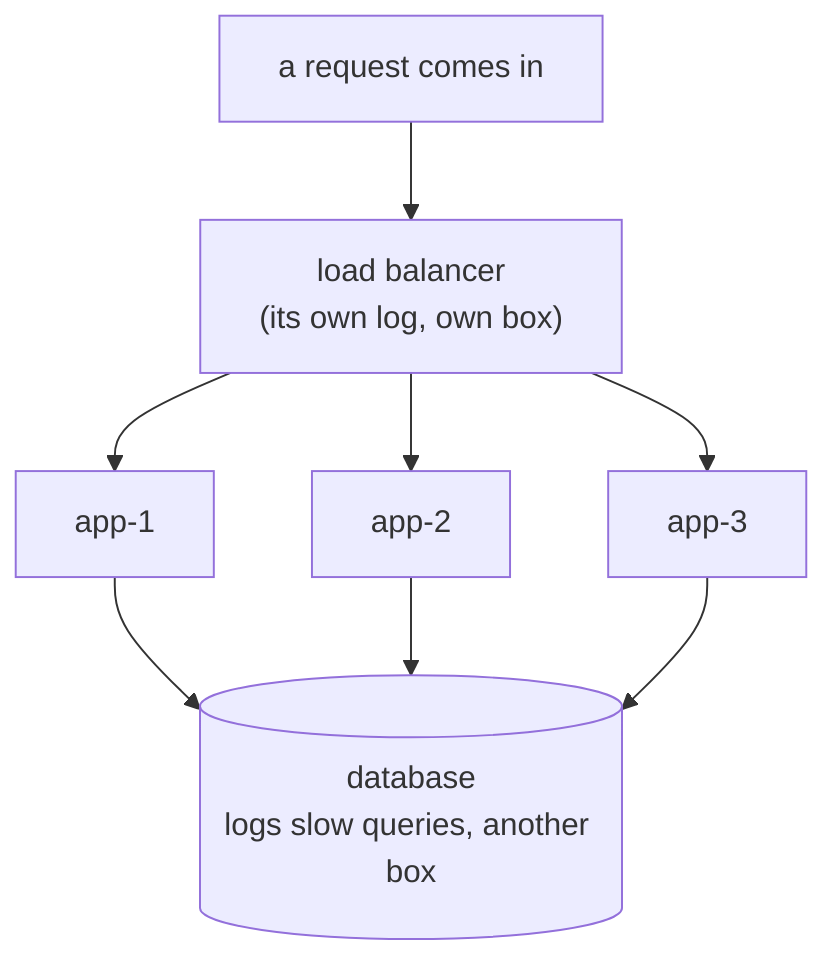
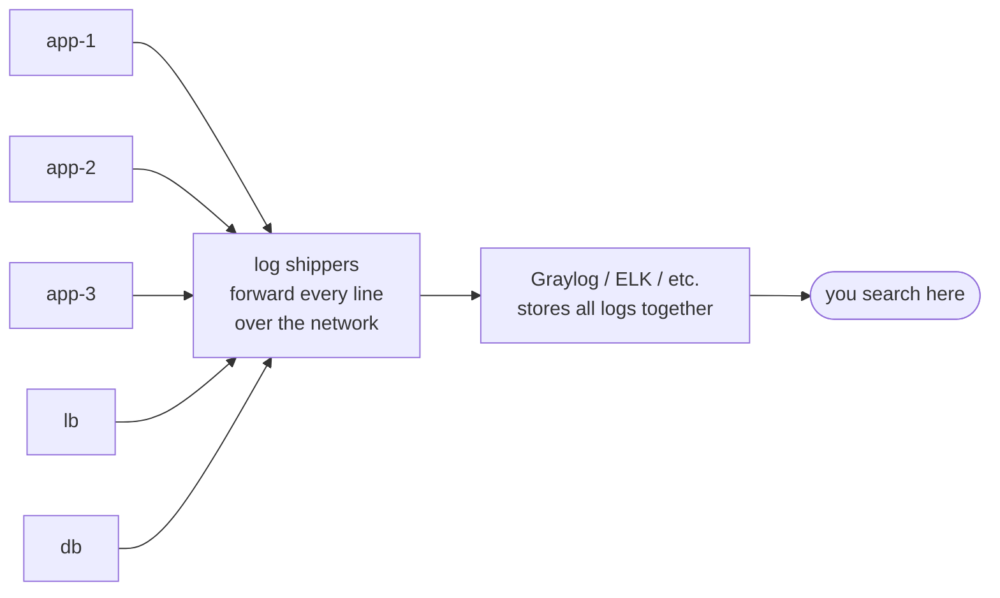

# Why Centralized Logs

You already know how to read logs on one machine: `tail -f` the file, `grep` for the error, scroll to the
moment it broke. That skill is real and it still matters. The problem isn't the skill - it's that the
file you need isn't on the machine you're logged into. Modern systems spread one request across many
processes, and any of them could be where it went wrong. Centralized logging exists for exactly this
discomfort. Once you see *what* it's doing and *why*, the rest of this guide is mostly learning where the
buttons are.

## Why `grep` on one box stops working

**What changed.** A single server with one app is a single diary. You SSH in, you read the diary. But a
typical production system isn't one diary - it's dozens, scattered across machines that come and go.



When the pager goes off, you don't know which `app-N` handled the failing request. SSHing into each one
and `grep`-ing by hand is slow, and it gets worse with every box you add. Containers make it sharper
still: a crashed container can be *gone*, and its log file with it, before you ever log in.

⚠️ **Containers don't keep your logs for you.** A container's filesystem is usually thrown away when it
restarts. If logs only live inside the container, a crash-loop erases exactly the evidence you need.
Shipping logs *off* the box, somewhere durable, is the whole point.

## The first idea: one search box over everything

**What it actually is.** Graylog (and ELK, and OpenSearch) is a place that *receives* log lines from
every machine and stores them together, with a single search interface on top. Instead of "which box do I
SSH into," the question becomes "what am I searching for." One box. One search. The whole fleet.

**How the logs get there.** A small agent runs on each machine - or each container's output is collected
by the platform - and forwards every log line to the central server over the network.



📝 **Log shipper / agent.** The thing that reads logs on a machine and sends them onward. You'll see
names like Filebeat (the ELK world), Fluentd / Fluent Bit, Vector, or Graylog's Sidecar. They all do the
same job: pick up log lines and forward them to the central store.

**Why this design.** The alternative - searching each machine individually - doesn't scale and doesn't
survive machines disappearing. Centralizing trades a little setup and storage cost for the ability to ask
one question and have it answered across everything, even for boxes that no longer exist.

📝 **Graylog, ELK, OpenSearch - same shape.** **ELK** is Elasticsearch (the store/search engine) +
Logstash (ingest) + Kibana (the UI). **OpenSearch** is a fork of Elasticsearch with its own dashboards UI.
**Graylog** is its own web app that sits on top of an Elasticsearch/OpenSearch store. The vendor logos
differ, but the mental model in this guide - ship everything in, search by field, scope by time, route
with streams, alert on conditions - applies to all of them. Where the query *syntax* differs, we'll say so.

## The second idea: structured fields, not just raw text

This is the one that changes how you search, so it's worth slowing down on.

**The wrong picture.** Many people imagine the central store as one giant text file you `grep`. That
picture works for a while, but it sells the tool short and makes your searches clumsier than they need to
be.

**What it actually is.** Each log line arrives as a little record with *named fields*, not just a blob of
text. A line that prints like this on the box:

```text
2026-06-19T14:02:11Z level=error service=checkout request_id=a1b2c3 status=500 msg="payment gateway timeout"
```

is stored centrally as something more like a labeled card:

```text
   timestamp   : 2026-06-19T14:02:11Z
   level       : error
   service     : checkout
   request_id  : a1b2c3
   status      : 500
   message     : payment gateway timeout
```

**Why this matters.** Because the pieces are *named*, you can search by them precisely:
`service:checkout AND status:500` instead of hoping the right text happens to appear next to the right
other text. Time, level, service, and host are almost always fields you can lean on. The richer your log
lines (i.e. the more they were written as structured key/value data rather than free prose), the sharper
your searches get - which is a habit your own services benefit from.

**Where fields come from.** Some are added automatically (timestamp, the source host, which stream it
landed in). Some come from how your app logged the line - if you logged JSON or `key=value` pairs, those
keys *become* fields. If you logged a wall of prose, you get fewer named fields and you'll lean more on
full-text search of the `message`. You can still search prose; you just have fewer handles to grab.

💡 **Key point.** A centralized log isn't a giant text file - it's a pile of labeled cards. The search
box lets you say "show me the cards where `service` is `checkout` and `status` is `500`, in the last 15
minutes." That sentence is the entire job.

## The gotcha that shapes everything later

⚠️ **Logs are only as good as what you logged.** Centralized logging can't show you a field your app
never emitted. If `checkout` never logs a `request_id`, you can't follow a request by id no matter how
good Graylog is. The search tool is a magnifying glass, not a microscope that invents detail. This is why
Phase 3 ends on the trade-offs of *what* and *how much* to log - and why you must **never log secrets**
(passwords, tokens, full card numbers), because a central store is searchable by lots of people and often
retained for a long time. (See [Secrets Management](/guides/secrets-management).)

## Recap

1. One box → `grep` a file. A fleet → the file you need is on a machine you're not logged into (or one
   that no longer exists).
2. Graylog / ELK / OpenSearch ship every log line into one place and put a single search box on top.
3. A log shipper (Filebeat, Fluent Bit, Vector, Sidecar…) on each machine forwards lines to the center.
4. Logs are stored as records with *named fields*, not one big text blob - that's what makes precise
   `field:value` search possible.
5. The tool can only show what you logged; logs are only as good as the data your apps emit - and never
   log secrets.

---

[← Guide overview](_guide.md) · [Phase 2: Searching Effectively →](02-searching-effectively.md)
