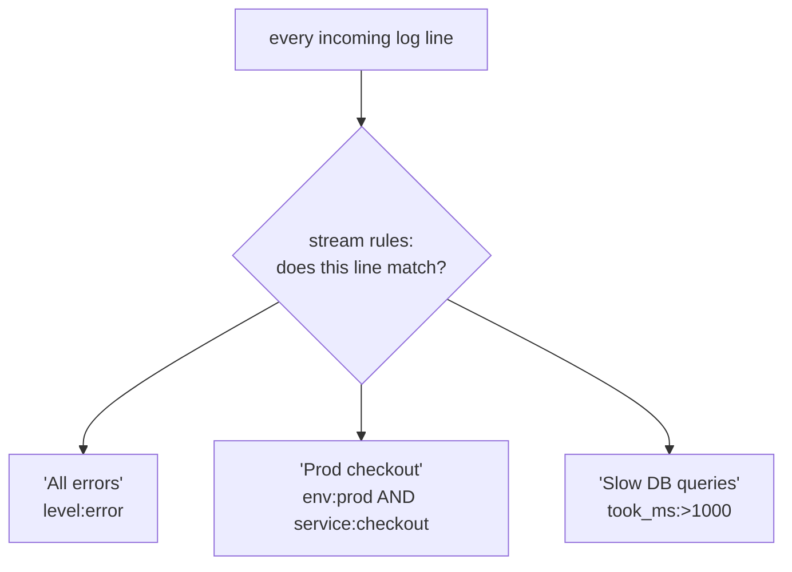

# Streams, Dashboards & Alerts

So far you've been the one asking questions: you open the search box, you scope, you filter, you read the
histogram. That's the right skill for an incident already in progress. But you can't sit in the search box
all day, and the worst incidents are the ones nobody was looking at when they started. This phase is about
making the system work *for* you between emergencies: pre-sorting the logs that matter (streams), keeping a
view you can glance at (dashboards), and having the system tap you on the shoulder when something's wrong
(alerts). Then we close on the uncomfortable truth underneath all of it: this is only ever as good as
what you logged.

## Streams: pre-sorted piles of logs

**What it actually is.** A stream is a *standing filter* - a rule that says "any log line matching this
condition belongs in this pile." Once it exists, you (and dashboards and alerts) can search just that
pile instead of the whole firehose every time.



**What it does in real life.** Instead of typing `level:error AND env:prod` for the hundredth time, you
define it once as a stream like "Production Errors." Now anyone can click that stream and immediately be
looking at only prod errors - no query, no scoping the firehose. Streams are also the unit other features
point at: you build a dashboard *over* a stream, and you attach an alert *to* a stream.

📝 **Stream vs. search.** A *search* is a one-off question you type. A *stream* is a saved, always-on
routing rule that keeps a named subset continuously populated. (Kibana's nearest equivalents are *saved
searches* and *data views* - same idea, different label: a reusable, named slice of the logs.)

💡 **Key point.** Streams turn "I'll remember to filter for prod errors" into "prod errors are already
their own pile." The filtering happens at ingest, continuously, instead of in your head during an
incident.

## Dashboards: the glance-able view

**What it actually is.** A dashboard is a saved page of widgets - counts, the error histogram, a
top-services-by-error-count list, a live tail of the latest ERRORs - usually built over one or more
streams. It answers, at a glance, "is anything on fire right now?" without you typing a query.

**What it does in real life.** A useful ops dashboard might show: total error count in the last hour
(a single big number), the error-rate histogram (the shape from Phase 2, but always on), and a table of
which services are throwing the most errors. You glance at it in the morning, after a deploy, or when
someone says "is prod okay?" The dashboard is the same searches you'd run by hand, frozen into a layout
so you don't have to run them.

⚠️ **A dashboard is a view, not a notifier.** It shows you the spike only if you happen to be looking at
it. For "tell me even when I'm not watching," you need an alert - next.

## Alerts: let the system page you

**What it actually is.** An alert is a search plus a *threshold* plus a *time window* plus a *destination*.
The system runs the search on a schedule and, when the result crosses the threshold, it notifies you
(email, Slack, PagerDuty, a webhook). It's the difference between finding the fire and being told about it.

**A real example - an error-rate alert.** The condition reads, in plain English:

```text
   IF   (stream: Production Errors)
        count of matching messages
   IS   greater than 50
   IN   the last 5 minutes
   THEN notify #oncall and PagerDuty
```
*What just happened:* You taught the system the shape of "something is wrong." Most of the time the
5-minute error count sits well under 50, so nothing fires. When checkout starts timing out and errors
jump to ~100/min (the cliff from Phase 2's histogram), the 5-minute count blows past 50 and the alert
fires - and you hear about the outage from the alert, not from an angry customer twenty minutes later.

⚠️ **Tune the threshold or you'll train yourself to ignore it.** Set it too low and it fires on normal
noise; people mute the channel, and then the *real* alert gets ignored too - alert fatigue. Set it too
high and you find out too late. Start from the baseline you can *see* in the histogram (Phase 2): pick a
threshold clearly above the normal background rate, then adjust after you've watched it for a week.

💡 **Key point.** Streams + dashboards + alerts are three views of the same searches at three levels of
attention: a stream is a pile you can open, a dashboard is a glance, an alert is a tap on the shoulder.
Build the search once; reuse it at whichever level fits.

## The trade-offs underneath all of this

This is where centralized logging stops being free, so it's the part worth being honest about.

### Logs are only as good as what you logged

⚠️ Everything in this guide - every search, stream, dashboard, and alert - operates on data your apps
chose to emit. No tool can search, route, chart, or alert on a field that was never logged. If `checkout`
never logged `request_id`, no stream will ever follow a request through it. If failures are logged as bare
"error" with no context, your dashboard can count them but never explain them. The leverage you get out of
Graylog is set by the quality of the log lines going in. Logging structured `key=value` (or JSON) data with
the fields you'll actually search on - service, level, request id, status, duration - is what makes the
rest of this work.

### Never log secrets

⚠️ A central log store is searchable by many people and often kept for a long time. That makes it exactly
the wrong place for passwords, API tokens, session cookies, full credit-card numbers, or personal data
you have no business retaining. A secret logged once is now a secret sitting in a searchable archive,
replicated and backed up, waiting. Scrub or redact sensitive fields *before* they ship - at the
application or the shipper. For how to handle credentials properly, see
[Secrets Management](/guides/secrets-management).

### Retention and cost are a real trade-off

**The tension.** Keeping every log forever would be ideal for investigations and impossible for the
budget. Centralized stores cost money to run, and that cost scales with how much you ingest and how long
you keep it. So every centralized logging setup makes a *retention* choice: how long before old logs are
deleted (or moved to cheaper, slower storage).

📝 **Retention policy.** The rule for how long logs are kept before they're aged out. Common shapes: keep
high-volume DEBUG/INFO for a short window (days), keep WARN/ERROR longer (weeks), keep a thin audit trail
longest. Higher-severity, lower-volume logs are cheaper to keep and more valuable later.

⚠️ **The retention window is a wall you'll hit at the worst time.** The bug you're investigating may have
first appeared *before* the oldest log you still have. If retention is 7 days and the regression shipped 10
days ago, the early evidence is gone. It's worth knowing your retention window *before* an incident,
so you're not surprised by an empty search that just means "older than we keep," not "never happened." The
honest trade-off: log enough, at the right severity, kept long enough to investigate - without paying to
store noise you'll never read.

## Recap

1. **Streams** are standing filters that keep a named subset of logs (e.g. prod errors) continuously
   populated - define the filter once, reuse it everywhere.
2. **Dashboards** freeze your common searches into a glance-able view - but only help when someone's
   looking.
3. **Alerts** run a search on a schedule and notify you when it crosses a threshold - so the system finds
   the fire, not the customer. Tune thresholds against the visible baseline to avoid alert fatigue.
4. All of it is bounded by what you logged: structured fields in, real leverage out.
5. Never log secrets into a searchable, long-lived store; and know your retention window - cost forces a
   trade-off between keeping everything and keeping nothing.

---

[← Phase 2: Searching Effectively](02-searching-effectively.md) · [Guide overview →](_guide.md)

**Related guides:** [Reading Logs Without Drowning](/guides/reading-logs-without-drowning) ·
[Observability: Logs, Metrics & Traces](/guides/observability-logs-metrics-traces) ·
[Secrets Management](/guides/secrets-management)
