# Why Async Exists

Here's the thing nobody says out loud when they teach you to code: **a huge amount of what your program does is wait.** It asks a database for a row and waits. It requests a web page and waits. It reads a file off disk and waits. It sets a timer and - you guessed it - waits.

And waiting, in computer terms, is *slow*. Not slow like "this loop runs a million times" slow. Slow like "the network round-trip to another continent takes a few hundred milliseconds, during which your CPU could have executed hundreds of millions of instructions" slow. The numbers are lopsided: the CPU is a sprinter, and the network, disk, and timers are the post office.

So the real question async answers is: **what should the worker do while it waits?** There are exactly two answers, and the difference between them is the whole story.

## The two ways to wait

📝 **Terminology.** *Blocking* means an operation stops your code dead until it finishes - the line `data = read_file()` doesn't return until the file is fully read, and nothing else runs in the meantime. *Non-blocking* means an operation starts the work and returns immediately, letting your code keep going; you get the result later, when it's ready.

That's the entire distinction. Blocking: stop and wait. Non-blocking: start it, do other things, come back.

## The restaurant analogy

This clicks fastest with a picture you already know: a waiter in a restaurant.

Imagine a waiter - one person, one worker - taking care of several tables. A customer orders. The waiter walks the order to the kitchen. Now the food needs ten minutes to cook. What does the waiter do?

**The blocking waiter** stands at the kitchen window for ten full minutes, staring at the pan, doing nothing, until the food is ready. Then he delivers it, and only *then* walks to the next table to take their order. Your other tables sit there, menus closed, ignored. One slow dish freezes the entire restaurant.

**The non-blocking waiter** drops the order at the kitchen and immediately walks to the next table to take *their* order. While the first dish cooks, he's seating new guests, refilling drinks, clearing plates. When the kitchen rings the bell - "table 4 is ready!" - he picks up the dish and delivers it. The cooking still takes ten minutes. But the waiter was never idle, so the whole room stays served.

Notice what didn't change: the food still takes ten minutes either way. Non-blocking doesn't make the *waiting* faster - it makes the *worker* productive during the wait. People expect async to speed up the slow thing; it doesn't. It stops the slow thing from freezing everything else.

💡 **Key point.** Async doesn't make waiting shorter. It makes waiting *non-exclusive* - one wait no longer holds up all the other work.

## Seeing it on a timeline

Say your program needs to do three things, each of which mostly waits on the network: fetch a user, fetch their orders, and fetch a notification. Each request takes about 100 ms, almost all of it spent waiting for the server to reply.

The blocking version does them one after another, standing at the kitchen window each time:

```mermaid
gantt
  title BLOCKING - waits stack back-to-back (~300 ms)
  dateFormat X
  axisFormat %L
  fetch user    :0, 100
  fetch orders  :100, 200
  fetch notif   :200, 300
```



The non-blocking version starts all three, then handles each reply as it arrives:

```mermaid
gantt
  title NON-BLOCKING - waits overlap (~100 ms)
  dateFormat X
  axisFormat %L
  fetch user    :0, 100
  fetch orders  :0, 100
  fetch notif   :0, 100
```



*What's happening:* Blocking waits stack back-to-back because the worker won't start the second wait until the first finishes. Non-blocking kicks off all three waits up front and collects results as they arrive, so the waits *overlap* instead of stacking - same network, same per-request time, roughly a third of the wall-clock time. (Illustrative round numbers, not a measured benchmark.)

⚠️ **Gotcha.** This overlap only helps when the work is *waiting* (network, disk, timers - often called **I/O-bound** work). If your three tasks were each grinding the CPU at 100% - say, hashing a giant file - async wouldn't help at all, because there's no idle waiting to fill. A single worker can only *compute* one thing at a time. Async fills *waiting* time, not *computing* time. (Filling computing time means using multiple workers - threads or processes - which is a different tool; see [Processes, Memory & the CPU](/guides/processes-memory-and-cpu).)

## A real example

Let's make the difference concrete. Here's blocking code - the kind you'd write without async - fetching two URLs in sequence. Each `fetchSync` call stops the world until its response arrives:

```console
$ node blocking.js
[t=0ms]   start
[t=512ms] got first response
[t=1041ms] got second response
[t=1041ms] done
```
*What just happened:* The program sat frozen ~512 ms waiting on the first request, then only began the second - another ~529 ms. The total is the sum: the second wait couldn't start until the first was completely over. During both waits the CPU had nothing to do - the blocking waiter at the kitchen window.

Now the non-blocking version, which starts both requests before waiting on either:

```console
$ node nonblocking.js
[t=0ms]   start
[t=0ms]   both requests sent
[t=534ms] both responses arrived
[t=534ms] done
```
*What just happened:* Both requests went out at `t=0`, so their waits overlapped. The program finished in roughly the time of the *slower single request*, not the sum of both - we didn't add workers or speed up the network, we just stopped the first wait from blocking the second. (Times vary with your network; the shape - overlap vs. sum - is the point.)

**Why this saves you later.** Once you can see the difference between blocking and non-blocking on a timeline, a whole class of "why is my app so slow?" mysteries dissolves. A web server that handles one request at a time because each one blocks on the database; a UI that freezes solid while it loads data; a script that takes 30 seconds doing ten 3-second waits in a row - these are all the blocking waiter, and you'll recognize him on sight. The fix is almost always: stop standing at the kitchen window.

## Recap

1. **Most programs spend most of their time waiting** - on the network, disk, and timers - and the CPU is wildly faster than any of those, so naive waiting wastes the worker.
2. **Blocking** = stop and wait; nothing else runs until the operation finishes. **Non-blocking** = start the wait, do other useful work, collect the result when it's ready.
3. **The restaurant waiter** is the model: the non-blocking waiter never stands idle, so one slow dish doesn't freeze the whole room.
4. **Async fills *waiting* time, not *computing* time.** It overlaps waits; it does not make a single wait shorter, and it doesn't help CPU-bound work.

So non-blocking is clearly better for waiting - but *how* does one worker juggle many overlapping waits without dropping anything? What rings the bell when "table 4 is ready"? That mechanism has a name, and it's the engine the whole model runs on: the event loop.

---

[← Guide overview](_guide.md) · [Phase 2: The Event Loop →](02-the-event-loop.md)
