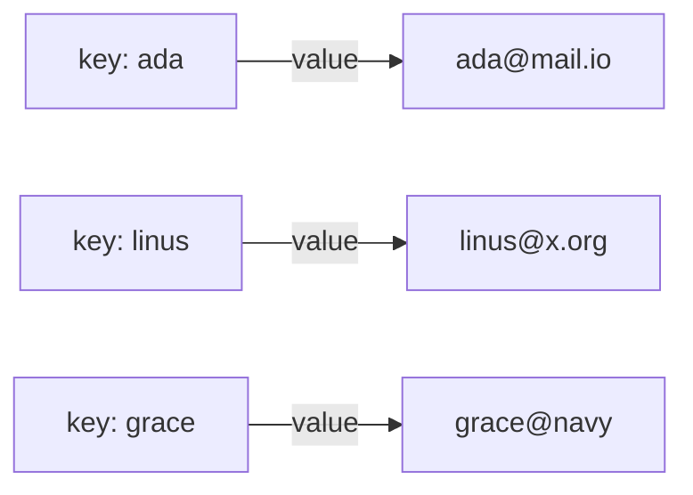
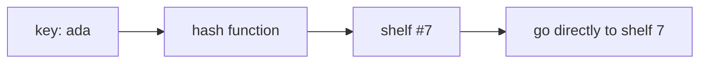

# Maps & Sets - Lookup by Key

Last phase ended on a frustration: a list makes you *walk* through everything to answer "do I have this, and
what's attached to it?" That's fine for ten items and miserable for ten million. This phase is about the
container built precisely to kill that walk - the **map** - and its close cousin, the **set**. Once these
click, a huge amount of everyday code suddenly looks obvious.

Let's start with the picture, because the speed only makes sense once you see the trick.

## The mental model: a labeled value you can jump to

**What a map actually is.** A **map** stores pairs: a **key** and a **value** that belongs to it. You look
things up *by the key*, and you get the value back without searching. Think of a coat check at a theater:
you hand over your coat (the value) and get a numbered ticket (the key). When you come back, you don't dig
through every coat - you hand over ticket #42 and the attendant goes *straight* to hook 42.



📝 **Terminology.** A map goes by many names. Python calls it a **dict** (dictionary); JavaScript has
objects and a `Map`; Java calls it a `HashMap`; other languages say "hash," "associative array," or
"hashtable." They're the same idea: **key → value, fast lookup by key.** We'll say "map" or "dictionary."

A dictionary is a perfect mental anchor for the name: you don't read a paper dictionary cover to cover to
find "umbrella" - you jump to U and you're nearly there. A map does the same for your data.

## Using a map - set a value, get it back

```python runnable
emails = {
    "ada": "ada@mail.io",
    "linus": "linus@x.org",
}

emails["grace"] = "grace@navy.mil"   # add a new pair
print(emails["ada"])                 # look up by key
```
```console
ada@mail.io
```
*What just happened:* The `{ ... }` created a map with two pairs. `emails["grace"] = ...` added a third pair
- the key `"grace"` now points at her email. Then `emails["ada"]` asked "what value is filed under the key
`ada`?" and got it back **without** scanning the other entries. That's the move a list couldn't do: direct
lookup by something meaningful, not by a slot number.

⚠️ **Gotcha.** Asking for a key that isn't there is a classic stumble - in Python it raises a `KeyError`
and stops your program:

```python
print(emails["nobody"])
```
```console
KeyError: 'nobody'
```
*What just happened:* There's no pair filed under `"nobody"`, so the map couldn't hand anything back and
raised an error. The safe way to ask is `emails.get("nobody")`, which returns `None` instead of crashing -
reach for `.get()` whenever you're not certain a key exists.

## Why it's fast: hashing, the gentle version

Here's the one piece of magic worth understanding, because it explains *everything* about why maps are fast
and lists aren't.

**The idea.** When you give the map a key like `"ada"`, it runs the key through a little function called a
**hash function**. That function turns the key into a number, and the number says *which shelf* the value
lives on. So instead of searching, the map *computes the location* from the key itself and goes straight
there.



Compare that to last phase's list, where finding a value meant walking every slot. A map skips the walk
entirely: the key tells it where to look. That's the whole secret.

📝 **Terminology.** **Hashing** is turning a key into a number that points at a storage spot. You almost
never call the hash function yourself - the map does it for you on every lookup and every insert. You just
need the picture: *the key is a label that jumps you near the value.*

💡 **Key point.** Looking up by key in a map stays fast *no matter how many pairs it holds* - 10 entries or
10 million, fetching one by its key feels the same. That "doesn't slow down as it grows" quality is the
reason maps exist.

A couple of honest caveats, so the picture is true and not a fairy tale:

- ⚠️ **Keys must be unique.** Assign to a key that already exists and you *overwrite* its old value rather
  than adding a second one. A map holds at most one value per key.
- A map does **not** keep a meaningful order the way a list does. (Modern Python happens to remember
  insertion order, but you shouldn't lean on a map for "what came 3rd" - that's a list's job.)

## Sets - the same trick, for uniqueness

Now the cousin. Sometimes you don't care about a value attached to a key - you only care *whether you've
seen a thing*. That's a **set**.

**What a set actually is.** A set is a bag of items where (a) **each item appears at most once** and (b)
checking "is this in the bag?" is fast. It's a map that kept only the keys and threw away the values - so it
inherits the same hashing speed.

```python runnable
seen = set()
seen.add("ada")
seen.add("linus")
seen.add("ada")        # already there - silently ignored

print(seen)
print("ada" in seen)   # fast membership check
print(len(seen))       # how many unique items?
```
```console
{'ada', 'linus'}
True
2
```
*What just happened:* Adding `"ada"` a second time did nothing - a set refuses duplicates by design, which
is exactly the point. `"ada" in seen` answered instantly (same hashing jump as a map, no walking), and
`len(seen)` is 2 because there are only two *unique* items even though we called `add` three times.

**What it does in real life.** Sets shine for two jobs: **deduplicating** ("give me the unique values") and
**fast membership** ("have I already processed this ID?"). A common one-liner removes duplicates from a list
by passing it through a set:

```python runnable
ids = [3, 7, 3, 1, 7, 7]
unique_ids = set(ids)
print(unique_ids)
```
```console
{1, 3, 7}
```
*What just happened:* Building a set from the list dropped every repeat automatically - there's no value to
store, just "is this item present?", and a set only keeps one copy of each. Order isn't preserved, because,
like a map, a set is organized by hashing, not by sequence.

## How these three fit together

You now have the everyday trio. Here's the one-line version of each, which is really the whole guide in
miniature:

- **List** - ordered; jump to item #N fast; finding a *value* means walking.
- **Map** - key → value; fetch a value by its key fast; no real order.
- **Set** - unique items; "is it in here?" fast; no values, no order.

Notice the trade running through all three: lists give you *order* but slow value-lookup; maps and sets give
you *fast lookup* but drop ordering. There's no single best container - there's the right one for the
question you're asking. The next phase turns that into a decision you can make in seconds.

## Recap

1. A **map** (dict / hash map) stores **key → value** pairs and fetches a value by its key without scanning.
2. The speed comes from **hashing**: the key is run through a function that points straight at the value's
   spot - a label that jumps you near the value.
3. Map lookup by key stays fast no matter how big it grows; **keys are unique** (re-assigning overwrites).
4. A **set** is the same trick minus the values: a bag of **unique** items with **fast membership** checks.
5. Use sets to **dedupe** and to answer "**have I seen this?**" quickly.
6. Maps and sets trade away **order** for speed - when order matters, that's a list's job.

---

Set keys and click a row to "get" by key - no scanning. Switch the tab to a set to see uniqueness:

```playground-ds
map
```

[← Phase 1: Arrays & Lists](01-arrays-and-lists.md) · [Guide overview](_guide.md) · [Phase 3: Choosing the Right One →](03-choosing-the-right-one.md)
