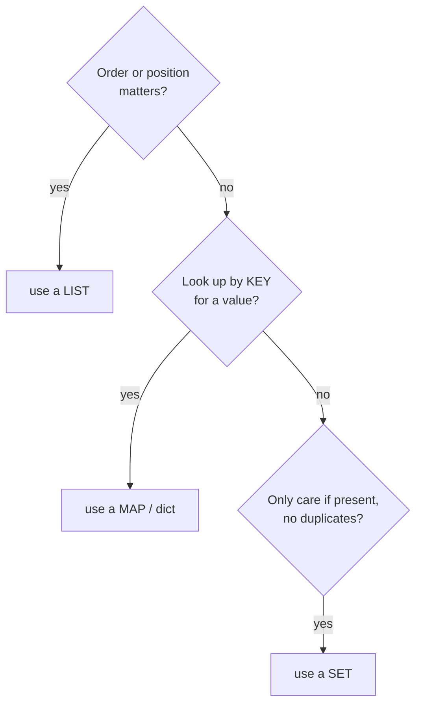

# Choosing the Right One

You've met the three containers and seen what each is built for. This phase is the payoff: a way to pick the
right one in a few seconds, and the comparison table to glance at when you forget. There's no clever theory
here - picking a data structure comes down to clearly answering what your code keeps *asking* of the data.

If you're here mid-task and just need an answer, the three questions below and the table will get you sorted.
If you want the reasoning, it's all underneath.

## The cheat-card: three questions

Ask these in order. The first "yes" usually points you at your container.



Most everyday code is one of these three. When two seem to fit, ask which question your code asks *most
often* - that's the operation you want to be fast.

## The comparison table

Here's what each container is fast and slow at, side by side. "Fast" means the cost barely changes as the
data grows; "slow" means it gets worse the bigger the collection gets.

| Operation | List | Map (dict) | Set |
|---|---|---|---|
| Get item by **index/position** (`x[3]`) | **fast** | n/a | n/a |
| Get value by **key** (`x["ada"]`) | n/a | **fast** | n/a |
| Check "**is this value present?**" (`v in x`) | slow (walks it) | **fast** (by key) | **fast** |
| **Add to the end** | **fast** | **fast** | **fast** |
| **Insert/remove in the middle or front** | slow (shuffles) | n/a | n/a |
| Keeps **order**? | **yes** | no | no |
| Allows **duplicates**? | yes | keys: no | no |

Read the table as a map of strengths, not a scoreboard. Each container is *fast at the thing it's for* and
slower at (or doesn't do at all) the things it isn't for - there's no winner, only a fit.

## Big-O, as intuition only

You'll hear people describe these speeds with **Big-O notation** - terms like `O(1)` and `O(n)`. Don't let
the symbols scare you; for now they're just two plain ideas:

- 📝 **"Constant"** (written `O(1)`) - the cost **doesn't grow** as the collection gets bigger. Grabbing
  `list[3]` or fetching `map["ada"]` costs the same whether there are 10 items or 10 million. This is the
  "fast" in the table above.
- 📝 **"Grows with size"** (written `O(n)`) - the cost **gets bigger as the collection grows**, because the
  work scales with the number of items. Searching a list by value, or inserting at its front and shuffling
  everything over, is this kind. This is the "slow" in the table.

That's genuinely all you need to choose well: *is this operation constant, or does it grow with size, and is
it the operation I do most?* The formal definitions, the math, and the in-between speeds belong to
[Big-O Without the Math Panic](/guides/big-o-without-the-math-panic) - chase them when you're optimizing real
code, not before.

## The classic slowdown: a list where you needed a map

Here's the mistake that quietly tanks more beginner programs than any other, and now you can see exactly why
it happens.

Say you have a big list of users and you keep checking "is this user already in here?" A list feels like the
obvious home for "a bunch of users," so people write:

```python
users = ["ada", "linus", "grace", ...]   # imagine 100,000 names

# called over and over in a loop:
if "grace" in users:
    ...
```
*What just happened:* every single `"grace" in users` makes the computer **walk the list** from the front,
comparing names one at a time (that's the "grows with size" cost from Phase 1). Do that check thousands of
times over a list of a hundred thousand, and your program slows to a crawl - not because anything is
*broken*, but because you picked a container that's slow at the exact question you keep asking.

The fix is to ask: *what does this code keep doing?* It keeps checking membership. That's question 3 - so it
wants a **set**:

```python
users = {"ada", "linus", "grace", ...}   # a set, built for membership

if "grace" in users:                     # fast, no walking
    ...
```
*What just happened:* the membership check now uses hashing to jump straight to the answer instead of
scanning (the "constant" cost from Phase 2). Same-looking code, the bottleneck gone. If you also needed
*data attached* to each user - their email, their last login - you'd reach for a **map** (`users["grace"]`)
for the same reason.

⚠️ **Gotcha.** Reaching for a list when you needed a map or set is *the* classic beginner slowdown. The
tell: you're repeatedly doing `something in my_list` or scanning a list to find a matching item. Both are
"grows with size" on a list and "constant" on a set/map. When you catch yourself searching a list by value
again and again, that's your cue to switch containers - and you'll often watch a sluggish program turn
instant.

## Putting it all together

You came in able to write code but unsure which container to grab. Now you have a real model:

- A **list** is an ordered row of slots - perfect when **sequence or position** matters, fast to read by
  index and to append, slow to search by value or edit the middle.
- A **map** files **values under keys** - perfect when you look things up by a meaningful key and want the
  value back instantly.
- A **set** keeps **unique items** with **fast membership** - perfect for deduping and "have I seen this?"
- The deciding question is never "which is best" but "**what does my code keep asking?**" Match the container
  to that question and the right one is usually obvious.

That's the everyday toolkit. When you're ready to go deeper, [Phase 4](04-stacks-queues-and-linked-lists.md)
covers stacks, queues, and linked lists, and [Trees & Binary Search Trees](/guides/trees-and-binary-search-trees)
picks up from there. Until then, you have more than enough to choose well and write code that stays fast as
it grows.

## Recap

1. **Three questions** decide it: order/position → **list**; lookup by key → **map**; uniqueness/membership
   → **set**.
2. The **comparison table** shows each container is fast at what it's *for* and slow at what it isn't.
3. **Big-O is just intuition** for now: **"constant"** (doesn't grow) vs **"grows with size."**
4. The **classic slowdown** is using a list where you needed a map or set - repeatedly searching a list by
   value is "grows with size"; a set/map makes it "constant."
5. Always ask **"what does my code keep doing?"** and make *that* operation the fast one.

---

A preview of two more structures - push/pop a stack (LIFO) versus enqueue/dequeue a queue (FIFO). Phase 4
covers what's happening here in full:

```playground-ds
```

[← Phase 2: Maps & Sets](02-maps-and-sets.md) · [Guide overview](_guide.md) · [Phase 4: Stacks, Queues & Linked Lists →](04-stacks-queues-and-linked-lists.md)

**Related guides:** [Programming from Zero](/guides/programming-from-zero) · [What Happens When Code Runs](/guides/what-happens-when-code-runs)
