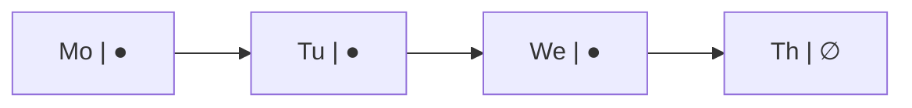

# Stacks, Queues & Linked Lists

The first three phases covered the containers you reach for daily. This phase covers three more you'll meet
constantly once you start looking - not because they're exotic, but because they're the *same* row-of-items
idea from Phase 1, restricted in a way that makes one specific pattern of use fast and predictable.

## Stack: last in, first out (LIFO)

**What it actually is.** A stack only lets you add or remove from *one* end - the "top." The last thing you
put on is the first thing you take back off.

**Real-world analogy.** A stack of plates. You put a clean plate on top and you take the top plate off to
use it - you never pull one from the middle without knocking the rest over. Your browser's back button
works the same way: each page you visit gets pushed on, and "back" pops the most recent one off.

```python runnable
history = []
history.append("home")      # push
history.append("search")    # push
history.append("product")   # push

print(history.pop())         # pop - "product", the most recently added
print(history.pop())         # pop - "search"
print(history)                # "home" is all that's left
```
```console
product
search
['home']
```
*What just happened:* `append` and `pop` (with no index) both operate on the *end* of the list - which is
exactly the "cheap" end from Phase 1. That's why a plain list makes a perfectly good stack: push and pop are
both `O(1)`, no shuffling required.

💡 **Key point.** Reach for a stack whenever "undo the most recent thing" is the operation you need: undo
history, matching brackets/parentheses, backtracking through a maze, or - not coincidentally - how your
program's own function calls are tracked (the "call stack" you've heard of in every stack-overflow error).

## Queue: first in, first out (FIFO)

**What it actually is.** A queue adds at one end and removes from the *other* - whatever went in first comes
out first.

**Real-world analogy.** A line at a coffee shop. The first person to join is the first person served. A
print queue, a task queue, a chat's "next message to process" - all the same shape: process things in the
order they arrived.

```python runnable
from collections import deque

line = deque()
line.append("Ana")     # enqueue
line.append("Ben")     # enqueue
line.append("Cy")      # enqueue

print(line.popleft())   # dequeue - "Ana", the first one in
print(line.popleft())   # dequeue - "Ben"
print(list(line))        # "Cy" is still waiting
```
```console
Ana
Ben
['Cy']
```
⚠️ **Gotcha.** A plain Python `list` is a *bad* queue: `list.pop(0)` removes from the front, and removing
from the front of a list means shuffling every remaining item down one slot - the costly `O(n)` operation
from Phase 1's "inserting/removing in the middle" trap. `collections.deque` (double-ended queue) is built
specifically so *both* ends are cheap, which is why it's the right tool the moment you need FIFO behavior.

💡 **Key point.** Reach for a queue whenever fairness or arrival order matters: processing requests in the
order they came in, breadth-first traversal, any "first come, first served" scheduling.

## Linked lists: nodes chained by pointers

Every container so far has been a tight row of slots sitting next to each other in memory - that's *why*
index access is instant (Phase 1) and *why* inserting in the middle is costly (everything has to shuffle to
keep the row tight). A **linked list** breaks that assumption entirely.

**What it actually is.** Instead of one contiguous row, a linked list is a chain of separate **nodes**
scattered anywhere in memory. Each node holds a value *and a pointer to the next node* (see
[Pointers & References](/guides/pointers-and-references) if "a pointer" is new to you). To find anything, you
start at the first node (the "head") and follow the chain, one pointer at a time.


*Each node points to the next; the last node's pointer is empty (often called `null`/`None`), marking the end.*

```python runnable
class ListNode:
    def __init__(self, value, next=None):
        self.value = value
        self.next = next

def traverse(head):
    values = []
    current = head
    while current is not None:
        values.append(current.value)
        current = current.next        # follow the pointer to the next node
    return values

head = ListNode("Mo", ListNode("Tu", ListNode("We")))
print(traverse(head))
```
```console
['Mo', 'Tu', 'We']
```
*What just happened:* there's no single array underneath - just three separate `ListNode` objects, each
holding a value and a `next` pointer to the following one. `traverse` doesn't jump to "position 2"; it walks
`head → head.next → head.next.next`, following pointers until it hits `None`.

**Why insert here.** Because nodes aren't packed tightly, inserting a new one is just re-pointing two
pointers - nothing else in the chain has to move.

```python runnable
# insert "Fri" right after "Tu" - once you're at the right node, this is O(1)
node = head
while node.value != "Tu":
    node = node.next
node.next = ListNode("Fri", node.next)   # splice in: Tu -> Fri -> (old next)

print(traverse(head))
```
```console
['Mo', 'Tu', 'Fri', 'We']
```
*What just happened:* `node.next` used to point straight from `"Tu"` to `"We"`. Splicing in `"Fri"` meant
creating one new node whose `next` is the old `"We"` node, then pointing `"Tu"`'s `next` at it. Nothing
shuffled - contrast that with Phase 1's `list.insert(1, "X")`, which had to physically shove every later item
over.

**The trade you make.** A linked list flips the array's strengths and weaknesses:

| Operation | Array / List | Linked List |
|---|---|---|
| Access by index (`x[3]`) | **fast** - jump straight there | slow - must walk from the head |
| Insert/remove once you're *at* the right node | slow - shuffles everything after | **fast** - just re-point two pointers |
| Insert/remove at the very front | slow (shuffle) | **fast** |

⚠️ **Gotcha.** The catch that trips people up: *getting to* the right node in a linked list still means
walking from the head, one pointer at a time - there's no shortcut to "node number 500." So a linked list
only wins when you already hold a reference to the node you're inserting near (e.g., you're already walking
the chain) - if you have to search for that node first, you've paid the `O(n)` walk anyway. That's exactly
why arrays remain the default: most everyday code accesses by position or appends at the end, both of which
arrays already do for free.

## Putting these three together

- A **stack** restricts a list to one end (LIFO) - reach for it whenever you need "undo the most recent
  thing."
- A **queue** restricts a list to add-one-end/remove-other-end (FIFO) - reach for it whenever arrival order
  must be preserved.
- A **linked list** trades away fast index access for cheap insertion anywhere you already have a pointer -
  the mirror image of the array's trade-off from Phase 1.

None of these replace the list/map/set decision from Phase 3 - they're refinements you reach for once you
know *which specific access pattern* your code actually needs.

Push and pop a stack, enqueue and dequeue a queue - see both side by side:

```playground-ds
```

```quiz
[
  {
    "q": "What does LIFO mean for a stack?",
    "choices": ["First in, first out", "Last in, first out", "Items are sorted automatically", "Only one item can ever be stored"],
    "answer": 1,
    "explain": "The most recently added item is the first one removed - like a stack of plates."
  },
  {
    "q": "Why is `collections.deque` preferred over a plain `list` for a queue?",
    "choices": ["deque uses less memory", "list.pop(0) has to shift every remaining item, which is O(n); deque makes both ends O(1)", "list can't hold strings", "deque sorts items automatically"],
    "answer": 1,
    "explain": "Removing from the front of a list means shuffling everything after it down one slot - deque is built so both ends are cheap."
  },
  {
    "q": "Why is inserting into the middle of a linked list cheap once you're at the right node, but array insertion isn't?",
    "choices": ["Linked lists are always shorter", "A linked-list insert just re-points two pointers; an array insert has to shuffle every later item", "Arrays don't support insertion at all", "Linked lists store data in sorted order automatically"],
    "answer": 1,
    "explain": "Nodes aren't packed contiguously, so splicing one in only touches the two neighboring pointers - no shifting required."
  }
]
```

---

[← Phase 3: Choosing the Right One](03-choosing-the-right-one.md) · [Guide overview](_guide.md)
