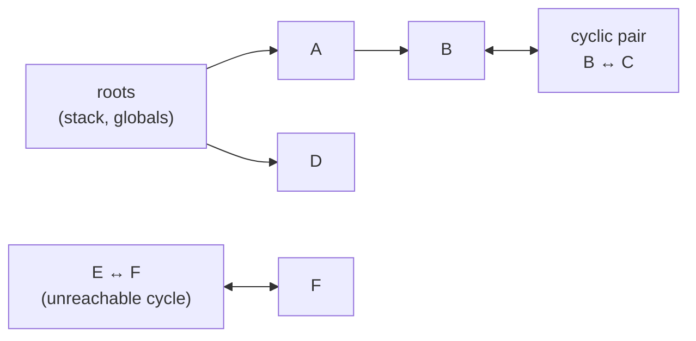

# Reference Counting and Mark-Sweep, the Two Basic Ideas

Every garbage collector, from CPython's to the JVM's most exotic low-latency engine, is answering one question: which heap objects can the program no longer reach? There are exactly two independent ways to answer it, discovered decades ago and still the foundation of everything built since. One counts. The other traces. Understanding both - and precisely where the first one breaks - explains almost every GC design decision that follows in this guide.

## Reference counting: count who points at you

The idea is mechanical and local. Every object carries a hidden counter: how many references currently point at it. Each time a reference is created - assigned to a variable, stored in a list, passed as an argument - the counter goes up. Each time a reference goes away - the variable goes out of scope, gets reassigned, the containing object is freed - the counter goes down. The moment a counter hits zero, nothing in the program can reach that object anymore, so it's freed immediately, right there, synchronously.

No separate collection pass. No pause where the whole program stops to hunt for garbage. Memory gets reclaimed the instant it becomes unreachable, one object at a time, spread evenly across the program's execution instead of bunched into a collection cycle.

CPython uses this as its primary mechanism. Every Python object has a `refcount` field baked into its C struct; `sys.getrefcount()` reads it directly.

```python
import sys

a = []
print(sys.getrefcount(a))   # 2: one for `a`, one for the getrefcount() argument itself

b = a
print(sys.getrefcount(a))   # 3: a, b, and the call argument

del b
print(sys.getrefcount(a))   # back to 2
```

*What just happened:* assigning `b = a` didn't copy the list - it added a second reference to the same object, and the refcount went up. `del b` removed that reference and the count dropped. If it had reached zero, CPython would have freed the list's memory on the spot, no separate GC pass involved.

**Why it's attractive.** Reclamation is immediate and spread out - no stop-the-world pause because there's no "the world" to stop, just one decrement at a time. An object's lifetime is exactly the span during which something points at it. This is part of why Swift and Objective-C chose reference counting (ARC) as their entire memory model, not just a helper: predictable, immediate deallocation matters where a GC pause would be a dropped frame.

**Why it's not enough on its own.** Every reference count change is extra work on every mutation - assign a pointer, touch a counter, and under multithreading that counter needs synchronized increments, which is genuinely expensive (part of why CPython's GIL exists in the shape it does). But the disqualifying flaw is structural, not a performance tax: **reference counting cannot collect cycles.**

## The cycle problem

Picture two objects that reference each other and nothing external references either of them anymore.

```python
class Node:
    def __init__(self):
        self.other = None

a = Node()
b = Node()
a.other = b   # a's refcount: 1 (from variable `a`)
b.other = a   # b's refcount: 2 (from variable `b` AND a.other)
              # a's refcount is now 2 (from variable `a` AND b.other)

del a
del b
# a and b are both unreachable from any root now -
# but a.other still points to b, and b.other still points to a.
# Neither refcount ever reaches zero. Pure reference counting leaks this.
```

*What just happened:* deleting the variables `a` and `b` removed the *external* references, but the two objects still reference each other. Each one's count drops from 2 to 1 - never to 0. A pure reference-counting collector would leave this pair sitting in memory forever: unreachable from the program, yet mutually "alive" by the counting rule. This is the exact shape of a doubly-linked list, a parent-child UI tree with back-pointers, an observer that holds its subject and vice versa - all common, all cyclic.

📝 **Terminology.** A **reference cycle** is a set of objects that reference each other (directly or through a chain) but that no root - no live variable, no global, no stack frame - reaches from outside the set. They're garbage by any reasonable definition, but invisible to counting alone.

**CPython's real answer.** Because pure refcounting leaks cycles, CPython runs two collectors, not one. Refcounting handles the vast majority of objects (strings, temporaries, non-circular structures) and frees them instantly. Layered on top is a periodic **cycle detector** - a generational tracing collector (Phase 2's subject) that runs occasionally, specifically to find and break cycles that counting missed. `gc.collect()` triggers it manually; it also runs automatically based on allocation thresholds. Lesson: reference counting is a real, deployed strategy, but every system that uses it as its primary mechanism pairs it with a tracing fallback for cycles.

## Mark-and-sweep: trace from the roots instead

The other founding idea sidesteps the counting problem by asking a global question instead of a local one: not "does anything point at me," but "can the program reach me *at all*, by any path, starting from what it definitely still needs?"

📝 **Roots** are the starting points a collector trusts as automatically live: local variables on every thread's call stack, global/static variables, and CPU registers holding a reference at the moment of collection. Nothing else gets to start a chain.

The algorithm runs in two explicit passes:

**Mark.** Start at every root. Follow each reference to the object it points at, flag that object as reachable, then follow every reference *that* object holds, and so on - a graph traversal (depth-first or breadth-first, either works) that visits every object reachable by any path at all. When it's done, every live object carries a mark.

**Sweep.** Walk the entire heap linearly, object by object. Anything without a mark was never reached from any root by any path - it's garbage, full stop, cycle or no cycle - and its memory returns to the allocator's free list. Clear all marks in preparation for the next cycle.



*Reading this:* `A`, `B`, `D` are reached by tracing from the roots, so they're marked live - including `B`, even though it's part of a `B ↔ C` cycle, because `B` is *also* reachable from `A`. `C` gets marked too, by extension. `E` and `F` reference each other but nothing traces to either of them from a root - unmarked, and swept. This is the direct answer to Phase 1's cycle problem: mark-and-sweep doesn't care whether objects reference each other. It only cares whether a root can reach them. A cycle with no root reference is exactly as dead as a single unreferenced object.

**The cost profile is the mirror image of reference counting.** No per-mutation overhead - assigning a pointer is a plain pointer assignment, nothing to increment. But reclamation isn't immediate: garbage sits unreclaimed until the next full trace runs, and that trace needs a moment where the object graph holds still - the root of the stop-the-world pause from the intro-level guide. Making that trace fast, frequent, and non-disruptive without giving up its cycle-safety is where the rest of this guide goes next.

Try it yourself - allocate objects, drop a root, and step through mark-and-sweep deciding what survives:

```playground-gc
```

```quiz
[
  {
    "q": "Two objects, A and B, reference only each other. No variable or global references either one. What does pure reference counting do?",
    "choices": ["Frees both immediately, since neither is reachable from a root", "Leaks both - their counts never reach zero because they reference each other", "Frees only A, since it was created first", "Throws an error because a cycle was detected"],
    "answer": 1,
    "explain": "Reference counting only tracks how many pointers reference an object, not whether a root can reach it. A and B keep each other's count above zero forever, even though nothing external can reach either one."
  },
  {
    "q": "In mark-and-sweep, what makes an object eligible to be swept?",
    "choices": ["Its reference count reached zero", "It was allocated more than one collection cycle ago", "No root can reach it by any chain of references, cyclic or not", "It has no methods that mutate its own fields"],
    "answer": 2,
    "explain": "Mark-and-sweep traces reachability from roots. Anything not visited during the mark phase - regardless of how many other objects reference it, including cyclically - gets swept."
  },
  {
    "q": "Why does CPython run a separate cycle-detecting collector on top of reference counting instead of relying on refcounts alone?",
    "choices": ["Refcounting is too slow for large objects", "Refcounting cannot detect or free reference cycles, since mutual references never bring a count to zero", "The cycle detector is only used for debugging, not real collection", "Refcounting only works for integers and strings"],
    "answer": 1,
    "explain": "Refcounting handles acyclic garbage instantly and cheaply, but structurally can't see cycles - two objects that only reference each other never hit zero. CPython layers a periodic tracing collector on top specifically to catch what counting misses."
  }
]
```

---

[Guide overview](_guide.md) · [Phase 2: Generational and Concurrent Collectors →](02-generational-and-concurrent-collectors.md)
