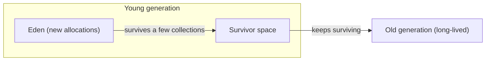
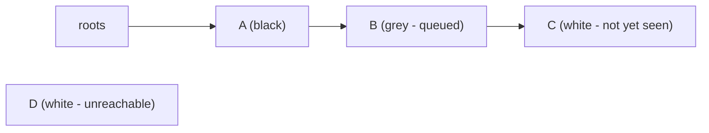

# Generational and Concurrent Collectors

Phase 1 left mark-and-sweep with a real weakness: to trace reachability safely, it wants the object graph to hold still, and tracing the *entire* heap every time is slow. Two independent insights fix this, and nearly every collector shipping today - the JVM's, Go's, V8's, .NET's - is built from some combination of them. One shrinks the *amount* of heap you trace on a typical pass. The other lets you trace *while the program keeps running*, instead of freezing it. They're separate ideas that compose.

## The generational hypothesis

Watch any real program's allocations and a pattern jumps out: the overwhelming majority of objects die almost immediately. A temporary string built inside a loop, a request object that lives for one HTTP call, an iterator that exists for a single `for` loop - allocated, used briefly, unreachable within microseconds. A small minority - caches, long-lived services, configuration objects - stick around for the life of the program. This observation has a name.

📝 **The generational hypothesis**: most objects die young. Empirically true across almost every language and workload measured, which is why it drives the internal structure of most production collectors.

If most garbage is young garbage, tracing the *whole* heap to find it is wasted effort - you're re-scanning a pile of old, long-lived objects over and over just to confirm, again, that they're still alive. The fix: stop treating the heap as one region. Split it by age.



New objects are born in the **young generation**. A **minor collection** traces and sweeps *only* that region - it's small, so it's fast, and because most young objects are already dead, a minor collection reclaims a lot of memory for very little work. Objects that survive several minor collections get promoted into the **old generation**, which is collected far less often by a **major** (or full) collection - a bigger, slower pass, but one that runs rarely because the old generation mostly holds things that actually are still needed.

The payoff compounds: the young generation gets collected constantly at near-zero cost per collection, while the expensive full-heap trace happens rarely enough that its cost amortizes away. This single design decision - separating by age and collecting the young generation disproportionately often - is responsible for most of the practical performance of a modern tracing GC. It's why a JVM service doing heavy allocation still keeps sub-millisecond typical pause times: nearly every pause is a cheap minor collection, and full collections are the rare exception, not the rule.

One wrinkle: an old object can reference a young one (a long-lived cache pointing at a freshly allocated value). A naive minor collection that only scans the young generation would miss that reference as a root and wrongly reclaim the young object. Collectors handle this with a **write barrier** - a small check inserted at every pointer write that records old-to-young references in a side table (a "remembered set"), so a minor collection can treat those recorded slots as extra roots without re-scanning the entire old generation.

## Concurrent collection and the tri-color invariant

Generations shrink *how much* gets traced. The other lever is *whether the program has to stop* while tracing happens at all. A naive mark phase needs a stable graph - if your code mutates references while the collector is mid-trace, the collector can lose track of what's reachable and free something still in use. The blunt fix is stop-the-world - freeze every thread, trace, resume; the refined fix is to trace **concurrently**, marking objects while application threads keep running, which is where modern low-pause collectors (Go's, the JVM's ZGC and Shenandoah, .NET's) spend their engineering effort.

To mark concurrently without corrupting the trace, collectors use **tri-color marking**, a bookkeeping scheme that makes "am I done, and is it still correct?" answerable at every point mid-trace, not just at the end.

📝 **Tri-color marking**: every object is white (not yet visited - assumed garbage), grey (visited, but its own references not yet scanned), or black (visited *and* fully scanned - confirmed live). Marking starts with all objects white and the roots grey, and proceeds by picking a grey object, scanning its references (turning any white targets grey), then coloring it black. Marking is complete when no grey objects remain: everything left white is genuinely unreachable.



*Reading this:* `A` has been fully scanned (black). `B` was discovered through `A` and is queued to have its own references scanned (grey). `C` hasn't been reached yet but will be, once `B` is processed. `D` is white and reachable from nothing - if marking ends with `D` still white, it's swept as garbage.

The danger with concurrent marking is a mutation that happens *during* the trace: your program runs a line of code that makes a black (already-scanned, "done") object point at a white (not-yet-seen) object, while simultaneously dropping the only grey-or-black reference to that white object. The collector, having already finished scanning the black object, never revisits it - so it never discovers that new white target, and incorrectly sweeps something still reachable. This is the exact bug tri-color marking exists to prevent.

📝 **The tri-color invariant**: a black object must never point directly at a white object. The instant application code would create that edge, the collector intervenes.

The mechanism is the same write barrier from the generational section, doing different work: on every pointer write during a concurrent mark phase, the barrier checks whether it's about to break the invariant, and if so, either colors the new target grey immediately (so it gets scanned) or colors the source object back to grey (so its references get re-checked). Either fix keeps the invariant intact without stopping the world. Real concurrent collectors still take brief stop-the-world pauses - to snapshot the initial roots, and to finalize - but the bulk of the marking work, the part that used to freeze your whole program, happens while it keeps running.

Watch reachability get traced and swept step by step:

```playground-gc
```

```quiz
[
  {
    "q": "Why does splitting the heap into young and old generations make garbage collection faster overall?",
    "choices": ["It lets the collector skip tracing altogether for old objects forever", "Most objects die young, so frequently collecting only the small young generation reclaims most garbage cheaply, while the rare full-heap trace amortizes its cost", "It reduces the total amount of memory the program can allocate", "Old objects are automatically assumed to be garbage without checking"],
    "answer": 1,
    "explain": "The generational hypothesis says most objects die young. Collecting the young generation often and cheaply catches most garbage; the old generation is traced far less often because it mostly holds things still genuinely in use."
  },
  {
    "q": "In tri-color marking, what does it mean for an object to be grey?",
    "choices": ["It has been permanently deemed garbage", "It hasn't been visited by the collector at all yet", "It has been visited but its own outgoing references haven't been scanned yet", "It's an old-generation object being demoted back to young"],
    "answer": 2,
    "explain": "Grey is the 'in progress' state: the collector has reached the object but still needs to scan its references before marking it black (fully processed)."
  },
  {
    "q": "What does a write barrier prevent during concurrent marking?",
    "choices": ["The program from allocating any new objects during collection", "A black (fully scanned) object from ending up pointing directly at a white (unscanned) object, which would hide it from the collector", "Two threads from allocating memory at the same address", "The old generation from ever being collected"],
    "answer": 1,
    "explain": "That edge violates the tri-color invariant - if a black object gains a pointer to a white object with no grey/black reference keeping it visible, the collector may never revisit it and could wrongly sweep something still reachable. The write barrier intercepts the pointer write and fixes the coloring."
  }
]
```

---

[← Phase 1: Reference Counting and Mark-Sweep](01-reference-counting-and-mark-sweep.md) · [Guide overview](_guide.md) · [Phase 3: Reading and Tuning a Real GC →](03-reading-and-tuning-a-real-gc.md)
