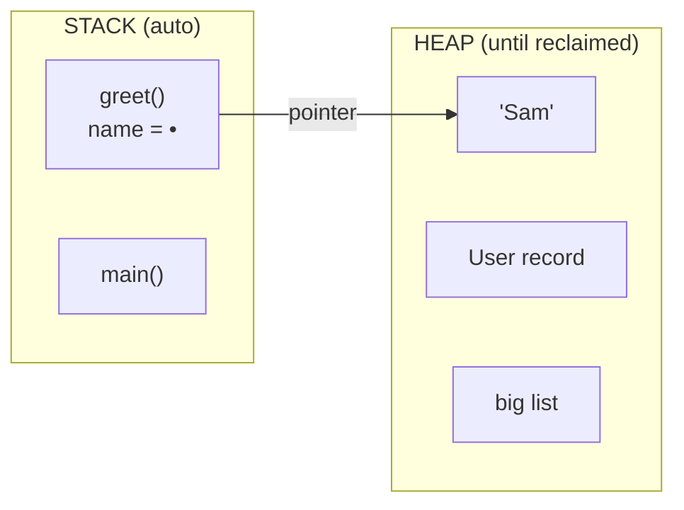
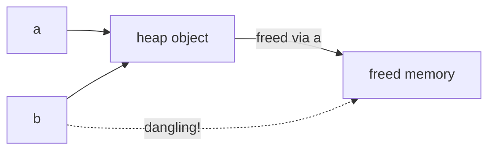

# Where Objects Live & How They're Allocated

Before we can talk about cleaning up memory, we have to be clear about where the stuff *is*: every value you create sits somewhere in memory, in one of two neighborhoods with completely different rules - one cleans up after itself automatically, and one does not. That second one is the whole reason garbage collection exists.

> ⏭️ This phase recaps an idea covered in full in [What Actually Happens When Your Code Runs](/guides/what-happens-when-code-runs). If the stack and heap are already solid for you, skim the recap and slow down at *"The hard part."*

## The two-minute recap: stack and heap

**What they actually are.** When your program runs, the operating system hands it a chunk of memory to work in. Your program organizes that chunk into (among other things) two regions that behave very differently:

- **The stack** is a tidy stack of plates. Every time you call a function, a new plate (a *stack frame*) goes on top, holding that function's local variables. When the function returns, its plate comes off - instantly, automatically. The stack is fast and self-cleaning, but it only works for things whose size is known up front and whose life ends when the function does.
- **The heap** is a big open warehouse. You can ask for a space of any size, at any time, and it stays yours until *something* decides to give it back. Nothing comes off automatically when a function returns. The heap is flexible, but that flexibility is exactly what makes cleanup hard.



The arrow is the key detail. On the stack, the variable `name` doesn't usually hold the string "Sam" itself - it holds the *address* of where "Sam" lives on the heap. That address is called a **pointer** (or a *reference*, in higher-level languages).

📝 **Terminology.** A *pointer* / *reference* is a value that holds the memory address of something else. The variable is on the stack; what it points *to* is often on the heap. This is why two variables can refer to the *same* object - they hold the same address.

## Why anything goes on the heap at all

If the stack is so fast and automatic, why not put everything there? Because the stack's great strength is also its limit: **a stack frame dies the moment its function returns.** That's perfect for a temporary counter, useless for anything that needs to *outlive* the function that created it.

Consider building something and handing it back:

```python runnable
def make_user(name):
    user = {"name": name, "logins": 0}   # build a dictionary
    return user                          # hand it back to the caller

u = make_user("Sam")
print(u["name"])    # Sam - still alive long after make_user returned
```
*What just happened:* The dictionary couldn't live on `make_user`'s stack frame, because that frame is gone the instant `make_user` returns. So the object itself lives on the **heap**, and what `make_user` returns is really a reference to it. The variable `u` now holds that reference. The object outlived the function that made it - and that is precisely what the heap is *for*.

This is the everyday pattern behind almost every object you create in a high-level language. Anything you build and pass around - lists, records, strings you grow, objects you store in other objects - lives on the heap, because its lifetime isn't tied to a single function call.

💡 **Key point.** The stack is for values that live and die inside one function call. The heap is for everything that has to outlive the call that created it. Heap memory is the interesting case because *something* has to decide when it's no longer needed.

## The hard part: when is it safe to reclaim?

Here's the problem the rest of this guide exists to solve. A piece of heap memory should be given back - *reclaimed* - once nobody needs it anymore, so the space can be reused. The question sounds trivial and is anything but: **how do you know nobody needs it anymore?**

Reclaim too early and you get a disaster. Suppose two variables point at the same heap object, you free it because one of them is done, and the other variable still thinks it's valid:



Now `b` is a **dangling pointer** - it points at memory that's been freed and possibly handed to something else entirely. Reading through `b` gives you garbage; writing through it corrupts another part of your program. This is the famous **use-after-free** bug, and it's both nasty to debug and a serious security hole.

Reclaim too *late* - or never - and you get the opposite failure: memory that's no longer needed but never given back. The program's heap usage only grows. That's a **memory leak**, and in a long-running program it ends in the crawl-then-crash you may have read about in [What "Out of Memory" Really Means](/guides/processes-memory-and-cpu).

📝 **Terminology.** *Use-after-free* = using memory through a pointer after that memory has been reclaimed. *Memory leak* = memory that's no longer reachable or needed but never gets reclaimed, so usage grows without bound.

So reclaiming heap memory is a tightrope - too early breaks correctness, too late wastes memory - and getting it *exactly* right requires answering "is anyone still using this?" precisely, every time. That single question is the fork in the road for the next phase. Two whole families of languages exist because they answer it differently: **make the programmer answer it by hand**, or **make the runtime figure it out automatically.**

## Recap

1. Running programs keep values in two main places: the **stack** (fast, automatic, dies when the function returns) and the **heap** (flexible, stays until something reclaims it).
2. A variable on the stack often holds a **pointer/reference** - an address of an object living on the heap. Two variables can hold the same address and point to the same object.
3. Objects go on the **heap** because they need to **outlive** the function that created them.
4. The hard problem is **when to reclaim heap memory**: too early causes **use-after-free** (a dangling pointer), too late or never causes a **memory leak**.
5. How a language answers "is anyone still using this?" - by hand or automatically - is the subject of the next phase.

---

[← Guide overview](_guide.md) · [Phase 2: Manual vs Automatic Memory →](02-manual-vs-automatic.md)
