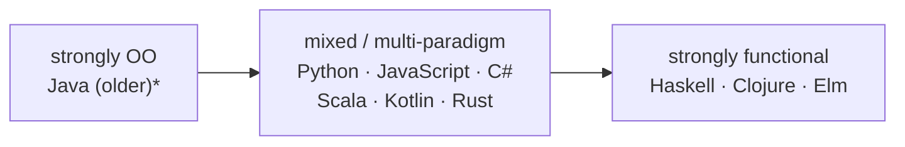

# Honestly: Which, When?

Now the question you actually came for. You understand both worldviews - so which one is *right*?

Here's the honest answer, and it's the most important sentence in this guide: **you don't have to choose, and the most common languages don't make you.** Python, JavaScript, C#, Java (modern versions), Ruby, Scala, Kotlin, Rust - all of them let you write objects *and* pure functions, and the good codebases written in them use both, deliberately, for different jobs. OOP and FP are tools in one toolbox, not teams you join.

## "But which one is my language?"

Most languages people argue about are **multi-paradigm** - they support more than one style and let you pick per situation.

*\* Even Java has added lambdas, streams, and records - it has drifted toward the middle.*

The takeaway: if you write Python or JavaScript, you are *already* free to use objects where they help and pure functions where they help. The "which language is functional" question matters far less than "which approach fits this particular piece of code."

## Where each one genuinely shines

Let's be fair to both. Each paradigm is strong exactly where its core idea pays off.

**OOP shines when you're modeling stateful entities with identity.** A user, a shopping cart, a game character, a database connection, an open file - things that *have* state, that change over time, and that you talk about as "a thing." Bundling that state with the operations that guard it (encapsulation) is a genuinely good fit. OOP also gives a large team a shared, nameable structure: "the `OrderService` owns order logic" is an organizing principle that scales across many people and many files.

**FP shines when you're transforming data.** Take input, run it through steps, produce output: parsing, report generation, ETL pipelines, anything analytics-shaped. It also shines for **concurrency** - when nothing can be mutated, multiple threads can read the same data with no locks and no race conditions, because there's nothing to race over. And it shines for **testability**: pure functions need no setup and no mocks, so the test is just "input → expected output."

## The honest comparison table

This covers both sides fairly - including each one's costs.

| Dimension | Object-Oriented | Functional |
|---|---|---|
| **Core unit** | Objects (data + behavior bundled) | Functions (data and behavior kept separate) |
| **How it handles state** | Embraces it - objects hold and guard mutable state | Avoids it - prefers immutable values, isolates change |
| **Best fit** | Modeling stateful entities with identity (user, cart, connection) | Transforming data (pipelines, parsing, analytics) |
| **Concurrency** | Needs care - shared mutable state means locks and races | Strong - immutable data is safe to share across threads |
| **Testability** | Often needs setup/mocks for objects with dependencies | Pure functions test with plain input → output |
| **Team scaling** | Familiar structure; classes give large teams clear ownership | Small composable functions; fewer shared conventions in practice |
| **Common failure mode** | Deep inheritance, over-modeling, tangled mutable state | Over-abstraction, jargon, awkward I/O when taken to extremes |
| **The thing it makes easy** | "This thing exists and protects its own rules" | "This input reliably produces this output" |

📝 A note on reading this table: no row crowns a winner. Each paradigm's strength has a matching cost. OOP's comfort with state is exactly what makes its concurrency story harder. FP's purity is exactly what can make plain old "write to the database" feel awkward if you go too far. That symmetry is the whole point.

## How real codebases actually mix them

In practice, a healthy codebase doesn't pick one. A very common and pragmatic pattern looks like this:

- **Objects at the boundaries and for stateful things** - the `User`, the `HttpServer`, the database connection, the cart. Things with identity and lifecycle.
- **Pure functions for the logic in the middle** - pricing rules, validation, formatting, transformations. The stuff you want to test in two lines.

A `Cart` object (OOP) might hold the items, while the function that computes the discounted total (FP, pure) takes the items and returns a number without touching anything. You get encapsulation where you want a guarded thing, and testable purity where you want trustworthy logic. That blend is not a compromise - it's most experienced developers' default.

## The judgment part (flagged as judgment)

Everything above this line is reasonably uncontroversial. What follows is *opinion* - useful heuristics, not laws:

- *In my experience,* reaching for a pure function first and only introducing an object when something genuinely needs to hold state leads to code that's easier to test. But that's a lean, not a rule.
- *I'd treat* any inheritance chain deeper than one or two levels as a smell worth a second look (this echoes the inheritance trap from [Phase 1](01-what-oop-actually-is.md)). Others disagree and use deeper hierarchies happily.
- *I'd be wary* of anyone who tells you one paradigm is correct and the other is obsolete. That's usually a sign they've worked in one world and not the other.

Take these as a senior colleague's leanings, weigh them against your own context, and discard the ones that don't fit your team.

## Recap

1. **You usually don't have to choose** - the common languages are multi-paradigm, and good codebases use both.
2. **OOP shines** at modeling stateful entities with identity and at giving large teams a clear structure.
3. **FP shines** at data transformation, at concurrency (immutable data is safe to share), and at testability (pure functions need no setup).
4. **Real codebases mix them** - objects for stateful boundaries, pure functions for the logic in between.
5. **They're tools, not religions.** Match the approach to the job, flag your opinions as opinions, and distrust anyone selling a one-true-way.

You can now read code in either style, name what it's doing and why, and make a deliberate choice instead of an inherited one - which was the whole goal.

## Where to go next

- [Languages Explained Like a Human](/guides/languages-explained-like-a-human) - how programming languages differ beyond paradigm, in plain terms.
- [Data Structures Explained](/guides/data-structures-explained) - the values your functions transform and your objects hold, demystified.

---

[← Phase 2: What Functional Programming Actually Is](02-what-functional-actually-is.md) · [Guide overview](_guide.md)
