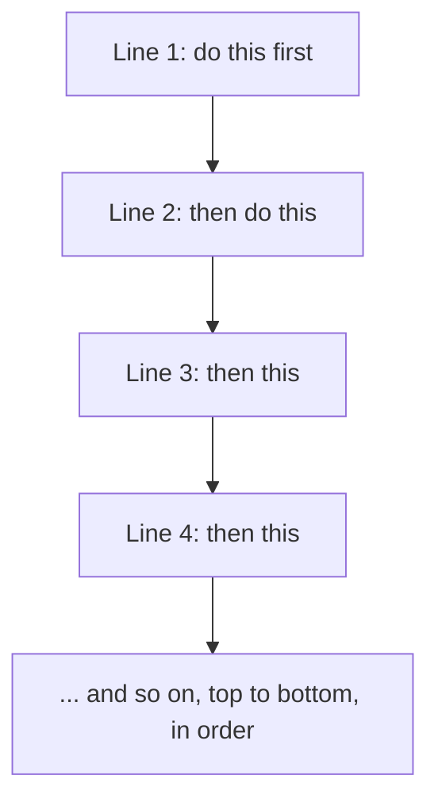

# What a Program Actually Is

Before you write a single line, get the most important idea straight - almost everything that feels
scary about coding comes from a wrong picture of what's happening.

Here's the wrong picture: that the computer is *smart*, that it understands what you *meant*, that
there's some intelligence on the other side filling in your gaps. There isn't. Once you stop expecting
that, code gets dramatically less frustrating.

## The mental model: instructions, not spells

**What a program actually is.** A program is a list of instructions, written down in advance, that a
computer carries out one at a time, in order, from top to bottom. That's it. You are writing a recipe,
and the computer is the most literal cook imaginable.

The key word is *literal*. The computer does **exactly** what your instructions say - no more, no less.
It doesn't guess what you meant, skip a step because it seems obvious, or fix your mistake for you. Tell
it to do something nonsensical and it does the nonsensical thing (or stops and complains). That sounds
like a weakness, but it's what makes programming *learnable*: because the computer is perfectly
predictable, every behavior has a cause you can find.

📝 **Terminology.** *Code* is the instructions you write, in a language a computer can be made to
understand. A *program* is a complete set of those instructions that does something. A *programming
language* (we're using **Python**) is the specific vocabulary and grammar you write the instructions in.

💡 **Key point.** You are not casting spells and hoping. You are writing precise instructions for a
machine that follows them exactly. When something goes wrong, it's not magic failing - it's an
instruction that said something other than what you intended. That reframe alone will save you a hundred
frustrated hours.

## Picture how it runs

When you run a program, the computer starts at the first line and walks downward, doing each instruction
in turn:



Order matters enormously. If line 2 depends on something line 4 sets up, it won't work - the computer
reached line 2 before line 4 ever happened. Reading code is mostly tracing, in your head, what the
machine does at each line, in sequence.

## Your first program

The classic first instruction in any language is: **put some text on the screen.** In Python, the
instruction for that is `print`.

```python runnable
print("Hello, world!")
```
*What just happened:* `print` is an instruction that means "display this on the screen." The text you
want shown goes inside the parentheses, wrapped in quotation marks. When the computer runs this one
line, it shows:

```console
Hello, world!
```

That's a complete program. One instruction, carried out exactly. Here's the line broken into its pieces
- you'll see every one of them again and again:

```text
   print ( "Hello, world!" )
   ─────   ───────────────
     │            │
     │            └─ the value you're giving to print: the text to show.
     │               The quotes mark where the text starts and ends.
     │
     └─ the name of the instruction you're running ("print this").
```

📝 **Terminology.** Running an instruction like `print(...)` is called **calling** it, and the value you
put in the parentheses is called an **argument** - the thing you're handing to the instruction to work
with. Here the argument is the text `"Hello, world!"`.

## Order in action

Because the computer goes top to bottom, three `print` instructions run in the order you wrote them:

```python runnable
print("First")
print("Second")
print("Third")
```
*What just happened:* The computer ran line 1, then line 2, then line 3, producing one line of output
each, in that exact order:

```console
First
Second
Third
```

Swap the lines and the output swaps too. The computer has no opinion about what order makes sense - it
follows yours.

## The gotcha that bites every single beginner

⚠️ **The computer is unforgivingly literal about punctuation.** Leave off a quote, a parenthesis, or
misspell `print`, and the program doesn't "mostly work" - it stops and reports an error. For example,
forgetting the closing quote:

```python
print("Hello, world!)
```
*What just happened:* The computer started reading the text after the first quote and kept going,
looking for the closing quote that ends it - and never found one. It can't guess where you meant the
text to stop, so it gives up with a message like this:

```console
  File "hello.py", line 1
    print("Hello, world!)
          ^
SyntaxError: unterminated string literal (detected at line 1)
```

📝 **Terminology.** A **syntax error** means your code broke the grammar rules of the language - like a
sentence with no closing quotation mark. The computer can't even *run* it yet, because it can't make
sense of what you wrote.

This feels harsh at first, but notice what the error gives you: the file, the line number (`line 1`), a
little `^` pointing near the problem, and a description (`unterminated string literal` - "you opened a
piece of text and never closed it"). Errors aren't the computer being mean - they're it telling you,
precisely, where your instructions didn't make sense. Learning to *read* them calmly is one of the
biggest things separating someone who's stuck from someone who's moving.

## Why this saves you later

Every confusing moment ahead - a program that does the wrong thing, output that's out of order, a crash
you don't understand - comes back to this one idea: **the computer did exactly what you told it, in the
order you told it.** When code misbehaves, you don't ask "why is it broken?" You ask "what did I
actually tell it to do, line by line?" Then you trace it. That mindset is the entire job.

## Recap

1. A **program** is a list of instructions the computer follows **in order, top to bottom**.
2. The computer is **perfectly literal** - it does exactly what you wrote, never what you meant. That
   predictability is what makes bugs findable.
3. `print("...")` displays text on the screen; the text in quotes is the **argument** you hand it.
4. **Order matters** - rearrange the lines and you rearrange the output.
5. A **syntax error** means you broke the language's grammar (a missing quote or parenthesis); the error
   message points you at where.

Next, we give those instructions something to work *with*: named values, the types they come in, and the
operators that combine them.

---

[← Guide overview](_guide.md) · [Phase 2: The Building Blocks →](02-building-blocks.md)
