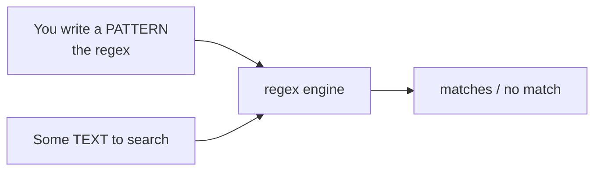

# What a Regex Actually Is

Before any symbols, let's fix the one idea the whole topic rests on. Get this, and every confusing
pattern you ever see afterward becomes something you can reason about instead of fear.

Here's the shift: **a regex is not code you run. It's a description you write.** You're not telling
the computer *how* to search the text step by step. You're describing the *shape* of the thing
you're looking for, and handing that description to a piece of software - called a **regex engine**
- that does the actual searching for you.

📝 **Terminology.** A **regular expression** (everyone says "regex," some say "regexp") is a small
pattern that describes a set of strings. A **regex engine** is the built-in machinery - inside your
editor, inside `grep`, inside your programming language - that takes your pattern and checks text
against it. You write the pattern; the engine does the work.

## The mental model: you're describing text

Think about how you'd describe a phone number to a friend over the phone: "three digits, a dash,
then four digits." You didn't write instructions for scanning a page. You described the *shape* -
and a human listening could now recognize one on sight.

A regex is exactly that description, written in a compact notation the engine understands. The
notation looks alien at first, but the *job* is the friendly one you already do in plain language:
**say what the text looks like.**



*What this picture says:* you supply two things - a pattern and some text - and the engine reports
back where (and whether) the pattern's shape appears in the text. You never wrote a loop; you
described, and it matched.

## Why people get this wrong

The common wrong picture is that a regex is a *command* - something that "does" an action like
"find and delete all the emails." It isn't. On its own, a regex only answers one question: **does
this shape appear in this text, and if so, where?**

The *actions* - search, highlight, replace, extract - come from the tool you hand the regex to. Your
editor's Find box uses it to decide what to highlight. A replace feature uses it to decide what to
swap out. `grep` uses it to decide which lines to print. The regex itself is always the same humble
thing: a description of a shape. Keeping that separation in your head - *pattern describes, tool acts*
- stops a lot of confusion later.

## A tiny first example

The simplest possible regex is plain text that means itself. The pattern `cat` describes a very
specific shape: the letter `c`, then `a`, then `t`, side by side.

Let's see what it matches. Imagine asking the engine to find `cat` in a few different lines:

```text
  pattern:  cat

  "the cat sat"          ►  MATCH      (found c-a-t at position 4)
  "a category error"     ►  MATCH      (found c-a-t inside "category")
  "concatenate"          ►  MATCH      (found c-a-t inside "concatenate")
  "a dog barked"         ►  no match   (no c-a-t shape anywhere)
  "CAT scan"             ►  no match   (uppercase - different characters)
```

*What just happened:* the engine slid the shape `cat` along each line, looking for three characters
in a row that match. It found that shape inside `category` and `concatenate` - because by default a
regex matches *anywhere in the text*, not only whole words. It found nothing in `a dog barked`
(no such run of letters), and nothing in `CAT scan` because, by default, matching is
**case-sensitive** - `C` and `c` are different characters to the engine.

⚠️ **Gotcha - "match" means "found somewhere," not "is equal to."** The most common beginner
surprise is expecting `cat` to match only the exact word "cat." It doesn't. A match means the shape
was found *somewhere inside* the text. Matching a *whole* string, or a *whole word*, takes extra
pieces (anchors and boundaries) that we'll meet in the next two phases. For now: a bare pattern
finds its shape wherever it appears.

💡 **Key point.** A regex describes a shape of text. The engine searches; the tool acts. Everything
in the next phase is only richer ways to describe a shape - "any digit" instead of one specific
digit, "one or more of these" instead of exactly one. The idea never changes.

## Why this saves you later

Once you hold "it's a description, not a command," the scary patterns lose their teeth. When you
meet `^\d{4}-\d{2}-\d{2}$` in the wild, you won't see a spell - you'll know it's *describing a
shape* ("four digits, dash, two digits, dash, two digits, and nothing else"), and you'll be able to
read it left to right like a sentence. That's the whole game: regex is readable once you know it's
a description. Phase 2 hands you the vocabulary.

## Recap

1. A **regex** is a pattern that describes the *shape* of text - a description, not a command.
2. A **regex engine** (in your editor, `grep`, or language) does the actual searching against your
   pattern.
3. The *tool* you give the regex to decides the action (highlight, replace, filter); the regex only
   describes.
4. A bare pattern like `cat` matches its shape **anywhere** in the text, and matching is
   **case-sensitive** by default.
5. "Match" means "this shape was found somewhere," not "the text equals this."

---

[← Guide overview](_guide.md) · [Phase 2: The Core Toolkit →](02-the-core-toolkit.md)
