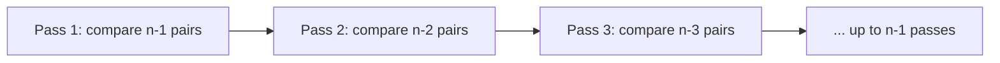

# Bubble Sort: Compare, Swap, Repeat

Sorting is the other half of this guide's story: binary search needs sorted data, so now let's actually put
things in order. Bubble sort is the easiest sort to understand and the easiest to trust is correct - which
makes it the right place to build the intuition, even though it's not what you'd reach for in real code.

## The mental model: neighbors swap until nobody needs to

**What it actually is.** Walk the list left to right, comparing each pair of neighbors. If they're out of
order, swap them. By the end of one full pass, the largest value has been pushed ("bubbled") all the way to
the end. Do another pass, and the next-largest lands in place. Keep going until a full pass makes zero swaps
- that's your signal the list is sorted.

```python runnable
def bubble_sort(items):
    items = items[:]              # work on a copy, don't mutate the caller's list
    n = len(items)
    for pass_num in range(n - 1):
        swapped = False
        for i in range(n - 1 - pass_num):
            if items[i] > items[i + 1]:
                items[i], items[i + 1] = items[i + 1], items[i]
                swapped = True
        if not swapped:           # a pass with no swaps means it's already sorted
            break
    return items

print(bubble_sort([5, 2, 9, 1, 5, 6]))
```
```console
[1, 2, 5, 5, 6, 9]
```
*What just happened:* the first pass compares `(5,2)` → swap, `(5,9)` → no swap, `(9,1)` → swap, `(1,5)` →
no swap, `(5,6)` → no swap - and `9`, the biggest value, has bubbled to the last slot. Each subsequent pass
repeats the walk over a slightly shorter range (the tail is already sorted, so `n - 1 - pass_num` shrinks the
comparison window), placing the next-biggest value correctly, until a pass swaps nothing at all.

💡 **Key point.** The `swapped` flag is a cheap but real optimization: on an already-sorted (or
nearly-sorted) list, bubble sort notices immediately and stops early instead of grinding through every
possible pass.

## Why it's O(n²)

**What it actually is.** In the worst case (data sorted backwards), every pass makes close to `n`
comparisons, and you need close to `n` passes to fully sort. That's roughly `n × n` = `n²` comparisons total.
Double the list, and the work roughly *quadruples* - the same nested-loop shape from
[Big-O Without the Math Panic](/guides/big-o-without-the-math-panic).



⚠️ **Gotcha.** Bubble sort's `O(n²)` cost is fine for a few dozen items and genuinely bad for a few hundred
thousand - the kind of slowdown that feels instant in a test and grinds in production. It's taught because
the "compare and swap" idea is the seed every faster sort builds on, not because you should reach for it in
real code (Python's built-in `sorted()` is a well-tuned `O(n log n)` sort - see the next phase for why that
matters).

Try it yourself - step through a shuffle and watch which pairs swap:

```playground-sorting
```

```quiz
[
  {
    "q": "What does one full pass of bubble sort guarantee?",
    "choices": ["The whole list is sorted", "The largest remaining value has moved to its final position", "The list is reversed", "Every pair has been compared exactly twice"],
    "answer": 1,
    "explain": "Each pass 'bubbles' the biggest unsorted value all the way to the end of the unsorted portion."
  },
  {
    "q": "Why does the `swapped` flag matter?",
    "choices": ["It counts the total number of swaps", "It lets the sort stop early once a pass makes no swaps", "It reverses the comparison order", "It's required for correctness"],
    "answer": 1,
    "explain": "A pass with zero swaps means the list is already sorted - continuing would just waste more passes."
  },
  {
    "q": "Why is bubble sort O(n²) in the worst case?",
    "choices": ["It only works on n items or fewer", "It needs roughly n passes of roughly n comparisons each", "It compares every item to itself", "It uses recursion, which doubles the cost"],
    "answer": 1,
    "explain": "Worst case (reverse-sorted data), you need about n passes, each doing about n comparisons - n times n is n²."
  }
]
```

---

[← Phase 2: Binary Search, Implemented](02-binary-search-implemented.md) · [Guide overview](_guide.md) · [Phase 4: Merge Sort (and Quick Sort) →](04-merge-sort-and-quick-sort.md)
