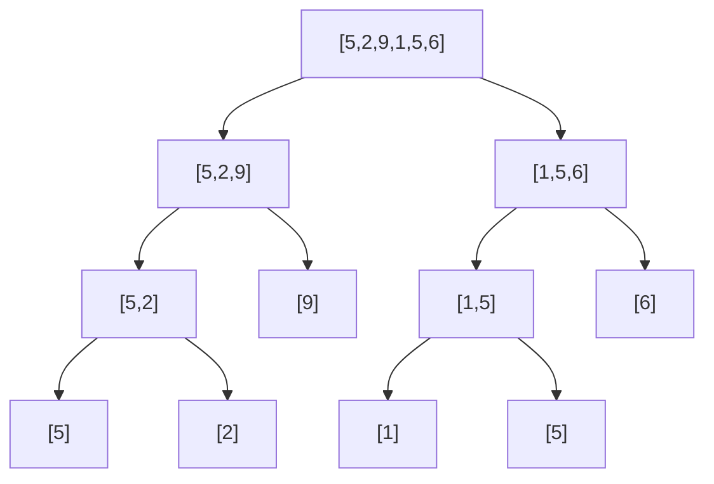

# Merge Sort (and Quick Sort)

Bubble sort's problem is that it only ever fixes one item's position per full walk through the data. Merge
sort takes a completely different strategy: **divide and conquer** - break the problem into pieces small
enough to be trivial, then combine the solved pieces back into a full answer.

## The mental model: split, solve, combine

**What it actually is.** A list of one item is already sorted - that's your base case (this is the same
shrink-toward-a-base-case shape as [recursion](/guides/recursion-finally-clicks)). Split any longer list into
two halves, recursively sort each half, then **merge** the two already-sorted halves into one sorted list by
repeatedly taking whichever half's front item is smaller.


*Split all the way down to single items (already sorted by definition), then merge back up.*

```python runnable
def merge_sort(items):
    if len(items) <= 1:
        return items
    mid = len(items) // 2
    left = merge_sort(items[:mid])
    right = merge_sort(items[mid:])
    return merge(left, right)

def merge(left, right):
    result = []
    i = j = 0
    while i < len(left) and j < len(right):
        if left[i] <= right[j]:
            result.append(left[i])
            i += 1
        else:
            result.append(right[j])
            j += 1
    result.extend(left[i:])   # whichever side has leftovers, they're already sorted
    result.extend(right[j:])
    return result

print(merge_sort([5, 2, 9, 1, 5, 6]))
```
```console
[1, 2, 5, 5, 6, 9]
```
*What just happened:* `merge_sort` keeps splitting until it hits single items, then `merge` walks the two
sorted halves side by side, always taking the smaller front item - the same trick you'd use combining two
sorted piles of cards by hand. Because both halves are already sorted going in, `merge` never has to look
back once it's placed an item.

## Why it's O(n log n)

**What it actually is.** Splitting the list in half repeatedly takes `log n` levels (the same halving as
binary search). At *each* level, merging back together touches every item once - `n` work per level. Multiply
them: `n` work × `log n` levels = `O(n log n)` total. That holds true in the **worst case, every time** -
merge sort's speed doesn't depend on how the input happened to be arranged.

💡 **Key point.** `O(n log n)` is the practical ceiling for general-purpose sorting - you can't reliably do
better by comparing items pairwise. It's what `sorted()` in Python and `.sort()` in JavaScript actually run
under the hood (with real-world tuning on top).

⚠️ **Gotcha: the memory cost.** `merge` builds a brand-new list instead of rearranging the original in
place. That's what gives merge sort its guaranteed `O(n log n)` - but it costs extra memory proportional to
`n`, which matters if you're sorting something huge with little RAM to spare.

## Quick sort: partition instead of merge

Quick sort is also divide and conquer, but it splits differently: pick a **pivot** value, then partition the
list into everything smaller than the pivot and everything bigger. Recursively sort each side, and there's
nothing left to merge - the pivot is already in its final position once both sides are sorted.

```python runnable
def quick_sort(items):
    if len(items) <= 1:
        return items
    pivot = items[len(items) // 2]
    less = [x for x in items if x < pivot]
    equal = [x for x in items if x == pivot]
    greater = [x for x in items if x > pivot]
    return quick_sort(less) + equal + quick_sort(greater)

print(quick_sort([5, 2, 9, 1, 5, 6]))
```
```console
[1, 2, 5, 5, 6, 9]
```
*What just happened:* everything less than the pivot goes left, everything greater goes right, and each side
recurses on its own. No merge step - once the two sides are sorted and stitched back around the pivot, the
whole thing is sorted.

**The trade-off.** With a well-chosen pivot, quick sort splits the data roughly in half each time - same
`O(n log n)` shape as merge sort, but sorting in place (no extra full-size copy). The catch: a *badly* chosen
pivot (say, always picking the first item on data that's already sorted) can split the list into "one item"
and "everything else" at every step, degrading to `O(n²)` - bubble sort's territory. Real-world quick sort
implementations pick the pivot more carefully (randomly, or the median of a few samples) specifically to make
that worst case rare.

| | Merge sort | Quick sort |
|---|---|---|
| Typical speed | `O(n log n)` | `O(n log n)` |
| Worst case | `O(n log n)` (guaranteed) | `O(n²)` (bad pivot) |
| Extra memory | Yes - a full copy | No - sorts in place |

Neither is "better" outright: merge sort trades memory for a guarantee, quick sort trades a rare worst case
for speed and low memory. Either one is what you're actually running any time you call a language's built-in
sort - bubble sort's `O(n²)` is the thing they were both invented to avoid.

```quiz
[
  {
    "q": "What is the base case in merge sort's recursion?",
    "choices": ["An empty list", "A list of one item - already sorted by definition", "A list of exactly two items", "There is no base case"],
    "answer": 1,
    "explain": "A single-item list can't be out of order, so it needs no further splitting - that's what stops the recursion."
  },
  {
    "q": "Why is merge sort O(n log n) instead of O(n²)?",
    "choices": ["It never compares two items", "It splits into log n levels, and each level does n work merging - n × log n total", "It skips half the data", "It only works on already-sorted input"],
    "answer": 1,
    "explain": "The halving gives log n levels; each level's merge step touches every item once, so total work is n times log n."
  },
  {
    "q": "What causes quick sort's worst-case O(n²) behavior?",
    "choices": ["Sorting a list that's already sorted, period", "A consistently badly-chosen pivot that splits the data very unevenly", "Using recursion instead of a loop", "Lists longer than 1000 items"],
    "answer": 1,
    "explain": "If the pivot is repeatedly the smallest or largest remaining value, each partition only removes one item instead of roughly halving the data."
  }
]
```

---

[← Phase 3: Bubble Sort](03-bubble-sort.md) · [Guide overview](_guide.md)
