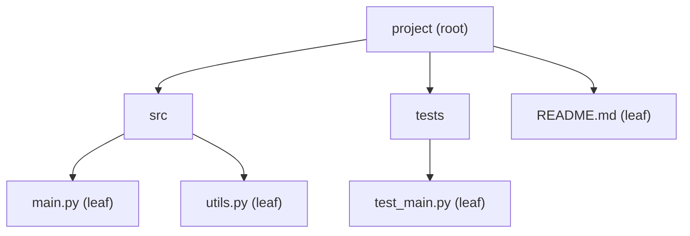

# What a Tree Is

You've already met trees, even if nobody called them that. A folder full of folders. An org chart. The
nested tags of an HTML page. All of them share one shape: one thing at the top, branching down into more
things, which branch into more things, until the branching stops.

## The mental model: one parent, any number of children

**What it actually is.** A tree is made of **nodes**, connected so that every node has exactly **one**
parent (except the very top one) and any number of **children**. That "exactly one parent" rule is what
makes it a tree and not just any tangle of connections - there's no way to loop back around to somewhere
you already were.



📝 **Terminology.**
- The **root** is the single node at the top with no parent - `project` above.
- A node's **children** are the nodes directly below it that it points to.
- A **leaf** is a node with *no* children - the branching stops there (`README.md`, `main.py`, and the rest).
- The **height** of a tree is the number of steps from the root down to its deepest leaf.

```python runnable
class Folder:
    def __init__(self, name, children=None):
        self.name = name
        self.children = children or []

root = Folder("project", [
    Folder("src", [Folder("main.py"), Folder("utils.py")]),
    Folder("tests", [Folder("test_main.py")]),
    Folder("README.md"),
])

def is_leaf(node):
    return len(node.children) == 0

def count_leaves(node):
    if is_leaf(node):
        return 1
    return sum(count_leaves(child) for child in node.children)

def height(node):
    if is_leaf(node):
        return 0
    return 1 + max(height(child) for child in node.children)

print(count_leaves(root))
print(height(root))
```
```console
4
2
```
*What just happened:* `count_leaves` and `height` both walk the tree the same way every tree-walking
function does - check the current node, then recurse into each child and combine the results. This is the
same "self-similar problem" shape from [Recursion, Finally](/guides/recursion-finally-clicks): a folder
containing folders is a smaller version of the same problem, all the way down to a leaf.

## Why trees show up everywhere

**File systems.** Folders contain folders and files; a file is a leaf, a folder with contents is an
internal node, the drive's top level is the root.

**Org charts.** A manager has reports, who may have their own reports; an individual contributor with no
reports is a leaf.

**The DOM (a web page).** `<body>` contains `<div>`s, which contain more elements, down to leaf elements like
`` or text nodes. Every time you've called `document.querySelector` and it "found the right element,"
something walked this tree for you.

**Any "this contains smaller versions of itself" data.** Nested comments, a company's category hierarchy,
a decision tree - if the shape is "one thing branching into more things, with no cycles," it's a tree.

💡 **Key point.** A **linked list** (see
[Data Structures, Explained](/guides/data-structures-explained/04-stacks-queues-and-linked-lists)) is
actually a special, restricted case of a tree - one where every node has *at most one* child. A tree just
lets a node branch into more than one.

## Recap

1. A **tree** is nodes connected so every node has exactly one parent (except the root) and any number of
   children.
2. The **root** has no parent; a **leaf** has no children; **height** is the longest path from root to leaf.
3. File systems, org charts, and the DOM are all trees - the shape shows up constantly once you recognize it.
4. Tree-walking code is naturally recursive: handle one node, recurse into its children, combine the results.

Next: one specific rule turns a tree into a structure you can search almost as fast as binary search.

```quiz
[
  {
    "q": "What makes a tree a tree, rather than just any connected structure?",
    "choices": ["Every node has exactly one parent (except the root), with no cycles", "Every node must have exactly two children", "All nodes must hold numbers", "It must be sorted"],
    "answer": 0,
    "explain": "The one-parent, no-cycles rule is what defines the branching tree shape - a binary tree (max two children per node) is one specific kind of tree, not the definition of 'tree' itself."
  },
  {
    "q": "What is a leaf?",
    "choices": ["The root node", "A node with no children", "Any node with exactly one child", "The deepest node in the tree, always"],
    "answer": 1,
    "explain": "A leaf is where the branching stops - it has no children, though it isn't necessarily the single deepest node if the tree is unbalanced."
  }
]
```

---

[← Guide overview](_guide.md) · [Phase 2: Binary Search Trees →](02-binary-search-trees.md)
