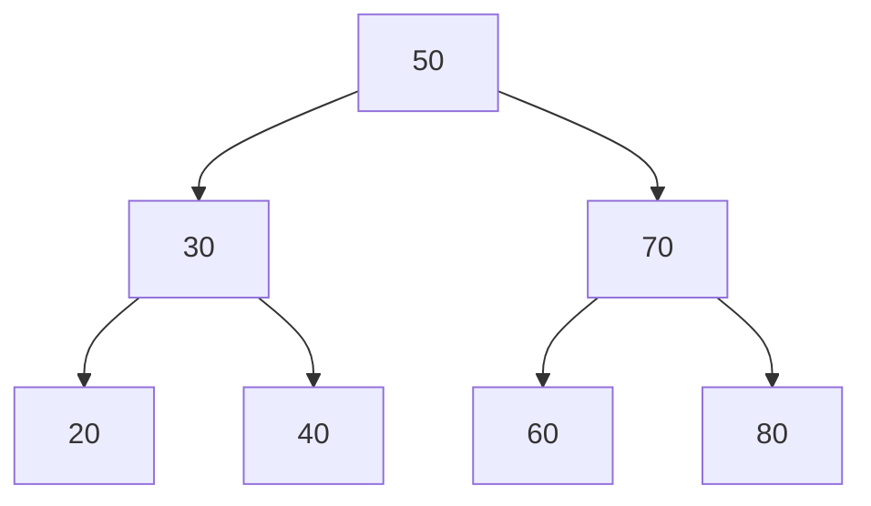

# Binary Search Trees

A **binary tree** is a tree where every node has *at most two* children, conventionally called **left** and
**right**. That alone doesn't buy you anything - it's just a shape. A **binary search tree (BST)** adds one
rule on top, and that one rule is what makes the whole thing fast to search.

## The ordering invariant

**The rule.** For *every* node in the tree: everything in its **left** subtree is smaller than it, and
everything in its **right** subtree is bigger than it. Not just its immediate children - the entire subtree
on each side.


*Everything under 50's left branch (20, 30, 40) is smaller than 50; everything under its right branch
(60, 70, 80) is bigger. The same rule holds at every node, not just the root - 30's left (20) is smaller
than 30, its right (40) is bigger.*

💡 **Key point.** This is the exact same idea as [binary search on a sorted
array](/guides/sorting-and-searching-explained/2) - "compare, then throw away half" - except the halves are
already laid out as branches instead of being computed from array indices each time.

## Searching a BST

Because of the invariant, searching is a straight walk: compare your target to the current node, and the
rule tells you which single branch could possibly contain it - go there, or stop.

```python runnable
class Node:
    def __init__(self, value):
        self.value = value
        self.left = None
        self.right = None

class BST:
    def __init__(self):
        self.root = None

    def contains(self, value):
        current = self.root
        while current is not None:
            if value == current.value:
                return True
            current = current.left if value < current.value else current.right
        return False
```
*What just happened:* at each node, `value < current.value` tells you unambiguously which branch to follow
- there's never a reason to check the other side, because the invariant guarantees your target can't be
there. That's identical to binary search discarding the half that can't contain the target.

## Inserting into a BST

Insertion walks the tree the same way search does, following the same left/right rule, until it finds an
empty spot - that's where the new node belongs.

```python runnable
class Node:
    def __init__(self, value):
        self.value = value
        self.left = None
        self.right = None

class BST:
    def __init__(self):
        self.root = None

    def insert(self, value):
        if self.root is None:
            self.root = Node(value)
            return
        current = self.root
        while True:
            if value < current.value:
                if current.left is None:
                    current.left = Node(value)
                    return
                current = current.left
            else:
                if current.right is None:
                    current.right = Node(value)
                    return
                current = current.right

    def contains(self, value):
        current = self.root
        while current is not None:
            if value == current.value:
                return True
            current = current.left if value < current.value else current.right
        return False

tree = BST()
for n in [50, 30, 70, 20, 40, 60, 80]:
    tree.insert(n)

print(tree.contains(40))
print(tree.contains(90))
```
```console
True
False
```
*What just happened:* inserting `30` after `50` compares `30 < 50`, goes left, finds nothing there yet, and
plants it. Inserting `20` next compares `20 < 50` (go left), then `20 < 30` (go left again), then plants it
as `30`'s left child. Every insert is the same walk-and-place pattern, and it's what builds the shape from
the diagram above out of a plain list of numbers.

⚠️ **Gotcha.** Equal values need a rule too, even though the diagram above has none. This implementation
sends anything not strictly less than the current node to the *right* (`value < current.value` is the only
check, so equal values fall into the `else`), which means duplicates are allowed and always land in the right
subtree. That's a reasonable default - just be consistent, since search relies on it.

## Why this is fast

Search and insert both do the same thing: at each node, one comparison eliminates an entire subtree. On a
**balanced** tree - one where each subtree is roughly the same size - that's `O(log n)`, exactly like binary
search: every step throws away about half the remaining nodes.

```quiz
[
  {
    "q": "What is the ordering invariant of a binary search tree?",
    "choices": ["Every node has exactly two children", "A node's entire left subtree is smaller than it; its entire right subtree is bigger", "The tree must be perfectly balanced", "Leaves must all be at the same depth"],
    "answer": 1,
    "explain": "That rule holds at every node, not just the root - it's what lets a single comparison eliminate an entire subtree."
  },
  {
    "q": "Why does a BST search only ever go one direction (left or right) at each node?",
    "choices": ["It checks both and picks the faster one", "The ordering invariant guarantees the target can't be on the other side", "It's a limitation, not a feature", "BSTs don't actually support search"],
    "answer": 1,
    "explain": "Because every value in the wrong-side subtree is guaranteed to be on the wrong side of the target, checking it would be wasted work."
  },
  {
    "q": "In the insert algorithm, what determines where a new value ends up?",
    "choices": ["It's always added as the root's direct child", "Walking left/right by the same comparison rule as search, until an empty spot is found", "A random position", "It's inserted at the deepest leaf, regardless of value"],
    "answer": 1,
    "explain": "Insert follows the exact same left/right walk as search - it just keeps going until it hits an empty spot, which is where the new node belongs."
  }
]
```

---

[← Phase 1: What a Tree Is](01-what-a-tree-is.md) · [Guide overview](_guide.md) · [Phase 3: BST Performance & Gotchas →](03-bst-performance-and-gotchas.md)
