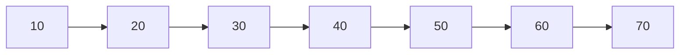

# BST Performance & Gotchas

Phase 2 showed why a BST search is fast: each comparison eliminates an entire subtree. That's true *if* the
tree is roughly balanced - similar-sized subtrees on each side. It quietly stops being true depending on the
order you insert values in, and that's the gotcha this phase is about.

## The good case: balanced

Insert `[50, 30, 70, 20, 40, 60, 80]` and you get the same tree from Phase 2 - each level roughly halves the
remaining nodes, so its height stays small.

```python runnable
class Node:
    def __init__(self, value):
        self.value = value
        self.left = None
        self.right = None

class BST:
    def __init__(self):
        self.root = None

    def insert(self, value):
        if self.root is None:
            self.root = Node(value)
            return
        current = self.root
        while True:
            if value < current.value:
                if current.left is None:
                    current.left = Node(value)
                    return
                current = current.left
            else:
                if current.right is None:
                    current.right = Node(value)
                    return
                current = current.right

def height(node):
    if node is None:
        return -1
    return 1 + max(height(node.left), height(node.right))

balanced = BST()
for n in [50, 30, 70, 20, 40, 60, 80]:
    balanced.insert(n)
print("balanced height:", height(balanced.root))
```
```console
balanced height: 2
```
*What just happened:* 7 values, and the tree is only 2 levels tall past the root - each level packs roughly
twice as many nodes as the one above it, which is exactly the `log₂(n)` shape from
[Sorting & Searching, Explained](/guides/sorting-and-searching-explained). Search or insert here costs at
most 3 comparisons, no matter which of the 7 values you're after.

## The gotcha: already-sorted input degenerates the tree

**What it actually is.** Insert always walks right when a value is bigger. Feed it values that are already
in sorted order, and *every single insert* goes the same direction - the "tree" becomes a straight chain.

```python runnable
degenerate = BST()
for n in [10, 20, 30, 40, 50, 60, 70]:
    degenerate.insert(n)
print("degenerate height:", height(degenerate.root))
```
```console
degenerate height: 6
```
*What just happened:* same 7 values, same code, but sorted input means each new value is always bigger than
everything before it - it always becomes the new rightmost node's right child. The tree is now a chain 6
levels deep, and searching for `70` means walking through all 7 nodes one at a time. That's `O(n)`, no
better than [linear search](/guides/sorting-and-searching-explained) on a plain list - the tree structure
bought you nothing.


*A binary search tree built from already-sorted input, drawn as what it actually is: a linked list with
extra steps.*

⚠️ **Gotcha.** A plain BST's speed depends entirely on insertion order, not just on the values themselves.
The same 7 numbers produce a fast `O(log n)` tree or a slow `O(n)` chain depending on nothing but the order
you handed them in - and sorted (or nearly sorted) input, which is common in real data, is the *worst* order
you could pick.

## The fix: self-balancing trees

**What it actually is.** A **self-balancing tree** (AVL trees, red-black trees) adds bookkeeping on every
insert: if one side ever grows too much taller than the other, it performs a **rotation** - a local
restructuring that shortens the tall side without breaking the ordering invariant. The result stays
`O(log n)` no matter what order you insert in.

You won't usually implement one by hand - production databases and language standard libraries already do
(Java's `TreeMap`, C++'s `std::map`, and database indexes are typically self-balancing trees under the
hood). What matters here is the intuition: **a plain BST is only as fast as its shape**, and that shape is
an accident of insertion order unless something actively corrects it.

## Recap

1. A BST is `O(log n)` when **balanced** - each subtree roughly half the size of its parent.
2. Inserting already-sorted (or nearly sorted) data can degrade a BST into a chain: `O(n)`, same as a linear
   scan.
3. The tree's speed depends on **insertion order**, not just which values it holds.
4. **Self-balancing trees** (AVL, red-black) fix this with rotations that keep the tree balanced automatically
   - the reason real-world sorted-map implementations stay fast regardless of insert order.

```quiz
[
  {
    "q": "Why does inserting values in already-sorted order produce a bad BST?",
    "choices": ["Sorted values can't be inserted at all", "Every insert goes the same direction, producing a straight chain instead of a branching tree", "It causes duplicate values", "It only affects search, not insert"],
    "answer": 1,
    "explain": "If every new value is bigger than everything before it, it always becomes the rightmost node's right child - height grows by one with every insert."
  },
  {
    "q": "What is the search cost on a degenerate (chain-shaped) BST with n nodes?",
    "choices": ["O(1)", "O(log n)", "O(n) - no better than a linear scan", "O(n²)"],
    "answer": 2,
    "explain": "A chain-shaped tree has to be walked one node at a time from the root to find a value near the end, which is the same cost as scanning a plain list."
  },
  {
    "q": "What do self-balancing trees (AVL, red-black) add to a plain BST?",
    "choices": ["Faster hardware requirements", "Automatic rotations on insert that keep the tree height roughly log(n) regardless of insertion order", "The ability to store duplicate values", "A requirement that all values be pre-sorted"],
    "answer": 1,
    "explain": "Rotations restructure the tree locally after an insert to prevent one side from growing too tall, guaranteeing O(log n) even on adversarial input order."
  }
]
```

---

[← Phase 2: Binary Search Trees](02-binary-search-trees.md) · [Guide overview](_guide.md)
