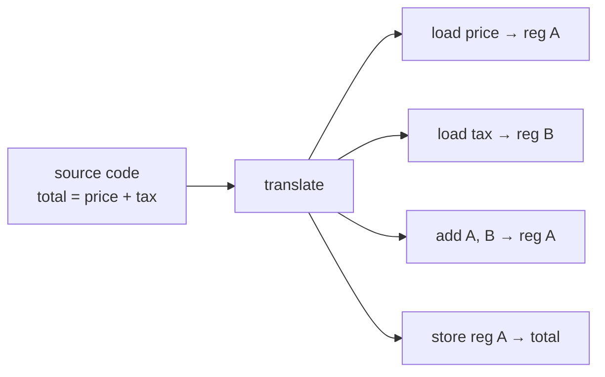

# From Source Code to Something the Machine Runs

Open one of your program files in a text editor and look at it. It's text — letters, numbers, brackets, indentation. You could print it on paper. Nothing about it physically *does* anything; it's a description, written for a human to read and for a machine to be told about.

Now here's the gap nobody points out: **the CPU — the chip actually doing the work — cannot read that text.** It has no idea what `print`, `if`, or `def` mean. The CPU understands one thing: a stream of extremely simple, numeric instructions ("add these two numbers," "copy this value here," "jump to that spot"). That's its entire vocabulary. So *something* has to stand between the words you wrote and the instructions the chip can run. This phase is about what that something is.

## What your code actually is, and what the machine actually runs

**What source code actually is.** Your `.py`, `.js`, `.go`, or `.c` file is **source code**: text written in a programming language, designed to be readable by people. It's the *source* — the original, human-friendly description of what you want to happen.

📝 **Terminology.** *Source code* = the human-readable text you write. *Machine code* = the raw numeric instructions a specific CPU can execute directly. They are two completely different things; one has to become the other before anything runs.

**What the machine runs.** The CPU runs **machine code**: a long sequence of tiny instructions, encoded as numbers, that match that exact kind of chip. Machine code is not readable in any practical sense — it's the opposite end of the spectrum from your source. Here's the contrast, made concrete:



One readable line on the left can become several machine instructions on the right. The translation from one to the other is the job we're about to meet — and there are two ways to do it.

💡 **Key point.** Every program, in every language, has to cross this same gap: from human-readable source to machine-runnable instructions. The whole "compiled vs. interpreted" debate is just a debate about *when* and *how* that crossing happens.

## The two ways across the gap

There are two strategies for turning your source code into something that runs. They're easiest to understand by analogy.

Imagine you wrote a book in English and need it read aloud to a French-speaking audience.

- **Strategy one: translate the whole book ahead of time.** A translator sits down, converts the entire book into French, and prints it. Later, anyone can read the French copy aloud, fast, as many times as they like — the translation work is already done. This is **compiling**.
- **Strategy two: bring a live interpreter to the reading.** No French copy exists. As you read each English sentence, the interpreter speaks the French version on the spot. It works immediately, with no upfront print job — but the interpreter has to be present every single time, translating as you go. This is **interpreting**.

Both get the story to the French audience. They just pay the translation cost at different moments.

## The compiler: translate-ahead

**What it actually is.** A **compiler** is a program that takes your *entire* source file and translates it, all at once, *before* the program ever runs, into machine code (or something close to it). The output is a separate, ready-to-run file — an **executable**.

📝 **Terminology.** A *compiler* translates whole source code into machine code ahead of time. An *executable* (a `.exe` on Windows, or a plain binary on macOS/Linux) is the resulting file of machine code you can run directly.

Languages that work this way include **Go, Rust, and C**.

**What it does in real life.** You run the compiler once. It chews through your code, reports any errors it finds, and — if all is well — hands you an executable. From then on, running your program means running *that file*; the compiler isn't involved anymore.

```console
$ go build hello.go
$ ls
hello       hello.go
$ ./hello
Hello, world!
```
*What just happened:* `go build` was the compiler. It read your source file `hello.go` and produced a new file, `hello` — that's the executable, a bundle of machine code for your kind of computer. Running `./hello` ran *that file* directly on the CPU. The `.go` source wasn't consulted at all; the translation already happened during `go build`.

**The trade-off.** Because the translation is done up front, the program starts and runs fast — there's no translating happening while it runs. The cost is paid earlier: you have to compile before you can run (a step that takes time on big projects), and the executable is built for one kind of machine, so a binary compiled for Windows won't run on a Mac.

## The interpreter: translate-as-you-go

**What it actually is.** An **interpreter** is a program that reads your source code and runs it *directly*, working through it piece by piece, translating-and-executing as it goes. There's no separate executable produced ahead of time — the interpreter is doing the translation live, every time the program runs.

📝 **Terminology.** An *interpreter* reads and executes source code on the fly, a piece at a time, rather than translating the whole thing into a standalone executable first.

Languages commonly run this way include **Python and JavaScript**.

**What it does in real life.** You hand your source file straight to the interpreter, and it starts running it immediately — no build step.

```console
$ python hello.py
Hello, world!
```
*What just happened:* `python` is the interpreter. It read `hello.py` and ran it on the spot — figuring out what each line means and doing it, line by line, right then. Nothing was pre-translated into a separate machine-code file; the interpreter (`python` itself) stayed in charge the whole time the program ran. That's why `python` has to be installed for the program to run at all.

**The trade-off.** You get to run code instantly — edit, run, edit, run, with no waiting on a build. That fast feedback loop is a real pleasure. The cost is that the translating happens *while the program runs*, over and over, so the same work tends to run slower than the compiled version, where the translation was done once, in advance.

⚠️ **Gotcha — "compiled" and "interpreted" describe how a language is *usually run*, not a law of nature.** The same language can often be run either way, and many modern languages blur the line (some interpreters compile hot code to machine instructions while running, a technique called just-in-time compilation). So when someone says "Python is interpreted," hear it as "Python is normally run by an interpreter," not "Python can only ever be interpreted." Don't over-trust the label.

## The honest comparison

Neither approach is "better" — they're optimized for different moments. Here's both sides, plainly:

```text
                      COMPILED (translate-ahead)      INTERPRETED (translate-as-you-go)
                      e.g. Go, Rust, C                e.g. Python, JavaScript
   ──────────────────────────────────────────────────────────────────────────────────
   When it translates   once, before running          continuously, while running
   Build step?          yes — compile first           no — run the source directly
   Startup / run speed   typically faster              typically slower
   Feedback loop        slower (wait to build)         fast (edit, run, repeat)
   What you ship        an executable (machine code)   the source + an interpreter
   Runs where?          one CPU/OS it was built for    anywhere the interpreter exists
```

The single thing driving every row is *when the translation happens*. Pull that thread and the rest follows.

🪖 **War story.** A teammate switched a small data script from Python to Go "for the speed" and was baffled when, for their tiny one-second job, it didn't feel faster to *use* — they'd added a compile step to their workflow and the script was too short for the runtime speed-up to matter. Compiled-vs-interpreted isn't "fast vs slow" in the abstract; it's a trade about *where the time goes*. For a quick script you run once, the interpreter's instant start often wins. For a program that runs hard for hours, the compiler's upfront work pays off.

## Recap

1. Your **source code** is human-readable text. The **CPU** only runs **machine code** — tiny numeric instructions. Something must translate one into the other.
2. A **compiler** translates the *whole* program ahead of time into an **executable**, then steps out of the way (Go, Rust, C).
3. An **interpreter** translates *and runs* your source as it goes, every time, with no separate executable (Python, JavaScript).
4. The trade-off is all about **when** translation happens: compiled gives faster runs but needs a build step; interpreted gives instant feedback but does its translating live.
5. "Compiled" / "interpreted" describe how a language is *usually run*, not an unbreakable rule.

Now you know how your text becomes runnable instructions. Next question: once those instructions start running, the values they work with — your numbers, your text, your lists — have to *live* somewhere. Let's look at where.

---

[← Guide overview](_guide.md) · [Phase 2: Where Your Data Lives — the Stack & the Heap →](02-stack-and-heap.md)
