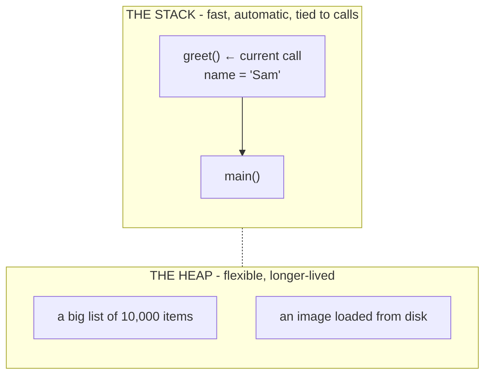
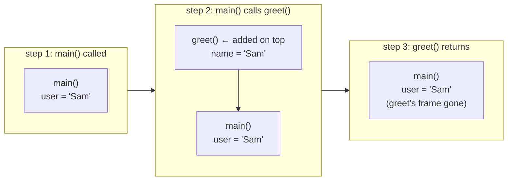

# Where Your Data Lives: the Stack & the Heap

In the last phase, your code became machine instructions that the CPU runs. But those instructions are constantly working with *values* - a number you added, a name you stored, a list you built. Each value has to physically sit somewhere while the program runs, and that somewhere is your computer's memory (RAM).

Here's the part almost never explained to beginners: that memory isn't one undifferentiated blob. While your program runs, it organizes its data into two distinct regions with two different personalities - the **stack** and the **heap**. You don't usually manage them by hand (in most languages the system handles it for you), but knowing they exist explains a whole category of behavior and a famous crash.

## The two regions, side by side

Picture the memory your running program is handed. Two areas matter here:



They solve two different problems. The stack is for the short-lived, predictable bookkeeping of function calls. The heap is for everything that needs to stick around or grow. Let's take them one at a time.

## The stack: fast, automatic, tied to function calls

**What it actually is.** The **stack** is a region of memory that grows and shrinks in a strict, orderly way as your functions call each other. Every time a function is called, the program adds a little block on top of the stack - a **stack frame** - to hold that function's local variables. When the function finishes and returns, its frame is removed, instantly and automatically.

📝 **Terminology.** A *stack frame* is the chunk of stack memory belonging to one function call: its local variables and the bookkeeping needed to return to whoever called it. "Stack" is the right word - like a stack of plates, you add and remove only from the top.

**What it does in real life.** Consider this little chain of calls:

```python runnable
def greet(name):
    message = "Hi " + name   # `name` and `message` live in greet's stack frame
    return message

def main():
    user = "Sam"             # `user` lives in main's stack frame
    print(greet(user))

main()
```

As this runs, the stack changes shape:


*What just happened:* Calling `greet` pushed a new frame on top of the stack, holding its local variables (`name`, `message`). The moment `greet` returned, that whole frame was discarded automatically - no cleanup code from you. That automatic add-on-call, remove-on-return is why the stack is fast and why you never have to think about freeing a local variable.

💡 **Key point.** Stack memory is *automatic*: a local variable lives exactly as long as its function call, then vanishes on its own when the function returns. You get this for free.

## The heap: flexible, for things that outlive a function

**What it actually is.** The **heap** is a separate region for data that can't follow the tidy add-and-remove-from-the-top rhythm of the stack - usually because it needs to **outlive** the function that created it, or because its size isn't known in advance, or it's large.

📝 **Terminology.** The *heap* is the region of memory used for longer-lived or dynamically-sized data. Unlike the stack, items here don't disappear just because a function returned - they persist until something decides they're no longer needed.

**What it does in real life.** Suppose a function builds a list and hands it back to its caller:

```python
def load_scores():
    scores = [10, 20, 30, ... ]   # a list, big and dynamic → lives on the heap
    return scores                 # the list survives after load_scores returns

results = load_scores()           # `results` now uses that same heap data
```
*What just happened:* The list can't live on `load_scores`'s stack frame, because that frame is destroyed the instant the function returns - yet the caller still needs the list. So the list lives on the **heap**, which outlasts the function call. The function returns a reference to it, and `results` uses it afterward. The heap is what makes "create something here, use it over there, later" possible.

**The trade-off.** The heap's flexibility has a cost: nothing automatically removes heap data when a function returns. *Something* has to decide when heap data is finished with and reclaim that space, or the program slowly eats memory it can never get back. In many languages (Python, JavaScript, Go, Java) an automatic **garbage collector** handles this for you; in others (C, Rust) it's managed differently. How heap memory gets cleaned up is its own guide: [Memory & Garbage Collection](/guides/memory-and-garbage-collection).

## ⚠️ "Stack overflow" - a real, specific thing

You've seen the name on a famous website, but **stack overflow** is a genuine error with a precise cause, and the stack you just learned about is exactly what overflows.

The stack is fast partly because it's *limited in size* - the system sets aside a fixed, fairly small amount of memory for it. Every function call adds a frame on top, so what happens if functions keep calling, deeper and deeper, without ever returning? The frames pile up... and eventually run past the edge of the space reserved for the stack. That's a **stack overflow**: the stack grew beyond its limit, and the program is killed on the spot.

The classic way to cause it is **recursion** - a function that calls itself - with no stopping condition:

```python
def countdown(n):
    print(n)
    countdown(n - 1)   # calls itself forever - no base case to stop it

countdown(5)
```

```console
$ python countdown.py
5
4
3
...
-9994
-9995
  File "countdown.py", line 3, in countdown
    countdown(n - 1)
RecursionError: maximum recursion depth exceeded
```
*What just happened:* Each call to `countdown` added another stack frame, and the function never returned, so the frames never got removed - they just kept piling up. Once they crossed the stack's size limit, the program stopped with a recursion/stack error. (Python raises a clean `RecursionError`; lower-level languages like C may crash harder with a literal "stack overflow.") The data wasn't corrupted - the program ran *out of stack room*.

⚠️ **Gotcha.** The fix for a stack overflow from recursion is almost never "ask for a bigger stack." It's to make sure recursion actually *stops* - every self-calling function needs a **base case**, a condition where it returns instead of calling itself again. Here, `countdown` should stop at, say, `if n < 0: return`. Bottomless recursion is the cause; a proper stopping point is the cure.

## Recap

1. While your program runs, every value lives in memory - and that memory is organized into two regions, the **stack** and the **heap**.
2. The **stack** holds each function call's local variables in a **stack frame**, added on call and removed on return - automatic, orderly, and fast.
3. The **heap** holds data that must **outlive** the function that made it, or that's large or dynamically sized - flexible, but it must be cleaned up rather than vanishing on its own.
4. **Stack overflow** is a real error: function calls pile up frames faster than they're removed (classically, bottomless recursion) until the stack exceeds its size limit and the program dies.
5. The cure for runaway recursion is a **base case** that lets it stop - not a bigger stack.

You now know how code is translated, and where its data lives while it runs. The last piece is the one wrapping all of it: what does it actually *mean* for a program to be "running"? Let's connect the whole chain.

Watch it animated: [the stack and the heap](/explainers/StackHeap.dc.html)

---

[← Guide overview](_guide.md) · [Phase 3: What "Running" Means →](03-what-running-means.md)
