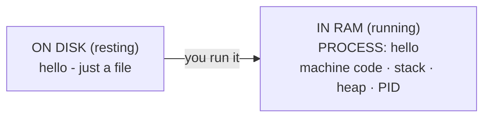
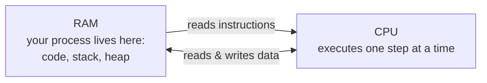
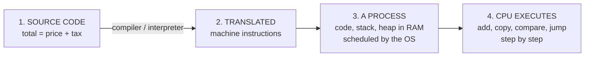

# What "Running" Means

We've followed your code a long way. It started as text. A compiler or interpreter turned it into machine instructions. Those instructions work with data that lives on the stack and the heap. But there's still a word we've been using loosely the whole time: **running**. When you double-click an app or type a command and hit Enter, what *is* the thing that comes to life? Let's give "running" a real definition and snap every piece into place.

## A running program is a process

**What it actually is.** When you start a program, the operating system takes your executable (or fires up the interpreter on your source) and creates a **process**: a living instance of that program, loaded into memory and being executed. The file on disk is *potential*; the process is the program *actually happening*.

📝 **Terminology.** A *process* is a program in the act of running - its instructions loaded into RAM, its stack and heap set up, and an identity the operating system tracks. The same program can run as several processes at once (think two separate browser windows from one app).

The difference is worth holding onto: your executable is like a recipe sitting in a cookbook. A process is what exists when someone is *actually cooking it* - ingredients out, pots on the stove, the kitchen busy. One recipe, but you could cook it twice at once in two kitchens.

## RAM is the workspace; the CPU does the work

Two pieces of hardware do the heavy lifting for a running process, and they have clearly different jobs.

**RAM is where the process lives while it runs.** Its machine instructions, its stack, its heap - all of it sits in **RAM** (random-access memory), the computer's fast working memory. This is *why* a program has to be loaded before it runs: it's copied from slow long-term storage (your disk) into fast working memory where the CPU can reach it quickly. The difference between RAM and disk, and why it matters so much, is its own topic: [CPU, RAM & Storage](/guides/cpu-ram-and-storage).

**The CPU is what actually executes the instructions.** The **CPU** (the processor) is the part that does the work: it reads your process's machine instructions from RAM, one after another, and carries each one out - add these, copy that, compare, jump. This is the literal meaning of "the code is running": the CPU is stepping through your translated instructions, in order, doing exactly what each one says.

## The OS schedules your process onto the CPU

Here's the fact that surprises people: your process is almost never running *continuously*. Your computer has dozens - often hundreds - of processes alive at once, but only a handful of CPU cores to run them on, so they can't all run at the same instant.

**What the OS does in real life.** The operating system acts as a scheduler. It gives your process a slice of the CPU, lets it run for a tiny moment, then pauses it and hands the CPU to another process, and another - cycling through all of them so fast it *looks* like everything runs at once. Your program experiences this as "running," even though, zoomed in, it's running in rapid bursts with pauses in between.

*Over a few milliseconds, one CPU core hands its time around in quick slices - your process gets the CPU in bursts, not all at once.*

This juggling act - how the OS decides who runs when, and how to read a machine that feels "stuck" - is a rich topic on its own. When you're ready to go deeper into processes, scheduling, and what "100% CPU" really means, that's [Processes, Memory & the CPU](/guides/processes-memory-and-cpu).

💡 **Key point.** "Running" doesn't mean your program owns the machine. It means the OS has made it a **process** and is repeatedly scheduling it onto the **CPU** for short turns, while the process's code and data sit in **RAM**.

## The whole chain, in one picture

Now every piece from this guide connects. From the text you typed to the work the chip does:

Read left to right, that's the answer to the question this whole guide asked. **Source code** is text you write. A **compiler or interpreter** translates it into **machine instructions** ([Phase 1](01-source-to-machine.md)). To run, those instructions and their data are loaded into **RAM**, organized into **stack and heap** ([Phase 2](02-stack-and-heap.md)), as a **process** the OS **schedules onto the CPU**, which **executes** them one step at a time. No magic anywhere in the line - just a handoff from human-readable words to a chip doing simple things very fast.

⚠️ **Gotcha - "my program finished" doesn't mean its memory cleaned itself up mid-run.** While a process runs, the heap memory it allocates isn't automatically reclaimed the way stack frames are. If long-running programs keep grabbing heap memory and never letting go, they slowly consume RAM - a *memory leak*. How memory gets reclaimed (and the garbage collectors that automate it) is the natural next step: [Memory & Garbage Collection](/guides/memory-and-garbage-collection).

## Recap

1. A **process** is a program *actually running* - loaded into memory and being executed - as opposed to the resting executable file on disk.
2. While running, a process lives in **RAM** (its code, stack, and heap), because that's the fast working memory the CPU can reach quickly.
3. The **CPU** does the real work: it reads the process's machine instructions from RAM and executes them one step at a time.
4. The **OS schedules** your process onto the CPU in rapid slices, sharing the chip among the many processes alive at once - which is what "running" actually feels like from the outside.
5. The full chain: **source code → translated to machine instructions → loaded as a process into RAM → executed step by step by the CPU.**

That's the whole journey, end to end. From here, three neighbors go deeper into single links of the chain: [Processes, Memory & the CPU](/guides/processes-memory-and-cpu) for how the OS juggles running programs, [CPU, RAM & Storage](/guides/cpu-ram-and-storage) for the hardware underneath, and [Memory & Garbage Collection](/guides/memory-and-garbage-collection) for how a running program's memory is cleaned up.

---

[← Guide overview](_guide.md) · [Phase 2: Where Your Data Lives ←](02-stack-and-heap.md)
