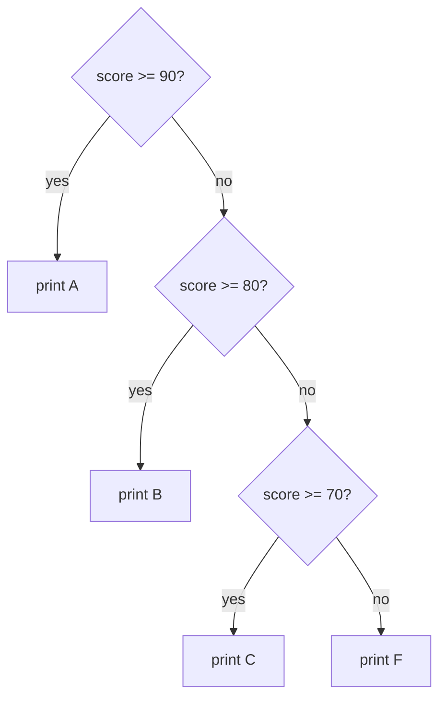
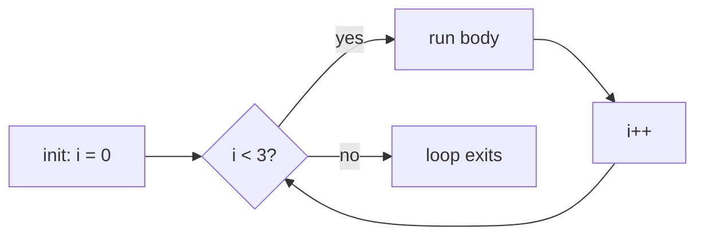

# Control Flow

Right now, a C program you write runs exactly one way: top to bottom, one line after another, no
decisions, no repetition. That's true but useless - almost nothing you actually want to build works
that way. You need to skip code when a condition is false, repeat code while something holds, and choose
between several paths. That's control flow, and it's the last piece you need before your programs can
actually *do* something interesting.

## The mental model: the program counter takes detours

**What it actually is.** Underneath, the CPU has a program counter - a register holding the address of
the next instruction to run. By default it just increments: run this line, move to the next, run that
one, move to the next. Every control flow construct in C - `if`, `while`, `for`, `switch` - compiles down
to one thing: an instruction that changes the program counter based on a condition, instead of letting it
fall through to the next line. `if (x > 0) { ... }` is, underneath, "check `x > 0`; if false, jump past
this block." A `while` loop is "check the condition; if false, jump past the loop; otherwise run the body,
then jump *back* to the check."

Once you see it that way, none of these keywords are separate magic - they're just different shapes of
"conditionally jump."

## Truthiness in C: there's no real boolean

**What it actually is.** Before you write a single `if`, you need to know what C considers "true." In
plain C, there is no readable boolean type until you `#include <stdbool.h>`. Every condition is just an integer expression: **`0`
means false, and any nonzero value means true.** `if (5)` is true. `if (-1)` is true. `if (0)` is the only
way to get false.

**Why people get this wrong.** Coming from a language with a real `bool`, it's tempting to assume C has
one too, and to write `if (x = 1)` meaning `if (x == 1)`, which we'll get to below - it compiles, it just
doesn't mean what you think.

📝 **Terminology.** C99 (a 1999 revision of the language) added `#include <stdbool.h>`, which gives you
`bool`, `true`, and `false` as readable names. Under the hood `bool` is still just a small integer and
`true`/`false` are still `1`/`0` - the header is a readability convenience, not a new type of value. Most
modern C code includes it; we will too from here on.

```c
#include <stdio.h>
#include <stdbool.h>

int main(void) {
    bool is_ready = true;
    if (is_ready) {
        printf("go\n");
    }
    return 0;
}
```
```console
$ gcc -Wall -o prog prog.c && ./prog
go
```
*What just happened:* `is_ready` holds `1` (that's all `true` is). `if (is_ready)` checks "is this
nonzero?" - it is, so the block runs.

## `if` / `else if` / `else`

**What it does in real life.** C checks conditions top to bottom and runs the *first* branch whose
condition is true, skipping the rest entirely.

```c
int score = 72;

if (score >= 90) {
    printf("A\n");
} else if (score >= 80) {
    printf("B\n");
} else if (score >= 70) {
    printf("C\n");
} else {
    printf("F\n");
}
```
```console
$ gcc -Wall -o prog prog.c && ./prog
C
```
*What just happened:* C checked `score >= 90` (false), then `score >= 80` (false), then `score >= 70`
(true) - printed `C` and skipped `else`. It never even looks at branches after the first true one.



⚠️ **The gotcha that bites everyone once: `=` vs `==`.** `=` assigns; `==` compares. Both are valid inside
an `if`'s parentheses, so the compiler won't stop you from typing the wrong one.

```c
int x = 0;
if (x = 5) {          // assigns 5 to x, then checks "is 5 truthy?" - yes, always
    printf("this always runs\n");
}
```
```console
$ gcc -Wall -o prog prog.c && ./prog
prog.c:2:9: warning: suggest parentheses around assignment used as truth value [-Wparentheses]
    2 |     if (x = 5) {
      |         ~~^~~
this always runs
```
*What just happened:* `x = 5` is itself an expression that evaluates to `5` (the value just assigned),
and `5` is nonzero, so the branch runs *every time*, and `x` has silently been overwritten. `-Wall` (which
you should always compile with) catches this and warns you - don't ignore that warning.

⚠️ **The dangling-else gotcha.** Without braces, `else` always binds to the *nearest* unmatched `if`, which
is not always the one that lines up visually:

```c
if (a > 0)
    if (b > 0)
        printf("both positive\n");
else
    printf("a is not positive\n");   // misleading indentation!
```

Despite the indentation, that `else` belongs to `if (b > 0)`, not `if (a > 0)` - so if `a` is `-1`, this
prints *nothing at all*. **Why this saves you later:** always write braces on multi-statement or nested
`if`s, even when C doesn't require them. It costs you two characters and removes an entire category of bug.

## Loops: `while`, `do-while`, `for`

**What it actually is.** All three loops are the same idea - repeat a block while a condition holds - with
different places for the setup and the check.

**`while`** checks the condition *before* every iteration, including the first:

```c
int n = 3;
while (n > 0) {
    printf("%d\n", n);
    n--;
}
```
```console
$ gcc -Wall -o prog prog.c && ./prog
3
2
1
```

**`do-while`** checks *after* the body, so the body always runs at least once - useful for things like
"prompt the user, then re-prompt while their input is bad":

```c
int n = 0;
do {
    printf("ran once even though n starts at 0\n");
} while (n > 0);
```
```console
$ gcc -Wall -o prog prog.c && ./prog
ran once even though n starts at 0
```

**`for`** bundles init, condition, and post-step into one line - it's the loop you reach for when you know
how many times you're iterating:

```c
for (int i = 0; i < 3; i++) {
    printf("%d\n", i);
}
```
```console
$ gcc -Wall -o prog prog.c && ./prog
0
1
2
```



*What just happened:* `int i = 0` runs once, before anything else. Then C checks `i < 3`; if true, it
runs the body, runs `i++`, and checks the condition again. It exits the moment the check fails - the body
never runs a fourth time.

⚠️ **The gotcha that costs people an hour: a stray semicolon.** This compiles cleanly and silently loops
forever, doing nothing:

```c
int n = 0;
while (n < 5);      // <-- that semicolon is the entire loop body!
{
    printf("n is %d\n", n);   // this block is NOT part of the loop
    n++;
}
```

The `;` right after `while (n < 5)` *is* the loop body - an empty statement that does nothing, checked
forever, since `n` never changes. The `{ ... }` that follows just runs once, separately, after the (never
happening) loop ends. This is one of the most common "my program hung" bugs in C, and the fix is simply:
never put a semicolon directly after a loop's condition unless you mean an empty body on purpose.

## `break` and `continue`

`break` exits the nearest loop (or `switch`) immediately. `continue` skips straight to the next iteration's
condition check (in a `for` loop, the update step - like `i++` - runs first), without running the rest of the body.

```c
for (int i = 0; i < 10; i++) {
    if (i == 3) continue;   // skip printing 3
    if (i == 6) break;      // stop entirely at 6
    printf("%d\n", i);
}
```
```console
$ gcc -Wall -o prog prog.c && ./prog
0
1
2
4
5
```
*What just happened:* at `i == 3`, `continue` jumped straight back to `i++` and the condition check,
skipping the `printf`. At `i == 6`, `break` left the loop entirely - `4` and `5` printed, but nothing from
`6` onward.

## `switch`: choosing between many exact values

**What it actually is.** `switch` compares one value against a list of exact constants and jumps to the
matching `case`. It exists (rather than everyone just writing a chain of `else if`s) because a compiler can
often turn a `switch` on a dense range of values into a *jump table* - one lookup straight to the right
code, instead of testing conditions one by one. That's the design trade-off: `switch` is less flexible than
`if`/`else if` (only exact-value matches, no ranges or `>`/`<`) in exchange for being potentially faster.

**The gotcha that defines this construct: fallthrough.** Unlike `if`/`else if`, a `switch` does *not* stop
after the matching case - it keeps running every case *below* it too, until it hits a `break` or the end
of the block.

```c
int day = 6;

switch (day) {
    case 6:
        printf("Saturday\n");
    case 7:
        printf("Sunday\n");
        break;
    default:
        printf("Weekday\n");
}
```
```console
$ gcc -Wall -o prog prog.c && ./prog
Saturday
Sunday
```
*What just happened:* `day` matched `case 6`, printed `Saturday`, and because that `case` has no `break`,
execution fell straight through into `case 7` and printed `Sunday` too, only stopping at *its* `break`.
This is intentional C behavior, not a bug in the language - but forgetting a `break` when you didn't mean
to fall through is one of the most common `switch` mistakes there is. **Why this saves you later:** when
you write a `switch`, put a `break` at the end of every case unless you are deliberately using
fallthrough (and if you are, a `// falls through` comment tells the next reader it's on purpose).

## Short-circuit evaluation: `&&` and `||`

**What it does in real life.** C evaluates `&&` and `||` left to right and stops as soon as the overall
result is decided - it never evaluates the right side if the left side already settled the answer.

```c
int *p = NULL;

if (p != NULL && *p > 0) {
    printf("positive\n");
}
```
```console
$ gcc -Wall -o prog prog.c && ./prog
$
```
*What just happened:* nothing printed, and nothing crashed. `p != NULL` was false, and because `&&` short-
circuits, C never evaluated `*p > 0` at all - it skipped dereferencing a null pointer, which would have
crashed the program. This pattern (checking a pointer is valid *before* using it, in the same `if`, relying
on short-circuiting) is everywhere in real C code. `||` short-circuits the same way in the other direction:
if the left side is already true, the right side never runs.

## Recap

1. Every control flow construct is a conditional jump on the program counter - `if`, `while`, `for`, and
   `switch` are all shapes of the same idea.
2. C has no true boolean at its core: `0` is false, anything else is true. `stdbool.h` gives you readable
   names for the same integers.
3. `if`/`else if`/`else` runs the first true branch and skips the rest; always brace nested `if`s to avoid
   the dangling-else trap.
4. `=` inside a condition assigns and is (almost) always a bug - `-Wall` will warn you, so always compile
   with it.
5. `while` checks before the body, `do-while` checks after (so it runs at least once), `for` bundles
   init/condition/post into one line.
6. A semicolon right after a loop's condition creates an empty body and an infinite, do-nothing loop.
7. `switch` falls through every case below the match unless you `break` - useful on purpose sometimes,
   a common bug the rest of the time.
8. `&&` and `||` short-circuit, which is what makes `p != NULL && *p > 0` safe.

Test yourself on the ideas that trip people up most in this phase:

```quiz
[
  {
    "q": "What happens when you compile and run `int x = 0; if (x = 5) { printf(\"yes\\n\"); }`?",
    "choices": [
      "It prints \"yes\", because `x = 5` assigns 5 to x and then evaluates to 5, which is truthy",
      "It doesn't compile, because `=` isn't allowed inside an `if`'s parentheses",
      "It prints nothing, because `x = 5` is treated as a comparison and 5 doesn't equal x's old value",
      "It's undefined behavior and could do anything"
    ],
    "answer": 0,
    "explain": "`=` assigns and the assignment expression evaluates to the value assigned; 5 is nonzero, so the branch runs every time regardless of x's prior value - this is why -Wall's warning about it matters."
  },
  {
    "q": "In a `switch` where `case 6:` matches but has no `break`, what happens next?",
    "choices": [
      "C jumps straight out of the switch, since a match was already found",
      "C keeps running the code in the cases below it until it hits a `break` or the end of the switch",
      "C raises a compile error, since every case needs a `break`",
      "C re-checks the switch value against the next case's condition before deciding whether to run it"
    ],
    "answer": 1,
    "explain": "Unlike if/else if, a matched case with no break falls through and runs every subsequent case's code unconditionally, regardless of whether their labels also match."
  },
  {
    "q": "Why does `if (p != NULL && *p > 0)` safely avoid crashing when `p` is `NULL`?",
    "choices": [
      "C evaluates both sides first and only crashes if both are true",
      "`&&` short-circuits: since `p != NULL` is false, C never evaluates `*p > 0` at all",
      "Dereferencing a NULL pointer in an `if` condition never crashes in C",
      "The compiler reorders the checks so the safer one always runs first"
    ],
    "answer": 1,
    "explain": "`&&` evaluates left to right and stops as soon as the result is decided, so a false left side skips the right side entirely - that's what makes the null-check-then-use pattern safe."
  }
]
```

---

[← Guide overview](_guide.md) · [Phase 4: Functions & Program Structure →](04-functions-and-program-structure.md)
