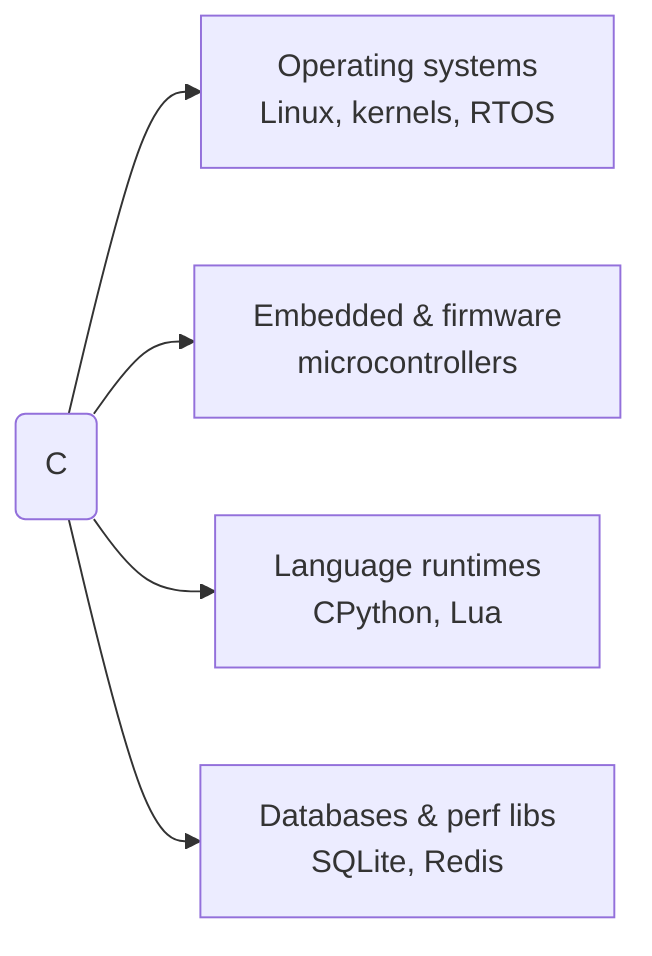

# Where to Go Next

Look at what you actually did. You started at "install a compiler" and ended at understanding *why* a dangling pointer is dangerous, *why* the stack is fast and the heap isn't free, and *why* the compiler is allowed to assume your program never triggers undefined behavior. That's not a beginner's slice of C. Most people who "know C" stop well before [Phase 11](11-the-stack-vs-the-heap.md) and [Phase 14](14-undefined-behavior-and-common-footguns.md) - you didn't.

This phase is short on purpose. You don't need another concept dumped on you. You need to know where this knowledge actually gets used, which tools turn "I think this is a memory bug" into "here's the exact line," and what to build so none of it fades.

## Where C actually shines

C didn't get old and irrelevant. It became the floor everything else stands on.

**Operating systems and kernels.** Linux, Windows' core, macOS's XNU kernel, every embedded RTOS - written in C, because an OS needs to talk to hardware directly with no runtime, no garbage collector, and no surprises about what a line of code actually does. The mental model from [Phase 11](11-the-stack-vs-the-heap.md) - you own memory, you know exactly where it lives - is the whole reason C can do this and a garbage-collected language can't.

**Embedded systems and firmware.** Microcontrollers running a thermostat, a car's engine controller, a pacemaker - these have kilobytes of RAM, no operating system underneath them, and zero tolerance for a garbage collector pausing mid-task. C's "no hidden costs" promise from [Phase 1](01-install-compiling-and-your-first-program.md) is exactly the deal embedded work needs.

**Language runtimes and interpreters.** CPython, the reference Lua interpreter, and large parts of Node's V8 engine are C or C++. When you build a language, you need to manage memory by hand and reason precisely about the machine underneath - which is the entire second half of this guide.

**Databases and performance-critical libraries.** SQLite, Redis, and the guts of PostgreSQL are C. When milliseconds and bytes matter at scale, C's directness (no hidden allocations, no hidden indirection) wins.



You are very unlikely to write a web app's UI in C in 2026. You're quite likely to depend, right now, on ten programs written in it without knowing it.

## The tools that turn theory into instinct

[Phase 9](09-build-tooling-makefiles-and-debugging.md) gave you a debugger. Two more tools are worth learning next, because they catch exactly the bugs [Phase 14](14-undefined-behavior-and-common-footguns.md) warned you about, automatically, every time you run your program.

**AddressSanitizer and UndefinedBehaviorSanitizer.** Compile with `-fsanitize=address,undefined` and your program gets a runtime bodyguard. A use-after-free or a buffer overrun aborts on the spot with a precise report - file, line, and what went wrong - instead of silently corrupting memory three functions later. A signed-integer overflow gets the same precise report, though by default UBSan prints it and keeps running (add `-fno-sanitize-recover=all` if you want those to abort too).

```c
// bug.c - one element past the end of the array
#include <stdio.h>
int main(void) {
    int arr[5] = {1, 2, 3, 4, 5};
    printf("%d\n", arr[5]);   // out of bounds - UB
    return 0;
}
```

```console
$ gcc -fsanitize=address -g bug.c -o bug
$ ./bug
==12345==ERROR: AddressSanitizer: stack-buffer-overflow on address ...
    #0 in main bug.c:5
```

Without the sanitizer this might print garbage, print `5`, or crash somewhere unrelated. With it, the bug names itself. Turn these flags on for every project you write from here forward - the cost is a slower binary, the payoff is bugs that used to take an afternoon now take a second.

**Valgrind.** Where sanitizers watch your program as it runs, Valgrind's `memcheck` tool runs your compiled binary in a simulator and catches leaked `malloc`s ([Phase 10](10-dynamic-memory-malloc-and-free.md)), reads of uninitialized memory, and invalid frees, with a full report of exactly which allocation leaked and where it was made.

## What to build next

Pick one and finish it. A small project you complete teaches you more than an ambitious one you abandon halfway through fighting the linker.

- **A dynamic array (a "vector") from scratch.** Implement `push`, `get`, and automatic growth via `realloc`. This forces you to actually use everything from [Phase 10](10-dynamic-memory-malloc-and-free.md) and [Phase 12](12-pointers-ii-arithmetic-double-and-function-point.md) in one place, and it's the exact data structure most higher-level languages hide from you.
- **A simple key-value store.** A hash table backed by linked lists for collisions, built on structs ([Phase 7](07-structs-and-typedef.md)) and pointers. It's small enough to finish in a weekend and touches nearly every idea in this guide.
- **A text adventure or a tiny shell.** Something that reads input, branches on it, and manages some state - good practice for [Phase 6](06-arrays-and-strings.md)'s string handling and [Phase 3](03-control-flow.md)'s control flow, without a memory-management deep end.

For each one: build it with a `Makefile` ([Phase 9](09-build-tooling-makefiles-and-debugging.md)), compile with `-Wall -Wextra -fsanitize=address,undefined`, and don't consider it done until it runs clean.

## Where C leads from here

If you want more safety without giving up C's directness, **C++** adds classes, RAII (automatic cleanup tied to scope, a distant cousin of what you saw in [Phase 11](11-the-stack-vs-the-heap.md)), and a much bigger standard library, while staying close enough to C that everything you just learned still applies. If you want a language that takes the memory rules you learned to respect in [Phase 14](14-undefined-behavior-and-common-footguns.md) and enforces them *at compile time* instead of trusting you to remember them, that's [Rust From Zero](/guides/rust-from-zero) - its whole "ownership" system exists to catch the exact class of bug this guide just taught you to fear.

For deeper reading, two resources are worth owning: **"The C Programming Language"** by Kernighan and Ritchie (the language's own creators, and still the clearest short book on it), and **Beej's Guide to C**, a free, precise, no-fluff reference that reads like a friendlier version of the manual pages.

## Recap

1. **Where C lives** - operating systems and kernels, embedded firmware, language runtimes, and the databases and libraries everything else is built on.
2. **Sanitizers** (`-fsanitize=address,undefined`) turn silent memory corruption into an immediate, precise crash report - turn them on for everything you write from here.
3. **Valgrind's memcheck** catches leaks and invalid memory access by running your binary in a simulator.
4. **Build one real thing** - a dynamic array, a key-value store, or a small interpreter/shell - and finish it with warnings and sanitizers on.
5. **Next languages** - C++ for more structure without leaving C behind, or [Rust](/guides/rust-from-zero) if you want the compiler to enforce the memory rules you now understand by hand.

You came in not knowing what a pointer was. You're leaving able to explain why `free`ing something twice corrupts memory, why the stack is fast, and why undefined behavior is the compiler's silent permission to assume you didn't make a mistake. That's the real skill. Go build the small thing.

## Quick check

Test yourself on the ideas that matter most for what comes after this guide:

```quiz
[
  {
    "q": "You compile with `-fsanitize=address,undefined`. What does that actually get you?",
    "choices": [
      "A runtime check that catches a memory error or undefined behavior the moment it happens and reports it with a precise file and line",
      "A static analysis pass that rewrites your code to remove undefined behavior automatically",
      "A compile-time guarantee that the program can never crash",
      "A checker that only catches memory leaks, not out-of-bounds access"
    ],
    "answer": 0,
    "explain": "Sanitizers instrument your binary so the bug is caught loudly and precisely at the moment it happens, instead of quietly corrupting memory somewhere else. A memory error aborts on the spot; UBSan reports the exact line and, by default, keeps going (use `-fno-sanitize-recover` to abort on those too). Either way they don't fix anything or guarantee correctness up front."
  },
  {
    "q": "How does Valgrind's memcheck differ from AddressSanitizer?",
    "choices": [
      "Valgrind runs your already-compiled binary inside a simulator, with no special compile flags needed, while sanitizers require compiling with `-fsanitize` to build the checks into the binary itself",
      "Valgrind only runs on Windows, sanitizers only run on Linux",
      "They do the exact same thing, so you only ever need to learn one",
      "Sanitizers work on C++ only, never on plain C"
    ],
    "answer": 0,
    "explain": "The two catch overlapping bugs but work differently: Valgrind simulates your existing binary after the fact, sanitizers bake the checks in at compile time - which is also why sanitized binaries run faster than a Valgrind session."
  },
  {
    "q": "Why does an operating system kernel get written in C instead of a garbage-collected language?",
    "choices": [
      "Because C source files compile faster than other languages",
      "Because a kernel needs to talk to hardware directly, with no runtime, no garbage collector pauses, and no hidden costs it didn't ask for",
      "Because garbage-collected languages can't be compiled to machine code",
      "Because only C has pointers"
    ],
    "answer": 1,
    "explain": "Garbage-collected languages compile to machine code just fine - the real issue is a GC's unpredictable pauses and hidden runtime, which a kernel talking directly to hardware can't tolerate. C's whole appeal here is no surprises about what a line of code costs."
  }
]
```

---

[Guide overview](_guide.md)
