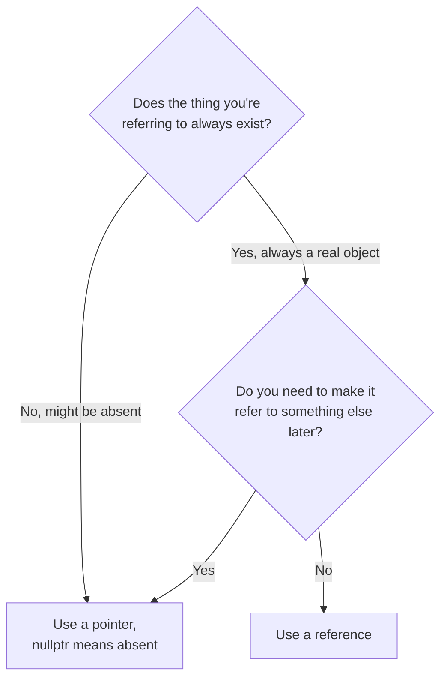

# References vs Pointers

If you came from [C From Zero](/guides/c-from-zero) or any C background, you already know pointers: a variable that holds an address, which you dereference with `*` to get at the thing it points to. C++ keeps pointers exactly as they were, but it adds a second way to refer to an existing object: the **reference**. This phase is about understanding what a reference actually is, why it exists, and - the question that trips up almost everyone at first - when to reach for which one.

## The mental model: an alias, not a variable

**What a reference actually is.** A reference is not a new object that stores an address. It is *another name for an object that already exists*. Once you write `int& r = x;`, `r` and `x` are the same variable wearing two name tags. There is no "reference object" sitting in memory that you could inspect separately from `x` - the compiler just makes `r` compile down to uses of `x` (usually implemented as a pointer under the hood, but that's an implementation detail, not part of the model).

Compare that to a pointer, which genuinely is its own variable:

```cpp
int x = 10;

int* p = &x;   // p is a variable. It holds the address of x.
int& r = x;    // r is not a variable of its own. It IS x, under another name.

*p = 20;       // "go to the address p holds, and change what's there"
r = 30;        // just... assign to r. It's x.

std::cout << x << " " << *p << " " << r << "\n";  // 30 30 30
```
```console
30 30 30
```
*What just happened:* `p` and `r` both end up letting you read and write `x`, but the *mechanism* is different. `p` is a separate variable you dereference to reach `x`. `r` has no separate identity - assigning to `r` is, semantically, assigning to `x`. That difference is the source of every rule in this phase.

## Three rules that follow directly from "a reference is an alias"

Because a reference is another name for something, not a value that can point at different things over time, three consequences fall straight out of the definition:

1. **A reference must be bound at declaration.** You can't declare `int& r;` and bind it later - there's no such thing as an unbound alias. This is a compile error, not a runtime concern.
2. **A reference can never be null.** A pointer can hold `nullptr` - "I point at nothing." A reference always refers to a real object, because it *is* that object's other name. (You can technically construct a "null reference" through undefined behavior by dereferencing a null pointer and binding a reference to the result, but that's a bug, not a feature - never rely on it.)
3. **A reference can't be reseated.** `r = y;` doesn't make `r` refer to `y` - it assigns `y`'s value into whatever `r` already refers to (`x`, in the example above). Once bound, always bound to the same object.

Pointers have none of these restrictions, and that's exactly why they still exist in C++ instead of references replacing them outright:

```cpp
int a = 1, b = 2;

int* p = &a;
p = &b;        // fine: p now points at b instead
p = nullptr;   // fine: p points at nothing

int& r = a;
// r = b;      // NOT a reseat - this would set a = b (a becomes 2)
// int& r2;    // error: reference must be initialized
```

So the two tools have opposite personalities: a pointer is a *flexible, optional, reseatable* handle to something (or nothing). A reference is a *fixed, mandatory, permanent* alias.

## Why this exists: references are pointers with the footguns removed

Pointers in C give you total freedom, and total freedom is exactly how you get null-pointer crashes, dangling-pointer corruption, and code where you can never tell just by reading a function signature whether a pointer parameter is allowed to be null. C++ added references so that the *extremely common* case - "let this function operate on an existing object, without copying it, and I promise there's always a real object there" - can be expressed in a way the compiler enforces for you. You don't check `if (r != nullptr)` for a reference, because that check is a category error: it can't be null, full stop.

That's the real payoff. It's not that references are "safer pointers" in some vague sense - it's that an entire class of bugs (null dereference, forgetting to check, unioning "no object" with "a valid object" in one type) is *ruled out by the type itself*.

## The default for function parameters: pass by const reference

Here's where this phase earns its keep day-to-day. When you write a function that takes a large object and only needs to *read* it, passing by value copies the whole thing:

```cpp
#include <string>

void greet_by_value(std::string name) {     // copies the whole string
    std::cout << "Hello, " << name << "\n";
}

void greet_by_ref(const std::string& name) { // no copy - name is an alias
    std::cout << "Hello, " << name << "\n";
}
```

`greet_by_ref` takes a `const std::string&`: a reference (no copy, cheap) that's `const` (the function promises not to modify the caller's object). This is the default you reach for whenever a parameter is "read this object" and the object isn't a tiny, cheap-to-copy type like `int` or `double`. For those small types, just pass by value - copying an `int` is exactly as cheap as passing a reference to it, and simpler to read.

If the function *needs* to modify the caller's object, drop the `const`:

```cpp
void double_it(int& n) {   // non-const reference: can modify the caller's variable
    n *= 2;
}

int main() {
    int x = 21;
    double_it(x);
    std::cout << x << "\n";   // 42
}
```
```console
42
```
*What just happened:* no `&x` at the call site, no `*` inside the function - `n` is just another name for `x` for the duration of the call. This reads cleanly *and* the signature `int& n` documents, right there in the header, that this function is allowed to change what you pass it. That's a real advantage over the pointer version, `void double_it(int* n)`, where a reader can't tell from the call site `double_it(&x)` whether the function might leave `x` unchanged (read-only) or mutate it - the pointer syntax makes both look the same.

## When you actually still need a pointer

References cover "always refers to something, never needs to change what it refers to" - which is most parameter-passing. Reach for a pointer instead when you genuinely need one of the things references can't do:

- **Optionality.** The value might legitimately not exist yet. `Node* next;` in a linked list needs to be `nullptr` sometimes - there's no "empty reference" to express that.
- **Reseating.** You need the same variable to point at different objects over its lifetime (a loop cursor walking a list, a pointer reassigned as you search).
- **Arrays and low-level buffer work.** Pointer arithmetic (`p + 1`, `p[i]`) is a pointer thing; references don't support it.
- **Storing "maybe references" in a container.** You can't have a `std::vector<int&>` - references aren't reseatable, so most containers, which need to reassign elements internally, can't hold them. Store pointers (or, in modern C++, a `std::reference_wrapper`-style tool you'll meet later) instead.

A decision that becomes automatic with practice:



## Reading declarations left to right

One last practical habit: when you see `T&` or `T*` in code, read it as part of the *type*, not as an operator glued to the variable name. `int& r = x;` declares `r` to have type "reference to `int`." The common style of writing `int &r` (space before the name) is legal but misleading for exactly this reason - it makes it look like `&` belongs to `r` rather than to `int`. Prefer `int& r` and it'll read the way the compiler actually parses it.

One gotcha worth flagging early, because it bites everyone once: never return a reference (or a pointer) to a local variable.

```cpp
int& broken() {
    int local = 5;
    return local;   // local's storage is gone the instant the function returns
}   // compiler warning: reference to local variable returned
```

`local` lives on the stack frame of `broken()`, and that frame is destroyed the moment the function returns. The reference you handed back is now an alias for memory that no longer belongs to anything - a *dangling reference*. Using it is undefined behavior: it might print the old value, garbage, or crash, and it might do a different one of those each time you run it. Rule of thumb: only return a reference to something that outlives the function call - a member of the object, a parameter that was itself passed by reference, or a global. Otherwise, return by value.

## Recap

1. A **pointer** is a variable holding an address: it can be null, reseated, and used in arithmetic.
2. A **reference** is another name for an existing object: it must be bound at declaration, can never be null, and can never be reseated.
3. Default function parameters to **`const T&`** for anything non-trivial to copy; drop `const` when the function needs to mutate the caller's object; pass small types (`int`, `double`, ...) by value.
4. Reach for a **pointer** when you need optionality (`nullptr`), reseating, pointer arithmetic, or storage in most containers.
5. Never return a reference or pointer to a local variable - its storage is gone the instant the function returns.

References are the first piece of C++'s bigger theme: giving you safer, more expressive defaults on top of what C already let you do with raw addresses. The next phase puts that same idea to real use, building your own types with **classes and objects**.

### Check yourself

```quiz
[
  {
    "q": "Given `int x = 1, y = 2; int& r = x; r = y;` - what happens?",
    "choices": ["r now refers to y instead of x", "x is set to 2, and r still refers to x", "Compile error: references can't be reassigned"],
    "answer": 1,
    "explain": "r = y is not a reseat - it assigns y's value into whatever r already refers to, which is x."
  },
  {
    "q": "Why prefer `void greet(const std::string& name)` over `void greet(std::string name)` when the function only reads a large object?",
    "choices": ["It avoids copying the object while still stopping the function from modifying it", "It lets name be null if the caller has nothing to pass", "It lets the function reseat name to a different string later"],
    "answer": 0,
    "explain": "A const reference is a no-copy alias, and const blocks the function from writing through it."
  },
  {
    "q": "`int& broken() { int local = 5; return local; }` - what's wrong here?",
    "choices": ["Nothing - returning a reference avoids copying the int", "It returns a reference to local's storage, which is destroyed the instant the function returns", "It should be rewritten to return a pointer instead, since references can't be returned"],
    "answer": 1,
    "explain": "local lives on broken()'s stack frame, so the reference dangles the moment the function ends."
  }
]
```

---

[← Phase 4: Functions, Overloading & Default Arguments](04-functions-overloading-and-default-arguments.md) · [Phase 6: Classes & Objects →](06-classes-and-objects.md)
