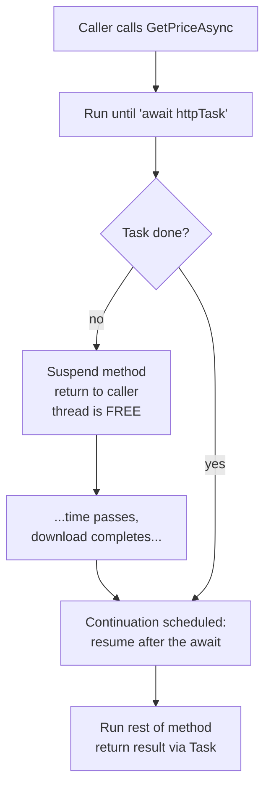

# async/await & Tasks - Concurrency Without the Pain

You've written `var data = File.ReadAllText(path);` and it just worked. But while that line ran, your program sat on a thread, fully employed, doing absolutely nothing - staring at the disk, waiting for bytes to arrive. Multiply that across a web server handling a thousand requests, each parked on a thread waiting for a database, and you've got a thousand threads burning memory to wait. That's the problem `async`/`await` solves.

C# pioneered this syntax back in 2012, and nearly every language since (JavaScript, Python, Rust, Swift) borrowed it. Worth getting the *mental model* right, not just the keywords - the model underneath is where the real understanding lives.

The one idea to carry through this whole phase: **`await` lets the current thread go do other useful work while you wait, then resumes you later.** It is not a blocking wait, and not (by itself) a new thread.

## The problem - a blocked thread is a wasted thread

When you call a synchronous I/O method - reading a file, hitting a database, calling a web API - the thread that runs it can't do anything else until the bytes come back. Network and disk are *slow* compared to a CPU: a database query taking 50ms is an eternity in which a modern core could execute hundreds of millions of instructions. Instead, the thread just blocks.

A thread isn't free - each costs around a megabyte of stack memory plus scheduling overhead. On a server, "one blocked thread per in-flight request" is exactly how you run out of threads and grind to a halt.

📝 **Async ≠ parallel.** The distinction that trips everyone up. *Parallelism* is doing multiple things *at the same instant* on multiple CPU cores. *Asynchrony* is dealing with work that *completes later* - like I/O - without holding a thread hostage while you wait. Async is about *not wasting a thread on waiting*; parallelism is about *using more threads to go faster*. You can have one without the other - more on this at the end.

💡 **Key point.** The win from async I/O isn't that any single operation finishes faster - the database is just as slow either way. The win is that the waiting thread is *freed up* to serve other work meanwhile. Same hardware, far more throughput.

## `Task` and `Task<T>` - work that will finish later

Before `await` makes sense, you need the thing it waits *on*: a `Task`.

📝 **`Task`** - an object representing an operation that will complete in the future. C#'s name for what other languages call a *promise* or *future*. A bare `Task` produces no value (it just finishes); a `Task<T>` eventually hands back a value of type `T`. Think of it as a receipt: "your result isn't ready yet, but here's a handle to collect it when it is."

A method doing asynchronous work *returns a Task* instead of the value directly, so the caller gets the receipt immediately and decides when to wait for the real result.

```csharp
using System.Net.Http;

// Returns a Task<string> - the receipt - right away.
// The actual download finishes later.
Task<string> DownloadHomepageAsync(HttpClient client)
{
    return client.GetStringAsync("https://example.com");
}
```

*What just happened:* `GetStringAsync` kicks off a network download and hands back a `Task<string>` instantly - long before the HTML arrives. `DownloadHomepageAsync` passes that receipt straight up to its own caller; nothing has blocked. Somewhere up the chain, someone will turn that receipt into an actual string - that's where `await` comes in.

⚠️ **A `Task` is not a thread.** Creating a `Task` for I/O does *not* spin up a background thread to sit and wait - the OS signals completion via an I/O callback when the bytes land. (You *can* put CPU work on a thread with `Task.Run`, covered later, but that's a different use of `Task`.) Conflating "Task" with "thread" is the root of most async confusion.

## `async`/`await` - what `await` really does

You mark a method `async` and give it a return type of `Task` or `Task<T>`. Inside, you use `await` on any Task. The crucial part - what `await` *actually* does:

When execution hits `await someTask`:
1. If the task is already done, it grabs the result and keeps going.
2. If not, the method **suspends** - returning control to *its* caller right then. The thread is now free to do anything else.
3. When the task completes, the rest of your method (everything after the `await`) runs as a **continuation** - picking up exactly where it left off, locals intact.

`await` is *not* `Thread.Sleep`, not a busy-wait - it's "pause me, free the thread, wake me back up when the result is ready."



In action, with prints so you can see the suspend-and-resume happen:

```csharp
using System;
using System.Threading.Tasks;

async Task<int> GetNumberAsync()
{
    Console.WriteLine("2: inside, before await");
    await Task.Delay(100);                 // simulates slow I/O - suspends here
    Console.WriteLine("4: inside, after await (resumed)");
    return 42;
}

Console.WriteLine("1: before calling");
Task<int> task = GetNumberAsync();         // runs up to the await, then returns
Console.WriteLine("3: after calling, before awaiting result");
int result = await task;                   // wait for completion, unwrap the value
Console.WriteLine($"5: got {result}");
```
```console
1: before calling
2: inside, before await
3: after calling, before awaiting result
4: inside, after await (resumed)
5: got 42
```

*What just happened:* Calling `GetNumberAsync()` did *not* run the whole method - it ran synchronously up to `await Task.Delay(100)`, then suspended and handed control back, which is why `"3: after calling"` prints *before* `"4: after await"`. While `Task.Delay` ticked, the thread was free; when the delay completed, the continuation fired, `"4"` printed, and `42` flowed back through the Task that `await task` unwrapped into `result`. The interleaved order proves `await` pauses and resumes rather than blocking.

💡 **`await` unwraps the result and rethrows exceptions.** Two jobs in one keyword. `await task` on a `Task<int>` gives you the `int` directly, no `.Result` needed. If the awaited operation *threw*, `await` rethrows that exception right at the `await` line, so an ordinary `try`/`catch` handles it as if the code were synchronous - the magic that makes async code *read* like normal sequential code.

```csharp
try
{
    string html = await client.GetStringAsync("https://does-not-exist.invalid");
}
catch (HttpRequestException ex)
{
    Console.WriteLine($"download failed: {ex.Message}");
}
```

*What just happened:* The network call failed inside the awaited Task, so the exception was captured on the Task. When `await` saw a faulted Task, it rethrew the original `HttpRequestException` at the `await` line, letting an ordinary `catch` handle it. Without `await`, that exception would sit silently on the Task object, easy to miss - why you almost always *await* your tasks rather than letting them dangle.

## The pitfalls - async void, deadlocks, and fire-and-forget

Async is wonderful right up until you hit one of these. Each bites essentially every C# developer exactly once. Here they are, before they bite you.

### ⚠️ `async void` - almost never what you want

You *can* write `async void` instead of `async Task`. Don't, with one exception.

The problem: an `async void` method returns *nothing to await*. The caller can't wait for it, can't know when it finished, and - worst of all - **can't catch its exceptions**, which have nowhere to go; they're raised on whatever context is current and typically crash the process.

```csharp
async void DoWorkBad()          // ⚠️ exceptions here are unobservable
{
    await Task.Delay(10);
    throw new InvalidOperationException("boom");   // crashes - no one can catch this
}

async Task DoWorkGood()         // ✅ caller can await AND catch
{
    await Task.Delay(10);
    throw new InvalidOperationException("boom");   // surfaces normally via await
}
```

*What just happened:* Both methods throw, but the outcomes differ. `DoWorkBad` returns `void`, so its caller has no Task to await - the exception escapes and brings the program down. `DoWorkGood` returns a `Task`, so `await DoWorkGood()` receives the exception at the `await` and can `try`/`catch` it. The rule: **`async` methods return `Task` or `Task<T>`.** The *only* legitimate `async void` is an event handler, since the event signature demands a `void` return - and even there, `try`/`catch` inside it.

### ⚠️ Sync-over-async - the classic deadlock

The nastiest one: calling an async method, then *blocking* on its result with `.Result` or `.Wait()` instead of awaiting it. In UI apps (and older ASP.NET), this can deadlock your program solid.

The mechanism: some environments have a **SynchronizationContext** - a rule that says "continuations must resume on a *specific* thread" (the UI thread, so you can safely touch controls). Block that thread on `.Result` and it sits waiting for the task - but the task's continuation needs *that same thread* to resume, and it's busy blocking. Each waits on the other. Frozen forever.

```csharp
// In a UI app or legacy ASP.NET context - this DEADLOCKS:
async Task<string> GetDataAsync()
{
    await Task.Delay(100);          // continuation wants the UI thread back
    return "done";
}

void OnButtonClick()
{
    string data = GetDataAsync().Result;   // ⚠️ UI thread blocks waiting...
    // ...for a continuation that needs the UI thread. Deadlock.
    Console.WriteLine(data);               // never reached
}
```

*What just happened:* `OnButtonClick` ran on the UI thread and called `.Result`, which *blocks* that thread until the task finishes. But `GetDataAsync`'s continuation was scheduled to resume *on the UI thread* - now frozen inside `.Result`, unable to run anything. The task can never complete, so `.Result` never returns. The fix: **don't block - await all the way up.** Make `OnButtonClick` an `async void` event handler and write `string data = await GetDataAsync();`.

### 💡 `ConfigureAwait(false)` - for library code

The deadlock above exists because the continuation insists on returning to the original context. If your code doesn't need that context - library code usually doesn't - tell `await` to skip it:

```csharp
public async Task<string> FetchAsync(HttpClient client)
{
    // In a reusable library: we don't care which thread resumes us.
    string html = await client.GetStringAsync("https://example.com")
                              .ConfigureAwait(false);
    return html.Trim();   // resumes on a thread-pool thread, not the captured context
}
```

*What just happened:* `ConfigureAwait(false)` says "resume the continuation on any available thread-pool thread, don't bother returning to the original context." This makes library code faster (no context-hop) and immune to the sync-over-async deadlock, since the continuation no longer needs that one blocked thread. Rule of thumb: **use it in library code; skip it in application code** where you *do* want to land back on the right context. (Modern ASP.NET Core has no SynchronizationContext, so the deadlock doesn't occur there - but the habit still matters for libraries and desktop apps.)

### ⚠️ Don't forget to await - fire-and-forget

Call an async method and *don't* await it (or store its Task), and you've launched "fire-and-forget" work. The compiler usually warns you. The danger: no idea if it succeeded, and any exception it throws vanishes silently onto an unobserved Task.

```csharp
SaveToDatabaseAsync(record);          // ⚠️ no await - bug! warning CS4014
// execution continues immediately; if the save throws, you'll never know

await SaveToDatabaseAsync(record);    // ✅ wait for it, observe success or failure
```

*What just happened:* The first line starts the save and moves on without waiting - the returned Task is dropped on the floor. If the write fails, the exception lands on that abandoned Task and is never observed; your program continues as if it succeeded. The second line awaits it, so any failure surfaces at the `await`. Unless you have a deliberate, carefully-handled reason for fire-and-forget, **await every Task you create.**

## Parallelism vs async - and composing tasks

So far every `await` waited for *one* thing at a time. The real power shows up when you run several async operations *concurrently* and await them together.

### `Task.WhenAll` and `Task.WhenAny`

To fetch three URLs concurrently, *start* all three tasks first (don't await yet), then await them as a group:

```csharp
async Task<string[]> FetchAllAsync(HttpClient client)
{
    // Start all three NOW - they run concurrently. No await yet.
    Task<string> a = client.GetStringAsync("https://example.com/1");
    Task<string> b = client.GetStringAsync("https://example.com/2");
    Task<string> c = client.GetStringAsync("https://example.com/3");

    // Now wait for all of them together.
    return await Task.WhenAll(a, b, c);   // ~as slow as the slowest one, not the sum
}
```

*What just happened:* By starting `a`, `b`, and `c` before awaiting any of them, all three downloads were in flight at once. `Task.WhenAll` returns a single Task completing when *every* input task does, handing back an array of all results - total time roughly the duration of the *slowest* download, not the sum. Contrast with `await a; await b; await c;`, which waits for each in turn. ⚠️ Ordering matters: `await` each task where you create it, and you've serialized them, throwing away the concurrency.

`Task.WhenAny` is the sibling for "whichever finishes first" - useful for timeouts (race your real task against a `Task.Delay`) or querying several mirrors and taking the fastest reply.

### `Task.Run` - for CPU-bound work

Everything above was *I/O-bound* (waiting on the network). Sometimes you have genuinely heavy *computation* you don't want freezing your UI thread - deliberately push it onto a background thread with `Task.Run`:

```csharp
// CPU-bound: a heavy calculation. Move it off the UI thread.
long sum = await Task.Run(() =>
{
    long total = 0;
    for (int i = 0; i < 1_000_000_000; i++) total += i % 7;
    return total;
});
```

*What just happened:* `Task.Run` hands the lambda to a thread-pool thread and returns a Task representing it. Awaiting that Task frees the calling thread (e.g. the UI) while the CPU work churns in the background - the *one* time you genuinely *do* want a new thread, since the work is real computation, not waiting. ⚠️ Don't wrap I/O calls in `Task.Run`; that wastes a thread babysitting work that was already non-blocking.

### Data parallelism - `Parallel.ForEach` and PLINQ

For a CPU-heavy operation applied across a *collection*, using *all* your cores, reach for the data-parallel tools:

```csharp
using System.Threading.Tasks;
using System.Linq;

// Run a CPU-bound transform across all cores:
Parallel.ForEach(images, img => Resize(img));

// Or with PLINQ - parallel LINQ:
var results = numbers.AsParallel().Select(n => ExpensiveCompute(n)).ToArray();
```

*What just happened:* `Parallel.ForEach` splits the collection across multiple threads, processing chunks simultaneously on different cores - true parallelism. `AsParallel()` does the same for a LINQ query. Both are about *going faster by using more cores*, a different goal from async I/O.

💡 **The dividing line.** Use **async/await** for **I/O-bound** work (network, disk, database) - the goal is *not wasting a thread while waiting*. Use **parallelism** (`Task.Run`, `Parallel.ForEach`, PLINQ) for **CPU-bound** work - the goal is *using more cores to finish faster*. They look similar but solve opposite problems: async on CPU work just adds overhead, parallelism on I/O just wastes threads.

## Recap

1. **A blocked thread is a wasted thread.** Synchronous I/O parks a thread doing nothing while it waits; async I/O frees that thread to serve other work.
2. **A `Task`/`Task<T>` is a receipt for work that finishes later** - C#'s promise/future. A Task is *not* a thread; I/O Tasks don't burn a thread to wait.
3. **`await` suspends your method and returns to the caller**, freeing the thread; when the Task completes, a continuation resumes right after the `await`, locals intact. It also unwraps the result and rethrows exceptions so async code reads like sync code.
4. ⚠️ **Avoid `async void`** (exceptions are unobservable - only for event handlers), and ⚠️ **never block on async** with `.Result`/`.Wait()` on a captured context (deadlocks). Use `ConfigureAwait(false)` in libraries, and await every Task you start.
5. **Compose with `Task.WhenAll`/`WhenAny`** by starting tasks *before* awaiting, so they run concurrently - total time tracks the slowest, not the sum.
6. 💡 **Async for I/O-bound, parallelism for CPU-bound.** `async`/`await` stops you wasting threads on waiting; `Task.Run`/`Parallel.ForEach`/PLINQ use more cores to compute faster. Different problems, different tools.

You can now write code that handles thousands of concurrent operations without a thread per wait - the foundation of every responsive UI and scalable server in .NET. Next: one level deeper into the runtime itself - how memory, the garbage collector, and the JIT actually make your C# run.

## Quick check

Test yourself on the one idea that makes all of this work - what `await` really does:

```quiz
[
  {
    "q": "When execution hits `await someTask` and the task is NOT yet complete, what happens?",
    "choices": [
      "The method suspends and returns control to its caller, freeing the thread; the rest runs later as a continuation when the task completes",
      "The current thread blocks and sleeps until the task finishes, doing nothing else",
      "A new thread is always spawned to run the awaited work in parallel",
      "The task is cancelled and the method returns its default value immediately"
    ],
    "answer": 0,
    "explain": "await is not a blocking wait. It suspends the method and hands control back to the caller, leaving the thread free to do other work. When the task completes, the code after the await resumes as a continuation, with locals intact. That's why it scales - no thread is held hostage while waiting."
  },
  {
    "q": "Why does blocking on an async method with `.Result` on a UI thread (with a SynchronizationContext) deadlock?",
    "choices": [
      "The UI thread blocks waiting for the task, but the task's continuation needs that same UI thread to resume - so each waits on the other forever",
      "`.Result` is not a valid way to get a value from a Task and throws an exception",
      "The task runs on a thread that the garbage collector pauses indefinitely",
      "Async methods can only ever run on background threads, never the UI thread"
    ],
    "answer": 0,
    "explain": "The captured SynchronizationContext requires the continuation to resume on the UI thread. But .Result blocks that very thread waiting for the task to finish. The continuation can't run (thread is busy blocking), so the task never completes, so .Result never returns. The fix is to await all the way up instead of blocking."
  },
  {
    "q": "You have a CPU-heavy calculation (a billion-iteration loop) that's freezing your UI. Which tool fits?",
    "choices": [
      "`Task.Run` to move the computation onto a background thread, then await it",
      "Plain `async`/`await` on the loop, which will run it off-thread automatically",
      "`Task.WhenAll`, since it always runs work in parallel across cores",
      "`ConfigureAwait(false)`, which moves CPU work to the thread pool by itself"
    ],
    "answer": 0,
    "explain": "This is CPU-bound work, so it needs a real thread to run on - that's exactly what Task.Run provides, handing the work to a thread-pool thread and freeing the UI thread (which you await). Plain async/await is for I/O (it doesn't move CPU work off-thread by itself), and ConfigureAwait only controls where continuations resume, not where the work runs."
  }
]
```

---

[← Phase 13: Records, Pattern Matching & Modern C#](13-records-and-modern-csharp.md) · [Guide overview](_guide.md) · [Phase 15: The .NET Runtime: Memory, GC & JIT →](15-the-dotnet-runtime-and-gc.md)
