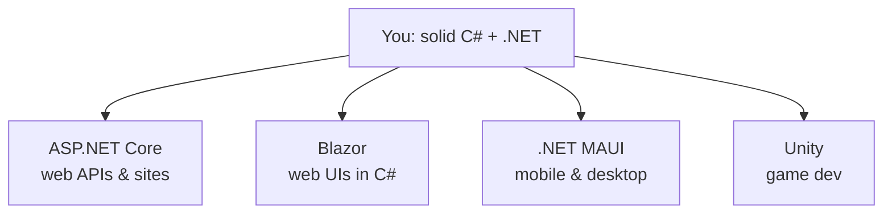

# Where to Go Next - Putting C# to Work

Take a second to notice what you've actually got. You learned C# the language - types, classes, generics, LINQ, async/await, the lot - *and* you learned your way around .NET, the runtime and library that the language lives on. That's two things, and most people conflate them. You now know the difference, and you can read real code without flinching. Everything from here is *application*: pointing what you already have at a real target.

So this last phase isn't more syntax. It's a map. The C# world spans web servers, mobile apps, desktop apps, and games - which is genuinely rare for one language - and that breadth can feel like pressure to learn all of it at once. You don't. Here are the honest branches, what each is *for*, and the one I'd point most people at first.

## The branches from here



*What this shows:* four directions lead out from where you stand, all using the same C# you already write. You don't have to pick one forever - but pick *one to go deep on next*, because depth beats breadth when you're learning. For most people, that one is ASP.NET Core.

## Web with ASP.NET Core - the highest-leverage next step

This is the C# job. When companies hire C# developers, they're overwhelmingly hiring for **ASP.NET Core** - the framework for building web APIs and server-rendered sites on .NET. It's fast, mature, cross-platform, and the center of gravity for the whole ecosystem.

You'll meet a few styles under one roof: **minimal APIs** (a handful of lines to stand up a JSON endpoint - the gentlest on-ramp), **MVC** (the classic controllers-and-views structure for larger apps), and **Razor Pages** (page-focused server rendering). Alongside them lives **Entity Framework Core** - EF Core - which maps your C# classes to database tables so you query data with LINQ instead of raw SQL. The `async/await` you learned in [Phase 14](14-async-await-and-tasks.md) is everywhere here, because web servers are mostly waiting on I/O.

💡 If you only go deep on one branch, make it this one. It's the most direct path to employability, and it exercises the most of what you already know.

## Blazor - building web UIs in C#

Here's a genuinely interesting one. **Blazor** lets you build interactive browser UIs in *C#* instead of JavaScript. Buttons, forms, live-updating components - written in the language you already know, sharing the same models and validation logic as your backend.

It comes in flavors (server-side, where the UI runs on the server over a live connection, and WebAssembly, where your C# runs *in the browser*), but the headline is the same: if you'd rather not context-switch into a separate JavaScript framework, Blazor keeps you in one language across the whole stack. It pairs naturally with ASP.NET Core.

## Desktop & mobile with .NET MAUI

Want to ship an app that runs on Android, iOS, Windows, and macOS from one codebase? That's **.NET MAUI** (Multi-platform App UI). You write your UI and logic once in C#, and MAUI builds native apps for each platform.

It's the path if you're drawn to building *products people install* rather than websites they visit. It's a real, supported framework - though for a first deep dive, web tends to teach more transferable fundamentals, so consider MAUI once you've got a backend under your belt.

## Game dev with Unity

For a lot of people, *this* is why they're here. **Unity** is one of the most widely used game engines in the world, and its scripting language is C#. The C# you learned in this guide is the same C# you'll write to move a character, spawn enemies, or wire up a menu - Unity layers its own engine APIs on top, but the language is yours already.

If games are the dream, you're not starting over. You're starting at "now I learn the engine," which is a much better place to stand.

## Why C# is a great bet

💡 Step back and look at that list: web, desktop, mobile, cloud, *and* games - all reachable from one language. Few languages span that range. C# is also a pleasure to work in day to day: first-class tooling (Visual Studio and the C# extension for VS Code are excellent), genuinely cross-platform now (it runs happily on Linux and macOS, not Windows-only), Microsoft-backed with serious long-term investment, and evolving fast - the language picks up thoughtful new features every year. Betting your time on it is a sound bet.

## What to actually build

Reading got you here. *Building* is what turns knowledge into skill. The trick is something small enough to finish but real enough to teach you the messy parts. A few honest suggestions:

- **A REST API with ASP.NET Core + EF Core.** Three or four endpoints backed by a real database. You'll exercise minimal APIs, async, LINQ, and EF Core all at once - and it's the single most job-relevant thing on this list.
- **A CLI tool.** Take a chore you do by hand and turn it into a console app. Small, finishable, and it cements the language fundamentals without any framework noise.
- **A Blazor to-do app, or a tiny Unity game.** Pick by what excites you. A to-do app in Blazor teaches components and state; a small Unity game teaches the engine loop. Either one is a great first "I made a thing that runs."

Whatever you pick, **finish it**. A finished rough project teaches more than three polished half-projects abandoned at 80%.

## A last word

The official **Microsoft Learn** path for C# and the **C# language docs** on Microsoft's site are genuinely excellent - well-written, thorough, and completely free. Bookmark them; they won't steer you wrong. And if you ever want to step back and think about *why* languages make the trade-offs they do - why C# reaches for a runtime and a garbage collector while another reaches for manual memory - that's the subject of [Languages, Explained Like a Human](/guides/languages-explained-like-a-human). It's a good companion now that you've lived inside one language end to end.

You started not knowing what `Console.WriteLine` did. You're leaving able to read real C#, reason about async, model a problem with types, and choose your next step on purpose instead of by panic. That's the hard part, and it's behind you. Go build the small thing. You're ready.

## Recap

1. **You learned two things** - the C# language *and* the .NET runtime. Everything next is applying them.
2. **ASP.NET Core is the highest-leverage branch** - minimal APIs, MVC, Razor Pages, and EF Core; it's the dominant C# job and uses the most of what you know.
3. **Blazor** builds web UIs in C# instead of JavaScript; **.NET MAUI** builds cross-platform mobile and desktop apps; **Unity** uses C# as its scripting language for games.
4. **C# is a great bet** - one language across web, desktop, mobile, cloud, and games, with first-class tooling, true cross-platform support, and fast Microsoft-backed evolution.
5. **Build one real thing and finish it** - a REST API (most job-relevant), a CLI tool, or a Blazor/Unity app - leaning on Microsoft Learn and the official docs.

## Quick check

Test yourself on the map you just drew:

```quiz
[
  {
    "q": "For most people learning C#, which branch is the highest-leverage next step to go deep on?",
    "choices": [
      "ASP.NET Core - it's the dominant C# job and exercises the most of what you already know",
      "Unity - every C# developer is expected to ship a game first",
      "It doesn't matter; you must learn all four branches at once before building anything",
      ".NET MAUI - because mobile is the only platform worth targeting"
    ],
    "answer": 0,
    "explain": "ASP.NET Core (minimal APIs, MVC, Razor Pages, EF Core) is the most direct path to employability and uses the most of the language and runtime you've already learned. Pick one branch to go deep on - depth beats breadth when learning."
  },
  {
    "q": "What does Blazor let you do?",
    "choices": [
      "Build interactive web UIs in C# instead of JavaScript",
      "Compile C# down to a single static binary with no runtime",
      "Write iOS apps in Swift from inside Visual Studio",
      "Replace the .NET runtime with a faster custom one"
    ],
    "answer": 0,
    "explain": "Blazor lets you build interactive browser UIs in C# - sharing models and logic with your backend - rather than switching into a separate JavaScript framework. It comes in server-side and WebAssembly flavors."
  },
  {
    "q": "Why is the C# you learned in this guide a head start for Unity game development?",
    "choices": [
      "Unity's scripting language is C#, so you already know the language - you just add the engine APIs",
      "Unity automatically converts your console apps into 3D games",
      "Unity uses a different language, but the syntax happens to look similar",
      "Unity only runs on Windows, which is where you learned C#"
    ],
    "answer": 0,
    "explain": "Unity scripts are written in C#. The language is the same one you already know; Unity layers its own engine APIs on top. You start at 'now I learn the engine,' not from scratch."
  }
]
```

---

[← Phase 17: Performance & the Ecosystem](17-performance-and-ecosystem.md) · [Guide overview](_guide.md)
