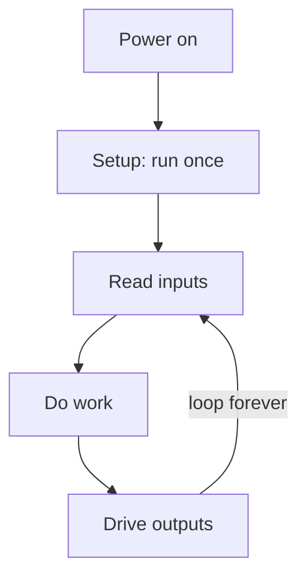

# What "Embedded" Even Means

Every C program you have written so far ran as a guest. Something bigger - an operating system - handed your program some memory, gave it a terminal to print to, let it open files, and cleaned up after it when `main` returned. You never thought about that host because it was always there.

Embedded C takes the host away. Your code runs on a microcontroller: a whole tiny computer on a single chip, with the processor, the memory, and the connections to the outside world all baked into one piece of silicon. There is no operating system underneath you. There is no terminal, no file system, no `printf` writing to a screen. When your program starts, *it is the only software on the chip.* That is what "bare metal" means, and it changes what a program even looks like.

## Bare metal: nothing underneath you

On a desktop, "output" means text on a screen or bytes in a file. On a microcontroller, none of that exists by default. The chip's connection to the world is its **pins** - the metal legs sticking out of it - and your program's output is a pin going high or low. Driving a pin high puts a voltage on it (on the ATmega328P, about 5 volts); driving it low puts it at 0 volts. Wire an LED to that pin and "output" becomes a light turning on.

So the first mental shift is this: **you do not print, you act on the physical world.** No `printf`, no `console.log`. You set a pin, and something in the real world changes.

The second shift is size. The desktop you are reading this on has gigabytes of RAM and a processor running at billions of cycles per second. The ATmega328P has about **2 kilobytes of RAM**, **32 kilobytes of flash** to hold your compiled program, and runs at **16 million cycles per second** on the Uno. That is not a typo. Two kilobytes. A single large array can swallow your entire memory, so you stop assuming space is free and start counting bytes. There is no garbage collector and no virtual memory to lean on - what you allocate is what you have.

## Three words you will hear constantly

📝 **Terminology.**
- **Microcontroller** - a complete small computer on one chip: CPU, RAM, flash storage, and pins to the outside world, all together. The ATmega328P is one. It is not a "chip that helps a computer"; it *is* the computer.
- **Firmware** - the software that runs on that chip. It is called firmware, not software, because it lives in the device permanently and rarely changes. The code you are about to write is firmware.
- **Embedded** - the whole field. Software "embedded" inside a physical device (a thermostat, a microwave, a car's engine controller) rather than running on a general-purpose computer. The device is not sold as a computer, but there is one inside it running your firmware.

## The program that never ends

Here is the structural shock. A desktop program has a life story: it starts, does its work, and exits. `main` returns, the process ends, control goes back to the operating system.

Firmware has nowhere to return *to*. If your `main` finished and returned on a microcontroller, the chip would have nothing to run and would sit there doing... whatever the leftover state happens to do, which is never what you want. So embedded programs are built as a **super-loop**: set things up once, then loop forever.

```c
int main(void) {
    // setup: runs one time
    // (configure pins, peripherals, and so on)

    while (1) {
        // the loop: runs forever
        // read inputs, decide, drive outputs, repeat
    }
    // we never reach here
}
```

That `while (1)` is not a mistake or a placeholder - it is the shape of almost every piece of firmware ever written. The chip powers on, runs your setup once, then runs the loop body again and again until the power is cut. Your program does not end; it *is* the device, for as long as the device is on.



⚠️ **Gotcha.** Coming from desktop C, an infinite loop feels like a bug you would get yelled at for. On bare metal it is the correct and expected structure. The mistake here would be letting `main` return, not looping forever.

## Blink an LED in 60 seconds

Enough theory. Let us make a real chip do something, with nothing but a browser tab.

The Arduino Uno has an LED soldered onto the board, wired to one specific pin. In ATmega328P terms that pin is **PB5** - bit 5 of a group of pins the chip calls "Port B." (On the Uno's own numbering it is labelled "pin 13," and the little LED is marked "L".) We are going to turn that LED on and off directly, by writing to the chip's registers. Do not worry about *why* the registers are named this way yet - that is Phase 4. For now, read along and watch it work.

```c
#include <avr/io.h>
#include <util/delay.h>

int main(void) {
    DDRB |= (1 << PB5);          // make PB5 an output pin

    while (1) {
        PORTB |= (1 << PB5);     // drive PB5 high: LED on
        _delay_ms(500);
        PORTB &= ~(1 << PB5);    // drive PB5 low: LED off
        _delay_ms(500);
    }
}
```

Read it top to bottom. `DDRB` is the "data direction" control for Port B; setting bit 5 tells the chip that PB5 is an output we intend to drive, not an input we read. Then, forever: `PORTB |= (1 << PB5)` switches PB5 on, we wait half a second, `PORTB &= ~(1 << PB5)` switches it off, we wait again. The onboard LED blinks: half a second on, half a second off.

There is no `main` return, no exit, no operating system. Three registers and a loop, and a physical light responds.

▶ **Try it:** start a new Arduino Uno project at [wokwi.com](https://wokwi.com), paste this in, and Run. The little "L" LED on the simulated board starts blinking.

📝 **Terminology.** A Wokwi Arduino project normally hands you two functions, `setup()` and `loop()`, instead of a bare `main()`. That is the same super-loop split in two: `setup()` is the run-once part, `loop()` is the body of `while (1)`. The build links your `main()` above in place of the one the Arduino library would supply, so it runs as shown - and from Phase 4 on we use the `setup()` / `loop()` form so each example drops straight into a fresh sketch.

💡 **Key point.** That code is the whole program. Not a function called by a framework, not a script an interpreter reads - the entire software on the chip. When people say embedded gives you "direct control of the hardware," this is what they mean: `PORTB |= (1 << PB5)` is you, in C, changing the voltage on a physical pin, with nothing in between.

⚠️ **Gotcha.** `_delay_ms` needs to know the clock speed to count out real time, which it reads from a value called `F_CPU`. The Arduino and Wokwi build set `F_CPU` to `16000000` (16 MHz) for you, so the example above works as-is. In a from-scratch build outside Arduino you must define it yourself, before including the delay header:

```c
#define F_CPU 16000000UL
#include <util/delay.h>
```

Get `F_CPU` wrong and your delays are wrong by the same ratio - a common first-day surprise.

Quick gut check before the recap:

```quiz
[
  {
    "q": "Why is firmware built as a super-loop with `while (1)`, when a desktop program returns from `main` and exits?",
    "choices": [
      "Because infinite loops run faster on small chips",
      "Because the C standard requires embedded programs to loop",
      "There is no operating system to return to - if `main` returned, the chip would have nothing to run, so firmware loops forever until the power is cut",
      "To stop the LED from ever turning off"
    ],
    "answer": 2,
    "explain": "On bare metal nothing is waiting to reclaim the program. `main` never returns; the super-loop runs the device for as long as it has power."
  },
  {
    "q": "On a bare-metal microcontroller, what is the closest thing to a program's \"output\"?",
    "choices": [
      "A line printed to the terminal with printf",
      "A voltage on a physical pin - for example driving PB5 high to light an LED",
      "A file written to disk",
      "The return value of main"
    ],
    "answer": 1,
    "explain": "There is no terminal, no files, and no printf underneath you. The program acts on the world by setting pins high or low."
  },
  {
    "q": "The ATmega328P has about 2 KB of RAM and 32 KB of flash. What does that force you to do differently from desktop C?",
    "choices": [
      "Be deliberate about memory: a few large arrays can use up all your RAM, so you count bytes instead of assuming space is free",
      "Nothing - the compiler manages memory for you",
      "Write the whole program in assembly",
      "Rely on a garbage collector to reclaim space"
    ],
    "answer": 0,
    "explain": "With kilobytes instead of gigabytes, memory is a budget you track. There is no garbage collector and no virtual memory to fall back on."
  }
]
```

## Recap

1. Embedded C runs on **bare metal**: a microcontroller with no operating system, no terminal, no files, and no `printf`. The output is a physical pin going high or low.
2. A microcontroller is a whole tiny computer on one chip, with very little memory - the ATmega328P has about 2 KB of RAM and 32 KB of flash, so memory is a budget you count, not a resource you assume.
3. Firmware is a **super-loop**: set up once, then `while (1)` forever. `main` never returns, because there is no host to return to.
4. Terminology worth pinning down: *microcontroller* (the chip-computer), *firmware* (the software on it), *embedded* (software living inside a physical device).
5. You blinked an LED with `DDRB` and `PORTB` in a browser tab - real bare-metal register code, running on a simulated ATmega328P, no hardware required.

Next up, [The C That Changes](02-the-c-that-changes.md): the handful of C habits that flip the moment you leave the desktop behind.
