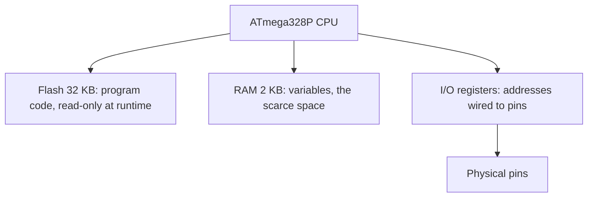

# The C That Changes

Here is the good news: the C you already know still compiles and still works. Loops loop, structs group, pointers point. Embedded C is not a different language. What changes is a small set of habits - things that were harmless on a desktop and become load-bearing on a chip with 2 kilobytes of RAM and hardware wired directly into memory. This phase is those habits, one at a time.

## Fixed-width types, because `int` lies

On a desktop you probably treat `int` as "a 4-byte number" without thinking. That was never guaranteed. The C standard only promises `int` is *at least* 16 bits; the exact width is up to the compiler and the target. On your laptop it is usually 4 bytes. On the ATmega328P, an 8-bit chip, **`int` is 2 bytes.** Same keyword, different size, and code that quietly assumed 4 bytes can overflow where you did not expect.

The fix is to say exactly what you mean. `<stdint.h>` gives you types whose size is right there in the name:

- `uint8_t` - unsigned, exactly 1 byte, range 0 to 255
- `uint16_t` - unsigned, exactly 2 bytes, range 0 to 65535
- `uint32_t` - unsigned, exactly 4 bytes
- and signed versions: `int8_t`, `int16_t`, `int32_t`

These are the same size on every machine, which is exactly what you want when a variable maps to a hardware value or a byte in a protocol. Let us prove the sizes on the real target. There is no `printf` here, so to see values we send them over the USB serial link with Arduino's `Serial` helper, and read them in a serial monitor.

```c
#include <stdint.h>

void setup() {
    Serial.begin(9600);
    Serial.print("int:      "); Serial.println(sizeof(int));
    Serial.print("uint8_t:  "); Serial.println(sizeof(uint8_t));
    Serial.print("uint32_t: "); Serial.println(sizeof(uint32_t));
    Serial.print("pointer:  "); Serial.println(sizeof(void *));
}

void loop() {
}
```

```console
int:      2
uint8_t:  1
uint32_t: 4
pointer:  2
```

*What just happened:* on this 8-bit chip an `int` is 2 bytes, not the 4 you would see on most laptops. The `uint8_t` and `uint32_t` are exactly 1 and 4 bytes, and they would be on any machine - that fixed size is the reason embedded code reaches for them. Even a pointer is only 2 bytes here, because the chip's whole address space fits in 16 bits.

▶ **Try it:** start a new Arduino Uno project at [wokwi.com](https://wokwi.com), paste this in, Run, and open the serial monitor.

📝 **Terminology.** You may notice this example uses `setup()` and `loop()` instead of the `main()` with `while (1)` from Phase 1. That is the same super-loop - the Arduino framework writes the `main()` and the infinite loop for you, calls `setup()` once, then calls `loop()` forever. Underneath, it is identical to what you wrote by hand.

## `volatile`: this can change behind your back

This is the keyword that separates embedded C from the rest, and the one that produces the most baffling bugs when it is missing.

**What it actually is.** `volatile` is a promise you make to the compiler in reverse: it tells the compiler *"this variable can change without any code you can see changing it, so never cache it in a register - re-read it from memory every single time."*

**Why that matters.** A C compiler is aggressive. If it sees you read a variable in a loop and nothing in the loop writes to it, it reasonably concludes the value cannot change, reads it once into a fast register, and reuses that copy. On a desktop that optimization is invisible and correct. On a chip, two things really do change memory behind the compiler's back: **hardware registers**, and **variables written by an interrupt** (code the hardware calls on its own, which we cover in Phase 5). The compiler cannot see those writes, so it optimizes as if they never happen.

Here is the exact bug. We set a flag inside an interrupt and wait for it in `main`:

```c
#include <avr/io.h>
#include <avr/interrupt.h>

uint8_t button_pressed = 0;      // set by the interrupt below

ISR(INT0_vect) {                 // hardware runs this when the button fires
    button_pressed = 1;
}

int main(void) {
    // ... configure the INT0 interrupt on a pin ...
    sei();                       // turn interrupts on

    while (button_pressed == 0) {
        // wait here until the interrupt sets the flag
    }

    // ... react to the press ...
}
```

Compiled with optimization on, this can **hang forever, even after you press the button.** The compiler looked at the `while` loop, saw that nothing inside it writes `button_pressed`, loaded the value once, and now spins on that stale copy in a register. The interrupt dutifully writes `1` into memory, but the loop is not looking at memory anymore.

The fix is one word:

```c
volatile uint8_t button_pressed = 0;
```

Now every check of `button_pressed` re-reads it from RAM, so the interrupt's write is seen and the loop exits on the next pass.

🪖 **War story.** A classic firmware ghost story: the code works perfectly in the debug build and hangs in the release build. The cause is almost always a flag shared with an interrupt that is missing `volatile`. Debug builds turn optimization off, so the stale-register trick never happens and the bug hides. Ship the optimized build and it appears. One keyword, hours of confusion.

💡 **Key point.** You do *not* need `volatile` on the hardware registers from `<avr/io.h>` like `PORTB` or `PINB` - the header already declares them volatile for you. You add `volatile` to *your own* variables that an interrupt touches.

## Why `malloc` mostly stays in the box

On a desktop you reach for `malloc` without a second thought. In small firmware it is usually avoided, and the reasons are all about the constraints from Phase 1.

- **There is barely any room.** A heap needs free RAM to hand out. With 2 kilobytes total, there is little to spare, and a heap that runs dry fails in ways that are hard to recover from on a device with no user watching.
- **Fragmentation with no reset.** Desktop programs start and stop constantly, which resets the heap. Firmware can run for months without a reboot. Allocate and free different sizes for long enough and the free space breaks into scattered gaps: you can have plenty of total free memory and still fail to allocate one contiguous block.
- **Nondeterminism.** How long `malloc` takes depends on the state of the heap, so it is not predictable. Firmware often has hard timing requirements, and "usually fast" is not good enough.

The embedded habit is **static allocation**: fixed-size arrays and variables whose size is known at compile time. You decide up front "this buffer is 64 bytes" and it lives at a fixed spot for the life of the program. Predictable, no fragmentation, and you can see your entire memory budget by reading the code.

## The memory map: three kinds of address

To make `volatile` and the type sizes click, you need the picture of where things live. On the ATmega328P, addresses fall into three regions, and they behave very differently.



- **Flash (32 KB)** holds your compiled program and any constants you mark as read-only. It is not rewritten while the program runs - it is where the code lives.
- **RAM (2 KB)** holds your variables: the stack, globals, and anything that changes at runtime. This is the scarce resource you budget.
- **Registers** are the surprising part. Some memory addresses are not ordinary storage at all - they are wired straight to the hardware. Writing to the address named `PORTB` does not "save a value," it changes the voltage on real pins. Reading the address named `PINB` reads the actual state of those pins right now. That is why those addresses must be `volatile`: their contents change because of the physical world, not because your code assigned them.

That last idea - a memory address that *is* a piece of hardware - is the heart of embedded programming, and the whole subject of Phase 4.

Quick gut check before the recap:

```quiz
[
  {
    "q": "You need a counter that only ever holds 0 to 200 on the ATmega328P. Why prefer `uint8_t` over `int`?",
    "choices": [
      "uint8_t is always faster than int on every processor",
      "`int` has no guaranteed size in C - it is 2 bytes on this chip and often 4 on a laptop - while `uint8_t` is exactly one byte everywhere, so you know the size and range you are getting",
      "int cannot store the value 200",
      "uint8_t automatically prevents the counter from overflowing"
    ],
    "answer": 1,
    "explain": "The width of `int` is implementation-defined: 2 bytes here, 4 on a typical desktop. Fixed-width types from <stdint.h> pin down size and range so you are not guessing per target."
  },
  {
    "q": "You set a flag inside an interrupt and poll it with `while (flag == 0) { }`, but the loop never exits in the optimized build. What is the most likely cause?",
    "choices": [
      "The interrupt is never actually running",
      "A variable cannot be read inside a while loop",
      "`flag` is not declared `volatile`, so the compiler cached it in a register and never re-reads the memory the interrupt writes",
      "The chip's RAM is faulty"
    ],
    "answer": 2,
    "explain": "Without volatile the compiler may hoist the read out of the loop and spin on a stale copy. `volatile` forces a fresh read from memory each time, so the interrupt's write is seen."
  },
  {
    "q": "Why is `malloc` usually avoided in small embedded firmware?",
    "choices": [
      "malloc does not exist in C",
      "With kilobytes of RAM and code that may run for months without a reboot, heap fragmentation and out-of-memory failures become likely and hard to predict, so static allocation is safer",
      "malloc is too slow to call even once",
      "The compiler refuses to link programs that call malloc"
    ],
    "answer": 1,
    "explain": "Tiny RAM plus long uptime makes fragmentation and nondeterministic failures a real risk. Fixed, compile-time allocation keeps memory use predictable."
  }
]
```

## Recap

1. Use **fixed-width types** from `<stdint.h>` (`uint8_t`, `uint16_t`, `uint32_t`). Plain `int` has no guaranteed size - it is 2 bytes on the ATmega328P and often 4 on a desktop.
2. **`volatile`** tells the compiler a variable can change behind its back, so it re-reads from memory every time. Use it for variables shared with interrupts; hardware registers from `<avr/io.h>` are already volatile for you.
3. Without `volatile`, a flag set by an interrupt and polled in a loop can get cached in a register, and the loop spins forever - the bug that works in debug and hangs in release.
4. Avoid `malloc` on tiny chips: little room, fragmentation over long uptime, and nondeterministic timing. Prefer **static, compile-time allocation**.
5. There is no `printf` on bare metal - you send bytes over serial or act on pins - and `sizeof` lets you check type sizes on the actual target.
6. Memory splits three ways: **flash** (code, read-only at runtime), **RAM** (your scarce variables), and **registers** (special addresses wired straight to the hardware).

Next up, [Bit Manipulation, Properly](03-bit-manipulation.md): the `|=`, `&=`, and `<<` you saw in the blink, taught slowly, because on hardware you flip single bits all day long.
