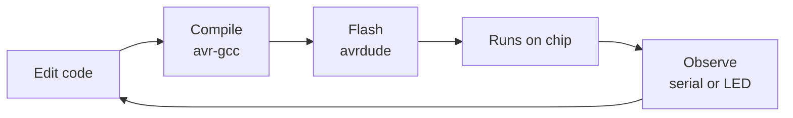

# The Toolchain and the Real Workflow

Writing the firmware is half the job. The other half is the machinery that carries your code from a text file on your laptop onto a chip with 2 KB of RAM and no operating system - and how you find out what went wrong once it's running there. This phase is the day-to-day loop of real embedded work: cross-compile, flash, respect the memory budget, and debug a system that can't always stop to talk to you.

## Cross-compilation: your PC builds code it can't run

**What it actually is.** Your laptop runs an x86 (or ARM) processor. The Uno runs an AVR processor - a completely different instruction set. When you build an Arduino sketch, the compiler (`avr-gcc`) runs on your PC but produces machine code for the *AVR*, not for your laptop. That's cross-compilation: the machine doing the compiling (the *host*) differs from the machine that will run the result (the *target*).

**Real behavior.** The `.hex` file that comes out is AVR machine code. Try to run it on your PC and nothing happens - your CPU cannot execute those instructions. It only means something to the ATmega328P. The Arduino IDE bundles `avr-gcc` and its toolchain, so the target is chosen for you when you pick the board; on a bare command line you'd pass `-mmcu=atmega328p` to say which chip you're aiming at.

📝 **Terminology.** *Host* = the machine you compile on. *Target* = the machine that runs the binary. On desktop they're the same, so you never think about it. In embedded they almost never are, which is why "it compiled" and "it runs on the chip" are two separate victories.

## Flashing: getting the binary onto the chip

**What it actually is.** Compiling produces a file on your PC. *Flashing* (or uploading) copies that file into the microcontroller's flash memory, where it runs. On the Uno this goes through a small program already living on the chip called the *bootloader*: when you hit Upload, the board resets, the bootloader listens on the serial line, and a PC-side tool called `avrdude` streams the new program in while the bootloader writes it to flash.

**Real behavior.** The Arduino IDE's Upload button is really two steps - compile, then flash - behind one click. A successful upload looks like this:

```console
Sketch uses 1084 bytes (3%) of program storage space. Maximum is 32256 bytes.
Global variables use 200 bytes (9%) of dynamic memory, leaving 1848 bytes for
local variables. Maximum is 2048 bytes.

avrdude: writing flash (1084 bytes):
Writing | ################################################## | 100% 0.18s
avrdude: 1084 bytes of flash written
avrdude: verifying flash memory against the input file:
Reading | ################################################## | 100% 0.14s
avrdude: 1084 bytes of flash verified
avrdude done.  Thank you.
```

*What just happened:* the toolchain reported how much flash and RAM the program needs, then `avrdude` wrote the 1084-byte program into flash and read it back to verify. The instant verification finishes, the board resets and your code starts running.

The whole inner loop of embedded work is these steps on repeat:



💡 **Key point.** There's no button that runs your firmware on your laptop the way a Python script runs. The chip is the only place it can execute, so every test cycle goes all the way around: edit, compile, flash, watch the hardware.

## Memory budgets: 2 KB is the whole world

**What it actually is.** The ATmega328P has three separate memories: 32 KB of *flash* (holds the program, survives power-off), 2 KB of *SRAM* (holds your variables while running, wiped on reset), and 1 KB of *EEPROM* (small persistent storage). The size report above tells you how full the first two are. Flash is usually roomy; SRAM is the one that hurts.

**Real behavior.** That 2 KB of SRAM holds everything live at once: global variables, the stack (function calls and their locals), and the heap (anything you `malloc`). The stack grows down from the top, the heap grows up from the bottom, and if they meet in the middle they overwrite each other. There's no memory-protection unit and no crash with a tidy error message - the program starts behaving insanely instead: garbled serial output, a variable that changes on its own, spontaneous resets.

⚠️ **Gotcha.** The sneakiest RAM eater is text. Every `Serial.println("some message")` copies that string into SRAM by default. A dozen debug messages can quietly swallow hundreds of your 2048 bytes. Wrap literals in the `F()` macro - `Serial.println(F("some message"))` - to keep them in flash instead, and watch the "dynamic memory" number in the size report drop. When the IDE warns `Low memory available, stability problems may occur`, believe it.

**Why this saves you later.** On desktop you never think about 200 bytes. Here, reading the size report after every build - and knowing that SRAM is where you run out, not flash - is the difference between a stable device and one that resets every few minutes for reasons that look like black magic.

## Debugging when you can't pause the chip

**What it actually is.** On desktop, your debugger and your program run side by side under the same OS, so setting a breakpoint is trivial. On a microcontroller your code runs alone on a separate chip, with no OS and no debugger process beside it. To pause real hardware you need a physical *debug interface* wired in - and a stock Uno doesn't expose one conveniently. So embedded debugging leans on a different toolkit:

- **UART logs.** The `Serial.println` from [the peripheral tour](06-a-peripheral-tour.md) is the workhorse: print what the chip saw and where it got to.
- **Blink codes.** When you have no serial (or serial is the thing that's broken), blink the onboard LED on pin 13 in a pattern - two blinks for "reached setup," a fast flutter for "error." The lowest-tech status report there is, and it always works.
- **A logic analyzer.** A cheap tool that records what several digital pins did over time, down to the microsecond. It's how you confirm whether an I2C or SPI conversation actually happened the way you think - the pins can't lie.
- **GDB over a debug probe.** You *can* get true breakpoints, but you need a hardware debugger physically connected (an SWD probe on ARM chips, debugWIRE on AVR). It's standard on STM32 and the Pico, awkward on a bare Uno - which is why simulation (Wokwi) and serial prints do most of the day-to-day work.

🪖 **War story.** A device would reset at random, hours apart, with nothing in the logs. No breakpoint could catch something that rare. The fix was a blink code fired on a watchdog reset plus a counter kept in EEPROM, so every reset left a fingerprint behind. The lesson: when you can't pause the bug, make it record itself. Instrumentation beats a breakpoint you'll never be watching at the right moment.

## Recap

1. **Cross-compilation:** `avr-gcc` runs on your PC (the host) but builds machine code for the AVR (the target). The `.hex` output won't run on your laptop.
2. **Flashing** copies that binary into the chip's flash, usually via the bootloader and `avrdude`. The Upload button is compile-then-flash; the loop is edit, compile, flash, observe.
3. **SRAM is the budget that bites.** 2 KB holds globals, stack, and heap at once; a stack/heap collision causes corruption and random resets, not a clean error. Read the size report, and use `F()` to keep strings in flash.
4. **You can't breakpoint a bare chip easily.** Lean on serial logs, blink codes, a logic analyzer, and - with a hardware probe - GDB.

The details that trip people up first:

```quiz
[
  {
    "q": "Why is building for the Uno called *cross*-compilation?",
    "choices": [
      "Because the code has to cross from C into assembly",
      "Because avr-gcc runs on your PC but produces machine code for a different processor, the AVR, which your PC can't run",
      "Because the compiler checks your code across multiple files at once",
      "Because you compile it twice, once for debug and once for release"
    ],
    "answer": 1,
    "explain": "Cross-compilation means host and target differ: the compiler runs on your x86/ARM laptop but emits AVR machine code. The resulting .hex only runs on the microcontroller, not on the machine that built it."
  },
  {
    "q": "Your sketch compiles and flashes fine, but the board sends garbled serial and resets at random. The size report shows global variables at 96% of SRAM. Most likely cause?",
    "choices": [
      "The flash memory is corrupted and needs replacing",
      "The downward stack and the heap/globals are colliding in the tiny 2 KB SRAM, overwriting each other",
      "avrdude flashed the wrong .hex file",
      "The baud rate is too high for the chip"
    ],
    "answer": 1,
    "explain": "With SRAM nearly full, the downward-growing stack runs into the heap and globals below it, silently corrupting memory. There's no memory-protection unit to catch it, so the symptom is chaos - garbage output and spontaneous resets - not a clean error. Free up RAM, for example by moving strings to flash with F()."
  },
  {
    "q": "Why can't you set a breakpoint on a stock Arduino Uno as easily as in a desktop IDE?",
    "choices": [
      "AVR chips don't support the C language fully",
      "Breakpoints only work in interpreted languages",
      "The code runs alone on a separate chip with no OS or debugger beside it, so pausing real hardware needs a physical debug interface the Uno doesn't expose conveniently",
      "The Uno runs too fast for any debugger to keep up"
    ],
    "answer": 2,
    "explain": "On desktop the debugger shares the OS with your process. On a microcontroller your firmware runs solo on the chip, so you need a hardware debug probe (SWD or debugWIRE) wired in to pause it. Lacking that, embedded debugging leans on serial logs, blink codes, and a logic analyzer."
  }
]
```
