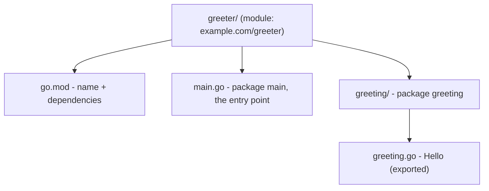

# Modules & Project Layout

One file is fine for learning. A real program is many files, often using code other people wrote, and
needs a way to say "this project depends on *that* library, at *this* version." That's what **modules**
and **packages** are for - get these two ideas straight and your project stops being a pile of `.go`
files and becomes something you can grow and ship as a single binary.

## Packages vs modules - two words people mix up

📝 **Terminology.**
- A **package** is a folder of `.go` files that belong together and share a name (you've already used the
  `fmt` package and written `package main`) - the unit of *code organization*, one folder, one package.
- A **module** is a whole *project*: a collection of packages versioned and released together, with one
  file (`go.mod`) recording its name and dependencies - the unit of *distribution and versioning*.

In short: **a module is your project; packages are the folders inside it.** A tiny program is one module,
one package; a big one is one module, many.

## `go mod init` - create the module

Start a project by making a folder and initializing a module in it:
```console
$ mkdir greeter
$ cd greeter
$ go mod init example.com/greeter
go: creating new go.mod: module example.com/greeter
```
`go mod init example.com/greeter` created a `go.mod` file marking this folder as a module named
`example.com/greeter`. That name is the module's **import path** - the unique address other code uses to
import it. Convention is a URL-like path (often where the code lives, e.g. `github.com/you/greeter`); for
a local-only project, anything unique works.

Peek at it:
```console
$ cat go.mod
module example.com/greeter

go 1.25
```
`go.mod` is small and human-readable: the module's name and the Go version it targets. Third-party
libraries get listed here too once added - the single source of truth for "what does my project depend
on." You rarely edit it by hand; the `go` tool keeps it updated.

## Exported = Capitalized - Go's whole visibility rule

Most languages use keywords like `public` and `private` to control what other code can see. **Go uses
capitalization instead, and that's the entire rule:**

> An identifier (a function, type, or variable name) that starts with a **Capital letter** is
> **exported** - visible to other packages. One that starts with a **lowercase letter** is **unexported**
> - private to its own package.

That's it, no keywords. Make a package folder `greeting` with a file `greeting.go`:
```go
package greeting

import "fmt"

// Hello is exported - capital H - so other packages can call it.
func Hello(name string) string {
	return fmt.Sprintf("Hello, %s!", greetingPrefix(name))
}

// greetingPrefix is unexported - lowercase g - private to this package.
func greetingPrefix(name string) string {
	return name
}
```
`Hello` starts with a capital `H`, so any package that imports `greeting` can call `greeting.Hello(...)`.
`greetingPrefix` starts lowercase - an internal helper, invisible outside this package even sitting right
there in the file. (`fmt.Sprintf` is like `Printf` but *returns* the formatted string instead of printing
it.)

💡 **Key point.** When you see `thing.DoStuff()`, the capital `D` is *why* you're allowed to call it.
Capitalize to make something part of your package's public surface; keep it lowercase to keep it an
implementation detail you're free to change later - a one-letter decision made on purpose.

## Importing your own package

Now use that package from your program. In the module root, a `main.go`:
```go
package main

import (
	"fmt"

	"example.com/greeter/greeting"
)

func main() {
	fmt.Println(greeting.Hello("Ada"))
}
```
```console
$ go run .
Hello, Ada!
```
The `import (...)` block (parentheses let you import several at once) brings in both the standard-library
`fmt` and *your own* `greeting` package, addressed by its full path: the module name `example.com/greeter`
plus the folder `greeting`. `greeting.Hello("Ada")` then calls the exported function. We ran `go run .` (a
dot, "this whole package") rather than naming a single file - once a project has multiple files, `.` tells
Go to build the package in the current folder, all of it together.

⚠️ **Gotcha.** The import path is **module name + folder path**, not just the folder name. With module
`example.com/greeter` and folder `greeting/`, the import is `"example.com/greeter/greeting"` - just
`"greeting"` won't resolve. The *package name* (`package greeting`) is what you type to use it
(`greeting.Hello`); keep folder and package names the same to avoid confusion.

## `go build` vs `go run`

`go run` compiles and runs in one disposable step - ideal while iterating. For the actual *program* - a
standalone executable to keep, ship, or deploy - use `go build`:
```console
$ go build
$ ls
go.mod  greeter  greeting  main.go
$ ./greeter
Hello, Ada!
```
`go build` compiled the module into a single executable named after its last path segment (`greeter` here;
`greeter.exe` on Windows). Running `./greeter` ran it directly - no `go` involved. That binary is
self-contained: copy it to another machine of the same OS and CPU type and it just runs, no Go installed there.
**`go run` = try it now; `go build` = produce the thing you ship.**

## A sane small layout

You don't need an elaborate folder structure to start - resist the urge to over-organize a small project.
A clean starting shape for a program with a bit of internal code:



The module root holds `go.mod` and your `package main` (the entry point); each subfolder is one package of
supporting code, grouped by what it does. As the project grows, add more package folders the same way -
each a self-contained unit with a clear public surface (capitalized names) and private internals
(lowercase). Start flat; split into packages only when a real grouping emerges.

## Looking ahead to concurrency

You now have the whole foundation: values and types, collections, control flow, multiple-return
functions, and a project structured into a module and packages.

So far every program has done **one thing at a time**, top to bottom. But the reason companies reach for
Go - the reason it powers Docker, Kubernetes, and a huge slice of the cloud - is how gracefully it does
*many* things at once: thousands of network connections, work in parallel, a server that stays responsive
under load. That's **concurrency**, and Go's tools for it (`goroutines` and `channels`) are next.

## Recap

1. A **package** is a folder of related code; a **module** is the whole project, defined by `go.mod`.
2. **`go mod init <path>`** creates the module and its `go.mod` (the record of name + dependencies).
3. **Exported = Capitalized.** Capital-first identifiers are public to other packages; lowercase-first are
   private - that's Go's entire visibility rule.
4. **Import your own packages** by `module-name/folder-path`, and run multi-file packages with `go run .`.
5. **`go run`** compiles-and-runs disposably; **`go build`** produces a standalone executable to ship.
6. **Start flat**, split into package folders only when a real grouping appears.

Next: goroutines and channels - doing many things at once, safely. The reason Go exists.

---

[← Phase 4: Control Flow & Functions](04-control-flow-and-functions.md) · [Guide overview](_guide.md) · [Phase 6: Goroutines & Channels →](06-goroutines-and-channels.md)
