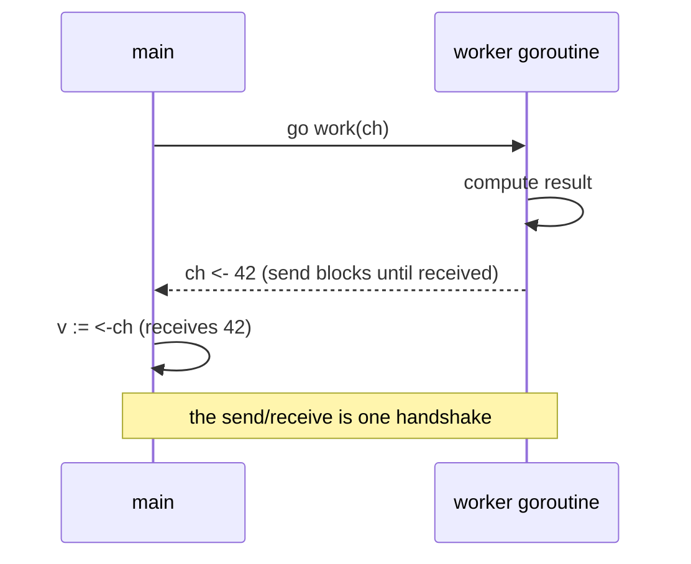

# Goroutines & Channels - Go's Concurrency

Concurrency is where a lot of languages make you feel stupid. Threads, locks, mutexes, callbacks, the dread of a race condition you can't reproduce - it's the part of the manual everyone skips and then pays for at 2am. Go's whole pitch is that it makes this *approachable*: the things you reach for daily are two small ideas, and they were designed to fit together.

Here's the mental model to carry through this phase. A **goroutine** is a task running alongside your other tasks - and it's so cheap to start that you can have thousands. A **channel** is a pipe between tasks: one goroutine puts a value in, another takes it out. That's it. The famous Go mantra falls right out of those two facts:

> **Don't communicate by sharing memory; share memory by communicating.**

Translation: instead of two tasks both poking at the same variable behind a lock (and racing each other), you hand the value down a channel from one to the other. Whoever is holding it owns it. No lock, no race, no 2am. Let's build that up.

## Goroutines: a concurrent task, started with one word

**What it actually is.** A goroutine is a function that runs concurrently with the rest of your program. You start one by putting the word `go` in front of a function call. The call returns immediately and your code keeps going; the function runs on its own.

📝 **Terminology.** A *goroutine* is not an operating-system thread. It's a lightweight task the Go runtime schedules onto a small pool of real threads for you. A goroutine starts with a tiny stack (a couple of kilobytes) that grows as needed, which is why running thousands of them is normal and cheap - a thing you genuinely cannot do with OS threads. (For what a thread actually is underneath, see [What Happens When Code Runs](/guides/what-happens-when-code-runs).)

**A real example.**
```go
package main

import (
	"fmt"
	"time"
)

func main() {
	go fmt.Println("hello from the goroutine")
	fmt.Println("hello from main")
	time.Sleep(10 * time.Millisecond) // give the goroutine a moment to run
}
```
```console
$ go run main.go
hello from main
hello from the goroutine
```
*What just happened:* `go fmt.Println(...)` launched that print as a separate task and returned instantly - so `main` printed its own line first, then the goroutine got a turn. The `time.Sleep` is a crude hack: without it, `main` would reach the end and the whole program would exit *before* the goroutine ever ran. (`main` ending kills every goroutine with it.) That sleep is a placeholder - channels and `WaitGroup`, below, are the real way to wait.

⚠️ **Gotcha.** When `main` returns, the program exits immediately and takes all goroutines with it, finished or not. A goroutine is not a promise that the work will complete - it's a request to run *alongside*. You need an explicit way to wait for it, which is exactly what the rest of this phase gives you.

## Channels: a typed pipe between goroutines

**What it actually is.** A channel is a pipe you can send values into and receive values out of - and every channel carries one specific type. A `chan int` carries `int`s; a `chan string` carries `string`s. You make one with `make`, send with `ch <- v`, and receive with `v := <-ch`.

**Why this is the heart of it.** A channel does two jobs at once. It *moves a value* from one goroutine to another, and it *synchronizes* them: on a plain (unbuffered) channel, a send blocks until someone is ready to receive, and a receive blocks until someone is ready to send. That blocking is a feature - it's a handshake. When the value comes out the other end, you *know* the sender has reached that point. You got coordination for free, without touching a lock.

Picture the handshake - one goroutine produces a number, sends it down the channel, and `main` receives it:



**A real example.** Here's the proper version of "wait for the goroutine," using a channel instead of `time.Sleep`:
```go
package main

import "fmt"

func work(ch chan int) {
	ch <- 42 // send the result into the channel
}

func main() {
	ch := make(chan int) // an unbuffered channel of ints
	go work(ch)
	v := <-ch // blocks here until work() sends
	fmt.Println("got", v)
}
```
```console
$ go run main.go
got 42
```
*What just happened:* `main` started `work` as a goroutine, then sat on `<-ch`, blocked, waiting. `work` computed its result and sent `42` into the channel; the instant it did, `main` woke up, received the value, and printed it. Notice there's no `Sleep` and no race - the channel itself made `main` wait for exactly the right moment. The value moved *and* the timing was coordinated, in one line each.

📝 **Terminology.** An *unbuffered* channel (`make(chan int)`) holds nothing - a send waits for a receiver, hand-to-hand. A *buffered* channel (`make(chan int, 3)`) has room for a few values, so a send only blocks when the buffer is full. Start with unbuffered; reach for a buffer only when you have a reason.

⚠️ **Gotcha - deadlock on an unbuffered channel.** Because an unbuffered send blocks until *someone* receives, sending on a channel that nobody is listening to freezes forever. Go's runtime can often detect when *every* goroutine is stuck and bails out:
```go
func main() {
	ch := make(chan int)
	ch <- 1 // nobody is receiving - this blocks forever
}
```
```console
$ go run main.go
fatal error: all goroutines are asleep - deadlock!

goroutine 1 [chan send]:
main.main()
	/tmp/main.go:3 +0x28
exit status 2
```
*What just happened:* `main` tried to send `1`, but there was no goroutine anywhere ready to receive it, so the send blocked. Since `main` was the only goroutine and it was now stuck, *nothing* could ever make progress - the runtime recognized that everyone was asleep and reported `deadlock!`. The fix is to make sure a receiver exists (often: start the receiver as a goroutine *before* you send, or use a buffered channel if a send genuinely shouldn't wait).

## Closing a channel and ranging over it

**What it actually is.** When a sender is done, it can `close(ch)` to signal "no more values are coming." A receiver can loop with `for v := range ch` to pull values until the channel is closed and drained, then stop cleanly.

**A real example.**
```go
package main

import "fmt"

func main() {
	ch := make(chan int)
	go func() {
		for i := 1; i <= 3; i++ {
			ch <- i
		}
		close(ch) // tell the receiver we're done
	}()

	for v := range ch { // loops until ch is closed and empty
		fmt.Println("received", v)
	}
}
```
```console
$ go run main.go
received 1
received 2
received 3
```
*What just happened:* The goroutine sent `1, 2, 3` and then `close(ch)`. The `for ... range ch` loop in `main` received each value as it arrived, and when the channel was closed and emptied, the loop ended on its own - no counter, no sentinel value. Closing is how a sender says "that's all," and `range` is how a receiver listens for exactly that.

⚠️ **Gotcha.** Only the *sender* should close a channel, and only once. Closing a channel that's already closed, or sending on a closed channel, panics. The rule of thumb: whoever owns the sending end owns the close.

## `select`: waiting on several channels at once

**What it actually is.** `select` is like a `switch`, but its cases are channel operations. It blocks until *one* of its cases can proceed, then runs that one. It's how a goroutine listens to multiple channels - "whichever speaks first."

**A real example.** A common shape: do some work, but give up if it takes too long.
```go
package main

import (
	"fmt"
	"time"
)

func main() {
	result := make(chan string)
	go func() {
		time.Sleep(2 * time.Second) // pretend this is slow work
		result <- "done"
	}()

	select {
	case r := <-result:
		fmt.Println("got result:", r)
	case <-time.After(1 * time.Second):
		fmt.Println("timed out waiting")
	}
}
```
```console
$ go run main.go
timed out waiting
```
*What just happened:* `select` waited on two channels at once: the `result` channel, and the one returned by `time.After`, which delivers a value after the given delay. The work took 2 seconds but the timeout fired at 1 second, so the `time.After` case won and we printed the timeout. `select` is your tool for "wait for whichever happens first" - results, timeouts, cancellation, all at the same time.

## `sync.WaitGroup`: wait for a batch of goroutines to finish

**What it actually is.** Sometimes you don't need to pass values back - you just need to launch a bunch of goroutines and wait until *all* of them are done. A `sync.WaitGroup` is a counter for exactly that: `Add` how many you're starting, each goroutine calls `Done` when it finishes, and `Wait` blocks until the counter hits zero.

**A real example.**
```go
package main

import (
	"fmt"
	"sync"
)

func main() {
	var wg sync.WaitGroup
	for i := 1; i <= 3; i++ {
		wg.Add(1) // one more goroutine to wait for
		go func(id int) {
			defer wg.Done() // mark this one done on the way out
			fmt.Println("worker", id, "finished")
		}(i)
	}
	wg.Wait() // block until all three call Done
	fmt.Println("all workers finished")
}
```
```console
$ go run main.go
worker 3 finished
worker 1 finished
worker 2 finished
all workers finished
```
*What just happened:* Each iteration called `wg.Add(1)` before launching a worker, and each worker called `wg.Done()` (via `defer`, so it runs no matter how the function exits). `wg.Wait()` held `main` until the counter dropped to zero - all three done. The workers ran in whatever order the scheduler picked (here `3, 1, 2`), but `"all workers finished"` is guaranteed to print last, because `Wait` doesn't return until they've all reported in.

💡 **Key point.** `defer wg.Done()` is the safe habit - it guarantees the counter is decremented even if the goroutine returns early or panics. Forget a `Done` and `Wait` blocks forever; call it twice and the counter goes negative and panics. One `Add`, one `Done`, per goroutine.

⚠️ **Gotcha - goroutine leaks.** A goroutine that blocks forever never gets cleaned up - it sits there holding memory for the life of the program. The usual cause is a goroutine waiting to send on (or receive from) a channel that nothing will ever touch again:
```go
func leak() {
	ch := make(chan int)
	go func() {
		val := <-ch // waits forever - nobody ever sends
		fmt.Println(val)
	}()
	// function returns; the goroutine is stranded, blocked, leaked
}
```
*What just happened:* `leak` started a goroutine that blocks on `<-ch`, then returned without ever sending anything. The goroutine can never make progress and can never exit - it's leaked. Unlike the all-stuck case earlier, the runtime *won't* warn you here, because the rest of the program is still happily running. Leaks are silent. The fix is to always give a blocked goroutine a way out: close the channel, or use a `select` with a cancellation/timeout case so it can give up.

## Recap

1. **Goroutine** - a cheap concurrent task; start it with `go f()`. Thousands are fine. When `main` exits, they all die, so you need a way to wait.
2. **Channel** - a typed pipe (`make(chan T)`) that both *moves* a value and *synchronizes* the two goroutines. An unbuffered send blocks until a receiver is ready.
3. **close + range** - the sender calls `close(ch)` to say "no more"; the receiver loops with `for v := range ch` until it's drained.
4. **`select`** - wait on several channels at once and act on whichever is ready first; pair with `time.After` for timeouts.
5. **`sync.WaitGroup`** - `Add`, `Done` (via `defer`), `Wait` to block until a batch of goroutines all finish.
6. **The mantra** - share memory by communicating: hand values down channels instead of locking shared variables. ⚠️ Watch for deadlock (send with no receiver) and leaks (a goroutine blocked forever).

You can now run work concurrently and coordinate it safely. The next thing every real program needs is to handle what goes *wrong* - and in Go, errors aren't exceptions thrown from the shadows; they're ordinary values you pass around. Let's see how that changes everything.

---

[← Phase 5: Modules & Project Layout](05-modules-and-project-layout.md) · [Phase 7: Errors & I/O →](07-errors-and-io.md)
