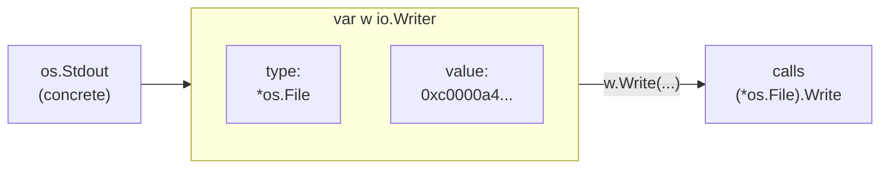

# Interfaces in Depth - Behavior, Not Hierarchy

In [Phase 9](09-idioms-and-gotchas.md) you met interfaces on the surface: small, implicitly satisfied lists of methods, like `io.Writer`. Underneath, though, is what an interface value actually *is* in memory - and once you see it, four separate-feeling quirks (type assertions, type switches, the empty interface, and the "my nil error isn't nil" bug) turn out to be one idea wearing four hats.

The mental model: **an interface value is not the thing you stored in it. It's a tiny box holding two slots - what type the thing is, and the thing itself.**

## The one idea: an interface value is a (type, value) pair

📝 **Interface value** - at runtime, a value of an interface type is a pair: a *dynamic type* (which concrete type is in the box right now) and a *dynamic value* (the actual data, or a pointer to it). The interface is just the box; the pair inside gives it behavior.

Assigning a concrete value to an interface variable makes Go record the concrete type alongside the value - the whole trick behind calling the *right* method later, and asking "what's actually in here?"



*What just happened:* assigning `os.Stdout` to an `io.Writer` variable filled both slots - type remembers `*os.File`, value points at the actual file. Calling `w.Write(...)` makes Go read the type slot to find *which* `Write` to run: **dynamic dispatch**, chosen at runtime from the concrete type in the box, not the interface type you declared. Two concrete types behind the same interface call two different methods - the entire point of an interface.

💡 **Why this matters.** Every feature in this phase is "do something with one of those two slots": assertions and switches *read the type slot*, the empty interface is *a box with no method requirements*, the nil trap is *the box being non-empty even when the value slot is nil*.

## Type assertions - getting the concrete value back out

A value inside an interface wears a disguise: you can only call the interface's methods, not the concrete type's other methods or fields. A **type assertion** pulls the disguise off - "I believe the concrete type here is `X`; give it back to me as an `X`."

📝 **Type assertion** - `x.(T)` checks interface value `x`'s dynamic type against `T`. Two forms: *comma-ok* `v, ok := x.(T)` (safe - `ok` tells you whether it matched), and *single-value* `v := x.(T)` (**panics** if the type doesn't match).

```go
package main

import "fmt"

func main() {
	var x any = "hello" // an interface box holding a string

	// comma-ok form: never panics, ok reports the match
	s, ok := x.(string)
	fmt.Println(s, ok)

	n, ok := x.(int) // wrong type - no panic, just ok == false
	fmt.Println(n, ok)

	// single-value form: panics if wrong. Use only when you're certain.
	s2 := x.(string)
	fmt.Println(s2)
}
```
```console
$ go run main.go
hello true
0 false
hello
```

*What just happened:* `x`'s type slot says `string`. `x.(string)` matched, so `s` got `"hello"` and `ok` was `true`; `x.(int)` didn't match, but comma-ok meant no panic - just `n = 0` and `ok = false`. The single-value `s2 := x.(string)` worked because we genuinely had a string; written as `x.(int)` it would have crashed with `panic: interface conversion: interface {} is string, not int`.

⚠️ **Reach for comma-ok by default.** Single-value is fine when a panic is the correct response to a broken assumption, but ordinary code almost always wants `ok` so it can handle "not that type" gracefully instead of taking down the program.

## Type switches - branching on the dynamic type

Chaining assertions for *several* possible concrete types gets ugly fast. The **type switch** reads the type slot and branches, binding the unwrapped value in each case.

📝 **Type switch** - `switch v := x.(type) { case T1: ... case T2: ... }`. The `.(type)` syntax is legal only inside a `switch`. In each `case`, `v` is already converted to that case's type, so you can use it directly.

Here's a small formatter that renders different types in different ways:

```go
package main

import "fmt"

type Point struct{ X, Y int }

func describe(x any) string {
	switch v := x.(type) {
	case int:
		return fmt.Sprintf("an int, doubled: %d", v*2)
	case string:
		return fmt.Sprintf("a string of length %d", len(v))
	case Point:
		return fmt.Sprintf("a point at (%d, %d)", v.X, v.Y)
	case nil:
		return "nothing at all"
	default:
		return fmt.Sprintf("some other type: %T", v)
	}
}

func main() {
	fmt.Println(describe(21))
	fmt.Println(describe("go"))
	fmt.Println(describe(Point{3, 4}))
	fmt.Println(describe(nil))
	fmt.Println(describe(3.14))
}
```
```console
$ go run main.go
an int, doubled: 42
a string of length 2
a point at (3, 4)
nothing at all
some other type: float64
```

*What just happened:* each `case` matched against `x`'s dynamic type - in `int`, `v` was already usable (`v*2` compiled); in `Point`, `v` had real `.X`/`.Y` fields. `nil` caught the empty box, and `default` swept up `float64` (`%T` prints the dynamic type). One switch replaced five separate comma-ok assertions.

## The empty interface and `any` - holds anything, knows nothing

An interface requiring *zero* methods accepts everything, since every type trivially has "no methods at all." That's the **empty interface**, written `interface{}`; since Go 1.18 it has a readable, identical alias: **`any`**.

📝 **`any` / `interface{}`** - an interface with no methods, so every value satisfies it: the universal box. You can put anything in, but call *no* methods on it until you pull the concrete type back out (with an assertion or type switch).

**When it's the right tool.** Genuinely heterogeneous data where you can't know the types ahead of time: decoded JSON (`map[string]any`), `fmt.Println`'s variadic `...any`, a cache storing arbitrary values.

```go
package main

import "fmt"

func main() {
	// A bag of mixed types - the empty interface earns its keep here.
	row := []any{"Ada", 36, true, 3.14}
	for _, field := range row {
		fmt.Printf("%v (%T)\n", field, field)
	}
}
```
```console
$ go run main.go
Ada (string)
36 (int)
true (bool)
3.14 (float64)
```

*What just happened:* `[]any` held a string, an int, a bool, and a float in one slice - impossible with a typed slice. Each element kept its own (type, value) pair, which is why `%T` reported the real type of each - the legitimate use case: data that's *inherently* mixed.

💡 **Prefer a specific interface whenever you can name the behavior you need.** `any` discards type safety - the compiler can't catch a wrong-type mistake, and every use site must assert the type back out. If what you need is "something I can write to" or "something with a `String()` method," declare *that* interface (`io.Writer`, `fmt.Stringer`). Code smell: a function taking `any` and immediately type-switching on known types usually wanted those types as a small interface instead.

## The nil-interface trap, fully explained

Phase 9 named this one and showed the symptom; now you have the model for *why* - one of the most baffling bugs in Go, and it follows directly from the (type, value) pair.

⚠️ **An interface is `nil` only when *both* slots are empty - type *and* value.** If the type slot holds a concrete type, the interface is **not nil**, even with a nil pointer in the value slot. A nil *pointer* and a nil *interface* are not the same thing.

The classic bug: a function returns a `*MyError`, and a nil one accidentally becomes a non-nil `error`.

```go
package main

import "fmt"

type MyError struct{ msg string }

func (e *MyError) Error() string { return e.msg }

// BUG: returns the concrete pointer type, even when there's no error.
func doWork(fail bool) error {
	var e *MyError // nil pointer of type *MyError
	if fail {
		e = &MyError{msg: "it broke"}
	}
	return e // <- always wraps *MyError into the error box
}

func main() {
	err := doWork(false) // we expect "no error"
	if err != nil {
		fmt.Println("caller thinks there was an error:", err)
	} else {
		fmt.Println("no error")
	}
}
```
```console
$ go run main.go
caller thinks there was an error: <nil>
```

*What just happened:* even with `fail == false`, `e` is a nil `*MyError` - but `return e` stuffs it into the `error` interface, filling the **type slot** with `*MyError`. The value slot is nil, the type slot isn't, so `err != nil` is `true` and the caller wrongly concludes work failed. (When printing, `fmt` calls `.Error()`, which panics dereferencing the nil `e` - but `fmt` recovers from that panic and, seeing a nil pointer, prints `<nil>`. Either way, the `if` already took the wrong branch.)

The fix: never let a typed nil leak into the interface. Return a *bare* `nil` when there's no error:

```go
package main

import "fmt"

type MyError struct{ msg string }

func (e *MyError) Error() string { return e.msg }

// FIXED: return the *interface* nil explicitly when nothing went wrong.
func doWork(fail bool) error {
	if fail {
		return &MyError{msg: "it broke"} // non-nil error, correctly
	}
	return nil // both slots empty -> a true nil error
}

func main() {
	err := doWork(false)
	if err != nil {
		fmt.Println("error:", err)
	} else {
		fmt.Println("no error")
	}
}
```
```console
$ go run main.go
no error
```

*What just happened:* returning the literal `nil` on the happy path hands back an interface with *both* slots empty - a genuine nil `error`, so `err != nil` is `false` and the caller takes the right branch. The rule: don't declare a typed pointer variable and return it as an interface; return concrete errors only when you have one, a bare `nil` otherwise - why idiomatic Go writes `return nil` rather than `return someNilPointer`.

## Recap

1. **An interface value is a (type, value) pair.** The type slot remembers the concrete type; the value slot holds the data. This single fact explains everything else, including dynamic dispatch - the method that runs is chosen from the concrete type in the box.
2. **Type assertions read the type slot.** `v, ok := x.(T)` is the safe comma-ok form; `v := x.(T)` panics on a mismatch. Default to comma-ok unless a panic is the right answer.
3. **A type switch** (`switch v := x.(type)`) branches on the dynamic type and hands you the unwrapped value per case - the clean way to handle several possible types.
4. **`any` (alias for `interface{}`)** accepts every value because it requires no methods. Right for genuinely heterogeneous data (JSON, mixed bags); a smell when a specific named interface would say what you actually need.
5. ⚠️ **The nil trap:** an interface is nil only when *both* slots are empty. A nil `*MyError` returned as `error` fills the type slot, so `err != nil` is true. Return a bare `nil`, never a typed nil pointer.

You now understand interfaces as a small box that pairs behavior with data, not a hierarchy. Next: **generics**, Go's way to write one function or type that works across many concrete types *with* full compile-time type safety.

## Quick check

Test yourself on the idea that ties this whole phase together - the (type, value) pair:

```quiz
[
  {
    "q": "What is an interface value actually made of at runtime?",
    "choices": [
      "A pair: the dynamic type of what's stored, plus the value (or a pointer to it)",
      "Just the concrete value, with the type discarded once stored",
      "A copy of the interface's method list and nothing else",
      "A string naming the interface type, like \"io.Writer\""
    ],
    "answer": 0,
    "explain": "An interface value holds two slots - a dynamic type and a dynamic value. That pairing is what enables dynamic dispatch and type assertions, and it's the reason the nil-interface trap exists."
  },
  {
    "q": "You write `n := x.(int)` (single-value form) but `x` actually holds a string. What happens?",
    "choices": [
      "The program panics with an interface conversion error",
      "`n` is set to 0 and execution continues",
      "It's a compile error - the types don't match",
      "`n` becomes the string converted to an int"
    ],
    "answer": 0,
    "explain": "The single-value assertion panics on a type mismatch. To check safely without panicking, use the comma-ok form `n, ok := x.(int)`, which sets `ok` to false instead of crashing."
  },
  {
    "q": "A function does `var e *MyError; return e` as an `error`. Why is the returned error not nil?",
    "choices": [
      "The interface's type slot is filled with *MyError, so only the value slot is nil - and an interface is nil only when both slots are empty",
      "Go automatically converts nil pointers into non-nil errors for safety",
      "Because *MyError has an Error() method, which can never be nil",
      "It actually is nil; the comparison `err != nil` is buggy in Go"
    ],
    "answer": 0,
    "explain": "Returning a typed nil pointer fills the interface's type slot with *MyError. An interface equals nil only when both the type and value slots are empty, so this one is non-nil. The fix is to return a bare `nil` when there's no error."
  }
]
```

---

[← Phase 9: Idioms & Common Gotchas](09-idioms-and-gotchas.md) · [Guide overview](_guide.md) · [Phase 11: Generics & Advanced Types →](11-generics-and-advanced-types.md)