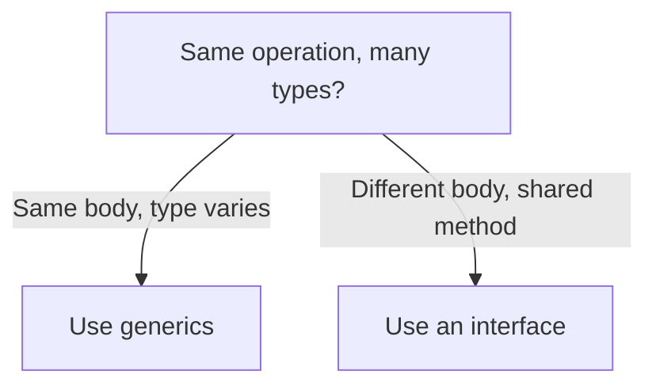

# Generics & Advanced Types - One Function, Many Types

For most of Go's life, there was a recurring papercut: you'd write a perfectly good `Max` function for `int`, then need the *same* logic for `float64`, then for `string`, and Go would make you write it three times. The logic was identical - only the type changed. That's the gap generics close.

The mental model: a **generic** function or type is one where you leave a type *blank* and fill it in later. You write the logic once, parameterized over "some type `T`," and the compiler stamps out a correct, type-checked version for each concrete type you actually use. You get the reuse of `interface{}` with none of the safety loss. This phase walks from the pain, to type parameters, to constraints, to generic types - and finishes with the method-set rule, the one piece of "advanced types" that quietly breaks code if you don't know it.

## The problem generics solve

Before generics, you had exactly two ways to write "the same logic for many types," and both hurt.

**Option one: copy-paste per type.** Write `MaxInt`, `MaxFloat`, `MaxString`. Identical bodies, three names, three places for a bug to hide.

**Option two: `interface{}` (now spelled `any`) and type assertions.** One function - but you throw away the type information at the door and have to claw it back at runtime:

```go
package main

import "fmt"

func MaxAny(a, b any) any {
	// We've lost the types. Now we have to guess them back.
	ai := a.(int) // panics if a isn't actually an int
	bi := b.(int)
	if ai > bi {
		return ai
	}
	return bi
}

func main() {
	fmt.Println(MaxAny(3, 7))      // works
	fmt.Println(MaxAny("a", "b"))  // compiles fine, panics at runtime
}
```
```console
$ go run main.go
7
panic: interface conversion: interface {} is string, not int
```
*What just happened:* `MaxAny` compiled happily even though it can only handle `int` - the `any` parameters accept *anything*, so the compiler can't warn you. The mistake surfaced at runtime as a panic, in production, far from where you wrote it. The return type is `any` too, so callers also have to assert the result back. This is the trade generics undo: keep one function, but let the compiler check the types *before* the program runs.

## Type parameters - leaving a type blank

A **type parameter** is a placeholder for a type, declared in square brackets right after the function name. Inside the function, you use it like any other type; at the call site, the compiler figures out (or you specify) what it should be.

📝 **Type parameter** - a named stand-in for a type (`T`, `K`, `V` by convention), written in `[...]` after the function or type name. It's filled in with a real type when the code is used, and the compiler type-checks each filled-in version.

Here's `Max`, written once, working for any ordered type. The `[T cmp.Ordered]` says "`T` is some type you can compare with `<` and `>`":

```go
package main

import (
	"cmp"
	"fmt"
)

func Max[T cmp.Ordered](a, b T) T {
	if a > b {
		return a
	}
	return b
}

func main() {
	fmt.Println(Max(3, 7))         // T inferred as int
	fmt.Println(Max(2.5, 1.5))     // T inferred as float64
	fmt.Println(Max("apple", "z")) // T inferred as string
}
```
```console
$ go run main.go
7
2.5
z
```
*What just happened:* One function, three types, zero runtime assertions. The compiler **inferred** `T` from each call - `Max(3, 7)` is an `int` call, `Max("apple", "z")` is a `string` call - and type-checked each one separately. Try `Max(3, "z")` and it won't compile, because `int` and `string` aren't the same `T`. That compile-time rejection is the whole point: the safety the `any` version threw away, handed back.

Generics shine for *container-shaped* helpers too. Here's `Map`, which transforms a slice of one type into a slice of another - note the *two* type parameters:

```go
package main

import "fmt"

// Map turns a []T into a []U by applying f to each element.
func Map[T, U any](in []T, f func(T) U) []U {
	out := make([]U, len(in))
	for i, v := range in {
		out[i] = f(v)
	}
	return out
}

func main() {
	nums := []int{1, 2, 3}
	lengths := Map(nums, func(n int) string {
		return fmt.Sprintf("#%d", n)
	})
	fmt.Println(lengths)
}
```
```console
$ go run main.go
[#1 #2 #3]
```
*What just happened:* `Map[T, U any]` has an *input* element type `T` and a *different output* type `U`. The compiler inferred `T = int` from the slice and `U = string` from what the function returns. The result is a properly typed `[]string` - not `[]any` - so the caller can use it without a single cast. `any` here means "no constraint at all," which is fine because `Map` never does anything to the elements except hand them to `f`.

## Constraints & type sets - what operations are allowed

You can't do *anything* you want to a value of type `T`. The compiler only lets you use operations it can *prove* every possible `T` supports. A **constraint** is how you make that promise. It answers the question: "what is this type allowed to do?"

There are two you'll use constantly:

- **`any`** - no constraint. The value can be passed around, stored, compared to `nil`, but not much else (you can't `+` it or `<` it). This is what `Map` used.
- **`comparable`** - the type supports `==` and `!=`. You need this for map keys and for "is this in the set?" checks.

For arithmetic or ordering, you need a constraint that actually permits those operators. That's where **type sets** come in: a constraint interface can list the concrete types it allows, and the `~` means "this type *or* any type whose underlying type is this."

📝 **Type set** - the set of types a constraint permits, written as a list of types joined by `|` inside an interface. `~int` means "int or any named type defined as int" (like `type Celsius int`). The allowed operations are whatever *all* listed types share.

```go
package main

import "fmt"

// Number permits any integer or float, including named types like `type Age int`.
type Number interface {
	~int | ~int64 | ~float64
}

func Sum[T Number](nums []T) T {
	var total T // zero value of whatever T is
	for _, n := range nums {
		total += n // allowed: every type in the set supports +
	}
	return total
}

type Age int // underlying type is int, so ~int covers it

func main() {
	fmt.Println(Sum([]int{1, 2, 3}))
	fmt.Println(Sum([]float64{1.5, 2.5}))
	fmt.Println(Sum([]Age{30, 40})) // works because of the ~
}
```
```console
$ go run main.go
6
4
70
```
*What just happened:* The `Number` constraint defines a type set - `int`, `int64`, or `float64` - and `Sum` is allowed to use `+` *only because every type in that set supports it*. The `~int` (rather than plain `int`) is what lets `Age`, a named type whose underlying type is `int`, slip through; without the `~`, only the literal type `int` would qualify. A constraint is not "which types fit" for its own sake - it's "which operations the compiler will let your generic code perform."

## Generic types - a typed container, written once

Type parameters aren't only for functions. A **struct** can be generic too, which is how you build a `Stack`, `Set`, or `Cache` that holds one specific type without resorting to `[]any`.

Here's a `Stack[T]` - a last-in-first-out container that's type-safe for whatever you put in it:

```go
package main

import "fmt"

type Stack[T any] struct {
	items []T
}

func (s *Stack[T]) Push(v T) {
	s.items = append(s.items, v)
}

func (s *Stack[T]) Pop() (T, bool) {
	var zero T
	if len(s.items) == 0 {
		return zero, false // nothing to pop
	}
	last := s.items[len(s.items)-1]
	s.items = s.items[:len(s.items)-1]
	return last, true
}

func main() {
	var s Stack[string] // a stack that holds strings, period
	s.Push("a")
	s.Push("b")

	v, ok := s.Pop()
	fmt.Println(v, ok)

	_, ok = s.Pop() // drain it
	_, ok = s.Pop() // now empty
	fmt.Println("empty pop ok?", ok)
}
```
```console
$ go run main.go
b true
empty pop ok? false
```
*What just happened:* `Stack[T any]` is a generic struct; its methods carry the `[T]` so they know which type they're operating on. Declaring `Stack[string]` locked `T` to `string` for that value - `s.Push(42)` would be a compile error. Notice the `var zero T` trick in `Pop`: you can't write a literal default for an unknown type, so `var zero T` gives you the zero value (`""` for strings, `0` for ints, `nil` for pointers) to return alongside the `false`. That paired `(value, ok)` return is the idiomatic way to signal "nothing there" without panicking.

## Method sets & receivers - the rule that bites

Now the "advanced types" piece that surprises people, and it's *not* about generics - it's about which methods count toward satisfying an interface. The answer depends on whether a method has a **value receiver** or a **pointer receiver**.

📝 **Method set** - the set of methods a type "has" for the purpose of satisfying interfaces. For a value type `T`, the method set is only its *value-receiver* methods. For a pointer `*T`, the method set is *both* its value-receiver and pointer-receiver methods.

The rule that catches everyone: **if a method has a pointer receiver, only `*T` satisfies the interface - not `T`.**

```go
package main

import "fmt"

type Speaker interface {
	Speak() string
}

type Dog struct{ name string }

// Pointer receiver - only *Dog will satisfy Speaker.
func (d *Dog) Speak() string { return d.name + " says woof" }

func main() {
	var s Speaker

	s = &Dog{name: "Rex"} // *Dog has Speak() → fits
	fmt.Println(s.Speak())

	// s = Dog{name: "Rex"}  // ← uncomment: COMPILE ERROR
	// Dog (value) does NOT satisfy Speaker, because Speak has a *pointer* receiver.
}
```
```console
$ go run main.go
Rex says woof
```
*What just happened:* `Speak` has a pointer receiver `(d *Dog)`, so only `*Dog` is in the method set that satisfies `Speaker`. Assigning a plain `Dog` value would fail to compile with `Dog does not implement Speaker (method Speak has pointer receiver)`. Why the asymmetry? Go can always take the address of an addressable value to call a pointer method, but it *can't* guarantee an arbitrary interface-held value is addressable - so it refuses at the safe boundary.

⚠️ **Gotcha - pointer receiver, value passed.** This is the canonical Go interface bug: you define methods with pointer receivers (correct, if they mutate state or the struct is large), then pass the *value* into something expecting the interface - a `[]Speaker`, a function parameter, a `json.Marshaler` slot - and get a confusing "does not implement" error. The fix is almost always to pass `&thing` instead of `thing`. The reverse direction is fine: a type with only value-receiver methods satisfies the interface as both `T` and `*T`.

💡 **Key point - generics or an interface?** They solve different shapes of problem, and reaching for the wrong one makes code awkward. Use **generics** when you have *the same logic for many types* - `Max`, `Map`, `Stack`: the body never changes, only the type does. Use an **interface** when you have *different logic behind shared behavior* - a `Writer` that's a file vs. a buffer vs. a socket, each `Write` doing something genuinely different. Rule of thumb: same code, varying type → generic; varying code, same call → interface. When both could work, the interface is usually the simpler, more idiomatic Go.



## Recap

1. **Generics solve duplication without losing safety** - before them you copy-pasted per type or used `any` + assertions (which moved errors to runtime). Type parameters keep one function and keep compile-time checking.
2. **Type parameters** go in `[...]` after the name (`func Max[T cmp.Ordered](...)`, `Map[T, U any]`); the compiler usually *infers* the concrete type from the call.
3. **Constraints define allowed operations.** `any` = no operations beyond passing around; `comparable` = `==`/`!=`; custom **type sets** (`~int | ~float64`) permit only the operations all listed types share. The `~` admits named types with that underlying type.
4. **Generic types** like `Stack[T]` give you typed containers written once; use `var zero T` to produce a default value for an unknown type.
5. ⚠️ **Method sets:** a pointer-receiver method means *only* `*T` satisfies the interface, not `T`. Pass `&thing`, not `thing`, into interface slots when methods have pointer receivers.
6. 💡 **Generics vs. interfaces:** same logic over many types → generics; different logic behind a shared method → interface.

You can now write code that's reused across types without giving up the compiler's help - and you know the method-set rule that otherwise turns a one-character fix into an hour of confusion. Next, we pull together everything about goroutines and channels into real concurrency patterns.

## Quick check

Test yourself on the two ideas most likely to bite - constraints and method sets:

```quiz
[
  {
    "q": "Why does the `any` version of `Max` compile even though it only handles `int`, while the generic version catches the mistake?",
    "choices": [
      "`any` accepts any value, so the compiler can't check the types - the error only appears at runtime as a panic",
      "`any` is slower, so the compiler skips type checking to save time",
      "The generic version also fails at runtime; there's no real difference",
      "`any` automatically converts strings to ints before comparing"
    ],
    "answer": 0,
    "explain": "An `any` parameter accepts everything, so the compiler has no type information to verify against - bad calls compile and panic at runtime. A type parameter ties the arguments to one concrete `T` the compiler checks before the program runs."
  },
  {
    "q": "In the constraint `~int | ~float64`, what does the `~` add?",
    "choices": [
      "It admits named types whose underlying type is int or float64 (like `type Age int`), not just the literal types",
      "It makes the constraint match all numeric types automatically",
      "It marks the types as optional, so any type at all is allowed",
      "It enables approximate (floating-point) comparison"
    ],
    "answer": 0,
    "explain": "`~int` means 'int, or any named type whose underlying type is int.' Without the `~`, only the literal type `int` qualifies and a `type Age int` would be rejected."
  },
  {
    "q": "`Speak()` has a pointer receiver `(d *Dog)`. Which satisfies the `Speaker` interface?",
    "choices": [
      "Only `*Dog` - a plain `Dog` value does not implement Speaker",
      "Only `Dog` - pointer receivers don't count toward interfaces",
      "Both `Dog` and `*Dog`, always",
      "Neither - interfaces require value receivers"
    ],
    "answer": 0,
    "explain": "A pointer-receiver method is only in the method set of `*T`, so only `*Dog` satisfies the interface. Pass `&Dog{...}`, not `Dog{...}`. (The reverse holds for value receivers: those satisfy via both `T` and `*T`.)"
  }
]
```

---

[← Phase 10: Interfaces in Depth](10-interfaces-in-depth.md) · [Guide overview](_guide.md) · [Phase 12: Concurrency Patterns →](12-concurrency-patterns.md)