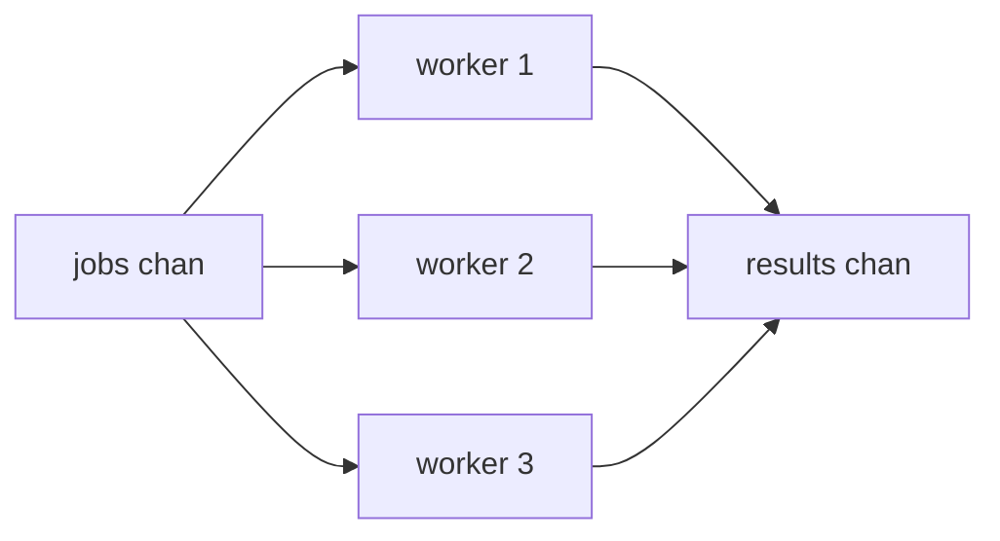

# Concurrency Patterns - From Goroutines to Real Systems

In [Phase 6](06-goroutines-and-channels.md) you learned the two primitives - `go` to start a concurrent task, channels to pass values safely. Those are the bricks; this phase is the architecture built from them over and over in real Go programs.

The mental model: production concurrency is rarely "start one goroutine and wait." It's "start a controlled number of goroutines, give them a way to *stop* when the work is no longer needed, spread work across them, collect results, and protect anything they share." Each section below is one piece of that - no new machinery, just `go`, channels, and `sync` arranged into shapes you'll reach for by name.

## `select` - wait on several channels at once

You met `select` briefly in Phase 6 for a timeout - time to make it a tool you reach for deliberately, the control structure that turns one-channel toys into real coordination.

📝 **`select`** - a `switch` whose cases are channel operations (sends or receives). It blocks until *one* case can proceed, then runs exactly that case; if several are ready at once, it picks one at random, so no single channel can starve the others.

**Non-blocking with `default`.** Add a `default` case and `select` stops blocking: if no channel is ready *right now*, it runs `default` and moves on - how you "peek" without committing to wait.

```go
package main

import "fmt"

func main() {
	jobs := make(chan int, 2)
	jobs <- 1 // buffer has room, so this doesn't block

	select {
	case j := <-jobs:
		fmt.Println("got a job:", j)
	default:
		fmt.Println("no job ready")
	}

	select {
	case j := <-jobs:
		fmt.Println("got a job:", j)
	default:
		fmt.Println("no job ready") // buffer is empty now
	}
}
```
```console
$ go run main.go
got a job: 1
no job ready
```
*What just happened:* The first `select` found a value waiting and took the receive case; the second found the channel empty and, thanks to `default`, didn't block - it reported "no job ready" and moved on. Without `default`, that second receive would block forever (`deadlock!`). `default` is your "try, but don't wait" switch.

**A timeout with `time.After`.** The other everyday shape: "wait for a result, but give up after a while." `time.After(d)` returns a channel delivering one value after duration `d` - put it in a `select` beside the thing you're really waiting on, and whichever fires first wins.

```go
package main

import (
	"fmt"
	"time"
)

func main() {
	result := make(chan string)
	go func() {
		time.Sleep(2 * time.Second) // slow work
		result <- "done"
	}()

	select {
	case r := <-result:
		fmt.Println("got:", r)
	case <-time.After(500 * time.Millisecond):
		fmt.Println("gave up waiting")
	}
}
```
```console
$ go run main.go
gave up waiting
```
*What just happened:* `select` watched two channels - `result` and the `time.After` timer. The work needed 2 seconds; the timer fired at half a second, so the timeout case won. The slow goroutine is still out there, though - it'll eventually try to send on `result` with nobody listening, and *leak*. That dangling goroutine is exactly what `context` solves next.

💡 **Key point.** `select` is the join point of Go concurrency: "receive a result *or* time out," "send *or* bail if the consumer is gone," "wait on work *or* a cancellation signal" - all the same shape, list the channels, let whichever is ready win.

## `context` - telling goroutines to stop

The timeout above stopped *us* from waiting, but did nothing to stop the *worker*. In a real server - thousands of requests, each spawning goroutines - work nobody needs anymore has to actually stop, or you bleed memory and CPU. That's what `context` is for.

📝 **`context.Context`** - a value carrying a cancellation signal (plus a deadline and request-scoped values) down a call tree, via one channel, `ctx.Done()`, that *closes* when work should stop. Goroutines `select` on `ctx.Done()` and exit when it fires; cancel a context and every context derived from it is cancelled too.

Create one from a parent (`context.Background()`, or a server's request context) with a helper that also gives you a way to trigger cancellation:

- `context.WithCancel(parent)` - returns a `ctx` and a `cancel()` function you call to stop it.
- `context.WithTimeout(parent, d)` - auto-cancels after duration `d` (and still gives you a `cancel` to call early).

**A real example.** A worker that loops until it's told to stop:

```go
package main

import (
	"context"
	"fmt"
	"time"
)

func worker(ctx context.Context) {
	for {
		select {
		case <-ctx.Done(): // cancellation signal arrived
			fmt.Println("worker stopping:", ctx.Err())
			return
		default:
			fmt.Println("working...")
			time.Sleep(200 * time.Millisecond)
		}
	}
}

func main() {
	ctx, cancel := context.WithTimeout(context.Background(), 500*time.Millisecond)
	defer cancel() // always release the context's resources

	worker(ctx)
}
```
```console
$ go run main.go
working...
working...
working...
worker stopping: context deadline exceeded
```
*What just happened:* The worker looped, doing a little work each pass. After 500ms the timeout fired, closing `ctx.Done()`; the `select` picked that case up, the worker printed why it stopped (`ctx.Err()` reports `context deadline exceeded`) and returned cleanly - no leak. The `defer cancel()` is non-negotiable: it frees the timer even when the timeout already fired, and `go vet` warns if you forget it.

💡 **Key point.** By strong convention, `ctx` is the **first parameter** of any function doing cancellable work: `func Fetch(ctx context.Context, url string) (...)`. Pass it down the call chain; never store it in a struct. When a request is cancelled or times out at the top, that signal propagates all the way down and every goroutine watching `ctx.Done()` unwinds - *the* idiom for not leaking goroutines.

## Worker pool - N goroutines sharing a queue of jobs

An unbounded number of goroutines (one per job, for a million jobs) will happily exhaust memory or hammer a database into the ground. The fix is a **worker pool**: a fixed crew of goroutines pulling jobs off one channel and pushing results onto another - parallelism *and* a cap on how much runs at once.



**A real example.** Three workers squaring numbers:

```go
package main

import (
	"fmt"
	"sync"
)

func worker(id int, jobs <-chan int, results chan<- int, wg *sync.WaitGroup) {
	defer wg.Done()
	for n := range jobs { // pull jobs until the channel is closed and drained
		results <- n * n
	}
}

func main() {
	jobs := make(chan int, 100)
	results := make(chan int, 100)

	var wg sync.WaitGroup
	for w := 1; w <= 3; w++ {
		wg.Add(1)
		go worker(w, jobs, results, &wg)
	}

	for n := 1; n <= 6; n++ {
		jobs <- n
	}
	close(jobs) // no more jobs; workers' range loops will end

	wg.Wait()      // wait for all workers to finish
	close(results) // safe to close now: nobody is still sending

	sum := 0
	for r := range results {
		sum += r
	}
	fmt.Println("sum of squares:", sum)
}
```
```console
$ go run main.go
sum of squares: 91
```
*What just happened:* Three workers each ran `for n := range jobs`, competing to pull from the same channel - free load balancing. `close(jobs)` after sending all six jobs let each worker's `range` loop end once the channel drained. A `WaitGroup` tracked the workers; once `wg.Wait()` returned, every sender on `results` was done, so it was safe to `close(results)` and range over it. Result order is non-deterministic, but the **sum is deterministic** - 1+4+9+16+25+36 = 91.

⚠️ **Gotcha - close in the right order.** `close(results)` must come *after* `wg.Wait()` - closing while a worker still sends panics with "send on closed channel." The discipline: senders finish, then whoever knows they're all done closes the channel.

Notice the directional channel types: `jobs <-chan int` (receive-only) and `results chan<- int` (send-only). The compiler now *enforces* that a worker can only take from `jobs` and put onto `results` - a safety rail documenting the data flow.

## Fan-out / fan-in - split work, then merge results

A worker pool *is* fan-out/fan-in, named by its two halves:

- **Fan-out** - multiple goroutines reading from the *same* channel, dividing the work (our three workers ranging over `jobs`).
- **Fan-in** - multiple goroutines writing to the *same* channel, merging output into one stream (our three workers sending to `results`).

The new wrinkle in a standalone merge: when several producers feed one output channel, *who closes it?* Same tool as above - a `WaitGroup` counting the producers, plus one goroutine that waits then closes:

```go
func merge(cs ...<-chan int) <-chan int {
	out := make(chan int)
	var wg sync.WaitGroup
	wg.Add(len(cs))
	for _, c := range cs {
		go func(c <-chan int) {
			defer wg.Done()
			for v := range c {
				out <- v
			}
		}(c)
	}
	go func() {
		wg.Wait()  // all producers drained
		close(out) // ...so it's safe to close the merged channel
	}()
	return out
}
```
*What just happened:* `merge` starts one goroutine per input channel, each copying values into the shared `out` channel - the fan-in. A separate goroutine waits on the `WaitGroup` and closes `out` only once every producer has finished, so the caller writes a plain `for v := range merge(...)`. This "WaitGroup + closer goroutine" combo is the canonical way to safely close a channel with many writers.

## The `sync` toolbox - when to share memory instead

Channels are the headline, but aren't always the right tool. Sometimes you genuinely have *shared state* - a counter, a cache, a config loaded once - and a channel is more ceremony than it's worth. That's what `sync` is for.

**`sync.Mutex` - one writer at a time.** A mutex is a lock: `Lock()` before touching shared state, `Unlock()` after. Only one goroutine holds the lock at a time, so the protected section can't race.

```go
package main

import (
	"fmt"
	"sync"
)

type counter struct {
	mu sync.Mutex
	n  int
}

func (c *counter) inc() {
	c.mu.Lock()
	defer c.mu.Unlock() // unlock on every exit path
	c.n++
}

func main() {
	c := &counter{}
	var wg sync.WaitGroup
	for i := 0; i < 1000; i++ {
		wg.Add(1)
		go func() {
			defer wg.Done()
			c.inc()
		}()
	}
	wg.Wait()
	fmt.Println("final count:", c.n)
}
```
```console
$ go run main.go
final count: 1000
```
*What just happened:* A thousand goroutines incremented the same `c.n`. `c.n++` looks atomic but isn't - read, add, write, three steps the scheduler can interrupt, so two goroutines can read the same value and lose an increment. The mutex serializes `inc`, so all 1000 land exactly. Remove the lock and you'd get something *less* than 1000, differently wrong each run. `defer c.mu.Unlock()` right after `Lock()` releases even if the body panics.

📝 **`sync.RWMutex`** - distinguishes readers from writers. Many goroutines can hold the *read* lock (`RLock`) at once, but a *write* lock (`Lock`) is exclusive. Reach for it when reads vastly outnumber writes (a config read on every request, written rarely) - readers run in parallel instead of queueing.

**`sync.WaitGroup` - recap.** Used throughout: `Add(n)` before launching, `defer Done()` inside each goroutine, `Wait()` to block until the counter hits zero.

**`sync.Once` - run something exactly once.** For one-time initialization (a config load, a singleton connection) several goroutines might trigger at once, `Once` guarantees the function runs a single time and every other caller blocks until it completes.

```go
var (
	once   sync.Once
	config map[string]string
)

func loadConfig() map[string]string {
	once.Do(func() {
		fmt.Println("loading config (this prints once)")
		config = map[string]string{"env": "prod"}
	})
	return config
}
```
*What just happened:* No matter how many goroutines call `loadConfig` simultaneously, `once.Do` runs its function exactly one time; the rest wait, then see the already-populated `config` - race-free lazy initialization without writing your own locking.

**So: channel or mutex?** The Phase 6 mantra - *"don't communicate by sharing memory; share memory by communicating"* - is the default, not a law:

- Use a **channel** when you're *passing ownership* of data between goroutines, or coordinating *who does what next*.
- Use a **mutex** when goroutines genuinely *share* one piece of state and each needs brief, exclusive access (a counter, an in-memory cache) - wrapping that in channels is usually more code for no benefit.

If unsure, start with a channel - it's harder to misuse. Drop to a mutex when the channel version feels like fighting the problem.

⚠️ **Gotcha - goroutine leaks, again.** The silent failure of every pattern here: a goroutine blocked forever on a send or receive that never happens never gets garbage-collected, and the runtime won't warn you. The slow worker from the `select`/timeout example was one. The fixes: give every long-lived goroutine a `ctx.Done()` case, and make sure every channel you send on has a guaranteed receiver (or gets closed). Leaks don't crash - they slowly eat memory until something far away falls over.

**And finally: the race detector.** Some concurrency bugs cannot be found by reading at all. A data race - two goroutines touching the same memory at once, at least one writing, no synchronization - might work fine for a million runs and corrupt data on the million-and-first. Go ships a tool that finds them for you:

```console
$ go run -race main.go     # run with the race detector on
$ go test -race ./...      # or, far better, run your whole test suite with it
```

Run with `-race` and Go instruments every memory access; the instant two goroutines touch the same location unsafely, it prints a `WARNING: DATA RACE` report naming the goroutines, variable, and stack traces - catching the lost-update bug from the mutex example, slice and map races, all of it. It's slower (don't ship a `-race` binary), but make `go test -race` part of your normal runs - the single highest-leverage habit in concurrent Go. If you write goroutines and never run it, you have bugs you haven't met yet.

## Recap

1. **`select`** waits on several channel operations and runs whichever is ready; add `default` for a non-blocking peek, and pair with `time.After` for timeouts. It's the join point of all the patterns here.
2. **`context`** carries a cancellation signal down a call tree. Goroutines `select` on `ctx.Done()` to stop cleanly; create one with `WithCancel`/`WithTimeout`, always `defer cancel()`, and pass `ctx` as the first parameter.
3. **Worker pool** caps concurrency: a fixed set of goroutines `range` over one jobs channel and send to one results channel. Close `jobs` to end the workers; `WaitGroup` then tells you when it's safe to close `results`.
4. **Fan-out / fan-in** is that pool by name - many readers split the work, many writers merge results. To close a many-writer channel safely, use a `WaitGroup` plus a goroutine that waits then closes.
5. **The `sync` toolbox** guards shared state directly: `Mutex`/`RWMutex` for exclusive (or read-shared) access, `WaitGroup` to wait for a batch, `Once` for one-time init. Channels to pass ownership; mutexes to share state. ⚠️ A goroutine blocked forever is a silent leak - give every one a way out.
6. **The race detector** (`go test -race`, `go run -race`) finds data races that reading the code never will. Make it part of your normal test runs.

You can now build the concurrent shapes real Go services are made of - bounded, cancellable, checked for races. Next: handling what goes *wrong*, the Go way.

## Quick check

Test yourself on the patterns that separate toy goroutines from production ones:

```quiz
[
  {
    "q": "In a worker pool, why must `close(results)` come after `wg.Wait()` rather than before?",
    "choices": [
      "Because a worker still sending on `results` would panic if the channel were already closed",
      "Because `close` only works on empty channels",
      "Because `wg.Wait()` is what allocates the results channel",
      "Because closing first would make the workers run twice"
    ],
    "answer": 0,
    "explain": "Sending on a closed channel panics. `wg.Wait()` returns only once every worker has finished (and therefore stopped sending), so it's the signal that closing `results` is now safe."
  },
  {
    "q": "What does a goroutine actually do to respond to a context being cancelled?",
    "choices": [
      "It `select`s on `ctx.Done()`, which becomes ready when the context is cancelled, and returns",
      "It polls `ctx.Cancelled` as a boolean every loop",
      "Go automatically kills the goroutine when `cancel()` is called",
      "It waits for the garbage collector to stop it"
    ],
    "answer": 0,
    "explain": "Cancellation closes the channel returned by `ctx.Done()`. A goroutine watches that channel in a `select`; once it's ready, the goroutine cleans up and returns on its own. Go never forcibly stops a goroutine - cooperation via `ctx.Done()` is the mechanism."
  },
  {
    "q": "You have a shared in-memory counter incremented by 1000 goroutines and the final total is sometimes less than 1000. What's the right fix?",
    "choices": [
      "Protect the increment with a `sync.Mutex` (or run with `-race` to confirm the data race first)",
      "Add a `time.Sleep` after each increment so they don't collide",
      "Run the program more times until it gives 1000",
      "Make the counter a global variable so all goroutines see it"
    ],
    "answer": 0,
    "explain": "`n++` is read-add-write, not atomic, so concurrent increments lose updates - a classic data race. A mutex serializes access so every increment lands. `go run -race` will pinpoint exactly this race; sleeping only hides it, and a global is still shared unsafely."
  }
]
```

---

[← Phase 11: Generics & Advanced Types](11-generics-and-advanced-types.md) · [Guide overview](_guide.md) · [Phase 13: Error Handling, Deep →](13-error-handling-deep.md)
