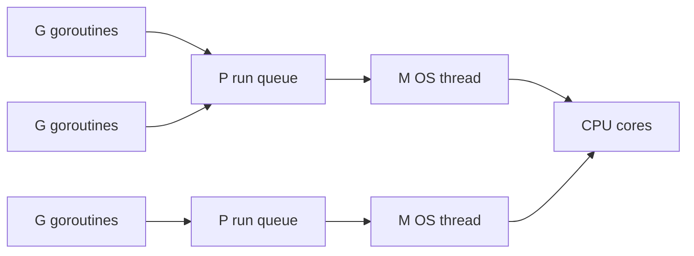

# The Runtime: Scheduler, Memory & GC - What Go Does for You

Back in the concurrency phases you spun up goroutines with a single keyword and never thought about the cost. You typed `go doWork()` a thousand times and your program didn't fall over. That's not luck - it's the Go **runtime**, machinery baked into every binary that schedules your goroutines, decides where values live, and quietly cleans up memory you stop using.

You can write Go for years without opening this hood. But "why are goroutines so cheap?", "why did memory usage climb and never come back down?", and "why is the compiler putting *this* on the heap?" are all runtime questions. The big idea: **Go trades a little magic you don't control for a lot of work you don't have to do** - and it pays off as long as you know the few places it can still bite.

## Why goroutines are cheap

The first thing to unlearn: a goroutine is **not** an operating-system thread. "Lightweight thread" is close enough to be dangerous - the same heavy object with a smaller label, which is wrong.

📝 **Goroutine** - a function managed by the Go runtime, not the OS. It starts with a tiny (~2 KB) stack that *grows on demand*, and the runtime - not the kernel - decides when it runs. **OS thread** - a unit the kernel schedules, with a large fixed stack (often ~1–8 MB) and an expensive kernel-space context switch.

Run the numbers: a thousand OS threads at 1 MB of stack each is a gigabyte reserved before a line of your code runs. A thousand goroutines at 2 KB each is about 2 MB, growing only if a goroutine needs a deeper stack. That's why "spawn a goroutine per request" is normal Go, and "spawn a thread per request" brings a server to its knees.

```go
package main

import (
	"fmt"
	"sync"
)

func main() {
	var wg sync.WaitGroup
	for i := 0; i < 100_000; i++ { // a hundred thousand goroutines - no problem
		wg.Add(1)
		go func(n int) {
			defer wg.Done()
			_ = n * n
		}(i)
	}
	wg.Wait()
	fmt.Println("all 100,000 goroutines finished")
}
```
```console
$ go run main.go
all 100,000 goroutines finished
```
*What just happened:* We launched a hundred thousand goroutines and the program shrugged - a hundred thousand OS threads would exhaust memory before they even started. Each goroutine began life with a stack measured in kilobytes; the kernel never saw 100,000 schedulable things, just a handful of threads - the trick we're about to unpack.

💡 **The insight.** Cheap goroutines aren't free - the runtime keeps the *expensive* resources (OS threads) small in number and reuses them, while the *cheap* things (goroutines) multiply freely. The scheduler makes that reuse possible.

## The GMP scheduler

With 100,000 goroutines and maybe 8 CPU cores, something has to decide which goroutine runs on which core, and when. That's the **GMP scheduler**, and once you know its three letters the whole design clicks.

📝 **G (goroutine)** - its stack, instruction pointer, and state; there can be hundreds of thousands. **M (machine)** - an OS thread, what the kernel actually schedules onto a CPU; there are few. **P (processor)** - a *logical* processor: a scheduling context holding a queue of runnable Gs and the resources an M needs to run them, set by `GOMAXPROCS` (default: CPU core count).

The shape to hold in your head: an **M must hold a P to run a G**. Ps are the permission slips - exactly `GOMAXPROCS` of them, so at most that many goroutines run *truly in parallel*, but the runtime cycles thousands of Gs through those few Ps fast enough that everything makes progress.



Two mechanisms keep the cores busy:

- **Blocking syscalls don't block the core.** When a goroutine makes a blocking syscall (reading a file, waiting on the network), its M gets stuck in the kernel. Rather than let a precious P sit idle, the runtime **hands that P to another M**, which immediately runs other goroutines - your CPU never twiddles its thumbs because one goroutine is waiting on disk.
- **Work-stealing balances the load.** When a P empties its local run queue, instead of going idle it **steals** half the runnable goroutines from another P's queue - spreading work across cores without a single global lock to fight over.

```go
package main

import (
	"fmt"
	"runtime"
)

func main() {
	fmt.Println("GOMAXPROCS (Ps):", runtime.GOMAXPROCS(0)) // 0 = query, don't change
	fmt.Println("CPU cores:      ", runtime.NumCPU())
	go func() {}()
	fmt.Println("goroutines now: ", runtime.NumGoroutine())
}
```
```console
$ go run main.go
GOMAXPROCS (Ps): 8
CPU cores:       8
goroutines now:  2
```
*What just happened:* `GOMAXPROCS(0)` reports how many Ps exist - 8 here, matching the cores, so up to 8 goroutines run in parallel. `NumGoroutine()` shows 2: `main`'s goroutine plus the one launched. The takeaway: a small, fixed number of Ps governs parallelism, while the goroutine count balloons independently.

⚠️ **Gotcha - `GOMAXPROCS` is parallelism, not concurrency.** Setting `GOMAXPROCS=1` does *not* break a concurrent program; goroutines still interleave on that single P, it just limits how many run at the literal same instant. Concurrency (structure) and parallelism (simultaneous execution) are different knobs - see [Phase 12: Concurrency Patterns](12-concurrency-patterns.md) for the structure side.

## Stack vs heap - where your values live

The scheduler decides *when* code runs. The other half decides *where data lives* - the stack or the heap.

📝 **Stack** - a per-goroutine region that grows and shrinks with function calls. When a function returns, its slice of the stack vanishes instantly and for free - allocation is a pointer bump, deallocation automatic. **Heap** - a shared pool for values that must outlive their creating function; it's *not* auto-freed on return, reclaiming it is the garbage collector's job.

In many languages you choose: `int x` on the stack, `new Thing()` on the heap. In Go, **you don't choose - the compiler does.** Write `x := Thing{}` and Go figures out whether `x` can live and die on the stack (cheap) or must be promoted to the heap (more expensive, since the GC must track it). The compiler's rule: *if a value can outlive its function, it must go on the heap* - and the analysis that applies it has a name.

## Escape analysis

📝 **Escape analysis** - the compile-time pass deciding, for each value, whether it stays on the stack or must "escape" to the heap. A value escapes when the compiler can't prove it's done being used by the time its function returns - most commonly because a pointer to it leaks out.

The classic escape: returning a pointer to a local variable. It would normally die when the function returns, but handing its address to the caller means it *can't* - it lives on the heap instead.

```go
package main

type Point struct{ X, Y int }

// stays: the Point is copied out by value, the local can die on return
func makeValue() Point {
	p := Point{1, 2}
	return p
}

// escapes: we return a pointer, so p must outlive makeValue → heap
func makePointer() *Point {
	p := Point{3, 4}
	return &p
}

func main() {
	_ = makeValue()
	_ = makePointer()
}
```

You don't have to guess what the compiler decided - ask it. The `-gcflags=-m` flag prints escape-analysis decisions:

```console
$ go build -gcflags=-m main.go
./main.go:13:2: moved to heap: p
./main.go:14:9: &p escapes to heap
```
*What just happened:* The compiler reported `p` inside `makePointer` **moved to heap** because its address escapes via `return &p`. It said *nothing* about `makeValue`'s `p`, which stayed on the stack and vanished for free. Same-looking code, two fates, decided entirely by whether a pointer leaked. (Returning a *pointer* can be more expensive than a *value* here, precisely because it forces a heap allocation.)

💡 **The insight.** Fewer escapes means fewer heap allocations means less GC work - *the* lever behind most Go performance tuning. When a hot path is slow, run `-gcflags=-m`, find values escaping inside your tight loop, and restructure to keep them on the stack. You rarely fight the GC directly - you reduce the garbage it has to collect. (You'll measure exactly this with the profiler in [Phase 15](15-testing-benchmarks-profiling.md).)

## The garbage collector

Everything that escapes to the heap eventually stops being used. Something has to reclaim it, and in Go that's automatic.

📝 **Garbage collector (GC)** - the runtime component that finds heap memory your program can no longer reach and frees it, so you never call `free()` yourself. Go's GC is a **concurrent, tri-color mark-and-sweep tracing** collector tuned for *low pause times*.

The model: the GC works by **reachability**. Starting from the roots (global variables, everything on every goroutine's stack), it traces every pointer it can follow. Anything reached is *live* and kept; anything unreachable is garbage, swept back into the pool. You don't track lifetimes; reachability *is* the lifetime.

The "concurrent, low-pause" part makes it pleasant. Older GCs would freeze the entire program ("stop the world") while marking, causing visible hiccups. Go's GC marks **concurrently, while your program keeps running**, reserving stop-the-world for two brief phases at the start and end - typically sub-millisecond even on large heaps, optimizing for "no big stalls" over "absolute minimum CPU."

One main dial: the `GOGC` environment variable (default `100`), controlling the memory-vs-CPU trade-off. `GOGC=100` lets the heap grow to roughly double the live set before the next collection. Raise it (`GOGC=200`) and the GC runs less often, using more memory but less CPU; lower it (`GOGC=50`) for the opposite. Most programs never touch it.

Watch the heap grow and the GC reclaim it:

```go
package main

import (
	"fmt"
	"runtime"
)

func heapBytes() uint64 {
	var m runtime.MemStats
	runtime.ReadMemStats(&m)
	return m.HeapAlloc
}

func main() {
	fmt.Printf("before: %d KB\n", heapBytes()/1024)

	junk := make([][]byte, 0, 1000)
	for i := 0; i < 1000; i++ {
		junk = append(junk, make([]byte, 10_000)) // ~10 MB of reachable garbage-to-be
	}
	fmt.Printf("after allocating: %d KB\n", heapBytes()/1024)

	junk = nil      // drop the only reference → all of it is now unreachable
	runtime.GC()    // force a collection (normally you'd never call this)
	fmt.Printf("after GC: %d KB\n", heapBytes()/1024)
}
```
```console
$ go run main.go
before: 96 KB
after allocating: 9863 KB
after GC: 102 KB
```
*What just happened:* Allocating a thousand 10 KB slices pushed the live heap to ~9.8 MB. The instant we set `junk = nil`, nothing could reach those slices anymore. The next collection traced from the roots, found none of them, and swept the memory back near its starting size - we never freed anything by hand. (`runtime.GC()` here just makes the timing visible; real code lets the GC decide when to run, driven by `GOGC`.)

Step through the mark-and-sweep cycle - roots, reachable, and swept - at your own pace:

```playground-gc
```

⚠️ **Gotcha - you can still "leak."** Automatic GC doesn't mean leak-proof - it only frees what's *unreachable*, so accidentally keeping a reference alive keeps the memory forever, looking exactly like a leak. Two classic culprits:

```go
// 1. A goroutine that never exits, holding memory the whole time.
func leakyGoroutine(data []byte) {
	go func() {
		<-make(chan struct{}) // blocks forever; nothing ever sends
		_ = data              // `data` is reachable as long as this goroutine lives
	}()
}

// 2. A global map that only ever grows.
var cache = map[string][]byte{}

func remember(key string, val []byte) {
	cache[key] = val // never deleted → cache (and its memory) grows without bound
}
```
*What just happened:* The goroutine blocks on a channel that never receives, so it never returns - and because it closes over `data`, that slice stays reachable forever. A pile of such stuck goroutines is the most common real Go memory leak. The global `cache` similarly keeps every value reachable for the program's life; without an eviction policy it grows until memory runs out. The GC does its job perfectly in both cases - the memory genuinely *is* still reachable. The fix isn't a GC setting; it's making sure goroutines can exit (a `context` or done channel, from [Phase 12](12-concurrency-patterns.md)) and long-lived maps have a bound.

## Recap

1. A **goroutine is not an OS thread** - it starts at ~2 KB with a growable stack, scheduled by the runtime, which is why a program can run hundreds of thousands where it could afford only a handful of threads.
2. The **GMP scheduler** multiplexes many **G**s onto few **M**s (OS threads) via **P**s (logical processors, capped by `GOMAXPROCS`). Handing off Ps on blocking syscalls and work-stealing keep every core busy.
3. Every value lives on the **stack** (cheap, auto-freed on return) or the **heap** (needs the GC). **Escape analysis** - visible via `go build -gcflags=-m` - decides which; a value escapes when it can outlive its function (e.g. returning a pointer to a local).
4. Go's **garbage collector** is concurrent, low-pause, mark-and-sweep, and reachability-based: it frees what your program can no longer reach, so you never call `free()`. `GOGC` tunes the memory-vs-CPU trade-off.
5. ⚠️ Automatic GC is **not leak-proof** - anything still *reachable* is kept, so stuck goroutines and ever-growing global maps cause real memory growth. Fewer heap escapes and bounded lifetimes, not GC settings, are your main levers.

You now know what happens beneath `go`, `make`, and `&`. Next: making it measurable - testing, benchmarking, and profiling, where you'll watch allocations and CPU time with real tools instead of reasoning in the abstract.

## Quick check

Test yourself on the three ideas that matter most - cheap goroutines, the GMP roles, and what "escape" really means:

```quiz
[
  {
    "q": "Why can a Go program run hundreds of thousands of goroutines but not hundreds of thousands of OS threads?",
    "choices": [
      "A goroutine starts with a tiny (~2 KB) growable stack and is scheduled by the runtime, while each OS thread reserves a large fixed stack and is scheduled by the kernel",
      "Goroutines run on the GPU instead of the CPU, which has far more cores",
      "The Go compiler converts goroutines into a single thread, so there's really only ever one",
      "Goroutines don't use memory at all until they finish running"
    ],
    "answer": 0,
    "explain": "A goroutine begins life at roughly 2 KB with a stack that grows on demand and is multiplexed onto a few OS threads by the runtime. OS threads each reserve a large fixed stack (often 1–8 MB) and carry kernel-scheduling overhead, so thousands of them exhaust memory fast."
  },
  {
    "q": "In the GMP scheduler, what is a P?",
    "choices": [
      "A logical processor: a scheduling context with a run queue of goroutines, capped by GOMAXPROCS, that an M must hold to run a G",
      "The pointer to a goroutine's stack",
      "A physical CPU core, exactly one per chip",
      "A 'pending' goroutine that is blocked on a channel"
    ],
    "answer": 0,
    "explain": "G is a goroutine, M is an OS thread, and P is a logical processor - a scheduling context holding a run queue. An M must hold a P to run a G, and the number of Ps (GOMAXPROCS) sets how many goroutines run truly in parallel."
  },
  {
    "q": "According to escape analysis, why does returning `&p` (a pointer to a local) force `p` onto the heap?",
    "choices": [
      "Because p must outlive the function that created it, so it can't die with the stack frame on return",
      "Because pointers are always stored on the heap in every language",
      "Because the garbage collector refuses to track stack memory",
      "Because returning a pointer is a compile error unless the value is heap-allocated"
    ],
    "answer": 0,
    "explain": "A stack-allocated local would vanish when its function returns. Returning its address means the caller can still use it afterward, so the value must outlive the frame - the compiler 'moves it to heap.' Returning the value by copy instead lets it stay on the stack."
  }
]
```

---

[← Phase 13: Error Handling, Deep](13-error-handling-deep.md) · [Guide overview](_guide.md) · [Phase 15: Testing, Benchmarks & Profiling →](15-testing-benchmarks-profiling.md)
