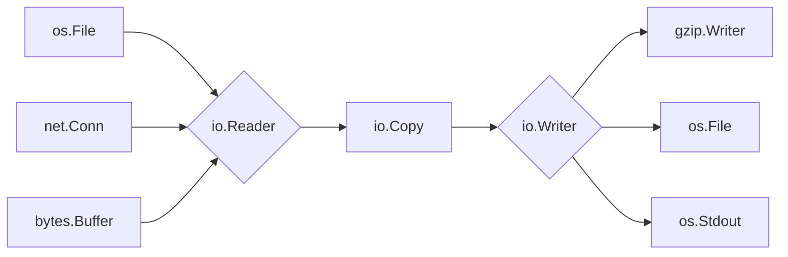

# The Standard Library as Design - Small Interfaces, Big Reach

Most languages ship a standard library that feels like a junk drawer - modules accreted over decades, each with its own opinions and quirks. Go's feels *designed*. Pick up almost any package and you find the same handful of small ideas reused everywhere, so learning one corner teaches you the next.

The mental model: **Go's standard library is built on a few tiny interfaces that compose into enormous reach.** Phases [9](09-idioms-and-gotchas.md) and [10](10-interfaces-in-depth.md) showed Go interfaces are small and satisfied implicitly. This phase shows what that buys a *whole ecosystem*: a file, a network connection, an in-memory buffer, and a gzip compressor can all plug into each other, because every one speaks the same one-method language. Once you see the pattern, you'll stop reaching for third-party packages reflexively - the stdlib has probably already solved it, coherently.

## `io.Reader` and `io.Writer` - two methods that run the I/O world

**What it actually is.** Nearly all Go input and output flows through two interfaces, each with exactly *one* method:

```go
type Reader interface {
	Read(p []byte) (n int, err error)
}

type Writer interface {
	Write(p []byte) (n int, err error)
}
```

A `Reader` is "anything you can pull bytes *from*." A `Writer` is "anything you can push bytes *to*." That's the entire contract. Because satisfaction is implicit (Phase 9), a staggering number of unrelated types end up being readers and writers without saying so: an open file, a TCP connection, a `bytes.Buffer`, an HTTP request body, a gzip stream, even `os.Stdout`.

📝 **Terminology.** `io.Reader` / `io.Writer` are the two foundational interfaces in `io`. A type "is a reader" by having a `Read([]byte) (int, error)` method - no inheritance, no registration. Same for writers.

**Why this is the whole game.** Because every source is a `Reader` and every destination a `Writer`, *any* source can connect to *any* destination. No `copyFileToSocket` and separate `copyBufferToFile` - one `io.Copy(dst Writer, src Reader)` works for every combination, including ones nobody anticipated. The pieces compose like Lego: same studs.



*One idea:* anything on the left flows into anything on the right, since the middle only ever talks about `Reader` and `Writer`. A gzip writer is *itself* a writer wrapping another writer, so you can stack them.

**A real example.** One piece of plumbing, two very different destinations:

```go
package main

import (
	"bytes"
	"io"
	"os"
	"strings"
)

func main() {
	src := strings.NewReader("hello, readers and writers\n") // a Reader over a string

	var buf bytes.Buffer        // an in-memory Writer
	io.Copy(&buf, src)          // pump everything from src into buf

	// Reset and copy the same kind of source straight to the terminal.
	src2 := strings.NewReader("...and now to stdout\n")
	io.Copy(os.Stdout, src2)    // os.Stdout is a Writer too

	os.Stdout.WriteString(buf.String())
}
```
```console
$ go run main.go
...and now to stdout
hello, readers and writers
```
*What just happened:* `strings.NewReader` gave a `Reader` over a plain string. `io.Copy` doesn't know or care what's on either end - it pulled bytes from the reader and pushed them to the writer until EOF, once into a `bytes.Buffer`, once into `os.Stdout`, changing *nothing* about the copy logic. The buffer and the terminal share nothing except satisfying `io.Writer` - all `io.Copy` ever asked for.

💡 **Key point.** This is interface-driven design from [Phase 10](10-interfaces-in-depth.md), at the scale of an entire standard library. Functions are written against the *smallest* interface they need (`io.Copy` needs only `Read` and `Write`), accepting the widest set of types - including types written years later. Wrapping is the superpower: a `gzip.Writer` compresses on its way to *another* writer, so `gzip.NewWriter(file)` gives "compress, then write to disk" by stacking two writers.

## `context` - carrying cancellation across boundaries

You met `context` in [Phase 12](12-concurrency-patterns.md) for stopping work. It deserves a spot here because `context.Context` is itself a tiny interface the rest of the library threads through everything.

**What it actually is.** A `Context` carries three things across API boundaries: a **cancellation signal** (a `Done()` channel that closes when work should stop), an optional **deadline**, and **request-scoped values**. By convention it's the *first* parameter of any cancellable function: `func Fetch(ctx context.Context, url string) (...)`.

**Why this is a design lesson.** Because `net/http`, database drivers, and most well-behaved libraries all accept a `context.Context`, cancellation composes the same way `io` does. A single timeout set at the top flows down through the HTTP handler, into the database query, into the outbound API call - every layer watches the same `Done()` channel, giving cancellation across the entire call tree for free.

```go
package main

import (
	"context"
	"fmt"
	"time"
)

func slowWork(ctx context.Context) error {
	select {
	case <-time.After(2 * time.Second): // pretend this takes 2s
		return nil
	case <-ctx.Done(): // ...but the context gave up first
		return ctx.Err()
	}
}

func main() {
	ctx, cancel := context.WithTimeout(context.Background(), 100*time.Millisecond)
	defer cancel() // always release the context's resources

	if err := slowWork(ctx); err != nil {
		fmt.Println("stopped:", err)
	}
}
```
```console
$ go run main.go
stopped: context deadline exceeded
```
*What just happened:* `context.WithTimeout` made a context that cancels itself after 100ms. `slowWork` raced two channels in a `select`: real work (2 seconds) versus `Done()`. The deadline fired first, so `slowWork` returned `ctx.Err()` - `context deadline exceeded` - instead of blocking two seconds. Pass that same `ctx` to an `http.Request` or SQL query and they'd abandon work at the same mark. ⚠️ Always `defer cancel()`; skipping it leaks the timer.

## `encoding/json` - structs in, JSON out

JSON is how most services talk, and `encoding/json` is how Go speaks it - mapping structs to JSON using *struct tags* and the same exported/unexported visibility rule from [Phase 9](09-idioms-and-gotchas.md).

**What it actually is.** `json.Marshal` turns a Go value into JSON bytes; `json.Unmarshal` parses it back. Control how a field appears with a **struct tag**: `json:"name"`. No schema file, no codegen - tags live right on the struct.

**A real example.**

```go
package main

import (
	"encoding/json"
	"fmt"
)

type User struct {
	Name  string `json:"name"`
	Email string `json:"email,omitempty"` // omit if empty
	Age   int    `json:"age"`
	token string // unexported - invisible to JSON
}

func main() {
	u := User{Name: "Ada", Age: 36, token: "secret"}

	data, _ := json.Marshal(u)
	fmt.Println(string(data))

	var back User
	json.Unmarshal([]byte(`{"name":"Grace","age":85}`), &back)
	fmt.Printf("%+v\n", back)
}
```
```console
$ go run main.go
{"name":"Ada","age":36}
{Name:Grace Email: Age:85 token:}
```
*What just happened:* `Marshal` walked the struct's *exported* fields using each `json:` tag for the key - `Name` became `"name"`. `Email` had `omitempty` and was empty, so it vanished entirely. The lowercase `token` field never appeared. `Unmarshal` parsed a JSON object into a fresh `User` (note `&back` needs a pointer to write into), filling `Name` and `Age`, leaving the rest at zero values.

⚠️ **Gotcha - unexported fields are invisible to JSON.** The same capitalization rule governing package visibility bites people wondering why their `password` field "disappeared." `encoding/json` lives in a different package and can only see *exported* (capitalized) fields. Watch `omitempty` too: it drops the field at the type's *zero value*, so a real, intentional `0`, `false`, or `""` also disappears. Reach for a pointer (`*int`) to distinguish "absent" from "zero."

## `net/http` - a real web server in a few lines

The headline proof Go's standard library is production-grade: a genuine, deployable HTTP server with no framework at all - built on the interfaces you've already met. `http.ResponseWriter` *is* an `io.Writer`; a request body *is* an `io.Reader`; every handler takes a `context.Context` via the request.

**What it actually is.** Register handlers on an `http.ServeMux` (a router mapping URL paths to functions), then hand the mux to `http.ListenAndServe`. A handler receives an `http.ResponseWriter` and an `*http.Request`.

**A real example - server and client in one file.**

```go
package main

import (
	"fmt"
	"io"
	"net/http"
)

func main() {
	mux := http.NewServeMux()
	mux.HandleFunc("/hello", func(w http.ResponseWriter, r *http.Request) {
		fmt.Fprintln(w, "hello from the stdlib") // w is an io.Writer!
	})

	go http.ListenAndServe(":8080", mux) // run the server in the background

	// Now act as a client against our own server.
	resp, err := http.Get("http://localhost:8080/hello")
	if err != nil {
		fmt.Println("request failed:", err)
		return
	}
	defer resp.Body.Close()

	body, _ := io.ReadAll(resp.Body) // resp.Body is an io.Reader!
	fmt.Print(string(body))
}
```
```console
$ go run main.go
hello from the stdlib
```
*What just happened:* We built a router with `http.NewServeMux`, registered a handler on `/hello`, started the server with `http.ListenAndServe`. Inside, `w` is an `http.ResponseWriter` satisfying `io.Writer`, so `fmt.Fprintln(w, ...)` writes the response exactly like writing to a file. `http.Get` made a client request, and `resp.Body` came back as an `io.Reader`, drained by `io.ReadAll`. The same two interfaces from the start of this phase carry the entire request and response. (Always `defer resp.Body.Close()` to free the connection.)

💡 **Key point.** This server is not a toy. `net/http` handles connection management, HTTP/1.1 and HTTP/2, TLS, timeouts, and concurrency (each request in its own goroutine) - production services with no framework underneath. For a focused JSON-over-HTTP walkthrough see [/guides/http-and-json-api-basics](/guides/http-and-json-api-basics).

## The lesson: reach for the standard library first

`io`, `context`, `encoding/json`, and `net/http` are the headliners, but the same coherence runs through the daily-driver packages you'll lean on constantly:

- **`time`** - durations, deadlines, timers, formatting (the source of `context`'s deadlines).
- **`strings`** and **`bytes`** - mirror-image toolkits for text and raw bytes; `strings.Builder` and `bytes.Buffer` are both writers.
- **`bufio`** - buffered wrappers around any reader/writer (you met `bufio.Scanner` in [Phase 7](07-errors-and-io.md)); it *wraps* an `io.Reader`, naturally.
- **`sort`** and the newer **`slices`** / **`maps`** generic helpers - sorting, searching, and transforming collections.
- **`errors`** - `errors.Is` / `errors.As` / `%w` wrapping from [Phase 7](07-errors-and-io.md), the error half of the same design philosophy.

The meta-point: **the standard library is coherent because it's built on a few small, composable interfaces, and that coherence is a reason to reach for it first.** Before adding a dependency, check the stdlib - almost always there, battle-tested, zero supply-chain risk, and since everything speaks `Reader`, `Writer`, `Context`, and `error`, it slots together without glue code.

## Recap

1. **`io.Reader` and `io.Writer`** are two one-method interfaces that nearly all I/O flows through; because files, sockets, buffers, and gzip streams all satisfy them implicitly, *any* source can be piped to *any* destination with `io.Copy` and friends.
2. **`context.Context`** threads a single cancellation/deadline signal down the entire call tree - `net/http` and database drivers all accept it, so one timeout composes across every layer. Always `defer cancel()`.
3. **`encoding/json`** maps structs to JSON via `json:"..."` struct tags; ⚠️ only *exported* (capitalized) fields are visible, and `omitempty` drops zero values too.
4. **`net/http`** is a production-grade server in a few lines - handlers use `http.ResponseWriter` (an `io.Writer`) and read `resp.Body` (an `io.Reader`), reusing the very interfaces this phase opened with.
5. **The design lesson** - `time`, `strings`, `bufio`, `slices`, and `errors` all reuse the same small-interface vocabulary. Reach for the standard library first: it's coherent, dependency-free, and composes without glue.

You now understand not just *what's* in Go's standard library, but *why* it fits together so well, which makes every new package faster to learn. Next: turning that composable code toward speed - profiling, allocation, and the optimizations that actually move the needle.

## Quick check

Test yourself on the one idea that ties this phase together - small interfaces that compose:

```quiz
[
  {
    "q": "Why can `io.Copy(dst, src)` work with a file, a network connection, and an in-memory buffer interchangeably?",
    "choices": [
      "Because each of those types satisfies the one-method io.Reader or io.Writer interface, and io.Copy only talks to those interfaces",
      "Because io.Copy has special-case code for every standard library type",
      "Because Go automatically converts all I/O types into files first",
      "Because io.Copy loads the entire source into memory before writing"
    ],
    "answer": 0,
    "explain": "io.Copy is written against io.Reader and io.Writer - the smallest interfaces it needs. Any type with the right one method satisfies them implicitly, so unrelated types like files, sockets, and buffers all plug in, including types written long after io.Copy."
  },
  {
    "q": "You marshal a struct to JSON but one field is missing from the output. The field is named `email` (lowercase). What's the most likely cause?",
    "choices": [
      "The field is unexported (lowercase), so encoding/json cannot see it",
      "JSON does not support string fields",
      "You must call json.Register on the field first",
      "Lowercase fields are always serialized as null"
    ],
    "answer": 0,
    "explain": "encoding/json lives in another package and can only access exported (capitalized) fields. A lowercase field is package-private and invisible to the marshaler. Capitalize it and use a json:\"email\" tag to control the key name."
  },
  {
    "q": "What does passing a `context.Context` with a timeout into `http.Get`, a database query, and an outbound API call give you?",
    "choices": [
      "A single cancellation signal that propagates through every layer, so one timeout stops the whole call tree",
      "Faster execution because context skips network round-trips",
      "Automatic retries of any operation that fails",
      "Encrypted communication between the layers"
    ],
    "answer": 0,
    "explain": "context.Context carries one cancellation/deadline signal across API boundaries. Because the standard library threads it consistently, a single timeout set at the top flows down and every layer watches the same Done() channel - cancellation composes for free."
  }
]
```

---

[← Phase 15: Testing, Benchmarks & Profiling](15-testing-benchmarks-profiling.md) · [Guide overview](_guide.md) · [Phase 17: Performance & Optimization →](17-performance-and-optimization.md)
