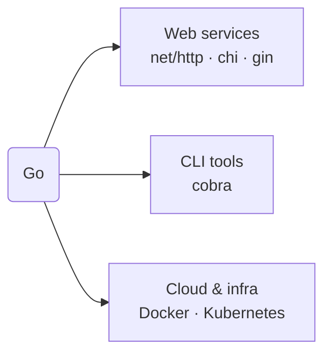

# Where to Go Next

You've covered the whole language: install and syntax, collections and control flow, modules, goroutines and channels, errors and I/O, the toolchain, and the idioms - not a beginner's slice of Go, that's *Go*. The remaining question: now what do you build?

This phase is deliberately short and to the point. Go isn't equally good at everything, so the kindest thing I can do is point you at where it genuinely shines, name the few libraries you'll actually reach for, and get out of your way.

## Where Go actually shines

**Web services and APIs.** Go's daily-driver job. The standard library's `net/http` (a full server in [Phase 8](08-ecosystem-and-tooling.md)) is genuinely production-ready, and many teams ship real services on it alone. For nicer routing and middleware, the common choices are **chi** (thin, idiomatic, close to the standard library) and **gin** (heavier, batteries-included). Start with the standard library, add a router only when you feel the friction.

**Command-line tools.** Go compiles to a single static binary with no runtime to install ([Phase 8](08-ecosystem-and-tooling.md)), close to ideal for CLIs. For anything beyond a couple of flags, **cobra** is the de facto library for commands and subcommands (it powers `kubectl` and `gh`). Many developer tools you already use are Go binaries for exactly this reason.

**Cloud and infrastructure - Go's home turf.** Here Go isn't just *usable* but *dominant*. **Docker** and **Kubernetes** are both written in Go, along with a large slice of the cloud-native ecosystem - Terraform, Prometheus, etcd. Not an accident: fast compiles, single static binaries, first-class concurrency ([Phase 6](06-goroutines-and-channels.md)), and a strong networking library are exactly what infrastructure software needs.

📝 **Terminology.** *Cloud-native* describes software built to run in containers and orchestrators (like Kubernetes) rather than on a single fixed server. A surprising amount of it is Go - so knowing Go opens that world of tooling to you.

## What to build next

Pick one and finish it. A small thing you complete teaches you more than an ambitious thing you abandon.

- **A JSON API.** A tiny HTTP service with two or three endpoints backed by an in-memory map, using `net/http` and `encoding/json`. Add **chi** when the routing starts to chafe.
- **A real CLI.** Take a chore you do by hand - renaming files, summarizing a log, checking a list of URLs - and make it a command-line tool. Start with `flag`; graduate to **cobra** for subcommands.
- **A concurrent fetcher.** Fetch a list of URLs at once with goroutines and a `sync.WaitGroup` ([Phase 6](06-goroutines-and-channels.md)), collecting results over a channel - it makes Go's concurrency model concrete in a way no tutorial can.

For each, the loop is the same: write it, run `go fmt`, `go vet ./...`, and `go test ./...` ([Phase 8](08-ecosystem-and-tooling.md)), reaching for the standard library before any third-party package.

## Where to go from here

The official **A Tour of Go** (go.dev/tour) and **Effective Go** (go.dev) are the two resources worth bookmarking - maintained by the Go team. And if you want to think about *why* languages make the choices they do - static binaries and goroutines versus a VM and threads - that's the subject of [Languages, Explained Like a Human](/guides/languages-explained-like-a-human).

You came in not knowing Go. You're leaving able to read it, write it idiomatically, handle concurrency and errors without fear, and reach for the right tool from the box. That transfers - the cloud-native world runs on it. Go build the small thing. You're ready.

## Recap

1. **Web** - `net/http` is production-ready; add **chi** (light, idiomatic) or **gin** (heavier, batteries-included) when you want a router.
2. **CLIs** - single static binaries make Go great for tools; **cobra** handles commands and subcommands.
3. **Cloud & infra** - Go's home turf; Docker and Kubernetes are written in Go, and much of the cloud-native stack with them.
4. **Build one real thing** - a JSON API, a CLI, or a concurrent fetcher - and finish it, leaning on the standard library and the toolchain.
5. **Next reading** - A Tour of Go and Effective Go for depth; [Languages, Explained Like a Human](/guides/languages-explained-like-a-human) for the bigger picture.

---

[← Phase 17: Performance & Optimization](17-performance-and-optimization.md) · [Guide overview](_guide.md)
